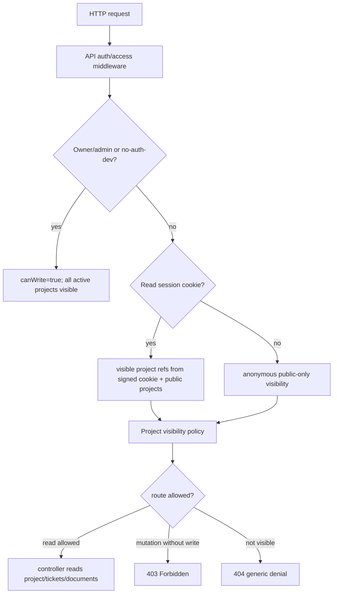

# Architecture: MDT-172

**Source**: [MDT-172](../MDT-172-public-read-only-sharing.md)
**Generated**: 2026-05-23

## Overview

Add a bounded sharing layer on top of the MDT-157 owner session model. Owner/admin remains the only write-capable mode; anonymous public, share-link, and scoped-token callers become read-only access contexts filtered by project visibility.

## Pattern

**Central Access Context + Project Visibility Policy**

All protected API requests resolve one access context before route handling:

- `owner-admin`: write-capable owner token or owner session cookie.
- `no-auth-dev`: write-capable compatibility mode when backend auth is disabled.
- `read-only`: signed server-managed read session from a share ID or scoped read token.
- `anonymous`: no owner/read session; can see only `public-readonly` projects.

Project visibility is evaluated by one policy service. Controllers do not hand-roll visibility checks.

## Runtime Flow



## Structure

```text
domain-contracts/src/project/schema.ts
shared/services/project/ProjectFactory.ts
shared/services/project/ProjectDiscoveryService.ts
shared/services/project/ProjectConfigService.ts
server/security/apiAuth.ts
server/security/accessPolicy.ts
server/security/readSession.ts
server/security/projectSharing.ts
server/routes/auth.ts
server/routes/share.ts
server/routes/projects.ts
server/routes/documents.ts
server/routes/sse.ts
server/controllers/ProjectController.ts
server/services/fileWatcher/SSEBroadcaster.ts
server/services/fileWatcher/index.ts
src/auth/AuthSessionProvider.tsx
src/App.tsx
src/components/SettingsModal.tsx
src/components/ProjectView.tsx
src/components/Board.tsx
src/components/Column/index.tsx
src/components/DocumentsView/DocumentsLayout.tsx
server/tests/api/public-sharing.test.ts
src/components/ReadOnlyMode.test.tsx
```

## Module Boundaries

- `domain-contracts` owns typed sharing modes and metadata shape.
- `shared/services/project/*` preserves registry metadata when projects are discovered.
- `server/security/accessPolicy.ts` owns route classification and centralized write/read requirements.
- `server/security/projectSharing.ts` owns sharing policy, project scope checks, and registry writes.
- `server/security/readSession.ts` owns signed read-only cookies and hash matching helpers.
- `server/security/apiAuth.ts` owns access-context resolution and mutation blocking.
- Controllers use the access context; they do not parse cookies, tokens, or sharing TOML directly.
- Frontend auth state exposes capability flags. UI surfaces consume `canWrite`, not owner-token details.

## Storage Decision

Project sharing state lives in global registry metadata, not project-local `.mdt-config.toml`.

Rationale: sharing is deployment behavior. Committing public visibility into project source config would make cloned repositories accidentally public and would mix deployment access with project definition.

## Share Link Decision

`/share/{shareId}` is a stable bookmarkable path for public/unlisted read-only access. A share ID creates or refreshes a read-only session and routes to the shared project. One-time `code` values are separate: they are exchanged through POST and removed from the browser URL after storage.

## Token Decision

Scoped read tokens are supplied as hashes in server configuration. Submitted tokens are hashed and timing-safe compared. A valid match writes a signed HttpOnly read session cookie with project refs; raw tokens are not logged or stored by the app.

## Error Philosophy

- Missing/private project for read-only callers returns generic 404.
- Read-only mutation returns 403.
- Invalid read token or code returns generic denial without project names or counts.
- Owner-auth failures remain 401.

## System Route Policy

System, config, cache, and filesystem routes are owner-only unless they return already-public operational health data. Read-only callers must not reach filesystem path selection, global config details, selector mutation endpoints, cache maintenance, or config maintenance routes.

## Invariants

- Default sharing mode is `private`.
- Only owner-admin and no-auth-dev can mutate.
- Public and unlisted modes never grant mutation.
- Unlisted projects are excluded from anonymous `/api/projects`.
- Share IDs are stable, random, and non-enumerable.
- SSE broadcasts are filtered per client-visible project scope.
- CORS and Origin policy remain owned by MDT-156 and must not be widened for sharing.
- Cookie-backed owner mutations keep the MDT-157 owner-intent and Origin checks.

## Extension Rule

Future multi-user roles should add a new access context provider. They should not bypass the project visibility policy or duplicate route-level mutation checks.

## Trace

- Architecture trace projection: [architecture.trace.md](./architecture.trace.md)
