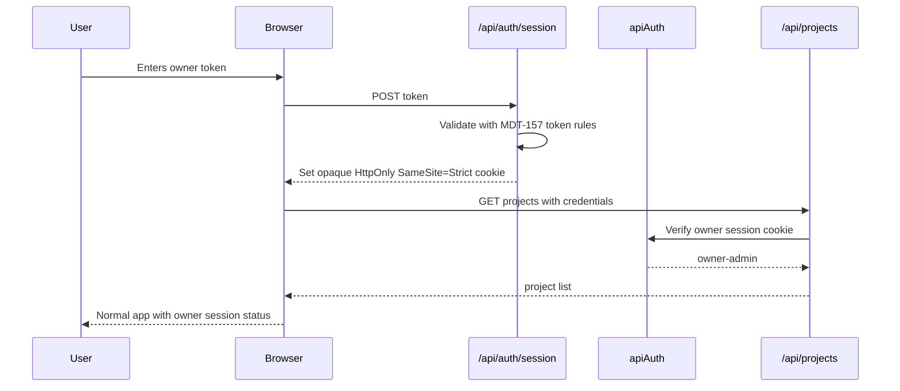
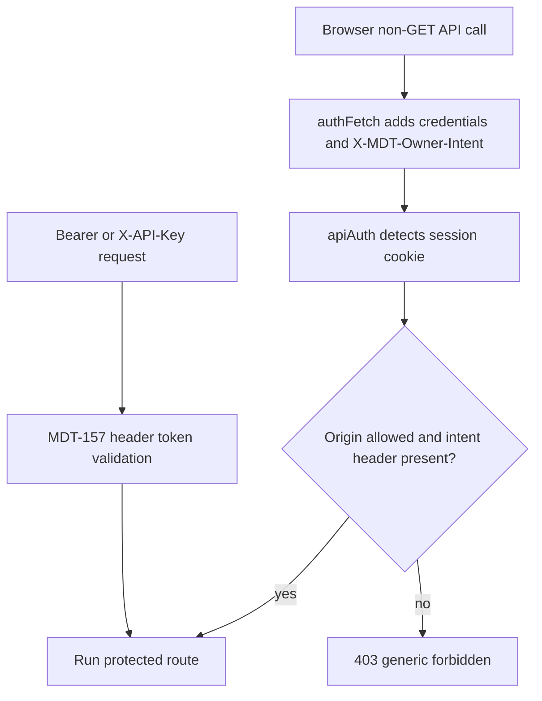

# Architecture: MDT-176

**Source**: [MDT-176](../MDT-176-browser-auth-session-unlock.md)  
**Generated**: 2026-05-23

## Overview

MDT-176 adds an owner browser session layer on top of the MDT-157 backend auth gate. The design keeps authentication centralized, adds a small server-managed cookie session contract, and gives the frontend one auth/access-state boundary so `401` never looks like an empty project list.

Assessment outcome carried forward: **Option 2 — Redesign Inline**. The backend auth seam is sound, but the feature requires a bounded redesign of session routes, cookie validation, frontend fetch/auth state, admin gating, and verification setup.

## Pattern

**Pattern name**: Centralized auth gate with browser session adapter and frontend auth boundary.

**Rationale**: Existing backend routes trust `server/security/apiAuth.ts` as the protected API gate. MDT-176 should extend that gate rather than move credential parsing into controllers. The browser receives a session cookie only after token exchange; the frontend never owns the raw admin token beyond submit-time input state.

## Critical Decisions

### Session endpoint placement

Decision: create `server/routes/auth.ts` and mount it before the protected API gate.

```text
server/server.ts
├── app.use('/api/auth', createAuthRouter(...))      # exempt auth-session routes
├── app.use('/api', createApiAuthMiddleware(...))    # protected API gate
├── app.use('/api/projects', ...)
├── app.use('/api/documents', ...)
├── app.use('/api/events', ...)
└── app.use('/api', createSystemRouter(...))
```

`server/tests/api/test-app-factory.ts` must mirror the same order.

Auth route contract:

| Method | Path | Auth gate | Behavior |
|--------|------|-----------|----------|
| `GET` | `/api/auth/session` | Exempt | Returns minimal `{ authEnabled, authenticated }` state; no secrets. |
| `POST` | `/api/auth/session` | Exempt | Validates submitted token with MDT-157 owner token rules, sets owner session cookie. |
| `DELETE` | `/api/auth/session` | Exempt/idempotent | Clears owner session cookie; no project mutation. |

Only these auth session routes are exempt. Health/status exemptions remain unchanged.

### Auth scope boundary

Decision: MDT-176 only adds single-owner token-to-cookie browser session support.

It must not add:

- multi-user accounts;
- RBAC;
- OAuth;
- password login;
- token rotation;
- refresh-token behavior.

Architecture and tasks must preserve this scope boundary. Any future expansion beyond a single owner/admin browser session requires a separate CR.

### Cookie validation owner

Decision: split session mechanics from auth decision-making.

- `server/security/apiSession.ts` owns cookie name, signing, verification, TTL, Set-Cookie/Clear-Cookie serialization, and secure-cookie flag decisions.
- `server/security/apiAuth.ts` remains the protected-route authentication owner. It extracts existing header credentials first, then verifies the owner session cookie through `apiSession`.
- `server/routes/auth.ts` validates submitted owner tokens by reusing `timingSafeTokenMatches` and parsed MDT-157 auth config. It must not introduce a second credential parser.

Session cookie rules:

- Value is opaque and signed; it never contains the raw admin token.
- Cookie name: architecture-defined in `apiSession` (recommended: `mdt_owner_session`).
- Cookie path: `/api`.
- Flags: `HttpOnly; SameSite=Strict`; `Secure` for production or HTTPS requests.
- Default TTL: architecture-defined in `apiSession` (recommended: bounded hours, not refresh-token semantics).
- Secret: use an explicit session secret if introduced; otherwise derive signing from the existing owner auth secret so token rotation invalidates sessions.

No new package is required; Node `crypto` plus Express response cookie headers are sufficient.

### CSRF mitigation for cookie-authenticated mutations

Decision: cookie-authenticated non-GET API mutations require two checks:

1. Origin validation: request `Origin` must match same-origin or the configured allowed origin policy.
2. Intent header: frontend must send an owner-mutation header, recommended `X-MDT-Owner-Intent: 1`.

This check applies only when authentication source is the owner session cookie. Header-token clients using `Authorization: Bearer` or `X-API-Key` keep MDT-157 behavior and do not need the browser intent header.

`authFetch` owns adding the intent header for non-GET browser API calls. Direct browser fetches that mutate state must be migrated to `authFetch` or an adapter using it.

### Frontend auth state and fetch boundary

Decision: add `src/auth/AuthSessionProvider.tsx` and `src/auth/authFetch.ts`.

`AuthSessionProvider` owns:

- `accessMode`: `unknown | locked | owner-admin | no-auth-dev | backend-down`
- `sessionStatus`: `checking | locked | unlocking | unlocked | error`
- `unlock(token)`: POSTs token, clears token from memory after submit, refreshes projects.
- `lock()`: DELETEs session, clears local owner state, returns to locked mode.
- capability helpers such as `canManageProjects`.

`authFetch` owns:

- `credentials: 'include'` for browser API calls.
- `X-MDT-Owner-Intent` on non-GET requests.
- `401` classification as auth-required.
- network/5xx classification separate from locked state.
- no logging of submitted token values.

`useProjectManager` should stop treating all non-OK project responses as generic errors. `401` from `/api/projects` updates auth state to locked and clears selected project/tickets; network/5xx remains backend-down.

### Locked UI and admin action gating

Decision: add dedicated AuthUnlock UI and gate admin controls by capability.

- `AuthUnlockPanel` renders “Board is locked”, access-token input, unlock button, generic error, and help text.
- `AuthStatusAction` renders locked/owner status and lock/unlock actions in the header. It renders nothing in local no-auth mode.
- `SecondaryHeader`, `HamburgerMenu`, `AddProjectModal`, root empty state, settings entry points, and project-management affordances use `canManageProjects`.
- `ProjectSelector` may render future public projects after MDT-172; MDT-176 does not expose public/read-only UI.

Rule: never show “No Projects Found” or Create/Add Project for a `401` response.

### Local no-auth mode

Decision: preserve MDT-157 local/test compatibility.

`GET /api/auth/session` returns `authEnabled: false` when backend auth is disabled. The frontend classifies this as `no-auth-dev` and loads the current app without an unlock prompt. Default Playwright E2E remains no-auth unless an auth-specific run opts into auth env vars.

### MDT-172 compatibility

Decision: MDT-176 owns authentication state only; MDT-172 owns authorization/project visibility.

Response semantics remain distinct:

| Backend result | Auth interpretation | UI |
|----------------|---------------------|----|
| `401` from `/api/projects` | Locked/auth required | AuthUnlockPanel |
| `200` with owner session | Owner admin | Normal app and admin actions |
| auth disabled | Local no-auth-dev | Current local app behavior |

Do not add project visibility filtering in MDT-176.

### SSE/session behavior

Decision: coordinate SSE with auth state.

The current EventSource auto-connects on module load. MDT-176 must prevent locked sessions from retaining stale owner streams:

- connect when `owner-admin`, `no-auth-dev`, or future visible anonymous states allow it;
- disconnect or suppress stale events when locked;
- after unlock, reconnect and refresh projects;
- after lock/logout or a reconnect-time 401, converge back to locked state.

## Runtime Flow

### Unlock flow



### Cookie-authenticated mutation flow



## Module Boundaries

```text
server/security/apiSession.ts                 # signed cookie mechanics and flags
server/security/apiAuth.ts                    # protected-route auth decision and CSRF check
server/routes/auth.ts                         # GET/POST/DELETE /api/auth/session
server/server.ts                              # production route ordering
server/tests/api/test-app-factory.ts          # test route ordering mirror
server/tests/api/auth-session.test.ts         # session API and cookie regressions
server/tests/api/api-auth.test.ts             # MDT-157 preservation

src/auth/AuthSessionProvider.tsx              # accessMode/sessionStatus/unlock/lock/capabilities
src/auth/authFetch.ts                         # credentials, intent header, 401 classification
src/components/AuthUnlock/AuthUnlockPanel.tsx # locked/unlock UI
src/components/AuthUnlock/AuthStatusAction.tsx# header auth chip/actions
src/hooks/useProjectManager.ts                # project-load auth semantics
src/App.tsx                                   # provider composition and route-level gating
src/components/RedirectToCurrentProject.tsx   # locked/root handling
src/components/SecondaryHeader.tsx            # admin menu capability input
src/components/HamburgerMenu.tsx              # Add/Edit/Settings visibility
src/components/AddProjectModal/AddProjectModal.tsx # owner-only project mutation calls
src/components/ProjectSelector/index.tsx      # public/owner project selector semantics
src/services/sseClient.ts                     # connect/disconnect by auth state

tests/e2e/auth/session-unlock.spec.ts         # isolated auth-enabled Playwright coverage
tests/e2e/utils/selectors.ts                  # auth selectors from design spec

docs/AUTH_SESSION_GUIDE.md                    # operator session guide
docs/DOCKER_GUIDE.md                          # deployment auth notes
docs/DEVELOPMENT_GUIDE.md                     # local no-auth behavior
```

## Runtime vs Test Scaffolding

Runtime code must not depend on test-only env toggles. Auth-enabled E2E must configure `API_SECURITY_AUTH=true` and `API_AUTH_TOKEN` only in an isolated Playwright setup, without changing default no-auth E2E behavior.

Testing responsibilities:

- Server API tests: session exchange, invalid token, cookie flags, session-cookie protected route access, logout cookie clearing, CSRF checks, and MDT-157 header auth preservation.
- Playwright E2E: locked state, successful unlock, invalid unlock, logout/reload remains locked, hidden admin controls, local no-auth default.
- Browser security checks: no raw token in localStorage, sessionStorage, URL state, visible errors, or captured frontend logs/request logs.

No new frontend unit-test framework is introduced.

## Invariants

- `server/security/apiAuth.ts` remains the protected API auth decision point.
- Session routes are the only new auth exemptions.
- The raw admin token is accepted only in the unlock POST body and cleared immediately by the frontend.
- Session cookies never contain the raw admin token.
- Cookie-authenticated mutations must pass CSRF mitigation.
- Header-token API clients retain MDT-157 semantics.
- `GET /api/status` and `GET /api/health` remain public and minimal.
- Local no-auth mode does not show unlock UI.
- MDT-176 does not implement public project filtering; MDT-172 remains the authorization/sharing owner.
- Admin UI visibility is capability-driven, not project-count-driven.
- MDT-176 remains a single-owner token-to-cookie browser session feature; it does not add accounts, RBAC, OAuth, password login, token rotation, or refresh tokens.

## Extension Rule

Future MDT-172 work must define its own authorization/project visibility contract. It must not move credential parsing into project controllers or reinterpret anonymous access as owner-admin access.

## Operator Documentation

Add/update operator docs for:

- enabling backend auth with `API_SECURITY_AUTH` and `API_AUTH_TOKEN`;
- how browser unlock exchanges the token for a server cookie;
- cookie flags and production HTTPS expectations;
- logout/lock behavior;
- local no-auth mode;
- MDT-176 before MDT-172 sequencing; public/read-only sharing remains out of scope.

---
Canonical architecture projection: [architecture.trace.md](./architecture.trace.md)
