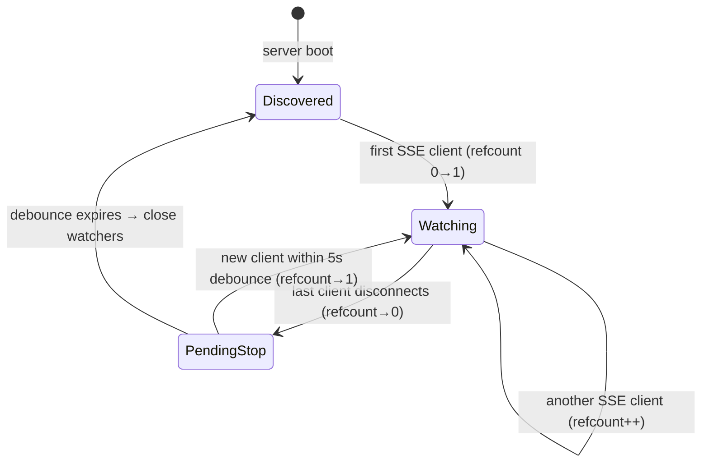
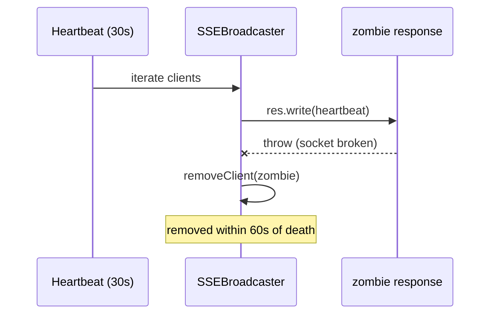

# Architecture: Lazy File Watchers & SSE Zombie Detection

> Architecture trace projection: [architecture.trace.md](./architecture.trace.md)

## Overview

Replace eager chokidar watcher initialization (all 10 projects at boot) with lazy on-demand lifecycle driven by SSE client connections. Add reliable zombie detection to the heartbeat mechanism. Target: 200 MB idle → under 300 MB with active clients.

## Pattern: Lazy Subscription-Driven Resource Lifecycle

The current architecture eagerly creates all file system watchers at server boot, regardless of whether any client is connected. This wastes 400+ MB of native memory on fsevents handles for idle projects.

The new pattern: **resources are provisioned on first subscription and released on last unsubscribe**. This is the same pattern used by observable streams (RxJS `refCount`) and database connection pools.

### Current flow (eager)

```
server boot → discover 10 projects → create ~30 chokidar watchers → 580 MB
                                                     ↑
                                               always running
SSE connect → addClient(res) → broadcast to existing watcher events
SSE disconnect → removeClient(res) → watchers still running
```

### New flow (lazy)

```
server boot → discover projects (metadata only) → ~200 MB
                                                    ↑
                                              no watchers yet

SSE connect → resolve project scope → WatcherLifecycleManager.ensureWatchers(projectId)
                                      → creates chokidar if not running
                                      → increments refcount

SSE disconnect → removeClient(res) → WatcherLifecycleManager.releaseProject(projectId)
                                     → decrements refcount
                                     → if refcount=0, debounce 5s → close watchers
```

## Module Boundaries

### New: `WatcherLifecycleManager` (owner: ART-watcher-lifecycle)

Central coordinator between SSE clients and chokidar watchers. Owns the refcount map and debounce logic.

```
Responsibilities:
  - Track per-project watcher refcount (clientId → Set<projectId>)
  - Call PathWatcherService.init* on first subscriber
  - Call PathWatcherService.stop for project on last unsubscribe (debounced)
  - Expose activeWatcherCount() for /api/status
  - Debounce rapid connect/disconnect (Edge-1)

Does NOT own:
  - SSE client management (SSEBroadcaster)
  - Chokidar instance creation (PathWatcherService)
  - Event broadcasting (SSEBroadcaster)
```

### Modified: `SSEBroadcaster` (owner: ART-sse-broadcaster)

Add write-error-based zombie detection to heartbeat.

```
Changes:
  - startHeartbeat: wrap res.write() in try/catch
  - On write error → removeClient(res) (handles TCP half-open)
  - Track client connect timestamp for timeout-based cleanup
  - No longer relies solely on res.destroyed/res.closed flags

Invariant: after each heartbeat cycle, all clients in Set are verified writable
```

### Modified: `FileWatcherService` facade (owner: ART-file-watcher-facade)

Delegates watcher lifecycle to `WatcherLifecycleManager` instead of exposing `initMultiProjectWatcher` directly.

```
Changes:
  - addClient() → notifies WatcherLifecycleManager.ensureWatchers()
  - removeClient() → notifies WatcherLifecycleManager.releaseProject()
  - initMultiProjectWatcher() becomes no-op or removed from startup
  - Registry watcher stays eager (lightweight, 1 toml glob)
```

### Modified: `server.ts` (owner: ART-server-entry)

```
Changes:
  - Remove initializeMultiProjectWatchers() call from startup
  - Keep project discovery (metadata only, no watcher creation)
  - Pass project metadata to WatcherLifecycleManager
  - Registry watcher still initialized at boot
  - Heartbeat unchanged (interval, but zombie detection improved)
```

## Key Design Decisions

### D1: Write-error zombie detection over TCP keepalive

**Decision**: Detect zombies by catching `res.write()` errors during heartbeat, not by setting TCP keepalive timeouts.

**Rationale**:
- Express response objects don't expose raw socket keepalive config reliably
- `res.write()` throw/catch is framework-native and works across all transports
- Heartbeat already runs every 30s — zombies caught within 60s max (two cycles)
- No additional timer overhead

**Alternative rejected**: `req.socket.setTimeout(30_000)` — interferes with SSE's `setTimeout(0)` and may kill legitimate long-lived connections.

### D2: Per-project refcount with debounce stop

**Decision**: Each project has a reference count. When refcount hits 0, wait 5 seconds before stopping watchers.

**Rationale**:
- Tab refresh = disconnect + reconnect in <1s — avoids chokidar teardown/init thrashing (Edge-1)
- Zombie detection (F-2) → EventSource auto-reconnect also <1s — same debounce covers MDT-180 cascade scenario
- 5s is safe margin: chokidar `ready` takes ~100-500ms, so re-init is fast if we guessed wrong
- Simpler than tracking "pending connect" state

### D3: Registry watcher stays eager

**Decision**: `initGlobalRegistryWatcher()` still runs at boot.

**Rationale**:
- Single glob on `~/.config/markdown-ticket/projects/*.toml` — negligible memory (~1 MB)
- Must detect new project additions even when no SSE clients connected
- Registry events trigger `disconnectReadOnlyClients()` which needs watcher active

### D4: Project metadata cached, watchers lazy

**Decision**: `projectDiscovery.getAllProjects()` still runs at boot to populate metadata. Only chokidar watchers are deferred.

**Rationale**:
- `/api/projects` endpoint needs project list without SSE dependency
- Project metadata is in-memory objects (~100 KB total) — negligible
- Avoids race condition where SSE client connects before project discovery completes

## Diagrams

### Lazy watcher lifecycle



### Zombie detection flow



## Invariants

1. **Zero idle watchers**: No chokidar FSWatcher instances exist when `SSEBroadcaster.clients.size === 0` (except registry watcher)
2. **One watcher set per project**: PathWatcherService creates at most one watcher set per project ID, shared by all SSE clients
3. **Heartbeat = liveness proof**: After every heartbeat cycle, every client in the Set is verified writable
4. **Refcount >= client count**: `WatcherLifecycleManager.refcounts[projectId] >= number of SSE clients subscribed to that project`

## Extension Rule

Adding a new watcher type (e.g., webhook notifications) goes through `WatcherLifecycleManager.ensureWatchers()` — never directly to `PathWatcherService`. This preserves the refcount/debounce contract.

## Error Philosophy

- **Chokidar creation failure**: Log warning, project enters "failed" state. SSE clients for that project receive an error event. Retry on next SSE connect.
- **Write error on zombie detection**: Remove silently — zombie connections are expected (tab closed, network drop).
- **Debounce timer leak**: `WatcherLifecycleManager.stop()` clears all pending debounce timers.
