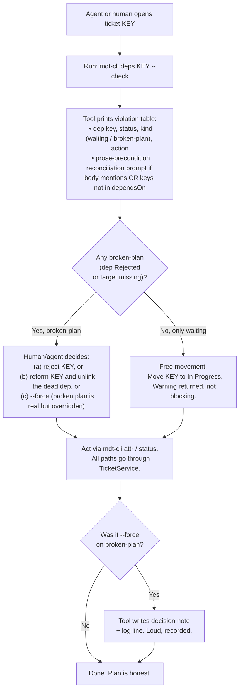
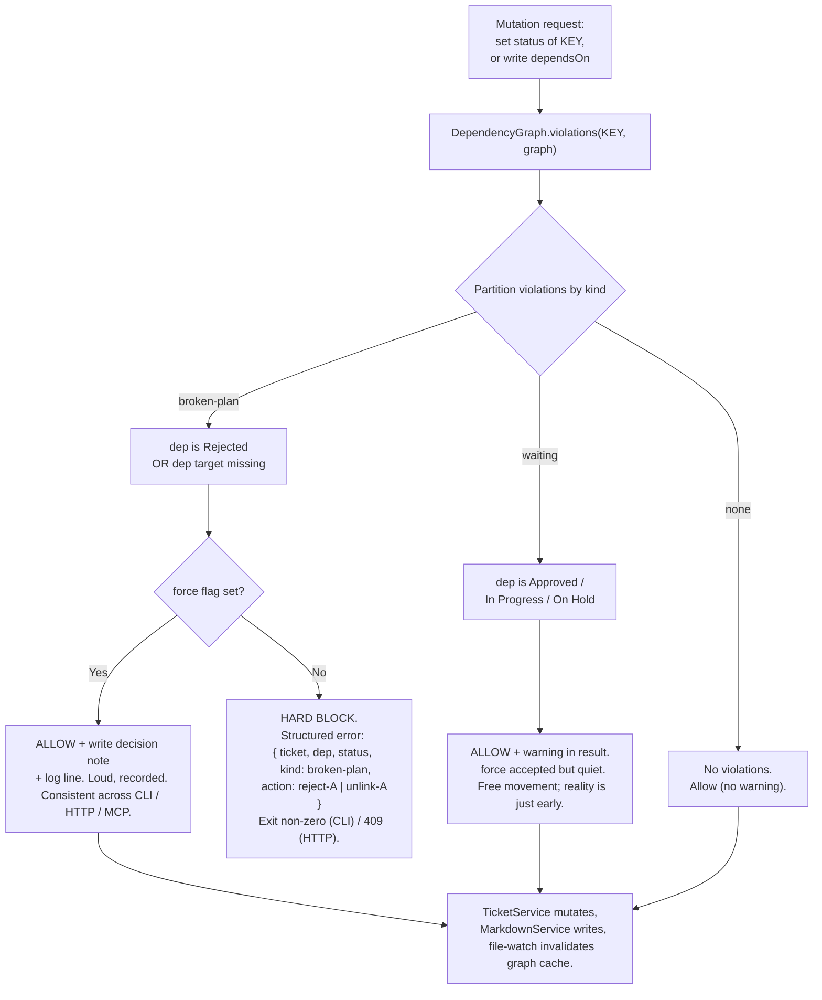

# MDT-188 Design: User Flow and Guardrail Decisions

**Parent:** [MDT-188](../MDT-188-dependency-graph-epic.md) — Ticket Dependency Graph: Implementation-Order Planning
**Purpose:** Answer "did we confirm the user flow?" with evidence. Two diagrams: the core planning loop, and the guardrail decision tree. Both are reviewable artifacts; prose in the epic stays scannable, the diagrams carry the behavioral detail.

**Scope:** v1 surfaces only — CLI (`mdt-cli deps`) and the shared mutation boundary. UI (v1.1) and MCP (v1.1/v1.2) are out of scope for these diagrams; they will follow the same shapes and get their own passes when those tickets land.

---

## 1. Core User Flow — the planning loop

The product is a planning tool, not a guardrail cop. The loop is: open a ticket, ask the tool what's lying about its readiness, decide, act. The decision is recorded (or `--force`'d), not silently bypassed.



### Concrete instance — the VOC lying-ticket scenario

The flow is not theoretical. Trace it for the scenario from IDEA-008:

- **Ticket KEY** has frontmatter `dependsOn: VOC-053` and a prose `## Precondition` section listing `VOC-049–VOC-052 implemented` and `VOC-053 release evidence green`.
- **VOC-053 status:** `Approved`. **VOC-052 status:** `Approved`.

Trace:

1. `mdt-cli deps KEY --check`
2. Tool prints:
   ```
   Precondition                       | Status    | Evidence
   VOC-049–VOC-052 implemented        | ❌        | VOC-052 still "Approved"
   VOC-053 release evidence green     | ⚠️        | Unverifiable prose — link a ticket
   dependsOn: VOC-053                 | ❌        | Not Implemented (waiting)
   ```
3. `broken-plan?` → **No** (Approved is waiting, not Rejected). Free movement path.
4. Reconciliation prompt fires separately: *"You mention VOC-049..VOC-052 in your Precondition section but they are not in dependsOn. Add? [y/N]"* → user decides.
5. Move KEY to `In Progress` succeeds with a waiting warning. Not recorded as a decision — it's just starting early.

**Contrast:** if VOC-053 were `Rejected` instead, step 3 routes to `Decide`, and the move is hard-blocked until the user picks reject / reform / `--force`. `--force` writes the note.

This is what "store the decisions" means operationally: every broken-plan resolution leaves a trail; every waiting-start does not, because it isn't a decision.

---

## 2. Guardrail Decision Tree

The riskiest behavioral design in the epic. Two cases, two policies — split deliberately, not lumped.



### Why the split

| Path | Semantic | Policy | Why |
|---|---|---|---|
| Waiting | Reality is incomplete (dep not done yet) | Warn, free movement | Starting early is a legitimate, frequent action. Blocking here is a friction cop — the failure mode of the killed validator at `TicketService.ts:356`. |
| Broken-plan | Plan is internally inconsistent (dep dead or missing) | Hard block + force + record | The plan is lying. Force a decision. `--force` exists for the real edge case ("I'm investigating anyway") but is loud and recorded so the decision is recoverable. |
| No violations | Clean | Allow silently | No ceremony for the common case. |

### What `--force` means on each path

- **Broken-plan `--force`:** real planning decision. Writes a decision note to the ticket (v1: `implementationNotes` append; structured field deferred). Log line emitted. This is the path that *stores* the decision — the whole point of the tool.
- **Waiting `--force`:** accepted but quiet. No note, no log. The user is just starting early; treating that as a recorded decision would be noise.

### The dead-validator defense

The transition validator at `shared/services/TicketService.ts:457-529` was killed (line 356: *"Status transition validation removed to allow free movement"*) because legacy data broke it. This guardrail is its spiritual successor. The defenses:

1. **Migrate before enforce.** MDT-189's `blocks` migration cleans the data first. This guardrail (MDT-191) ships only after MDT-189 is done — hard `dependsOn: MDT-189`.
2. **Only broken-plan hard-blocks.** Waiting warns. Free movement is preserved for every non-broken case, so the "legacy data tripped it" failure mode is narrow.
3. **`--force` always works.** Even on broken-plan, the user is never trapped. The worst case is a loud, recorded override — never an impossible action.

If the first legacy ticket trips this guardrail and the temptation is to rip it out, the answer is to fix the data, not delete the check.

---

## 3. Open questions these diagrams surface

Reviewing the flow and decision tree exposes decisions that are currently implicit in the epic. Flagging them, not resolving — these belong in the architecture pass for MDT-189/MDT-191:

- **Reconciliation prompt scope.** The flow assumes `--check` scans the whole ticket body for CR-key tokens. False positives are real (a "see also MDT-030" sentence triggers the prompt). Mitigation under consideration: only scan `## Precondition` / `## Prerequisites` sections. Decision needed at MDT-190 architecture.
- **Decision-note storage.** Diagram says "writes decision note." Open: append to `implementationNotes` (existing field, human-readable) vs. new `planningDecisions` frontmatter field (structured). MDT-191 recommends the former for v1; needs confirmation.
- **Warning delivery.** Diagram says "warning returned in result." Open: synchronous in the mutation result (simplest for every consumer) vs. emitted as a separate event. MDT-191 recommends synchronous.
- **Cache invalidation timing.** Diagram's terminal node says "file-watch invalidates graph cache." Not yet specified: does the guardrail re-read from cache or recompute? If cache, what's the staleness window for status changes? Belongs in MDT-189 architecture.

---

## 4. Out of scope for these diagrams

- **UI flow (v1.1).** The readiness banner and focused-neighborhood graph reuse the same decision tree but add interaction (hover, click, popover). Diagram when MDT-188 v1.1 ticket lands.
- **MCP tool surface (v1.1/v1.2).** `check_readiness`, `suggest_next_actionable`, `list_unblocked` wrap the same `DependencyGraph` functions. Diagram when MCP ticket lands.
- **Whole-project graph export.** Noise as a primary view; deferred per MDT-188 vision section.

---

## 5. References

- **Parent epic:** [MDT-188](../MDT-188-dependency-graph-epic.md)
- **Design source:** [IDEA-008](../../ideas/IDEA-008-ticket-dependency-graph.md) — VOC scenario, satisfaction table, guardrail split
- **Style precedent:** `docs/architecture/auth-and-sharing-architecture.md` — `flowchart TD`, quoted node labels, decision diamonds
- **Child tickets:** [MDT-189](../MDT-189-dep-graph-foundation.md) (foundation+migration), [MDT-190](../MDT-190-cli-deps-query.md) (CLI query), [MDT-191](../MDT-191-dep-enforcement.md) (enforcement)
- **Dead validator tombstone:** `shared/services/TicketService.ts:356` and `:457-529`
