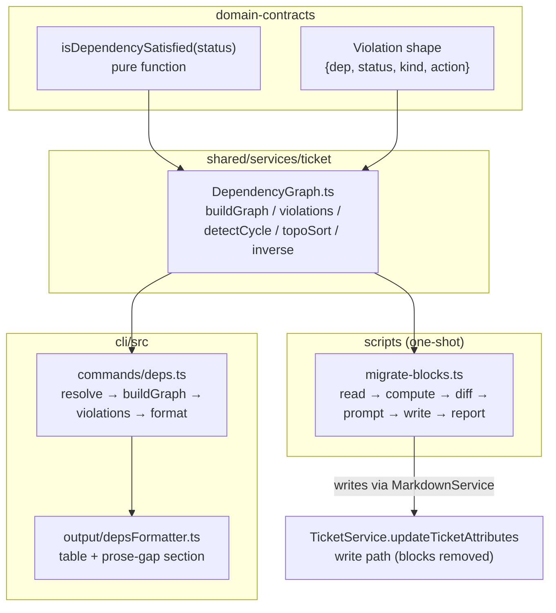

# Architecture — MDT-189

Related CR: [`MDT-189-dep-graph-foundation.md`](../MDT-189-dep-graph-foundation.md)
Epic: [`MDT-188`](../MDT-188-dependency-graph-epic.md) · Design: [`MDT-188/design.md`](../MDT-188/design.md)

## Rationale

v1 collapses foundation + migration + CLI into one ticket so the graph module
is proven by its consumer (`mdt-cli deps --check`). Three guiding constraints:

1. **Single logical well, distributed physical storage.** Files are the
   database; no central `dependencies.toml`. One module interprets deps; every
   consumer reads through it.
2. **Canonical edge is `dependsOn`.** `blocks := inverse(dependsOn)`,
   read-only after migration.
3. **CLI is pure presentation** (per AGENTS.md "CLI Business Logic Boundary").
   Any logic reusable by MCP/UI lives in `shared/`, not `cli/`.

## Structure



## Component API

### `domain-contracts/src/ticket/satisfaction.ts`

```ts
export type SatisfactionKind = 'satisfied' | 'waiting' | 'broken-plan'

export function isDependencySatisfied(status: string): boolean
// Implemented | (Partially Implemented in v2) → true
// Rejected / missing / unknown → false (caller classifies kind)

export function classifyViolation(
  depStatus: string | 'missing'
): SatisfactionKind
// 'missing' | 'Rejected' → 'broken-plan'
// anything else unsatisfied → 'waiting'
```

Lives in `domain-contracts` so HTTP/MCP/UI can import without pulling the graph.

### `shared/services/ticket/DependencyGraph.ts`

```ts
export interface DepGraph {
  /** All tickets keyed by canonical '{PROJECT}-###' form. */
  nodes: Map<string, Ticket>
  /** Adjacency: source key → keys it dependsOn. */
  edges: Map<string, string[]>
}

export interface Violation {
  dep: string
  status: string          // ticket status, or 'missing'
  kind: SatisfactionKind
  action: string          // human-readable resolution hint
}

export function buildGraph(
  tickets: Ticket[],
  activeProjectCode: string
): DepGraph

export function violations(
  ticket: Ticket,
  graph: DepGraph
): Violation[]

export function detectCycle(graph: DepGraph): string[] | null  // path or null; O(V+E)

export function topoSort(graph: DepGraph): Ticket[]

export function inverse(graph: DepGraph): Map<string, string[]>  // blocked-by
```

**Key resolution (inside `buildGraph`):**
- Stored value matches `^[A-Z]+-\d+$` → use as-is (cross-project).
- Otherwise → prefix `{activeProjectCode}-` and zero-pad to 3 digits.

This mirrors `keyNormalizer.ts` in MDT-187's badge elision.

### `cli/src/commands/deps.ts`

```ts
export interface DepsOptions extends StructuredOutputOptions {
  check?: boolean
  json?: boolean
  project?: string
}

export async function depsAction(
  key: string,
  opts: DepsOptions
): Promise<void>
```

Default behavior (no flag, or `--check`): print violation table + prose-gap
section. `--json`: structured `{ violations, ready, proseGaps }`.

Register in `cli/src/index.ts` under `ticket` subcommand, plus top-level
`deps` alias mirroring `attr`.

### `scripts/migrate-blocks.ts`

One-shot. Reads all tickets across all registered projects, computes
`inverse(dependsOn)`, diffs, prompts per contradiction, writes, emits report.

Not part of the runtime; not imported by any consumer. Run once, commit the
data diff + report, then it's dead code (kept for audit).

## Decisions

### D1 — `isDependencySatisfied` returns boolean; `classifyViolation` returns kind

Original spec had one function returning a tri-state. Splitting keeps the
satisfaction question (pure status check) separate from the violation
classification (needs to know if target is missing). The CLI formatter and the
future guardrail both want the kind, but a UI badge showing "✅/❌" only wants
the boolean.

### D2 — Migration writes via `MarkdownService`, not `updateTicketAttributes`

The migration runs *before* the write path is removed. But if it writes via
`updateTicketAttributes`, it goes through the path we're about to disable,
which is confusing. Direct frontmatter rewrite via `MarkdownService` is
cleaner: migration is a data fix, not a ticket mutation. After migration, the
service write path is removed in a separate reviewable commit.

### D3 — `blocks` stays in frontmatter, derived on write

Two options: (a) stop storing `blocks`, derive on read; (b) keep storing,
recompute when `dependsOn` changes. Chose (b) for human-readability — a contributor
opening a ticket file sees the blocking relationships without running a tool.
Cost: a hand-edit to `blocks:` gets overwritten on next write. That's correct
(`dependsOn` is the contract) and is what MDT-192's format guard will make
loud rather than silent.

### D4 — v1 `--check` does not write; prose reconciliation is informational

The user flow (design.md) shows a reconciliation prompt that writes
`dependsOn`. That interaction requires the write-validation path (MDT-191) to
be safe. v1 surfaces the gap ("you mention VOC-049..052 in prose but not in
dependsOn") without writing. Less magical, but doesn't half-ship MDT-191.

### D5 — `--tree` / `--mermaid` deferred unless trivial

Listed in scope but explicitly cut if they cost more than a day. `topoSort`
exists for `--tree`; `--mermaid` is a formatter over the graph. Both are
nice-to-haves. The acceptance test is `--check`; do not let tree/mermaid
balloon the ticket.

## Data Flow

```
User runs: mdt-cli deps MDT-188 --check
  → depsAction resolves project + target ticket
  → TicketService.listTickets({ project, all: true })
  → buildGraph(tickets, project.code)
  → violations(target, graph) → Violation[]
  → scan target.content for CR-key tokens not in dependsOn → proseGaps
  → depsFormatter.printViolationTable(target, violations)
  → depsFormatter.printProseGaps(proseGaps)
```

## Migration & Rollback

**Migration is a one-way door.** Sequence:

1. Implement graph module + satisfaction.
2. Implement migration script. **Dry-run only** — print report, write nothing.
3. Review the dry-run report. Decide each contradiction.
4. Real run. Commit data diff + report.
5. Remove `blocks` write path in `TicketService` and adjust `MarkdownService`
   to derive. Separate commit.
6. Ship CLI command.

**Rollback:** the data changes (step 4) are revertible via `git revert` of
the data commit — the old `blocks` values are in git history. The write-path
removal (step 5) is revertible via `git revert` of that commit. There is no
irreversible step *as long as* each step is its own commit and the report is
committed alongside the data.

## Non-Goals

- Status-transition guardrails (MDT-191).
- Write-time cycle/self-edge rejection (MDT-191).
- UI rendering (v1.1).
- MCP wrappers (v1.1/v1.2).
- `--tree` / `--mermaid` if they cost more than a day (defer to follow-up).
- Prose-precondition semantic verification ("release evidence green" is a
  claim about the world, not a ticket status; out of scope entirely).
