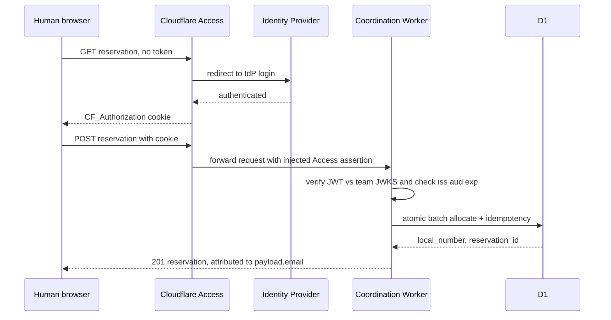
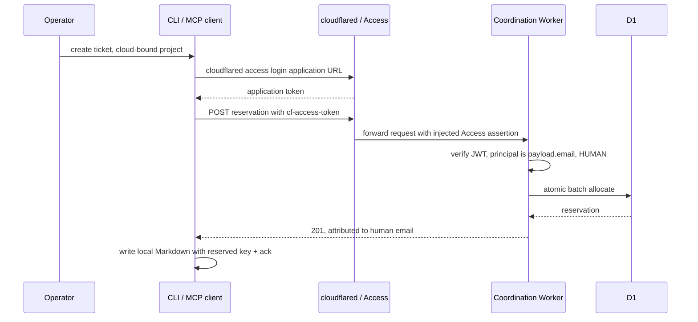
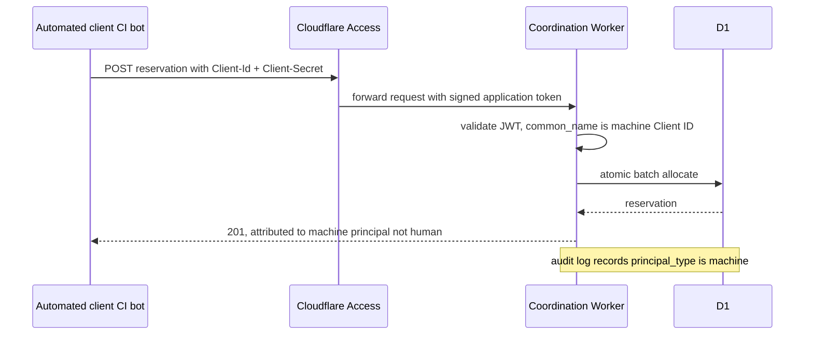

# MDT-198 Research: Cloud Ticket Coordination

> Research artifact. This ticket does **not** implement or deploy a production
> collaboration service. Every "current behavior" claim below is verified against
> the codebase as of the access date. Every Cloudflare claim is labeled as
> documentation-sourced with a URL and access date. No Cloudflare Access-protected
> environment was exercised by the local data POC.

- **Ticket**: MDT-198 (type `Research`, status `In Progress`)
- **Access date for all code claims**: 2026-07-24
- **Access date for all Cloudflare doc claims**: 2026-07-24
- **POC evidence**: see `poc.md` and `poc/`

---

## 1. Executive Decision

**Decision: Go (reduced scope).**

Workers + D1 is sufficient for the *minimum viable collaboration capability*:
collision-free per-project ticket-key allocation, idempotent creation, and a
read-only header/status projection visible to teammates. The baseline design
**does not** require Durable Objects.

User Review approved the reduced-scope defaults on 2026-07-24:

1. **Field authority for title/status/type/priority/assignee:** use the
   **Markdown-as-authority, one-way cloud projection** model
   (cloud stores only a derived, versioned mirror; the local file is the
   source of truth).
2. **Presence:** exclude it from the first slice.
3. **Offline allocation:** defer it; cloud-bound creation requires connectivity.
4. **Project adoption:** keep cloud coordination opt-in per project.

Durable Objects are recommended only if a *measured* realtime latency need
emerges (RQ9). They do not remove D1's storage throughput limits and are not a
baseline allocation dependency (RQ10).

---

## 2. Research Questions Answered

> Evidence keys: **[CODE]** = verified in repo at `file:line`;
> **[DOC-CF]** = current official Cloudflare documentation (URL + access date);
> **[POC]** = reproduced locally in this ticket's POC;
> **[TICKET]** = MDT-198 frontmatter/body.

### RQ1 — What exact collaboration capability is required?

**Answer.** The minimum supported journeys are:

1. **Collision-free key allocation.** Two teammates creating tickets against the
   same logical project (separate clones/worktrees or concurrent processes)
   receive **unique** per-project ticket numbers without manual coordination.
2. **Header projection for visibility.** A teammate can see other teammates'
   ticket headers (code, title, status, type, priority, assignee) and
   modification times without pulling Git, so the board reflects in-flight work
   between commits.
3. **Acknowledged local creation.** A reserved key is confirmed once the local
   Markdown file exists; the reservation survives retry and network gaps.

**Explicit non-goals** (carry from ticket scope [TICKET]):

- No full ticket bodies, comments, attachments, or document editing in the cloud.
- No Jira-style workflows, reporting, notifications, sprint/portfolio planning.
- No replacing Markdown/Git as the durable source for ticket content.
- No inferring ownership from Git branches/worktrees.

**Why this boundary.** The current system already renders shared metadata
(title/status/type/priority/assignee) on the board [CODE: board components];
the only unmet need is *collision-free allocation across clones* and
*cross-process visibility between Git pushes*. Anything beyond that turns MDT
into a SaaS issue tracker, which the ticket explicitly excludes.

### RQ2 — Which system owns each field?

**Answer.** One authority per synchronized field, with Markdown/Git retaining
content authority and the cloud owning only the allocation counter and a
**derived** projection.

| Data field | Authority | Local representation | Rationale |
|---|---|---|---|
| Project cloud ID & membership | **Cloud** | Non-secret binding in `.mdt-config.toml` / global registry | Identity must be stable across clones; only the cloud can guarantee uniqueness. |
| Ticket **key/number** | **Cloud** | Persist returned key in filename + frontmatter `code` | The collision problem is *the* motivating defect (RQ4); allocation must be centralized. |
| Ticket `code` (frontmatter) | **Markdown/Git** (set once from cloud reservation) | YAML `code:` field | After reservation, the file is the durable record; the key never changes. |
| `title` | **Markdown/Git** | H1 + frontmatter | Body content stays local; cloud holds a derived mirror only. |
| `status` | **Markdown/Git** | YAML `status:` | Cloud projects the latest known value for visibility, never writes back. |
| `type`, `priority` | **Markdown/Git** | YAML fields | Same projection rule. |
| `assignee` | **Markdown/Git** | YAML `assignee:` | Membership lives in cloud; the *assignment* is content, so it stays local. |
| Ticket body & workflow subdocuments | **Markdown/Git** | Canonical local files | Hard non-goal: no cloud body editing. |
| `dateCreated`, `lastModified` | **Markdown/Git** (file mtime / frontmatter) | YAML / filesystem | Authoritative timestamps; cloud stores a best-effort mirror. |
| Presence / activity | **Cloud (ephemeral)** | Optional UI indicator only | Advisory; see RQ9. Must not infer ownership. |
| Git branch / commit / worktree | **Local Git** | Never sent as ticket authority | Prevents branch-name→ownership inference (ticket non-goal). |

**The projection rule (one direction).** Cloud stores a *derived, versioned*
mirror of the header fields. The local Markdown file is always the authority.
On local edit, the client pushes the new header + an incremented `version` to
the cloud mirror; on read, the cloud mirror serves visibility to other
teammates. **The cloud never writes header fields back to a local file.** This
avoids the "two independent writers" anti-pattern the ticket warns about.

> User Review decision (2026-07-24): **Markdown-as-authority** is approved.
> Cloud-authoritative headers remain a rejected alternative for the first
> slice.

### RQ3 — How are project identity and team membership mapped across clones?

**Answer.**

- **Current identity is local and not globally stable.** `project.id` comes from
  `[project] id` in `.mdt-config.toml`, falling back to the directory basename
  when unset [CODE: `shared/services/project/ProjectFactory.ts:50`,
  `domain-contracts/src/project/schema.ts:80` declares `id?` optional]. The
  global registry is keyed by `project.id`
  [CODE: `shared/services/project/ProjectRegistry.ts:103`], but nothing is
  synced off-machine — the same repo cloned to two paths can produce two
  different ids if the config omits `id`.
- **Cloud mapping.** Cloud coordination requires a **stable, non-secret cloud
  project identifier** (a UUID) issued once and stored in the project's local
  config (e.g. a new `[cloud] projectId = "uuid"` field) and/or the global
  registry entry `CONFIG_DIR/projects/{project.id}.toml`. Two clones of the same
  repo then resolve to the **same** cloud project. Binding is opt-in per project.
- **Membership model.** Membership is a cloud-side list of principals (human or
  machine) permitted to allocate keys and read the projection for a cloud
  project id. Roles: **owner** (manage membership, regenerate binding),
  **contributor** (allocate keys + push header projections), **viewer**
  (read projection only). This intentionally mirrors, not replaces, the local
  access model.

**Identity ≠ Git worktree routing.** `WorktreeService` routes *ticket* reads
into branch-matched worktrees [CODE: `shared/services/ProjectService.ts:307`],
but that is a separate concern from cloud project identity and must stay
separate (ticket constraint). Git branch/commit is never sent as authority.

> Drift note (not fixed here — out of MDT-198 scope): the worktree-canonical
> identity in `docs/architecture/project-identity-and-worktrees.md`
> (`git-common-dir` resolution) is **documented intent, not shipped behavior**;
> `resolveCurrentProject` matches by raw path
> [CODE: `shared/services/ProjectService.ts:218-220`], and the recommended
> `shared/utils/git-worktree.ts` helper does not exist. This is a pre-existing
> doc-vs-code gap, not MDT-198 drift. Flagged for a separate follow-up; it does
> not block this research because cloud identity is keyed on an explicit cloud
> UUID, not on path canonicalization.

### RQ4 — How can the cloud allocate a per-project key exactly once?

**Answer.** Use a D1 **counter row per cloud-project** incremented inside an
atomic `batch()`, guarded by a unique constraint on the idempotency key.

**Mechanism [DOC-CF]**
- D1 `batch()` runs all statements as **a single SQL transaction**: "Batched
  statements are SQL transactions. If a statement in the sequence fails, then
  an error will be returned" and the batch is rolled back atomically.
  ([D1 worker-api](https://developers.cloudflare.com/d1/worker-api/d1-database/),
  accessed 2026-07-24). D1 has **no** SQL-level `BEGIN/COMMIT/ROLLBACK`; atomic
  multi-statement work *must* use `batch()`.
- An individual D1 database "operates as a single thread processing queries
  sequentially" ([D1 limits](https://developers.cloudflare.com/d1/platform/limits/),
  accessed 2026-07-24), so a counter increment is naturally serialized per
  project DB (or per project row when sharing one DB).

**Allocation algorithm (proven against a local D1 binding).** A D1 batch is a
prebuilt list of prepared statements; results are returned after the list
executes. Therefore the design cannot branch on one statement's result or bind
that result into a later statement. Use a request-scoped `reservationId` and
guard every write:

```text
input: cloudProjectId, idempotencyKey; generate reservationId
batch([
  1. INSERT ticket by SELECTing projects.next_number
       WHERE no idempotency row exists for cloudProjectId + idempotencyKey
  2. INSERT OR IGNORE idempotency by SELECTing the ticket whose
       reservation_id equals this request's reservationId
  3. UPDATE projects SET next_number = next_number + 1
       only where next_number equals this request's idempotency result
  4. SELECT the result for cloudProjectId + idempotencyKey
])
return the selected allocation; a replay returns the existing row
```

The schema also enforces `PRIMARY KEY (cloud_id, local_number)`, unique
`(cloud_id, reservation_id)`, and `PRIMARY KEY (cloud_id, idem_key)`.

**POC result [POC].** The local D1-binding verification sent 50 concurrent
unique requests and 10 concurrent replays. It produced 50 unique numbers, one
stable replay result, one ticket/idempotency row per unique intent, correct
counter advancement, and independent numbering in a second project. See
`poc.md` experiment E10.

**Retry semantics.** Because the idempotency row is written *inside* the same
batch as the number increment, a retried request either (a) finds the existing
idempotency row and returns the cached result, or (b) — if the first attempt's
batch never committed — performs a fresh atomic allocation. There is no window
that yields a duplicate.

### RQ5 — What happens when cloud allocation succeeds but local creation/Git fails?

**Answer.** A recoverable **reservation lifecycle** with explicit states.

| Lifecycle state | Meaning | Recovery |
|---|---|---|
| `reserved` | Cloud allocated a number; local file not yet confirmed. | Client retries local file creation with the *same* reservation id/key. |
| `acknowledged` | Local Markdown file exists with the reserved key. | Terminal success. |
| `abandoned` | Reservation aged out (e.g. > 24h) without acknowledgement. | Number is **retired, not reused**. A gap appears. Gaps are acceptable (ticket default assumption). |
| `orphaned` (operator state) | Cloud has `reserved` but local never created and never aged out. | Operator can force-`abandoned`. Never reuses the number. |

**Key invariants (ticket defaults):**

- **Gaps are acceptable; reuse is not.** A failed local write produces a gap in
  the sequence, never a reused number. This matches the ticket's explicit
  default ("gaps in ticket numbers are acceptable, reuse is not").
- **Allocation + metadata creation is atomic** [POC E4]. The number increment
  and the ticket row insert share one `batch()`, so a partial failure rolls
  both back — no "number allocated but no record" inconsistency.
- **Failed local file creation is recoverable** [POC E5]. The client records
  the reservation locally (e.g. a small `.mdt/reservations.json` or in-memory
  until ack) and retries `fs.outputFile` with the reserved key; the cloud
  reservation is idempotent.
- **Duplicate acknowledgement is harmless** [POC E6]. `ACK` is idempotent: a
  second ack for an already-acknowledged reservation is a no-op.

**Rename / delete / restore (lifecycle continuation):**

- **Rename** changes only the local file slug, never the key; the cloud
  projection updates `title`/`slug` via versioned write. The number is
  immutable.
- **Delete** removes the local file; the cloud projection can transition to a
  `deleted` tombstone (retaining the number to prevent reuse) or simply drop
  the projection row — **recommendation: tombstone to guarantee no reuse**.
- **Restore** recreates the file with the **original** key (the tombstone makes
  this safe); it is a normal local create that re-acks the existing reservation.
- **Git publication** is a separate, eventual step. The local file is the
  authority; Git push propagates it. Cloud projection lags Git by at most one
  client push.

### RQ6 — How do local and cloud metadata synchronize?

**Answer.** A **version/precondition (optimistic concurrency)** model on the
cloud projection. Markdown/Git is the authority; the cloud mirror is updated
via conditional writes.

- Each projected field set carries a monotonically increasing `version`.
- A push to the cloud mirror is a conditional update:
  `UPDATE tickets SET ... , version = version + 1
   WHERE cloud_id = ? AND local_number = ? AND version = ?`.
  If `version` mismatches, the row changed since the client last read → reject
  with `409 Conflict` and a `Location`/`GET` to fetch the current version.
- **Stale write rejection is deterministic** [POC E7]. The POC proves that a
  write with a stale version is rejected and that the client can re-read,
  re-merge (local authority wins for header fields), and retry.
- **Cloud gaps do not cause number reuse** [POC E8]. For a cloud-bound project,
  creation fails recoverably when coordination is unreachable; it does not
  allocate a local fallback number. User Review deferred offline allocation and
  local rename. Local-only projects retain the existing local allocation path.

**Conflict rule (one rule, by field authority):** since Markdown/Git is
authoritative for headers, there is no true "conflict" — the latest *local*
write wins, and the cloud mirror is corrected on the next push. The version
field only protects against lost-update races on the *mirror*, not against
divergent human edits (those resolve through Git as today).

### RQ7 — How should humans and automated clients authenticate?

**Answer.** Distinguish **human** identity (attributable to a person) from
**machine** identity (attributable to a service token). Three sequences.

**A. Human browser [DOC-CF]**

1. Browser hits the Worker behind **Cloudflare Access**.
2. Access authenticates the user via the configured IdP (Google, GitHub, etc.)
   and sets a `CF_Authorization` JWT cookie.
3. On subsequent browser requests, Access validates the cookie and injects the
   **`Cf-Access-Jwt-Assertion` header** into the request sent to the Worker.
   The Worker validates that header
   ([DOC-CF: validating-json](https://developers.cloudflare.com/cloudflare-one/access-controls/applications/http-apps/authorization-cookie/validating-json/),
   accessed 2026-07-24): verify signature against the team JWKS endpoint
   `https://<team>.cloudflareaccess.com/cdn-cgi/access/certs`, then verify
   claims `iss` (= `https://<team>.cloudflareaccess.com`), `aud` (= app AUD
   tag), and standard `exp`/`iat`. On success, `payload.email` is the trusted
   human identity.

**B. Interactive CLI / MCP [DOC-CF]**

1. Operator runs `cloudflared access login https://coord.example.com`, then
   obtains the application token with
   `cloudflared access token -app=https://coord.example.com`.
2. The CLI/MCP client sends that token to Access in the `cf-access-token`
   header. Access validates it and injects `Cf-Access-Jwt-Assertion` into the
   request sent to the Worker; the Worker validates identically to (A)
   ([DOC-CF: CLI](https://developers.cloudflare.com/cloudflare-one/tutorials/cli/),
   accessed 2026-07-24).
3. The human identity comes from the token's `email` claim — **attributable to a
   person**, not a machine.

**C. Headless / automated client (CI, bots) [DOC-CF]**

1. Provision a **Cloudflare Access service token**: `CF-Access-Client-Id` +
   `CF-Access-Client-Secret`.
2. The client sends **both** headers on every request
   ([DOC-CF: service-tokens](https://developers.cloudflare.com/cloudflare-one/access-controls/service-credentials/service-tokens/),
   accessed 2026-07-24). Access validates them and injects a signed application
   token into `Cf-Access-Jwt-Assertion`.
3. The Worker validates the application token and uses its `common_name` claim
   (the service token Client ID) as the **machine principal**, never as a human
   email
   ([DOC-CF: application token](https://developers.cloudflare.com/cloudflare-one/access-controls/applications/http-apps/authorization-cookie/application-token/),
   accessed 2026-07-24). Audit logs distinguish the two.

**Hard rule (ticket):** human actions stay attributable to a human identity;
machine credentials stay distinguishable. The Access JWT `email` claim and the
service-token client id are stored in separate audit columns.

> **Verification caveat:** Access JWT/service-token behavior was **not** proven
> by the local data POC (no Access-protected environment was exercised). RQ7
> conclusions are **documentation-sourced**, per the ticket instruction. They
> must be validated against a real Access-protected Worker in the follow-up
> Architecture/Feature slice.

#### Authentication sequence diagrams

**A. Human browser**



**B. Interactive CLI / MCP**



**C. Headless / automated client**



### RQ8 — What authorization and isolation are required?

**Answer.** Project-scoped roles, least privilege, tenant isolation, generic
denial, and revocable membership.

- **Roles per cloud project**: `owner`, `contributor`, `viewer` (see RQ3).
  Allocation requires `contributor`; projection read requires `viewer`;
  membership management requires `owner`.
- **Tenant isolation**: every query is scoped by `cloud_project_id` derived from
  the authenticated principal's membership. A principal can never see or write a
  project it is not a member of. Cross-project queries are forbidden at the
  service layer; D1 row-level scoping is enforced in every statement's `WHERE`.
- **Least privilege**: the Worker receives only the coordination database
  binding and no unrelated database or account credentials. Table and
  tenant isolation still depend on Worker query design; D1 is not treated as a
  row-level authorization layer.
- **Generic denial**: existence of a private project is never leaked — unknown
  or unauthorized project ids return the same generic `404`/denial as
  non-existent ones, mirroring the local sharing architecture's error semantics
  [CODE/DOC: `docs/architecture/auth-and-sharing-architecture.md` "Error
  Semantics"].
- **Revocation**: removing a principal from a project's membership immediately
  blocks allocation and projection reads on the next request (membership is
  checked per-request against the D1 membership table, not baked into a
  long-lived token).
- **Audit**: every allocation, projection write, membership change, and denial
  is appended to an append-only audit log with principal type (human/machine),
  identity, cloud project, timestamp, and outcome.

### RQ9 — Does teammate presence require realtime delivery?

**Answer.** **No for the recommended first slice.** Polling (or existing SSE
patterns adapted to the cloud) is sufficient; Durable Objects are excluded
unless a measured latency need justifies them.

**Comparison:**

| Channel | Latency | Cost / complexity | Fit for MDT-198 |
|---|---|---|---|
| Polling (e.g. 5–15s) | seconds | Lowest; trivial Worker + D1 read | **Recommended for slice 1** (header projection). |
| SSE (per current local pattern) | sub-second | Medium; requires long-lived connections, instance affinity | Existing local SSE is instance-local [CODE: `SSEBroadcaster.ts` EventEmitter+Set]; cloud SSE needs sticky sessions or a fan-out layer. |
| WebSocket via Durable Object | sub-second, push | Highest; duration billing unless hibernated [DOC-CF] | Only if presence/sub-second push is a hard product requirement. |

**Threshold for adding Durable Objects (measurable):** introduce a DO only if
product requires **sub-second** delivery of header changes *and* measured
polling load on D1 makes a hibernating WebSocket channel preferable.
Concretely: if the team requires < 1s propagation and measured rows read for
active collaborators at the chosen poll frequency would exceed the D1 budget,
a single **hibernating** DO per project (using the WebSocket Hibernation API to
avoid duration charges [DOC-CF: DO pricing]) becomes worth evaluating. Until
then, D1 + polling wins on simplicity.

> User Review decision (2026-07-24): the first slice **excludes presence**.

### RQ10 — Is Workers + D1 sufficient, and when is a DO justified?

**Answer.** **Sufficient for the recommended scope.** A DO is justified only
under a proven stateful-coordination or realtime need.

**Why D1 suffices for allocation:**

- Allocation is a counter increment guarded by an atomic `batch()` + idempotency
  unique constraint. D1's per-database single-threaded execution
  [DOC-CF: D1 limits] naturally serializes increments within a project — no DO
  needed for correctness.
- Concurrency: D1 queues excessive concurrent requests and a Worker can open up
  to **6 simultaneous connections per invocation**, with up to **1,000 queries
  per transaction/batch** on the Paid plan
  ([DOC-CF: D1 limits](https://developers.cloudflare.com/d1/platform/limits/),
  accessed 2026-07-24). For a coordination service doing a handful of statements
  per create, this is far above demand.
- POC E10 proves the static prepared-statement batch against an actual local D1
  binding under concurrent HTTP requests.

**When a DO *would* be required:**

1. **Persistent stateful coordination beyond D1 writes**, if a future workflow
   requires a single per-project actor for timers, sessions, or in-memory
   coordination. A DO would centralize that state but could itself become a
   bottleneck; it is not a throughput workaround for D1.
2. **Sub-second realtime push** that polling cannot meet (RQ9) — then a
   hibernating WebSocket DO per project.

Neither condition is met by the minimum viable scope. **Recommendation: do not
introduce Durable Objects in slice 1.** Re-evaluate only if measured load or a
hard latency requirement appears.

### RQ11 — What operational controls are required?

**Answer.** Audit, observability, rate limits, backup, restore, export,
retention, privacy, and incident paths.

- **Audit**: append-only log of allocations, projection writes, membership
  changes, and denials (principal type/id, project, timestamp, outcome). Retained
  per the project's data-retention policy.
- **Observability**: Workers Analytics + structured logs for allocation
  latency, idempotency-replay rate, `409` conflict rate, and error budget. Alert
  on elevated conflict or reservation-abandonment rates.
- **Rate limits**: per-principal allocation rate limit (e.g. tokens/bucket) to
  prevent a runaway client from burning numbers; mirrors the existing
  `publicRateLimit.ts` pattern [CODE].
- **Backup / restore / export [DOC-CF]**:
  - **Time Travel**: D1 can restore to a minute within the last **30 days on
    Paid plans or 7 days on Free plans**
    ([DOC-CF: time-travel](https://developers.cloudflare.com/d1/reference/time-travel/),
    accessed 2026-07-24). Restoring overwrites in-place; export before restore
    is recommended.
  - **Export**: D1 supports SQL import/export
    ([DOC-CF: import-export](https://developers.cloudflare.com/d1/best-practices/import-export-data/)).
    A repository-independent export (JSON or SQL dump of projects, tickets
    projection, idempotency, and audit tables) must be producible on demand —
    proven in POC E9.
- **Retention / privacy**:
  - Projection rows: retained while the project is cloud-enabled. Tombstoned
    numbers retained indefinitely (or per policy) to prevent reuse.
  - Presence/activity: short retention (minutes–hours) or ephemeral.
  - Idempotency keys: hash at rest (never store raw request bodies beyond what
    is needed for replay); prune after the reservation window.
  - PII: header fields may contain human text; store only what the projection
    needs; honor deletion requests by tombstoning.
- **Vendor-exit path**: because Markdown/Git remains the durable authority, exit
  is **disable cloud binding** → all data continues to live in the repo. The D1
  export is a backup, not a dependency. No lock-in: the cloud stores only a
  derived mirror + counter.
- **Incident path**: documented runbook for (a) D1 outage (clients degrade to
  local-only; no reuse because local scanning remains), (b) Access outage
  (allocation blocked until restored — acceptable for opt-in feature),
  (c) key-collision incident (run duplicate-detection [CODE: MDT-022 logic] +
  rename resolver).

### RQ12 — How does this integrate without duplicating ticket business logic?

**Answer.** A **single narrow seam** in the existing shared service, plus
projection read hooks. No business logic is duplicated.

**The seam (verified) [CODE]:** `shared/services/TicketService.createCR`
(`TicketService.ts:318-345`) calls `getNextCRNumber(project)` at line 320, then
writes the file at line 334. **There is a non-atomic TOCTOU window between
allocation and persistence** (location resolution, slug build, `ensureDir`,
markdown formatting happen in between), and the write uses `fs.outputFile`
which overwrites unconditionally — no `O_EXCL`. Cloud coordination slots in
exactly here: replace/augment line 320 with a cloud reservation, and the rest of
`createCR` already accepts the number as a value. All four create entry points
(CLI `create.ts:196-197`, MCP `crService.ts:37-39`, web
`server/services/TicketService.ts:194`, shared itself) already funnel through
this one method — verified.

**Integration & migration map:**

| Component | Current role | Cloud coordination change | Migration risk |
|---|---|---|---|
| `shared/services/TicketService.ts` | Sole numbering owner | Add an injectable `NumberAllocator` (local-scan default; cloud when bound). `getNextCRNumber` becomes the local strategy. | Low — seam is one method; behind an interface. |
| `cli/` | Thin presentation shell | No business logic added. CLI surfaces cloud-binding config + reservation retry. | Low. |
| `mcp-server/` | Thin wrapper over shared | No change to CRUD; reservation flows through shared seam. | Low. |
| `server/` | REST API + SSE | Add projection-pull endpoint (poll) for header visibility; SSE stays instance-local for now. | Medium — new endpoint + access scoping. |
| `domain-contracts/` | Types | Add cloud-binding DTOs, reservation result type, projection version type. | Low. |
| `src/` | Board | Consume projection for cross-clone visibility; indicate cloud-bound vs local. | Medium — UX decision (see open decisions). |

**No duplication rule:** the cloud service owns *only* allocation + projection
storage. Ticket field semantics (allowed attrs, relation fields, status
transitions) stay in `shared`/`domain-contracts`. The Worker never re-implements
CRUD — it receives already-decided values from the shared service.

---

## 3. Minimal Supported Collaboration Journeys

1. **Create (cloud-bound project):** teammate A creates a ticket → shared
   `createCR` requests a cloud reservation → cloud allocates unique number →
   file written with reserved key → ack → teammate B's board (polling
   projection) shows the new ticket header within seconds, before A pushes Git.
2. **Create (local-only project):** unchanged from today (local scan).
   Cloud-binding is opt-in per project.
3. **Status visibility:** teammate A changes a ticket's status locally →
   projection push updates the cloud mirror (versioned) → teammate B sees the
   new status on next poll. Git push eventually reconciles the file.
4. **Retry after network blip:** teammate A's create call times out → client
   retries with the same idempotency key → cloud returns the original
   reservation → A writes the file with the correct key. No duplicate.

---

## 4. Cloud/Local Field-Authority Matrix

(See RQ2 table — reproduced as the canonical matrix.)

**Rule:** exactly one writer per synchronized field. Cloud writes the
allocation counter and the derived mirror rows; Markdown/Git writes all header
content; the cloud mirror is updated by one-way projection from the local
authority.

---

## 5. Ticket Lifecycle

(See RQ5 table.) Reservation → local creation → acknowledgement → (optional)
abandonment/orphan → delete/restore → Git publication. Numbers are immutable
and never reused; gaps are acceptable.

---

## 6. Project Identity, Membership, Roles, Onboarding, Offboarding

- **Identity:** cloud UUID issued once, stored in local config + global
  registry; binds clones to one cloud project. Opt-in.
- **Onboarding:** owner adds a principal (human email or machine service-token
  id) to the project membership with a role. Principal authenticates via
  Access (human) or service token (machine).
- **Offboarding:** owner removes the principal; access is revoked on the next
  request (per-request membership check). No long-lived project credential to
  recall.

---

## 7. Authentication Sequences

(See RQ7.) Human browser via an Access cookie; interactive CLI/MCP via
`cloudflared access login` plus the `cf-access-token` header; headless via
service-token headers. In each case Access injects the signed application JWT
that the Worker validates. Human vs machine attribution is enforced in audit.

---

## 8. Authorization, Tenant Isolation, Audit, Privacy, Retention, Revocation

(See RQ8, RQ11.) Project-scoped roles; per-request membership; generic denial;
append-only audit; Time Travel backup; tombstoned numbers; short presence
retention; revocation is immediate.

---

## 9. D1 Schema Sketch, Constraints, Indexes, Idempotency, Versioning

```sql
-- One row per cloud-enabled project. next_number is the monotonic counter.
CREATE TABLE projects (
  cloud_id        TEXT PRIMARY KEY,           -- UUID, stable across clones
  local_code      TEXT NOT NULL,              -- e.g. "MDT" (advisory, display)
  next_number     INTEGER NOT NULL DEFAULT 1, -- next ticket number to allocate
  created_at      TEXT NOT NULL
);

-- Allocation record / projection mirror. local_number is immutable per row.
CREATE TABLE tickets (
  cloud_id        TEXT NOT NULL REFERENCES projects(cloud_id),
  local_number    INTEGER NOT NULL,
  reservation_id  TEXT NOT NULL,
  status          TEXT,            -- projected; Markdown/Git authoritative
  title           TEXT,            -- projected
  type            TEXT,            -- projected
  priority        TEXT,            -- projected
  assignee        TEXT,            -- projected
  reservation     TEXT NOT NULL,   -- 'reserved' | 'acknowledged' | 'abandoned' | 'deleted'
  version         INTEGER NOT NULL DEFAULT 1,  -- optimistic concurrency on projection
  created_at      TEXT NOT NULL,
  updated_at      TEXT NOT NULL,
  PRIMARY KEY (cloud_id, local_number),
  UNIQUE (cloud_id, reservation_id)
);

-- Idempotency: one result per client-supplied key, per project.
CREATE TABLE idempotency (
  idem_key        TEXT NOT NULL,
  cloud_id        TEXT NOT NULL REFERENCES projects(cloud_id),
  local_number    INTEGER NOT NULL,
  reservation_id  TEXT NOT NULL,
  created_at      TEXT NOT NULL,
  PRIMARY KEY (cloud_id, idem_key)   -- unique => replay returns same result
);

-- Membership + roles.
CREATE TABLE members (
  cloud_id        TEXT NOT NULL REFERENCES projects(cloud_id),
  principal       TEXT NOT NULL,            -- human email OR service-token client id
  principal_type  TEXT NOT NULL,            -- 'human' | 'machine'
  role            TEXT NOT NULL,            -- 'owner' | 'contributor' | 'viewer'
  added_at        TEXT NOT NULL,
  PRIMARY KEY (cloud_id, principal)
);

-- Append-only audit.
CREATE TABLE audit (
  id              INTEGER PRIMARY KEY AUTOINCREMENT,
  cloud_id        TEXT NOT NULL,
  principal       TEXT NOT NULL,
  principal_type  TEXT NOT NULL,
  action          TEXT NOT NULL,            -- 'allocate' | 'project' | 'member' | 'deny'
  outcome         TEXT NOT NULL,            -- 'ok' | 'conflict' | 'denied' | 'error'
  at              TEXT NOT NULL,
  detail          TEXT
);

CREATE INDEX idx_tickets_projection ON tickets(cloud_id, reservation);
CREATE INDEX idx_audit_project      ON audit(cloud_id, at);
```

**Constraints:** `PRIMARY KEY (cloud_id, local_number)` guarantees uniqueness of
a number within a project; `PRIMARY KEY (cloud_id, idem_key)` guarantees
idempotency; `version` enables deterministic stale-write rejection (RQ6).

**Idempotency storage:** hashed idempotency key + cached result row, written
inside the same atomic `batch()` as the allocation, pruned after the
reservation window.

**Versioning:** integer `version` on `tickets`, incremented on every projection
push; conditional `UPDATE ... WHERE version = ?` rejects stale writes.

---

## 10. API Contract Draft

Base: `https://<coord-worker>.<team>.workers.dev` behind Cloudflare Access.

| Method | Path | Body | Success | Error semantics |
|---|---|---|---|---|
| `POST` | `/v1/projects/{cloud_id}/reservations` | `{ idem_key, type?, title_slug? }` | `201 { local_number, reservation_id, version: 1 }`; an idempotent replay returns the same successful representation | `403` not a contributor; `404` not a member / unknown project (generic). |
| `POST` | `/v1/projects/{cloud_id}/tickets/{local_number}/ack` | `{ header: {title,status,type,priority,assignee}, version }` | `200 { version }` | `409` stale version (include `GET` location); `403`; `404`. |
| `PATCH` | `/v1/projects/{cloud_id}/tickets/{local_number}` | `{ header, expected_version }` | `200 { version }` | `409` precondition failed. |
| `GET` | `/v1/projects/{cloud_id}/tickets?since={version}` | — | `200 { tickets[], latest_version }` | `403`; `404`. (Polling projection.) |
| `POST` | `/v1/projects/{cloud_id}/members` | `{ principal, principal_type, role }` | `201` | `403` not owner. |
| `DELETE` | `/v1/projects/{cloud_id}/members/{principal}` | — | `204` | `403`. |
| `GET` | `/v1/projects/{cloud_id}/export` | — | `200` (JSON/SQL dump) | `403`. |

**Precondition semantics:** every mutating projection call carries
`expected_version`; mismatch → `409` with the current resource location. Every
unknown/unauthorized project reference → generic `404` (no existence leak).

---

## 11. Polling/SSE/WebSocket Comparison & DO Threshold

(See RQ9, RQ10.) Polling recommended for slice 1; DO only if sub-second push is
a hard requirement and polling read-budget is exceeded — then use a
**hibernating** WebSocket DO per project.

---

## 12. Cost and Limits (dated, sourced)

All figures accessed **2026-07-24** from official Cloudflare docs.

**D1 ([pricing](https://developers.cloudflare.com/d1/platform/pricing/),
[limits](https://developers.cloudflare.com/d1/platform/limits/)):**

| Dimension | Free (Workers Free) | Paid (Workers Paid) |
|---|---|---|
| Rows read | 5M/day | First 25B/month included, then **$0.001 / million** |
| Rows written | 100k/day | First 50M/month included, then **$1.00 / million** |
| Storage | 5 GB total | First 5 GB included, then **$0.75 / GB-month** |
| Databases / account | 10 | 50,000 |
| DB size | 500 MB | 10 GB |
| Queries / transaction | 50 | 1,000 |
| Connections / Worker invocation | 6 | 6 |
| Execution model | single-threaded, sequential per DB | same |

**Durable Objects
([pricing](https://developers.cloudflare.com/durable-objects/platform/pricing/)):**
Paid: 1M requests/mo included then **$0.15/M**; 400k GB-s/mo included then
**$12.50/M GB-s**; SQLite storage row reads 25B/mo then **$0.001/M**, row writes
50M/mo then **$1.00/M**, storage **$0.20/GB-mo**. **Hibernation avoids duration
charges** — critical if a WebSocket DO is ever adopted.

**Assumptions for MDT-198 scope:** a small team (≤ ~20 collaborators), dozens of
tickets/day. Allocation ≈ 3–5 D1 row writes per create → well within free tier.
Projection polling at 10s × 20 continuously connected clients is **172,800
requests/day**. D1 bills rows read, not HTTP requests, so the row-read estimate
is `172,800 × average rows read per indexed incremental poll`; this must be
measured with the actual projection query. **Conclusion:** free-tier fit is
plausible for a small team but is workload-dependent, not proven by request
count alone.

---

## 13. Backup, Time Travel, Export, Restore, Vendor-Exit

- **Time Travel**: point-in-time recovery for 30 days on Paid or 7 days on
  Free, with in-place restore overwrite [DOC-CF].
- **Export**: SQL/JSON dump on demand (POC E9 proves a repository-independent
  export).
- **Restore**: Time Travel or backup re-import; recommend export-before-restore.
- **Vendor-exit**: disable the cloud binding; all durable data already lives in
  Markdown/Git. The cloud is a derived mirror + counter, not a dependency.

---

## 14. Component Integration & Migration Map

(See RQ12 table.) Single seam at `TicketService.createCR:320`; injectable
`NumberAllocator`; projection read endpoint in `server/`; new DTOs in
`domain-contracts`; optional board UX in `src/`. No CRUD duplication.

---

## 15. Rejected Alternatives & Remaining Risks

**Rejected:**

- **Counter file (revived).** `.mdt-next` was deliberately removed in MDT-071
  (cross-project contamination, desync). Re-introducing a local counter does not
  solve cross-clone collisions.
- **File-lock / `O_EXCL` on a local marker.** Solves same-filesystem races only;
  cannot coordinate across clones or machines.
- **Git-as-coordinator (push/lock before allocate).** Adds round-trips, blocks
  offline work, and conflicts with the "gaps acceptable" model.
- **Cloud-authoritative headers.** Rejected for the first slice — reverses the
  Markdown-first invariant and adds Git drift.
- **Durable Objects baseline.** Unjustified for the measured load; added
  complexity and duration cost without a proven need.

**Remaining risks:**

1. **Access JWT validation in the Worker** is unproven locally (RQ7 caveat) —
   must be validated against a real Access-protected environment in the
   follow-up.
2. **Offline allocation mode** (deferred) introduces a local-rename path that
   could surprise users; recommended first slice is cloud-required to avoid it.
3. **Projection drift** if a teammate pushes a projection then discards the
   local change — the mirror would show a ticket the repo never gets. Mitigated
   by tombstone-on-missing + a "reconcile" sweep, but the exact policy is an
   Architecture-slice decision.
4. **D1 sequential execution** under a pathological burst would queue;
   acceptable for human scale, but the actual service must load-test and
   monitor allocation latency before a scale claim is made.

---

## 16. Follow-Up Ticket Recommendation

Given the approved **Go (reduced scope)** decision, the follow-ups are:

1. **MDT-199 Architecture CR** — Cloud ticket coordination service: D1 schema, Worker
   API contract, Access/service-token auth sequence, projection versioning,
   reservation lifecycle, integration seam at `TicketService.createCR`, and
   canonical owner documentation under `docs/architecture/cloud-sync/`.
2. **MDT-200 Feature CR (first vertical slice)** — Cloud key reservation
   (allocation + idempotency + ack), behind an opt-in per-project binding, with
   a polling projection read endpoint. Excludes presence, excludes offline
   allocation, and excludes Durable Objects. Depends on MDT-199.

User Review approved Markdown-authoritative projection, no presence, no offline
allocation, and opt-in cloud binding on 2026-07-24.

---

## Sources (accessed 2026-07-24)

- D1 overview — https://developers.cloudflare.com/d1/
- D1 worker-api (batch atomicity) — https://developers.cloudflare.com/d1/worker-api/d1-database/
- D1 limits — https://developers.cloudflare.com/d1/platform/limits/
- D1 pricing — https://developers.cloudflare.com/d1/platform/pricing/
- D1 Time Travel (30 days Paid / 7 days Free) — https://developers.cloudflare.com/d1/reference/time-travel/
- D1 import/export — https://developers.cloudflare.com/d1/best-practices/import-export-data/
- Access JWT validation — https://developers.cloudflare.com/cloudflare-one/access-controls/applications/http-apps/authorization-cookie/validating-json/
- Access application token claims — https://developers.cloudflare.com/cloudflare-one/access-controls/applications/http-apps/authorization-cookie/application-token/
- Access CLI — https://developers.cloudflare.com/cloudflare-one/tutorials/cli/
- Access service tokens — https://developers.cloudflare.com/cloudflare-one/access-controls/service-credentials/service-tokens/
- Durable Objects pricing (hibernation) — https://developers.cloudflare.com/durable-objects/platform/pricing/
- Durable Object WebSockets — https://developers.cloudflare.com/durable-objects/best-practices/websockets/

Code evidence is cited inline as `[CODE: file:line]`. POC evidence as `[POC En]`.
