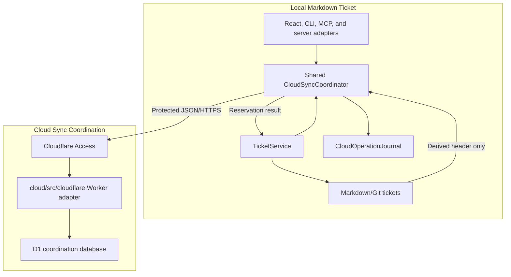

# MDT-199 Architecture

## Decision

Adopt one opt-in cloud coordination subsystem:

- a Cloudflare Worker protected by Cloudflare Access;
- one D1 database per deployment environment;
- cloud-owned project membership and monotonic ticket-number allocation;
- Markdown/Git-owned ticket bodies and header fields;
- a versioned, one-way header projection read through polling;
- shared local orchestration used by browser, CLI, MCP, and server adapters.

The permanent implementation contract is:

- [Cloud sync overview](../../architecture/cloud-sync/README.md)
- [Identity and access](../../architecture/cloud-sync/identity-and-access.md)
- [Data and consistency](../../architecture/cloud-sync/data-and-consistency.md)
- [Operations](../../architecture/cloud-sync/operations.md)

This architecture preserves the reduced-scope decisions approved in `MDT-198`.
It introduces no production code or deployment.

## Fit With the Current System

Current ticket creation converges on `shared/services/TicketService.ts`, but its
`getNextCRNumber()` scans local files and cannot coordinate independent clones.
The browser reaches it through the local server, while CLI and MCP instantiate
the shared service through their own adapters. Therefore the strategy and
recovery seam belongs in `shared`, not in any transport.

Current project identity is local path/config identity. The cloud project UUID
is an explicit, non-secret binding and is never inferred from a path, branch,
commit, or worktree.

Current local authentication describes one installation owner plus read-only
sharing. Cloud team membership is a separate Access-plus-D1 authorization
boundary and does not change local route authorization.

## Bounded Subsystem



The cloud subsystem is bounded because it has its own deployable package,
database, access policy, migrations, and operations. It shares only pure
contracts with local consumers.

## Module Ownership for MDT-200

| Module | Responsibility |
| --- | --- |
| `domain-contracts/src/cloud-sync/` | Pure DTOs, errors, projection fields, allocator and credential port types |
| `shared/services/cloud-sync/CloudSyncCoordinator.ts` | Create orchestration, journal recovery, projection push, polling merge |
| `shared/services/cloud-sync/CloudOperationJournal.ts` | Atomic non-secret pending-operation persistence |
| `shared/services/TicketService.ts` | Select local or cloud strategy from validated project config |
| `server/` | Browser-facing thin adapter and interactive human credential provider |
| `cli/` | Thin interactive adapter using the shared coordinator |
| `mcp-server/` | Thin human stdio or machine HTTP credential adapter |
| `src/` | Sync status, projection stub, conflict, and stale-state presentation |
| `cloud/src/cloudflare/application/` | Authorization and coordination use cases |
| `cloud/src/cloudflare/access/` | Access assertion validation and principal mapping |
| `cloud/src/cloudflare/d1/` | Prepared D1 statements and transactional batches |
| `cloud/migrations/` | Versioned D1 schema |

No presentation adapter may scan for or allocate a number itself. The Worker
does not import filesystem-aware shared services.

## Critical Consistency Decisions

### Allocation

The client persists an idempotency key before the request. D1 allocates the
number, reservation, idempotency result, counter update, and audit event in one
static prepared-statement batch. The design is the production form of the
`MDT-198` E10 proof, which passed local concurrent allocation and replay.

Cloud-bound creation stops if allocation is unavailable. Local fallback and
post-creation renaming are prohibited.

### Local Write Recovery

Allocation precedes the local Markdown write. A mode-`0600`, atomically written
operation journal survives these boundaries:

- response lost after allocation;
- allocation returned but file write failed;
- file exists but acknowledgement was lost;
- acknowledgement succeeded but journal cleanup failed.

Every recovery reuses the original idempotency key or reservation. Retired
numbers are never reused.

The journal is stored below `CONFIG_DIR/cloud-sync/journals/` with one file and
lock per physical-repository routing hash plus cloud project UUID. The
operator-controlled credential-origin allowlist is the global
`cloudSync.allowedOrigins` field in `CONFIG_DIR/config.toml`; project files
cannot expand it.

### Projection

Acknowledgement creates the first header projection. Later writes use an
expected projection version, operation ID, content hash, and complete approved
header. Stale writes return a conflict. The client never merges cloud values
into a local file and never retries a divergent conflict automatically.

Polling uses a project revision cursor. Local tickets remain canonical in the
board; cloud-only headers render as labeled, read-only projection stubs.

### Delete and Restore

Local deletion publishes a versioned tombstone. An old clone cannot silently
resurrect it. Restore is an explicit mutation against the current tombstone
version and requires a canonical local file.

## Identity Decisions

- Access edge admission is necessary but not sufficient.
- The Worker verifies `Cf-Access-Jwt-Assertion` signature, issuer, audience,
  expiry, and key ID against the rotating team JWKS.
- A verified email is a human principal.
- A verified service-token `common_name` is a machine principal.
- D1 membership then grants viewer, contributor, or owner behavior for one
  cloud project.
- Unknown and unauthorized projects share one non-disclosing `404`.
- Browser, interactive CLI, and local stdio MCP use a human application token
  obtained through `cloudflared`.
- Headless MCP HTTP and automation use an Access service token from a backend
  secret channel.
- No cloud credential enters browser storage, project TOML, registry files,
  ticket files, or logs.

## Configuration Decisions

The non-secret project binding is:

```toml
[project.cloudSync]
enabled = true
projectId = "cloud-project-uuid"
serviceUrl = "https://mdt-sync.example.com"
pollIntervalSeconds = 15
```

Enabling is guarded by a real membership probe. The project UUID and service
origin are file-only while enabled. Poll interval is 5 through 300 seconds.

Disabling one client preserves all Markdown but does not make local allocation
safe. Returning a formerly cloud-bound project to local numbering requires the
project-wide suspend, drain, Git synchronization, counter verification, and
detach procedure in the data owner document.

## Security Review

| Threat | Control |
| --- | --- |
| Forged identity header | Verify Access JWT signature, issuer, audience, time claims, and `kid` |
| Cross-project data access | Scope every repository query by project and membership; generic hidden-project `404` |
| Service credential leakage | Backend secret storage, fixed HTTPS origin, header redaction, no browser/project persistence |
| Idempotency confusion | Hash key, bind to canonical request hash, reject mismatched reuse |
| Lost projection update | Expected version and operation ID |
| Ticket body disclosure | No body field in schema, contract, logs, or endpoint |
| Number collision during outage | Cloud-required creation; no local fallback |
| Old clone resurrection | Versioned tombstone and explicit restore |
| Destructive database rollback | Suspend writes, export, bookmark, two-person restore procedure |
| Runaway client | Principal/project route-class rate limit plus D1 constraints |

## Operational Decisions

- Separate staging and production Workers, D1 databases, Access audiences,
  rate-limit namespaces, and credentials.
- Apply schema migrations before compatible code.
- Worker version rollback never implies D1 rollback.
- D1 Time Travel restore is a destructive incident procedure.
- Weekly external export and quarterly restore drill supplement Time Travel.
- A Wrangler-managed 15-minute Cron Trigger runs bounded reservation-expiry
  and audit-retention maintenance through the Worker's scheduled entry point.
- Durable D1 audit is in the mutation batch; sampled Worker logs are
  diagnostics.
- Initial rollout is project allowlisted and requires deployed latency,
  overload, D1 row, Access, recovery, and revocation evidence.

## Trade-offs

| Choice | Benefit | Cost and accepted risk |
| --- | --- | --- |
| One D1 database per environment | Simple migrations and cross-project operations | Every query must enforce tenant scope; a measured capacity gate precedes broad rollout |
| Access plus D1 membership | Edge admission and project authorization remain independently revocable | Two policy layers must be configured and tested together |
| Static D1 allocation batch | Matches the binding API and proven concurrency shape | SQL guards are less ergonomic than an application-branching transaction |
| Durable local journal | Recovers every network/filesystem crash boundary | Adds device-local state and lock ownership to the shared service |
| Polling | No realtime stateful subsystem | Visibility is interval-bound and creates recurring reads |
| Explicit projection conflict | Prevents silent mirror overwrite | Human or operator intervention is required for divergent writers |
| Separate Cloudflare Worker workspace | Clear deployment and secret boundary from the local Markdown application | Adds one package and release pipeline to the monorepo |

Rejected first-slice alternatives remain Git-only allocation, cloud-authoritative
headers, offline local allocation with rename, automatic last-writer-wins
projection retries, and a Durable Object/WebSocket baseline.

## Excluded From the First Slice

- ticket bodies, comments, attachments, and workflow documents in the cloud;
- presence, activity, WebSockets, or realtime fan-out;
- Durable Objects;
- offline allocation, temporary keys, rename, or reference rewriting;
- cloud-to-Markdown writes or automatic conflict merges;
- inferred identity from Git metadata;
- a generic hosted issue tracker.

## Evidence and Limits

`MDT-198` provides:

- a lifecycle POC for reservation, acknowledgement, version conflict,
  abandonment, and export;
- a local D1-binding POC with 50 concurrent unique allocations and 10
  concurrent idempotent replays.

Current code and official Cloudflare documentation were rechecked on
2026-07-24. The POC does not establish real Access behavior, deployed
multi-isolate capacity, or production latency. `MDT-200` must prove those in
staging and a limited production rollout before broader adoption.

## Implementation Gate for MDT-200

`MDT-200` may begin requirements and implementation only after User Review
approves this package. It must preserve:

1. the package and dependency boundaries above;
2. the exact authority split;
3. the static D1 allocation transaction and no-fallback rule;
4. real Access validation for human and machine identities;
5. versioned projection and tombstone semantics;
6. the recovery journal and polling model;
7. the operations release gates.

Concrete Cloudflare account IDs, hostnames, audience values, database IDs,
rate-limit namespace IDs, IdP groups, and production service-token owners are
deployment inputs for `MDT-200`; they do not alter the architecture.
