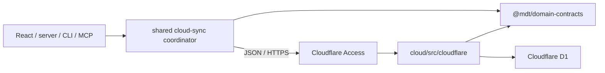

# Cloud Package Boundary Rationale

## Decision

MDT-200 adds one root workspace named `cloud/`, with the Cloudflare Worker
implementation under:

```text
cloud/src/cloudflare/
```

This replaces the earlier package name `cloud-sync-worker/`. It gives cloud
deployment code a clear boundary from the local Markdown application without
creating a provider-neutral or multi-cloud framework.

The permanent package tree and dependency rules are owned by
[Cloud Sync Architecture](../../architecture/cloud-sync/README.md#production-package-boundary).
This ticket note records only the rationale and implementation consequences.

## Rationale

- `cloud/` is the independently built and deployed Worker workspace.
- `cloud/src/cloudflare/` keeps Access, D1, Worker HTTP, rate limits, and
  scheduled execution visibly provider-specific.
- `domain-contracts/` owns pure DTOs shared across the HTTP boundary.
- `shared/` owns local allocation selection, journal recovery, Markdown
  persistence, projection publication, and polling merge.
- Local application packages call the cloud service through the protected HTTP
  API; they never import `@mdt/cloud`.
- The cloud package does not import filesystem-aware `shared`, server, CLI,
  MCP, or frontend code.

The folder name is an ownership boundary, not a portability promise. MDT-200
must not introduce generic provider factories, a future-provider registry, or
abstractions justified only by a hypothetical second platform. Normal
interfaces used for focused tests are acceptable when they simplify current
Cloudflare behavior.

## Relationship With the Main Application



The runtime and dependency relationship is:

```text
domain-contracts <- shared <- server | cli | mcp-server | src
domain-contracts <- cloud/cloudflare

shared --JSON/HTTPS--> cloud/cloudflare
```

## Implementation Consequences

- Add `cloud` to root workspace and build/lint/test/clean scripts.
- Set the Wrangler entry point to `cloud/src/cloudflare/worker.ts`.
- Keep ordered D1 migrations under `cloud/migrations/`.
- Organize Cloudflare application use cases, Access validation, D1 statements,
  rate limiting, and scheduled maintenance below `cloud/src/cloudflare/`.
- Test cloud business behavior with the Workers runtime and D1 integration
  environment; add smaller unit seams only where they reduce test cost now.
- Register the concrete permanent-owner paths in MDT-200 Spec Trace during its
  ordered architecture stage.

## Deferred Decision

If a second deployment provider becomes a real requirement, create a separate
architecture decision then. That decision must evaluate which behavior is
actually common before extracting provider-neutral ports or contract tests.
