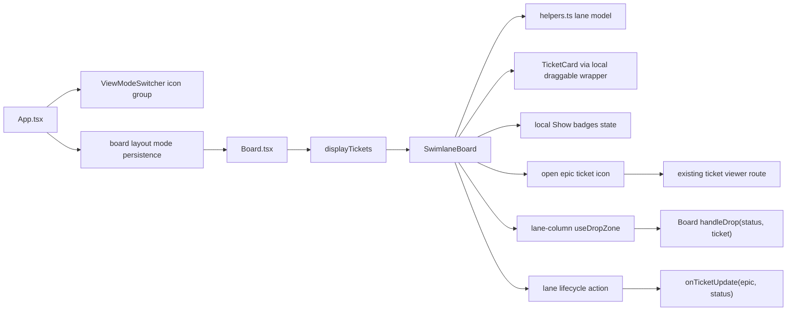

# Architecture: MDT-206

## Overview

MDT-206 adds a second board layout while preserving the existing flat board. `App.tsx` owns the icon-only peer view switcher and persisted board layout mode; `Board.tsx` remains the orchestrator for filtered tickets, sort preferences, optimistic status updates, and update errors; a new `SwimlaneBoard` owns epic grouping, lane controls, progress, and guarded lane-column drops.

## Pattern

Pattern: sibling layout component with pure lane-model helpers.

Rationale: the flat `Column` component is status-column specific. Swimlanes add a second axis, so the epic lane model belongs in a dedicated component instead of branching `Column` into two responsibilities.

## Runtime Flow

## Module Boundaries

- `frontend/src/App.tsx`: owns view-switcher actions, route selection, and `mdt-board-mode` persistence.
- `frontend/src/components/ViewModeSwitcher/`: owns the icon-only Board / Swimlanes / List / Docs peer control with semantic labels.
- `frontend/src/components/Board.tsx`: owns passing display tickets and update callbacks into `SwimlaneBoard`, and preserving the flat board branch unchanged when mode is `flat`.
- `frontend/src/components/SwimlaneBoard/index.tsx`: owns rendered swimlane UI, lane controls, lifecycle controls, and lane-column drop targets.
- `frontend/src/components/SwimlaneBoard/helpers.ts`: owns pure epic classification, lane-key resolution, progress calculation, and lane visibility helpers.
- `frontend/src/components/SwimlaneBoard/swimlane-board.css`: owns semantic swimlane classes and Design 3 token consumption.
- `frontend/src/components/TicketCard.tsx`: owns optional badge-row rendering; default remains visible for existing flat-board callers, swimlanes pass `showBadges=false` until the local toolbar toggle is enabled.
- `tests/e2e/utils/selectors.ts`: owns stable test selectors for swimlane controls and lanes.
- `tests/e2e/board/swimlane-board.spec.ts`: owns user-visible acceptance coverage.

## Invariants

- Epics are never rendered as cards in swimlane mode.
- Cross-epic drops must fail in both `canDrop` and the drop handler.
- Lane progress uses `Implemented`, `Rejected`, and `Partially Implemented` as terminal statuses.
- `No epic` is the trailing fallback lane for tickets with no valid explicit epic target.
- Swimlane ticket-card badges are hidden by default and toggled only through swimlane-local presentation state.
- The epic open icon calls the existing ticket open path; it does not introduce a second epic detail surface.
- Flat board behavior is unchanged when board mode is `flat`.
- Styling uses semantic classes and existing tokens; no Alpine/mock-data architecture is copied from `design3.html`.

## Error Philosophy

Epic Activate/Close actions use the existing ticket update path. If MDT-205 rejects close because children remain non-terminal, the lane header action surfaces the same error message/details through the existing toast path. UI pre-computation may disable the Close button when blockers are known, but server rejection remains authoritative.

## UX Notes

The durable design specs now match the implementation boundary: Swimlanes is a peer control in the app header, but both Board and Swimlanes share the board route/container and differ by persisted board layout mode.

## Rollback

Remove the `SwimlaneBoard` import/render branch from `Board.tsx` and the Swimlanes item from `ViewModeSwitcher`; the existing flat board remains the default branch and can continue to render without the swimlane files.

## Extension Rule

Future epic detail modal, side-rail, or zoom-filter work must compose around `SwimlaneBoard`; it must not move lane grouping or status mutation ownership out of the Board/Swimlane boundary.
