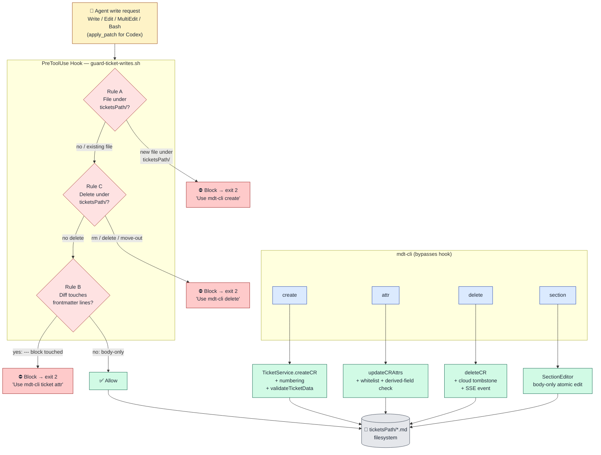

# Block direct agent file mutation of tickets path

## Problem Statement

Tickets are markdown files with YAML frontmatter in `{project.ticketsPath}/*.md` — a shared mutable resource. AI agents (Claude Code, Codex/.agents, .zcode) currently have unrestricted `Write`/`Edit`/`apply_patch` access to these files. Three concrete failure modes:

1. **File creation leakage.** Agents create new files under `ticketsPath` directly, bypassing `TicketService` numbering, key-format rules, and the canonical frontmatter schema. The result is duplicate keys, malformed frontmatter, and broken invariants that downstream readers (Kanban UI, SSE, MCP) silently accept because the parse side uses a lenient hand-rolled parser.

2. **Frontmatter corruption.** Direct edits to the `---` block can break format, canonical attributes, enum values, and field types. The canonical `TicketFrontmatterSchema` (Zod, strict) exists in `domain-contracts/src/ticket/frontmatter.ts` but is **never invoked** by the writer (`MarkdownService.writeMarkdownFile`). The contract is dead code.

3. **Silent deletion.** Agents can delete ticket files (`.md`), ticket folders (`{KEY}/`), or spec-trace folders (`.trace/{KEY}/`) with `Bash` (`rm`) or `apply_patch` delete operations, bypassing the `TicketService.deleteCR` lifecycle — which means no cloud projection tombstone, no SSE delete event, no cleanup of related artifacts. Worse, `deleteCR` itself has gaps (see MDT-143 UC-1/UC-2): it leaves orphan `{KEY}/` subdocument folders when non-empty, and never touches `.trace/{KEY}/`. Routing deletes through `mdt-cli` is necessary but not yet sufficient — see **Dependencies**.

### Current State (verified)

- **Hook infrastructure**: only Claude Code has live hooks today (1 `SessionStart` + 1 `Stop` via `prompts/mdt/scripts/enforce-tasks.sh`). Codex/.zcode have zero hook manifests in this repo.
- **Cross-ecosystem hook support** (confirmed): all three support `PreToolUse`-style hooks with the same JSON manifest shape, same stdin payload (`tool_name`, `tool_input.{command,file_path}`, `cwd`, `session_id`), and same block semantics (exit code `2` or stdout `{permissionDecision:"deny"}`). Tool names differ: Claude/ZCode use `Write`/`Edit`/`MultiEdit`; Codex uses `apply_patch`. Reference cross-ecosystem plugin: an external `commithooks/` prototype.
- **Schema gap**: `TicketFrontmatterSchema` declared in `domain-contracts/src/ticket/frontmatter.ts` is not invoked on the write path. `MarkdownService.writeMarkdownFile` trusts itself.
- **Service layer** (`shared/services/TicketService.ts`) is already the single mutation authority: enforces `TICKET_UPDATE_ALLOWED_ATTRS` whitelist, derived-field rejection (`blocks`), atomic field patching via `updateYAMLField` (preserves unrelated fields byte-for-byte), numbering, key normalization.
- **CLI gaps**: (a) `mdt-cli create` skips `TemplateService.validateTicketData` (weaker than MCP `create_cr`); (b) `manage_cr_sections` (replace/append/prepend body sections) is MCP-only — no `mdt-cli ticket section` equivalent.
- **Native path-deny**: Claude offers `permissions.deny` (e.g. `Edit(docs/CRs/**)`). ZCode and Codex do not — they require shell logic in the hook command for path filtering.

### Desired State

Agents may not create files under `{project.ticketsPath}/*.md`, may not mutate the frontmatter block of existing ticket files directly, and may not delete any path under `{project.ticketsPath}/`. Create / update-attributes / delete operations are routed through `mdt-cli` (or MCP/REST), which already enforces the canonical schema and invariants. **Body edits** of existing tickets remain permitted (the ergonomic common case for an agent improving prose).

The enforcement is symmetric across Claude Code, Codex/.agents, and .zcode — but **Claude Code ships first**, with Codex/.zcode parity in a later phase.

## High-Level Workflow

**Reading the diagram.** Every agent write/edit/delete first passes through the three-rule PreToolUse gate. Three block paths route to `mdt-cli` (create / attr / delete); the one allow path lets body-only edits through. `mdt-cli` commands never touch the hook — they go straight to `TicketService`, which is the single mutation authority that already enforces numbering, schema, whitelist, derived-field rejection, and lifecycle side-effects (cloud tombstone, SSE). Phase 0 ensures `TicketService`'s writer also calls `TicketFrontmatterSchema` so service-internal and CLI paths can't drift from the hook.

## Design Principles (non-negotiable)

1. **Single source of truth.** The validator the hook uses must be the same validator the writer uses. Two validators drift. Wire the schema into the writer first; the hook imports it.
2. **Surgical boundary.** Block frontmatter-line diffs, not body edits. The cut is frontmatter vs. body, not file vs. no-file.
3. **PreToolUse, not PostToolUse.** Block before the write. Post-hoc validation is apology-after-the-fact.
4. **Ecosystem parity is a Phase 2 concern.** Claude Code first. Do not let Codex/.zcode format differences block the Claude ship.
5. **No enterprise sludge.** One hook script, three thin manifest variants. No factory/builder/manager layers.

## Approach

### Phase 0 — Pre-conditions (ship regardless of hooks)

These pay for themselves even if no hook ever ships. They close the gap between "the schema exists" and "the schema is enforced."

- **0.1 Wire `TicketFrontmatterSchema` into `MarkdownService.writeMarkdownFile`.** Validate before write; throw on invalid. Legacy files still read via the tolerant `normalizeTicket` path (read stays lenient, write becomes strict). This makes the writer self-guarding — the foundation everything else depends on.
- **0.2 Close the CLI create-validation gap.** Call `TemplateService.validateTicketData` in `ticketCreateAction` (`cli/src/commands/create.ts`) to mirror `CRHandlers.handleCreateCR`. After this, CLI create and MCP create enforce the same rules.
- **0.3 Ship `mdt-cli ticket section`.** Port `manage_cr_sections` (list/get/replace/append/prepend) from MCP to CLI. Without this, a strict "no direct body edits" policy would break body work — but more importantly, the CLI should be a complete alternative to direct editing for every operation.

### Phase 1 — Claude Code PreToolUse hook

- **1.1 One hook script** (`prompts/mdt/scripts/guard-ticket-writes.sh`, sibling to `enforce-tasks.sh`) that reads the JSON stdin payload and enforces three rules:
  - **Rule A — creation gate.** If `tool_name ∈ {Write,Edit,MultiEdit}` AND `tool_input.file_path` is under `{project.ticketsPath}/` AND that file does not currently exist → `exit 2` with reason `"Use mdt-cli create to create tickets"`.
  - **Rule B — frontmatter gate.** If the operation modifies an existing ticket file AND the diff touches any line inside the `---` frontmatter block → `exit 2` with reason `"Use mdt-cli ticket attr for frontmatter changes"`. Body-line diffs pass.
  - **Rule C — deletion gate.** Block any tool call that removes a path under `{project.ticketsPath}/`. Three sub-cases:
    - **C.1 `Bash` deletion** (`rm`, `rmdir`, `find -delete`, `git rm`, `mv`-out-of-tree): if the command pattern deletes anything under `ticketsPath` → block. Best-effort regex on `tool_input.command`; on ambiguity, block.
    - **C.2 `apply_patch`/`Edit` file delete**: `apply_patch` `*** Delete File: <path>` and similar → block if path under `ticketsPath`.
    - **C.3 Multi-file / recursive**: any tool that could remove the `{KEY}/` folder or `.trace/{KEY}/` → block. Reason: `"Use mdt-cli delete <key> to delete tickets"`.
  - Resolves `ticketsPath` from `.mdt-config.toml` (same pattern as `mdt-project-vars.sh`).
- **1.1.1 Deletion is an `mdt-cli`-only operation** in Phase 1. No escape hatch — there is no scenario where an agent should delete a ticket file directly. The CLI is the single authority; its gaps (orphan subdocument folders, untouched `.trace/`) are tracked separately on MDT-143 (UC-1, UC-2) and must not be worked around by direct deletion.
- **1.2 Register** the hook in `.claude/settings.local.json` `hooks.PreToolUse` with matcher `^(Write|Edit|MultiEdit)$`.
- **1.3 Document** in `AGENTS.md` that `ticketsPath` is CLI/MCP-only for mutation (frontmatter) and CLI-only for creation. Soft governance underneath the hard gate.

### Phase 2 — Ecosystem parity (deferred)

- **2.1 Codex** (`<repo>/.codex/hooks.json`): same hook script, matcher `^apply_patch$`. Note Codex requires `[features].hooks = true` (already on globally) and first-run user trust.
- **2.2 ZCode** (`<repo>/.zcode/config.json` → `hooks.events.PreToolUse`): same script, matcher `^(Write|Edit)$`. Requires `hooks.enabled: true`.
- **2.3 Extract** the hook into a shared plugin under `commithooks/` so all three ecosystems pull from one source.

## Alternatives Considered

- **PostToolUse validate + show errors.** Rejected. Damage already done; recovery via `git checkout` is unreliable when the agent doesn't see or act on the error.
- **Block all direct ticket-file writes (force CLI/MCP for body too).** Rejected as default. Breaks body-edit ergonomics. Becomes viable only after 0.3 ships and only if body-edit abuse is observed in practice.
- **OS-level read-only mount.** Rejected. Cross-platform pain, overkill for the threat model.
- **Backend authority (agents go through REST/MCP only, never files).** Rejected for now. Architecturally cleanest but a workflow redesign, not an enforcement patch. Revisit if direct-file editing proves to be a feature with no defenders.
- **Marker/HMAC signing.** Rejected. Noise and overkill.

## Open Questions

- Q1: Should Rule B (frontmatter gate) also block edits to `dateCreated` / `code` (immutable fields)? Current answer: yes — `updateCRAttrs` already rejects these via the whitelist, so direct edits should be blocked symmetrically.
- Q2: Does the hook need to handle MultiEdit's multi-file payload shape separately? Verify during Phase 1 implementation.
- Q3: For Codex `apply_patch`, the file path lives inside the command body (`*** Update File: <path>`) not in `tool_input.file_path`. The hook script needs a parser branch. Confirm during Phase 2.
- Q4: Rule C.1 — what `Bash` patterns count as "delete under ticketsPath"? Proposed set: `rm`, `rmdir`, `find … -delete`, `find … -exec rm`, `git rm`, `mv <ticketsPath-paths> <outside>`. Open: `unlink`, `truncate -s0` (does zeroing count as delete?), `cp /dev/null >` (same). Default: block on ambiguity; allow only an explicit safe-list if one is needed.
- Q5: Does Rule C also need to gate `cp`/`rsync` *into* ticketsPath from outside? That's a creation vector (Rule A territory via `Bash`). Default: yes, treat `cp`/`rsync` writing into ticketsPath as Rule A creation.

## Verification

- **0.1**: write with bad assignee/status/date throws; existing tickets still parse (read path unchanged).
- **0.2**: `mdt-cli create bogusType "Title"` now rejects; parity with `create_cr` MCP tool.
- **0.3**: `mdt-cli ticket section <key> replace "## Description" "..."` works; matches MCP behavior.
- **1.1–1.3** (Claude):
  - agent `Write` to a new file under `docs/CRs/` → blocked (Rule A).
  - agent `Edit` touching the frontmatter block → blocked (Rule B).
  - agent `Edit` touching only body → passes.
  - agent `Bash rm docs/CRs/MDT-209.md` → blocked (Rule C.1).
  - agent `Bash rm -r docs/CRs/MDT-209/` → blocked (Rule C.1, recursive).
  - agent `Bash rm -r docs/CRs/.trace/MDT-209/` → blocked (Rule C.1, .trace under ticketsPath).
  - agent `Bash mv docs/CRs/MDT-209.md /tmp` → blocked (Rule C.1, move-out-of-tree).
  - agent uses `mdt-cli create`/`attr`/`delete`/`section` → succeeds.
- **2.x**: same matrix repeated under Codex (apply_patch) and ZCode.

## Impact Areas

- `domain-contracts/src/ticket/frontmatter.ts` (schema already present, wire-in)
- `shared/services/MarkdownService.ts` (writer validation)
- `shared/services/TicketService.ts` (no change — already the authority)
- `cli/src/commands/create.ts` (close validation gap)
- `cli/src/commands/section.ts` (new — port from MCP)
- `mcp-server/src/services/SectionManagement/` (extract shared logic)
- `prompts/mdt/scripts/guard-ticket-writes.sh` (new — handles Rules A/B/C)
- `.claude/settings.local.json` (register hook; matcher expanded to `^(Write|Edit|MultiEdit|Bash)$`)
- `AGENTS.md` (governance doc)
- Phase 2: `.codex/hooks.json`, `.zcode/config.json`, `commithooks/` plugin

## Dependencies

- **MDT-143 UC-1 / UC-2** (logged 2026-07-26): `mdt-cli delete` has its own gaps — leaves orphan `{KEY}/` subdocument folders when non-empty, and never touches `.trace/{KEY}/`. MDT-209 forces all deletes through `mdt-cli`, which makes those gaps the *only* path to delete. **MDT-209 does not fix them** — they belong to MDT-143 and are out of scope here. But MDT-209 is a forcing function: once Rule C ships, closing UC-1/UC-2 becomes more urgent because there is no longer a workaround.

## Phasing

Phase 0 ships first and is independently valuable. Phase 1 is the Claude Code enforcement layer (Rules A/B/C). Phase 2 is ecosystem parity. Each phase is independently shippable and reversible.