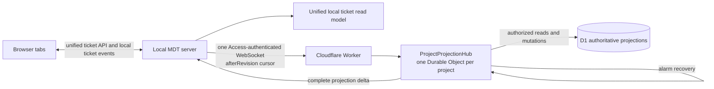

# Replace cloud projection polling with push delivery

## 1. Description

### Requirements Scope

`full`

### Problem

The current browser-owned 15-second projection poll creates cloud traffic when
nothing changed. Each poll reaches the Worker, checks D1 membership, and reads
projection state. The poll path also drains the local projection journal, so a
stuck entry adds a per-ticket projection read on every interval.

Production evidence supplied for this ticket showed 1,435 executions of the
membership query and 1,046 executions of the per-ticket projection query. Both
average about 0.2 ms. The defect is request amplification, not slow SQL.

Throttling retries would remove only the second query pattern. Increasing the
poll interval would reduce traffic by making updates slower. Neither fixes the
architectural problem: elapsed time must not cause D1 reads when project state
did not change.

### Outcome

Replace periodic cloud projection polling with an event-driven project stream:

- one hibernating `ProjectProjectionHub` Durable Object per cloud project;
- one Access-authenticated WebSocket per local server and cloud project;
- D1 commit followed by a complete projection delta broadcast;
- cursor catch-up on initial connection, gaps, and reconnects;
- a backend-owned projection read model merged into the existing ticket API;
- ordinary local ticket events from the server to every browser tab;
- zero D1 reads while a healthy connected project is idle.

D1 remains the authoritative projection and membership store. The Durable
Object is a delivery sequencer and connection coordinator, not a second ticket
or projection database.

### Scope

Included:

- Cloudflare Durable Object binding and migration for `ProjectProjectionHub`.
- Projection stream protocol, authentication, cursor, catch-up, deduplication,
  gap recovery, token-expiry, membership-revocation, and alarm recovery rules.
- One local upstream stream per project, independent of browser-tab count.
- One backend-owned unified ticket read model; no browser projection feed,
  cursor, catch-up, or cloud reconnect logic.
- Migration from connection schema version 1 polling configuration to version
  2 push configuration.
- Updated cloud-sync owner documents, operational signals, and rollout gates.
- Focused Worker, local server, contract, and browser E2E tests.

Excluded:

- Ticket-body storage or synchronization.
- Direct browser-to-cloud credentials or WebSockets.
- Presence, collaborative editing, offline number allocation, KV, Queues, D1
  replicas, and a second projection authority.
- Replacing the local projection write journal; it remains responsible for
  retrying failed local-to-cloud mutations independently of projection reads.

## 2. Decision

### Target Architecture

### Delivery Flow

1. The local server reads the last applied `projectRevision` and opens one
   project WebSocket through the Worker.
2. The Worker validates the Access assertion and current project membership,
   then routes by deterministic cloud project ID to `ProjectProjectionHub`.
3. The hub reads projections newer than `afterRevision`, sends catch-up deltas,
   and sends `ready(highWaterRevision)` only after catch-up. Catch-up revisions
   may be sparse because D1 retains only the latest row per ticket. An explicit
   hub operation queue serializes subscription and mutations, closing the
   connect/write race across asynchronous D1 calls.
4. Projection mutations route through the hub. The hub arms a recovery alarm,
   commits the existing D1 projection transaction, then broadcasts the complete
   approved projection header and its revision.
5. The local server applies revisions idempotently to its projection read
   model, persists the cursor only after applying state, sends `ack`, and emits
   an ordinary local ticket change.
6. Duplicate or older revisions are ignored. Sparse revisions are valid inside
   catch-up; only a gap during live delivery triggers one cursor catch-up.
7. Browser reads use the existing project-ticket endpoint, which returns local
   Markdown tickets plus projection-only read-only entries. The browser never
   calls a projection endpoint or manages projection state.

### Failure and Authorization Model

- Delivery is at-least-once; revision-aware application makes the resulting
  projection state idempotent.
- A WebSocket send is not delivery acknowledgement. Each socket records its
  acknowledged revision only after the backend applies and persists state.
- If the process fails after D1 commit and before every active socket
  acknowledges, the pre-armed Durable Object alarm replays a bounded catch-up
  to each still-active lagging socket. Disconnected servers catch up when they
  reconnect.
- The projection table stores the latest state per ticket, so recovery promises
  final-state convergence, not delivery of every intermediate edit.
- A disconnected board retains the last projection and marks it stale. Local
  Markdown remains usable.
- The stream is authorized at handshake, re-authorized after hibernation before
  delivery, and reconnected no later than Access-token expiry.
- Membership mutation and delivery share the project hub. Revoked or suspended
  principals are excluded and their sockets are closed before later delivery.
- Protocol-level WebSocket auto-response may maintain transport liveness; it
  must not query D1 or keep the Durable Object active.

### Request Reduction

| Condition | Current | Target |
| --- | --- | --- |
| Healthy project, no changes | Four polls/minute/client plus D1 auth and cursor reads | Zero D1 reads and no repeated Worker requests |
| Additional browser tab | Another browser poll loop | Same backend ticket API/event stream; no additional cloud connection or D1 traffic |
| Projection commit | Visible at next poll | One D1 mutation plus broadcast |
| Reconnect or detected gap | Next periodic poll | One bounded cursor catch-up |
| Stuck local projection write | Retried from every read poll | Retried only by the independent persisted write journal |

## 3. Alternatives Considered

| Approach | Decision |
| --- | --- |
| Increase polling interval | Rejected: trades traffic for freshness and still reads while idle |
| Cache membership/projection reads | Rejected: masks the pull model and complicates revocation |
| Decouple retries but preserve polling | Rejected: fixes one amplifier but keeps baseline D1 traffic |
| Worker WebSocket without Durable Object | Rejected: no project-scoped serialized coordinator or hibernating connection owner |
| Queue or KV notification layer | Rejected: adds products without removing the need for project connection coordination |
| Hibernating project Durable Object plus local fan-out | Accepted: traffic follows changes and connections, while D1 remains authoritative |

## 4. Artifact Specifications

### Cloud

- `cloud/src/cloudflare/durable/ProjectProjectionHub.ts` owns the hibernating
  project sockets, serialized catch-up/mutation flow, socket attachments, and
  alarm recovery.
- `cloud/src/cloudflare/worker.ts` authenticates WebSocket upgrades and routes
  stream plus projection mutations to the deterministic project hub.
- `cloud/src/cloudflare/application/projection-usecase.ts` and
  `cloud/src/cloudflare/d1/projection.ts` retain D1 transaction and cursor-query
  ownership behind the hub.
- `cloud/wrangler.jsonc` adds the Durable Object binding and migration. D1 needs
  no new table for delivery.

### Contracts and Local Runtime

- `domain-contracts/src/cloud-sync/projection-stream.ts` defines `catchup`,
  `delta`, `ready`, client `ack`, `stale`, and typed close/error envelopes.
- `shared/services/cloud-sync/CloudProjectionStreamClient.ts` owns WebSocket
  transport, Access headers, backoff, token refresh, cursor requests, and
  protocol validation.
- `server/services/cloud-sync/ProjectionStreamManager.ts` owns exactly one
  client per enabled local project and applies deltas to the backend read model.
- `shared/services/cloud-sync/CloudProjectionReadModel.ts` persists approved
  projected headers and the applied revision, and merges them with canonical
  local tickets using local-wins semantics.
- `domain-contracts/src/ticket/view.ts` defines the unified browser-facing
  ticket item with capability metadata but no cloud revision/transport fields.
- `server/services/TicketService.ts` returns the unified ticket list through
  the existing project-ticket endpoint.
- `SSEBroadcaster`, `src/services/sseClient.ts`, and `useSSEEvents` deliver
  ordinary local ticket changes. `useCloudProjectionFeed.ts` and the browser
  `/cloud-projections` request are removed after compatibility rollout.
- `shared/services/cloud-sync/project-state-store.ts` migrates version 1
  connections to version 2 and removes `pollIntervalSeconds` from active use.

### Durable Workflow Documents

- Narrative requirements: `docs/CRs/MDT-226/requirements.md`
- BDD acceptance: `docs/CRs/MDT-226/bdd.md`
- Architecture and obligations: `docs/CRs/MDT-226/architecture.md`
- Approved refinement record: `docs/CRs/MDT-226/uat.md`
- Canonical trace projections: `docs/CRs/MDT-226/*.trace.md`
- Permanent owners: `docs/architecture/cloud-sync/`

## 5. Acceptance Criteria

### Functional

- [ ] An enabled cloud project with a valid server-side credential establishes
  exactly one authenticated upstream projection stream per local server,
  regardless of browser-tab count.
- [ ] Initial connection and reconnect send `afterRevision`, apply catch-up,
  accept sparse catch-up revisions, and become live only after applying the
  final `ready` high-water cursor.
- [ ] A committed projection is delivered as a complete approved header without
  waiting for a periodic client request.
- [ ] The local server persists the revision after applying the delta and fans
  out an ordinary ticket change through existing local SSE; it sends `ack` only
  after state and cursor persistence succeeds.
- [ ] The existing project-ticket read endpoint returns canonical local tickets
  and projection-only read-only entries as one collection; local tickets win on
  duplicate ticket number.
- [ ] The browser owns no projection cursor, catch-up, WebSocket reconnect, or
  `/cloud-projections` request. It consumes only the unified ticket API, local
  ticket events, and high-level sync status.
- [ ] Duplicate/older revisions are ignored; sparse catch-up is accepted; a
  non-contiguous live revision causes one catch-up.
- [ ] A disconnected board keeps the last projection visible and marks it stale.
- [ ] A failure after D1 commit and before acknowledgement by an active socket
  converges through per-socket alarm replay or reconnect without polling.
- [ ] Revocation/suspension closes or excludes active sockets before any later
  projection delivery.
- [ ] Local Markdown tickets remain authoritative over same-number projections.
- [ ] Version 1 connection files migrate to version 2 without changing project
  identity, trusted origin, or credential reference.

### Non-Functional

- [ ] A healthy connected project with no changes, reconnects, or authorization
  changes performs zero D1 reads solely because time passes.
- [ ] Healthy connected delivery reaches the unified local ticket read model
  and connected browser within 2 seconds at p95 under the documented test load.
- [ ] Reconnect catch-up completes within 5 seconds at p95 under that load.
- [ ] The hub uses the Hibernation WebSocket API and alarms; no interval or
  application keepalive keeps it active.
- [ ] Stream payloads contain approved projection headers and delivery metadata
  only, never ticket bodies or Cloudflare credentials.
- [ ] The browser never opens the cloud WebSocket and never receives an Access
  token or service-token header.
- [ ] D1 remains authoritative; the Durable Object stores only delivery state
  and socket metadata needed to coordinate the stream.
- [ ] No KV, Queue, D1 replica, or new ticket-content store is introduced.

### Verification

- [ ] Worker tests prove explicit operation serialization, hibernation restore,
  commit-before-broadcast, per-socket acknowledgement/alarm recovery,
  membership revocation, and payload redaction.
- [ ] Local tests prove one stream per project, bounded reconnect, cursor
  persistence before acknowledgement, sparse catch-up, live-gap handling, and
  SSE fan-out.
- [ ] Browser E2E proves a remote projection appears without calling the legacy
  polling endpoint, is received as an ordinary ticket update, and additional
  tabs create no cloud traffic.
- [ ] An idle-traffic test holds a connected project open for at least five
  former poll intervals and observes zero projection or membership D1 reads.
- [ ] A write-journal test proves reads never trigger drains, retries honor
  persisted backoff, and missing projections become terminal `unmanaged`.
- [ ] A load test records p50/p95/p99 delivery and reconnect catch-up latency.
- [ ] `spec-trace validate MDT-226 --stage architecture --strict` passes.

## 6. Deployment

1. Deploy the Durable Object class, binding, migration, stream endpoint, and
   compatibility cursor endpoint. Keep old polling clients supported during
   the bounded rollout window.
2. Deploy local schema-v2 migration and the server stream manager behind a
   per-installation feature flag. Compare delivery correctness and D1 request
   metrics against the polling baseline.
3. Make push the default for selected projects, then all enabled projects.
4. Remove the browser projection hook and endpoint, then retire version-1
   polling compatibility only after active-client telemetry confirms the
   migration gate.

Rollback disables the local push flag and returns compatible clients to the
cursor endpoint. It does not roll back D1 data or reuse ticket numbers. The
Durable Object binding is removed only after all sockets and alarms are drained.

## 7. References

- `research/cloud-sync-delivery-model.md`
- `research/cloud-hosted-frontend-local-agent.md`
- `docs/architecture/cloud-sync/README.md`
- `docs/architecture/cloud-sync/data-and-consistency.md`
- `docs/architecture/cloud-sync/identity-and-access.md`
- `docs/architecture/cloud-sync/operations.md`

## 8. Clarifications

### UAT Session 2026-08-08 - Event-driven projection delivery

**Approved changes**

- Periodic projection polling is no longer the target architecture.
- Retry decoupling remains necessary but belongs to the independent local
  write-journal lifecycle; it is not the read-delivery solution.
- Projection delivery uses one hibernating Durable Object per cloud project,
  one local-server WebSocket per project, cursor catch-up, and local SSE fan-out.
- Idle D1 projection and membership reads must be zero.
- Freshness is defined by a 2-second p95 connected-delivery SLO and a 5-second
  p95 reconnect-catch-up SLO under the documented test load.

**Changed requirement IDs**

`BR-1.1` through `BR-1.9`, `C-1` through `C-10`, and `Edge-1` through `Edge-4`.

**Affected downstream trace**

- Requirements, BDD, and architecture were regenerated for this round.
- Test specifications and implementation tasks remain pending; generate them
  from the updated architecture rather than the superseded polling design.

**Strict validation result**

- Requirements: passed.
- BDD: passed.
- Architecture: passed.

### UAT Session 2026-08-08 - Unified browser ticket boundary

**Approved changes**

- `/v1/projects/{projectId}/projection-stream` is a cloud service endpoint used
  only by the local backend/agent.
- The backend owns projection cache, cursor, catch-up, reconnect, merge, and
  cloud transport lifecycle.
- The browser consumes the existing project-ticket API and local ticket event
  stream. It knows only ticket capabilities such as projected/read-only/stale;
  it does not manage projections.
- The browser projection hook and `/api/projects/:id/cloud-projections` route
  are removal targets after the rollout compatibility window.

**Changed requirement IDs**

- Refined `BR-1.3`.
- Added `C-11`.

**Updated workflow documents**

- `requirements.md`, `bdd.md`, `architecture.md`, `uat.md`, and their canonical
  trace projections.

**Strict validation result**

- Requirements, BDD, and architecture: passed.

### UAT Session 2026-08-08 - Projection write journal isolation

**Approved changes**

- Projection write retries are scheduled independently of browser/read paths.
- Retry state is explicit and persisted; missing projections stop as
  `unmanaged` rather than retrying forever or being created implicitly.
- Eligible updates use one conditional write without a preflight projection
  read. Initial creation still requires reservation recovery or explicit import.

**Changed requirement IDs**

- Added `C-12` and `Edge-5`.

**Updated workflow documents**

- Requirements, architecture, tests, tasks, current `uat.md`, permanent
  cloud-sync owners, and operator recovery guidance.

**Strict validation target**

- Requirements, BDD, architecture, tests, and tasks.

### UAT Session 2026-08-08 - Protocol drift review

**Resolved drifts**

- Catch-up no longer assumes every historical project revision exists. D1
  stores the latest row per ticket, so catch-up accepts sparse rows and advances
  atomically to the `ready` high-water cursor.
- WebSocket send success no longer counts as at-least-once delivery. The local
  server acknowledges only after read-model and cursor persistence; alarms
  replay to still-active lagging sockets.
- Project operations use an explicit async queue rather than assuming Durable
  Object handlers cannot interleave across D1 awaits.
- The 2-second SLO is end-to-end through the unified ticket read model and
  connected browser, not merely Worker-to-local-server transport.

**Changed requirement IDs**

- Refined `C-6`, `C-8`, `Edge-1`, and `Edge-2`.

**Updated workflow documents**

- `requirements.md`, `architecture.md`, `uat.md`, permanent cloud-sync owners,
  and canonical trace projections.

**Strict validation result**

- Requirements, BDD, and architecture: passed.
