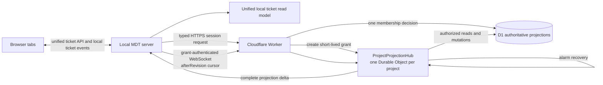

# Replace cloud projection polling with push delivery

## 1. Description

### Requirements Scope

`full`

### Problem

The current browser-owned 15-second projection poll creates cloud traffic when
nothing changed. Each poll reaches the Worker, checks D1 membership, and reads
projection state. The poll path also drains the local projection journal, so a
stuck entry adds a per-ticket projection read on every interval.

Production evidence supplied for this ticket showed 1,435 executions of the
membership query and 1,046 executions of the per-ticket projection query. Both
average about 0.2 ms. The defect is request amplification, not slow SQL.

Throttling retries would remove only the second query pattern. Increasing the
poll interval would reduce traffic by making updates slower. Neither fixes the
architectural problem: elapsed time must not cause D1 reads when project state
did not change.

### Outcome

Replace periodic cloud projection polling with an event-driven project stream:

- one hibernating `ProjectProjectionHub` Durable Object per cloud project;
- one Access-authenticated WebSocket per local server and cloud project;
- D1 commit followed by a complete projection delta broadcast;
- cursor catch-up on initial connection, gaps, and reconnects;
- a backend-owned projection read model merged into the existing ticket API;
- ordinary local ticket events from the server to every browser tab;
- zero D1 reads while a healthy connected project is idle.

D1 remains the authoritative projection and membership store. The Durable
Object is a delivery sequencer and connection coordinator, not a second ticket
or projection database.

### Scope

Included:

- Cloudflare Durable Object binding and migration for `ProjectProjectionHub`.
- Projection stream protocol, authentication, cursor, catch-up, deduplication,
  gap recovery, token-expiry, membership-revocation, and alarm recovery rules.
- One local upstream stream per project, independent of browser-tab count.
- One backend-owned unified ticket read model; no browser projection feed,
  cursor, catch-up, or cloud reconnect logic.
- Migration from connection schema version 1 polling configuration to version
  2 push configuration.
- Updated cloud-sync owner documents, operational signals, and rollout gates.
- Focused Worker, local server, contract, and browser E2E tests.

Excluded:

- Ticket-body storage or synchronization.
- Direct browser-to-cloud credentials or WebSockets.
- Presence, collaborative editing, offline number allocation, KV, Queues, D1
  replicas, and a second projection authority.
- Replacing the local projection write journal; it remains responsible for
  retrying failed local-to-cloud mutations independently of projection reads.

## 2. Decision

### Target Architecture

### Delivery Flow

1. The local server requests a typed stream session. The Worker validates
   Access and current membership once; the project hub issues a short-lived,
   server-only stream grant.
2. The local server opens one WebSocket with the grant and last applied
   `projectRevision`. The Worker routes it to the same hub without another D1
   membership query; reconnects reuse the grant until expiry or revocation.
3. The hub reads projections newer than `afterRevision`, sends catch-up deltas,
   and sends `ready(highWaterRevision)` only after catch-up. Catch-up revisions
   may be sparse because D1 retains only the latest row per ticket. An explicit
   hub operation queue serializes subscription and mutations, closing the
   connect/write race across asynchronous D1 calls.
4. Projection mutations route through the hub. The hub arms a recovery alarm,
   commits the existing D1 projection transaction, then broadcasts the complete
   approved projection header and its revision.
5. The local server applies revisions idempotently to its projection read
   model, persists the cursor only after applying state, sends `ack`, and emits
   an ordinary local ticket change.
6. Duplicate or older revisions are ignored. Sparse revisions are valid inside
   catch-up; only a gap during live delivery triggers one cursor catch-up.
7. Browser reads use `/api/projects/:id/tickets/unified`, which returns local
   Markdown tickets plus projection-only read-only entries. The browser never
   calls a projection endpoint or manages projection state.

### Failure and Authorization Model

- Delivery is at-least-once; revision-aware application makes the resulting
  projection state idempotent.
- A WebSocket send is not delivery acknowledgement. Each socket records its
  acknowledged revision only after the backend applies and persists state.
- If the process fails after D1 commit and before every active socket
  acknowledges, the pre-armed Durable Object alarm replays a bounded catch-up
  to each still-active lagging socket. Disconnected servers catch up when they
  reconnect.
- The projection table stores the latest state per ticket, so recovery promises
  final-state convergence, not delivery of every intermediate edit.
- A disconnected board retains the last projection and marks it stale. Local
  Markdown remains usable.
- Session authorization is a typed HTTPS control-plane decision. The hub
  validates the resulting grant at WebSocket handshake, re-authorizes after
  hibernation before delivery, and expires the grant no later than the Access
  credential.
- Authorization/protocol failures persist locally and do not retry on a timer or
  server restart. Only a changed connection/credential/protocol fingerprint,
  membership reconciliation, successful explicit cloud operation after a
  transport-only failure, or operator retry can re-arm activation. Routine
  refresh of the same token does not change the fingerprint.
- Membership mutation and delivery share the project hub. Revoked or suspended
  principals are excluded and their sockets are closed before later delivery.
- Protocol-level WebSocket auto-response may maintain transport liveness; it
  must not query D1 or keep the Durable Object active.

### Request Reduction

| Condition | Current | Target |
| --- | --- | --- |
| Healthy project, no changes | Four polls/minute/client plus D1 auth and cursor reads | Zero D1 reads and no repeated Worker requests |
| Additional browser tab | Another browser poll loop | Same backend ticket API/event stream; no additional cloud connection or D1 traffic |
| Unauthorized or incompatible project | Repeated membership read and denied audit write | One typed session decision per activation fingerprint, then persisted pause |
| Projection commit | Visible at next poll | One D1 mutation plus broadcast |
| Transport reconnect | Next periodic poll | Reuse current grant; no membership read; bounded attempt budget |
| Detected revision gap | Next periodic poll | One bounded cursor catch-up |
| Stuck local projection write | Retried from every read poll | Retried only by the independent persisted write journal |

## 3. Alternatives Considered

| Approach | Decision |
| --- | --- |
| Increase polling interval | Rejected: trades traffic for freshness and still reads while idle |
| General membership/projection cache | Rejected: masks the pull model and complicates revocation |
| Short-lived hub-owned stream grant | Accepted: one explicit D1 authorization decision can safely serve reconnects; membership mutation revokes grants and sockets |
| Decouple retries but preserve polling | Rejected: fixes one amplifier but keeps baseline D1 traffic |
| Worker WebSocket without Durable Object | Rejected: no project-scoped serialized coordinator or hibernating connection owner |
| Queue or KV notification layer | Rejected: adds products without removing the need for project connection coordination |
| Hibernating project Durable Object plus local fan-out | Accepted: traffic follows changes and connections, while D1 remains authoritative |

## 4. Artifact Specifications

### Cloud

- `cloud/src/cloudflare/durable/ProjectProjectionHub.ts` owns the hibernating
  project sockets, short-lived grant digests/revocation, serialized catch-up and
  mutation flow, socket attachments, and alarm recovery.
- `cloud/src/cloudflare/worker.ts` authenticates typed session requests,
  preserves grant-bearing upgrades, and routes stream plus projection mutations
  to the deterministic project hub.
- `cloud/src/cloudflare/application/projection-usecase.ts` and
  `cloud/src/cloudflare/d1/projection.ts` retain D1 transaction and cursor-query
  ownership behind the hub.
- `cloud/wrangler.jsonc` adds the Durable Object binding and migration. D1 needs
  no new table for delivery.

### Contracts and Local Runtime

- `domain-contracts/src/cloud-sync/projection-stream.ts` defines typed session
  outcomes, grant metadata, `catchup`, `delta`, `ready`, client `ack`, `stale`,
  and error envelopes.
- `shared/services/cloud-sync/CloudProjectionSessionClient.ts` owns one typed
  HTTPS grant request and no retry policy.
- `shared/services/cloud-sync/CloudProjectionStreamClient.ts` owns one
  grant-bearing WebSocket transport and no autonomous retry timer.
- `shared/services/cloud-sync/projection-stream-state-store.ts` persists phase,
  reason, activation fingerprint, and attempt budget without secrets.
- `server/services/cloud-sync/ProjectionStreamManager.ts` solely owns
  activation/re-arm policy, grant renewal, bounded transient reconnect, and
  delta application.
- `shared/services/cloud-sync/CloudProjectionReadModel.ts` persists approved
  projected headers and the applied revision, and merges them with canonical
  local tickets using local-wins semantics.
- `domain-contracts/src/ticket/view.ts` defines the unified browser-facing
  ticket item with capability metadata but no cloud revision/transport fields.
- `server/services/TicketService.ts` returns the unified ticket list through
  `/api/projects/:id/tickets/unified`.
- `SSEBroadcaster`, `src/services/sseClient.ts`, and `useSSEEvents` deliver
  ordinary local ticket changes. `useCloudProjectionFeed.ts` and the browser
  `/cloud-projections` request are removed after compatibility rollout.
- `shared/services/cloud-sync/project-state-store.ts` migrates version 1
  connections to version 2 and removes `pollIntervalSeconds` from active use.

### Durable Workflow Documents

- Narrative requirements: `docs/CRs/MDT-226/requirements.md`
- BDD acceptance: `docs/CRs/MDT-226/bdd.md`
- Architecture and obligations: `docs/CRs/MDT-226/architecture.md`
- Approved refinement record: `docs/CRs/MDT-226/uat.md`
- Canonical trace projections: `docs/CRs/MDT-226/*.trace.md`
- Permanent owners: `docs/architecture/cloud-sync/`

## 5. Acceptance Criteria

### Functional

- [ ] An enabled cloud project with a valid server-side credential establishes
  exactly one authenticated upstream projection stream per local server,
  regardless of browser-tab count.
  _Component-tested (`ProjectionStreamManager.test.ts`); server bootstrap wiring
  exists in `server/server.ts`; deployed credential/Worker round-trip still needs
  UAT evidence._
- [ ] Initial connection and reconnect send `afterRevision`, apply catch-up,
  accept sparse catch-up revisions, and become live only after applying the
  final `ready` high-water cursor.
  _Component-tested; server bootstrap wiring exists; deployed catch-up evidence
  remains pending._
- [x] Each project has at most one in-flight connection attempt and one
  reconnect/expiry timer; `error` plus `close`, catch-up close, and stale
  callbacks cannot create parallel reconnect lanes.
  _This bounds local concurrency only. The 2026-08-15 incident proved that one
  bounded lane can still retry a terminal handshake forever and amplify D1._
- [x] One process-scoped credential broker serves all server cloud paths,
  reuses valid human tokens by trusted origin, shares concurrent resolution,
  keeps startup/reconnect non-interactive, supports service-token stream headers,
  serializes `cloudflared` children, and signals deadline overruns without
  spawning a replacement before exit.
- [ ] A committed projection is delivered as a complete approved header without
  waiting for a periodic client request.
  _Server path is wired; deployed commit-to-local-read-model/browser evidence is
  still pending._
- [ ] The local server persists the revision after applying the delta and fans
  out an ordinary ticket change through existing local SSE; it sends `ack` only
  after state and cursor persistence succeeds.
  _Ack-after-persistence is component-tested; `server/server.ts` wires
  `ProjectionStreamManager`, the read-model provider, and
  `FileWatcherService.broadcastProjectionChange`; live deployed evidence remains
  pending._
- [x] `/api/projects/:id/tickets/unified` returns canonical local tickets and
  projection-only read-only entries as one collection; local tickets win on
  duplicate ticket number.
  _`/tickets/unified` + read-model local-wins merge tested; the provider is wired
  in `server/server.ts`. Frontend normalization still needs a regression proving
  projected `kind/readOnly/stale` are preserved into board rendering._
- [x] The browser owns no projection cursor, catch-up, WebSocket reconnect, or
  `/cloud-projections` request. It consumes only the unified ticket API, local
  ticket events, and high-level sync status.
  _`useCloudProjectionFeed` gutted (poll loop removed); E2E proves no
  `/cloud-projections` request in push mode._
- [x] Duplicate/older revisions are ignored; sparse catch-up is accepted; a
  non-contiguous live revision causes one catch-up.
  _`CloudProjectionReadModel.test.ts` (9 tests): duplicate/older ignored,
  sparse accepted, live-gap detection._
- [x] A disconnected board keeps the last projection visible and marks it stale.
  _Read-model stale-without-losing-entries tested._
- [ ] A failure after D1 commit and before acknowledgement by an active socket
  converges through per-socket alarm replay or reconnect without polling.
  _Manual deployed gate only (C-7/Edge-1); hibernation/alarm not in the
  automated suite._
- [ ] Revocation/suspension closes or excludes active sockets before any later
  projection delivery.
  _`revokeSockets` now returns its queued work (enqueueResult); the
  hibernation-runtime revocation behavior remains a manual deployed gate
  (Edge-4)._
- [x] Local Markdown tickets remain authoritative over same-number projections.
  _Read-model local-wins merge tested._
- [x] Version 1 connection files migrate to version 2 without changing project
  identity, trusted origin, or credential reference.
  _Read-time normalization in `project-state-store.ts` + legacy binding
  migration wired into project management._

### Non-Functional

- [ ] After activation settles into live or a terminal paused state, a project
  with no external state change performs zero D1 statements as time passes.
  _FAILED in production on 2026-08-15; containment implemented 2026-08-15
  (session/grant split, terminal pause persistence, no timer-driven retry;
  automatic streams behind the rollout flag, default off). Local incident tests
  green; the deployed 30-minute TEST-idle-zero-d1 statement count remains the
  accepting evidence._
- [ ] One unchanged non-live activation performs at most one D1 membership
  decision and one denial audit; grant reconnect, elapsed time, browser activity,
  and server restart add no D1 statement.
  _FAILED in the 2026-08-15 incident (238 membership reads + 111 denied-audit
  inserts in an idle 30-minute sample); enforced locally since 2026-08-15 by
  hub-cached session decisions, digest-stored grants, the persisted activation
  fingerprint, and the manager-owned re-arm policy. Proven by
  TEST-stream-session-client, TEST-worker-hub-upgrade-forwarding, and
  TEST-stream-handshake-failure-classification; deployed confirmation is the
  TEST-deployed-stream-handshake gate._
- [ ] Healthy connected delivery reaches the unified local ticket read model
  and connected browser within 2 seconds at p95 under the documented test load.
  _External gate; not measured. No automated SLO test._
- [ ] Reconnect catch-up completes within 5 seconds at p95 under that load.
  _External gate; not measured._
- [ ] The hub uses the Hibernation WebSocket API and alarms; no interval or
  application keepalive keeps it active.
  _Designed but not verified by the automated suite (manual gate C-7)._
- [x] Stream payloads contain approved projection headers and delivery metadata
  only, never ticket bodies or Cloudflare credentials.
  _`recordToCatchup` envelope mapping + forbidden-field recursion tested._
- [x] The browser never opens the cloud WebSocket and never receives an Access
  token or service-token header.
  _No browser WebSocket code exists; token stays server-side._
- [x] D1 remains authoritative; the Durable Object stores only bounded grant,
  delivery, and socket metadata needed to coordinate the stream.
- [x] No KV, Queue, D1 replica, or new ticket-content store is introduced.

### Verification

- [ ] Worker tests prove explicit operation serialization, hibernation restore,
  commit-before-broadcast, per-socket acknowledgement/alarm recovery,
  membership revocation, and payload redaction.
  _Partial: operation-queue serialization + payload redaction proven by the
  hub pure-logic tests; hibernation/alarm/revocation are manual deployed
  gates only. See architecture.md § Verification Architecture._
- [ ] Local tests prove one stream per project, bounded reconnect, cursor
  persistence before acknowledgement, sparse catch-up, live-gap handling, and
  SSE fan-out.
  _Component-tested in isolation (`ProjectionStreamManager`, read model, SSE
  fan-out helper). The incident-recovery slice adds the automated incident
  tests (session client, upgrade forwarding, failure classification,
  local-only status); the deployed Worker-to-hub round-trip remains unproven
  until the TEST-deployed-stream-handshake probe runs._
- [x] Local resource-bound tests prove compound transport termination and
  catch-up replacement and concurrent manager starts create one connection,
  concurrent credential callers share one acquisition, background refresh is
  non-interactive, and a hung `cloudflared` child is signalled without spawning
  another before exit.
- [ ] Browser E2E proves a remote projection appears without calling the legacy
  polling endpoint, is received as an ordinary ticket update, and additional
  tabs create no cloud traffic.
  _`cloud-sync-board.spec.ts` mocks the unified endpoint via `page.route`; it
  proves the board's render contract, not a live server/cloud round-trip._
- [ ] An idle-traffic test holds a connected project open for at least five
  former poll intervals and observes zero projection or membership D1 reads.
  _FAILED 2026-08-15: approximately 170 D1 statements per 15 minutes while two
  configured streams repeatedly failed to upgrade._
- [x] A write-journal test proves reads never trigger drains, retries honor
  persisted backoff, and missing projections become terminal `unmanaged`.
  _`projection-sync.test.ts` (terminal-no-retry) +
  `publish.usecase.test.ts` (missing row → projection_not_found)._
- [ ] A load test records p50/p95/p99 delivery and reconnect catch-up latency.
  _External gate; not run._
- [x] `spec-trace validate MDT-226 --stage architecture --strict` passes.

## 6. Deployment

1. Deploy the Durable Object class, binding, migration, stream endpoint, and
   compatibility cursor endpoint. Keep old polling clients supported during
   the bounded rollout window.
2. Deploy local schema-v2 migration and the server stream manager behind a
   per-installation feature flag. Compare delivery correctness and D1 request
   metrics against the polling baseline.
3. Make push the default for selected projects, then all enabled projects.
4. Remove the browser projection hook and endpoint, then retire version-1
   polling compatibility only after active-client telemetry confirms the
   migration gate.

Rollback disables the local push flag and returns compatible clients to the
cursor endpoint. It does not roll back D1 data or reuse ticket numbers. The
Durable Object binding is removed only after all sockets and alarms are drained.

## 7. References

- `research/cloud-sync-delivery-model.md`
- `research/cloud-hosted-frontend-local-agent.md`
- `docs/architecture/cloud-sync/README.md`
- `docs/architecture/cloud-sync/data-and-consistency.md`
- `docs/architecture/cloud-sync/identity-and-access.md`
- `docs/architecture/cloud-sync/operations.md`

## 8. Clarifications

### UAT Session 2026-08-08 - Event-driven projection delivery

**Approved changes**

- Periodic projection polling is no longer the target architecture.
- Retry decoupling remains necessary but belongs to the independent local
  write-journal lifecycle; it is not the read-delivery solution.
- Projection delivery uses one hibernating Durable Object per cloud project,
  one local-server WebSocket per project, cursor catch-up, and local SSE fan-out.
- Idle D1 projection and membership reads must be zero.
- Freshness is defined by a 2-second p95 connected-delivery SLO and a 5-second
  p95 reconnect-catch-up SLO under the documented test load.

**Changed requirement IDs**

`BR-1.1` through `BR-1.9`, `C-1` through `C-10`, and `Edge-1` through `Edge-4`.

**Affected downstream trace**

- Requirements, BDD, and architecture were regenerated for this round.
- Test specifications and implementation tasks remain pending; generate them
  from the updated architecture rather than the superseded polling design.

**Strict validation result**

- Requirements: passed.
- BDD: passed.
- Architecture: passed.

### UAT Session 2026-08-08 - Unified browser ticket boundary

**Approved changes**

- `/v1/projects/{projectId}/projection-stream` is a cloud service endpoint used
  only by the local backend/agent.
- The backend owns projection cache, cursor, catch-up, reconnect, merge, and
  cloud transport lifecycle.
- The browser consumes the existing project-ticket API and local ticket event
  stream. It knows only ticket capabilities such as projected/read-only/stale;
  it does not manage projections.
- The browser projection hook and `/api/projects/:id/cloud-projections` route
  are removal targets after the rollout compatibility window.

**Changed requirement IDs**

- Refined `BR-1.3`.
- Added `C-11`.

**Updated workflow documents**

- `requirements.md`, `bdd.md`, `architecture.md`, `uat.md`, and their canonical
  trace projections.

**Strict validation result**

- Requirements, BDD, and architecture: passed.

### UAT Session 2026-08-08 - Projection write journal isolation

**Approved changes**

- Projection write retries are scheduled independently of browser/read paths.
- Retry state is explicit and persisted; missing projections stop as
  `unmanaged` rather than retrying forever or being created implicitly.
- Eligible updates use one conditional write without a preflight projection
  read. Initial creation still requires reservation recovery or explicit import.

**Changed requirement IDs**

- Added `C-12` and `Edge-5`.

**Updated workflow documents**

- Requirements, architecture, tests, tasks, current `uat.md`, permanent
  cloud-sync owners, and operator recovery guidance.

**Strict validation target**

- Requirements, BDD, architecture, tests, and tasks.

### UAT Session 2026-08-08 - Protocol drift review

**Resolved drifts**

- Catch-up no longer assumes every historical project revision exists. D1
  stores the latest row per ticket, so catch-up accepts sparse rows and advances
  atomically to the `ready` high-water cursor.
- WebSocket send success no longer counts as at-least-once delivery. The local
  server acknowledges only after read-model and cursor persistence; alarms
  replay to still-active lagging sockets.
- Project operations use an explicit async queue rather than assuming Durable
  Object handlers cannot interleave across D1 awaits.
- The 2-second SLO is end-to-end through the unified ticket read model and
  connected browser, not merely Worker-to-local-server transport.

**Changed requirement IDs**

- Refined `C-6`, `C-8`, `Edge-1`, and `Edge-2`.

**Updated workflow documents**

- `requirements.md`, `architecture.md`, `uat.md`, permanent cloud-sync owners,
  and canonical trace projections.

**Strict validation result**

- Requirements, BDD, and architecture: passed.

### UAT Session 2026-08-14 - Local stream and credential resource bounds

**Approved changes**

- One project connection state machine owns handshake, reconnect, expiry, and
  transport replacement with one attempt and one timer.
- One process-scoped credential broker caches by trusted origin and shares
  concurrent acquisition across every server cloud path.
- The `cloudflared` adapter serializes children, signals deadline overruns, and
  blocks replacement acquisition until the child exits.
- Startup/reconnect never invokes interactive login; cached human and machine
  credentials map to headers plus expiry as one value.

**Changed requirement IDs**

- Added `C-13`, `Edge-6`, and `Edge-7`.

**Updated workflow documents**

- Requirements, architecture, tests, tasks, current `uat.md`, permanent
  cloud-sync owner docs, and operations guidance.

**Validation result**

- Strict requirements, unchanged BDD, architecture, tests, and tasks: passed.
- Focused shared/server tests, TypeScript validation, package lint, and full
  build: passed.

### UAT Session 2026-08-15 - Production D1 amplification incident

**Incident report**

- Impact: automatic projection delivery was unavailable for both configured
  projects and the retry loops generated approximately 170 D1 statements per
  15 minutes. No ticket or projection data loss was observed.
- MDT reached the Worker with valid membership, but the Worker replaced the
  request headers while adding principal context and dropped
  `Upgrade: websocket`; the Durable Object returned `426 Expected WebSocket`.
- VOC had no current membership and returned `404`. The local client classified
  both `404` and `426` as retryable transport failures and retried forever with
  full jitter capped at 30 seconds.
- From 09:08:55 to 09:23:20 CEST, VOC alone recorded 54 denied stream attempts:
  54 membership `SELECT`s and 54 audit `INSERT`s. MDT retried at a similar
  cadence with one membership `SELECT` before each `426`.
- A later idle 30-minute window recorded 238 membership `SELECT`s and 111 audit
  `INSERT`s: 349 D1 statements without project activity. The ratio supports the
  same two-loop diagnosis and confirms the incident remained active.

**Control and detection failures**

- The required per-installation rollout flag, deployed `101` handshake gate,
  and idle-D1 gate were not delivered before automatic stream startup.
- Stream attempts were logged as `project.probe`, not `projection.stream`.
- Existing status checks proved configuration, credentials, membership, and
  Worker reachability; they did not report live/paused/failed stream state.
  MDT-203 owns the settings surface and MDT-223 owns CLI output fidelity; this
  ticket must supply the backend runtime state they consume.
- The 2026-08-14 update proved local process bounds only. It overstated
  readiness because mocked tests and build success did not exercise the
  deployed Worker-to-Durable-Object upgrade or cloud request budget.

**Changed requirement IDs**

- Refined `BR-1.5`, `C-1`, `C-10`, and `C-14`; added `C-15` and retained
  `Edge-8` as the concrete upgrade-preservation failure. `C-1` now covers
  settled live and terminal states and carries failed production evidence.
- Refined `disconnected_board_stale` so the user sees reconnecting versus
  paused state and the required next action.
- Added `OBL-stream-failure-containment`, five incident test plans, and
  `TASK-stream-incident-recovery`.

**Containment and recovery**

- No runtime containment was performed during this documentation update.
  Stopping the server or disabling the affected bindings stops the traffic but
  also disables cloud delivery and remains an explicit operator decision.
- Recovery uses a typed HTTPS session request for one D1 membership decision,
  then a short-lived hub grant for WebSocket upgrade and reconnect without
  further membership reads. Terminal activation state persists across restart;
  the WebSocket transport owns no retry timer. Restore the rollout flag and
  accurate route telemetry, then pass deployed grant/`101`, catch-up, and
  30-minute idle-D1 gates before automatic streams are re-enabled.
