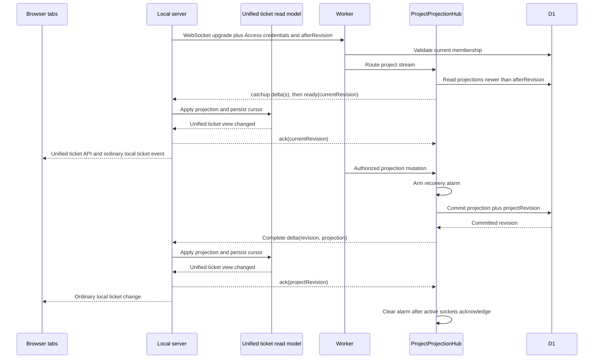

# MDT-226 Architecture

## Decision

Use a hibernating Cloudflare Durable Object, deterministically keyed by cloud
project UUID, as the ordering and delivery coordinator for projection changes.
D1 remains the authority for membership and projection state. Each local server
holds one upstream WebSocket per enabled project, materializes received
projections into its unified ticket read model, and exposes only ordinary local
ticket reads/events to browsers.



## Architecture Boundaries

### Cloud project hub

`ProjectProjectionHub` owns:

- accepted hibernating WebSockets and minimal socket attachments;
- an explicit per-instance async operation queue for subscription, membership
  mutation, and projection mutation work;
- race-free cursor catch-up followed by `ready`;
- commit-triggered complete-delta broadcast;
- per-socket acknowledged revisions and pre-armed alarm recovery.

It does not own ticket bodies, projection authority, membership authority, or a
second mutation log. Its durable state is delivery metadata only.

### Worker routing

The Worker validates the Access assertion and resolves a principal before
accepting the upgrade. It checks current membership without revealing hidden
projects, chooses the Durable Object by exact cloud project UUID, and forwards
projection and membership mutations through that same object.

The existing HTTPS cursor endpoint remains a bounded recovery and rollout
compatibility surface. Version 2 clients never call it on a timer.

### Mutation and delivery

The hub's explicit operation queue prevents async handler interleaving; the
design does not assume Durable Object event delivery alone provides a critical
section across D1 awaits. The hub arms an alarm before invoking the existing
projection use case. The use case commits the projection row, monotonic project
revision, and audit record in the D1 transaction. Only that committed result
becomes a stream delta.

Broadcast is not treated as delivery acknowledgement. After the local read
model applies and persists a revision, the stream client sends `ack`. The hub
stores the acknowledged revision in that socket's attachment. The alarm remains
armed while an active authorized socket is behind and replays a bounded catch-up
from that socket's cursor. A closed socket stops being an active delivery
obligation and catches up when it reconnects. With no active sockets, the alarm
can clear because D1 remains available for future catch-up.

### D1 cursor catch-up

Catch-up captures the current project revision as its high-water mark, then
reads `ticket_projections` by `cloud_project_id` and
`project_revision > afterRevision AND project_revision <= highWaterRevision`,
ordered by project revision with a bounded page size. The hub sends complete
projection rows, not patches, then sends `ready(highWaterRevision)`.

Catch-up revisions may be sparse because D1 stores only the latest row per
ticket: several historical revisions for one ticket can collapse into its
current row. The local read model applies all catch-up rows and advances to the
`ready` high-water mark as one completed batch. Once live, deltas are contiguous;
a live gap triggers a new catch-up.

There is no periodic membership or projection query. D1 reads occur on
handshake, reconnect/catch-up, actual mutations, authorization changes, or
recovery.

### Wire contract

The versioned stream envelope is a discriminated union:

- `catchup`: complete projection delta emitted before `ready`;
- `delta`: complete committed projection delta for live delivery;
- `ready`: current committed project revision after catch-up;
- `stale`: typed server-side indication that delivery cannot currently proceed;
- `error`: stable non-secret error code and retry disposition.

The client envelope `ack` carries the highest revision that the local read model
has applied and persisted. It is sent for a completed catch-up `ready` cursor or
a live delta, never merely because bytes were received.

Every data envelope includes `cloudProjectId` and `projectRevision`. Projection
deltas also include `ticketNumber`, `projectionVersion`, `lifecycle`, and the
approved projected header. No ticket body, Access assertion, service token,
filesystem path, or raw principal identifier is allowed.

### Local stream client

`CloudProjectionStreamClient` uses the existing credential provider to attach
Access headers during the WebSocket handshake. It validates envelopes, performs
bounded exponential reconnect with jitter, refreshes credentials, and requests
catch-up from the last applied cursor. Transport ping uses protocol behavior
that does not wake the hub for an application request.

### Local stream manager

`ProjectionStreamManager` is server-lifecycle owned and keyed by local project
identity. It starts at most one client per enabled cloud project, stops cleanly,
passes deltas to the projection read model in order, and owns reconnect/catch-up.
It sends `ack` only after the read model confirms atomic state/cursor
persistence. Browser mounts do not change upstream connection count.

### Local projection read model

`CloudProjectionReadModel` owns the local cache of complete projected headers,
the applied cloud revision, atomic persistence, duplicate/gap decisions, and
the rule that a canonical local ticket suppresses the same-number projection.
It publishes a backend ticket-view change only after state and cursor are
applied. It exposes no cloud transport state to React.

### Browser-facing ticket contract

`domain-contracts/src/ticket/view.ts` defines the browser-facing list item. A
canonical and projection-only item share the ticket fields needed by the board;
`kind`, `readOnly`, and `stale` let the UI render capabilities honestly. The DTO
contains no `projectRevision`, `projectionVersion`, catch-up state, cloud URL,
or credential.

### Unified ticket API

`server/services/TicketService.ts` returns the unified list from the existing
project-ticket endpoint: canonical Markdown tickets plus read-model entries
that have no canonical local match. A browser refresh therefore obtains the
complete current board without a separate `/cloud-projections` request.

### Browser ticket events

`SSEBroadcaster` remains the local one-to-many transport. The backend emits a
normal ticket-view change after the projection read model changes.
`src/services/sseClient.ts` maps it to the existing ticket event bus, and
`useSSEEvents` updates or refreshes the same ticket collection used for local
filesystem changes. The browser has no projection-feed hook, cloud cursor,
reconnect loop, or cloud endpoint knowledge. A separate project sync-status
event may expose `connecting`, `live`, `stale`, or `authentication_required`
without exposing the projection protocol.

### Connection schema v2

Active connection files become:

```toml
version = 2
state = "enabled"
cloudProjectId = "018f5e6c-6f32-7c5b-9e76-97c7c769c123"
serviceOrigin = "https://mdt-sync.example.com"
```

`pollIntervalSeconds` is accepted only while reading version 1 and is discarded
by the atomic version 2 rewrite. Project identity, origin trust, and credential
selection do not change.

### Cloudflare infrastructure

`cloud/wrangler.jsonc` adds a `PROJECT_HUB` Durable Object binding and a
`new_sqlite_classes` class migration for `ProjectProjectionHub`. The hub uses
the Hibernation WebSocket API and Durable Object alarms. The SQLite-backed class
storage holds only alarm and socket metadata — it is a separate database from
the `DB` D1 binding and is not a second projection authority. The existing D1
binding remains the only projection database; no D1 schema migration is required
for delivery. A hibernated, armed alarm makes no D1 request, so an idle
connected project performs zero D1 reads.

## Security and Revocation

- The browser never receives cloud credentials or addresses the hub directly.
- Handshake authorization is fail-closed and project-scoped.
- Socket attachments contain only the minimum project/principal tag, token
  expiry, and applied-revision data needed after hibernation.
- Before delivery after hibernation, the hub rechecks the distinct connected
  principals against D1 in a bounded batch.
- Membership revocation/suspension is routed through the hub, which commits the
  D1 change, marks matching attachments unauthorized, and closes their sockets
  before a later projection broadcast.
- A local server reconnects no later than token expiry, so an open socket is not
  an indefinitely cached authorization decision.

## Failure Semantics

| Failure | Required behavior |
| --- | --- |
| Access or membership denied at handshake | Reject without disclosing hidden-project existence |
| Connection lost | Keep last projection, mark stale, reconnect with bounded backoff |
| Sparse revisions inside catch-up | Apply rows and advance only to the final `ready` high-water cursor |
| Duplicate or old revision | Ignore without advancing or rewinding state |
| Revision gap during live delivery | Pause live application and perform one cursor catch-up |
| D1 mutation fails | Broadcast nothing; return typed mutation failure |
| D1 commit succeeds, active socket does not acknowledge | Alarm replays a bounded catch-up from that socket's acknowledged cursor |
| Local apply/persist fails | Do not acknowledge or advance cursor; reconnect/catch-up repeats safely |
| Membership revoked while connected | Exclude and close matching sockets before later delivery |

## Architecture Obligations

### OBL-single-project-stream

Route each local project through one hibernating project hub stream. Derived
from `BR-1.1`, `BR-1.6`, `C-5`, and `C-7`.

### OBL-commit-before-delivery

Commit authoritative D1 projection state before broadcasting a complete delta.
Derived from `BR-1.2`, `C-2`, and `C-4`.

### OBL-race-free-catchup

Serialize project operations, accept sparse catch-up, and persist and
acknowledge applied cursors. Derived from `BR-1.4`, `C-6`, and `Edge-2`.

### OBL-local-fanout

Expose cloud-derived changes only through the unified local ticket API and event
stream. Derived from `BR-1.3`, `BR-1.6`, `C-3`, and `C-11`.

### OBL-stream-authorization

Authorize handshakes and stop delivery after revocation or token expiry.
Derived from `BR-1.7`, `C-10`, and `Edge-4`.

### OBL-post-commit-recovery

Recover committed but unacknowledged revisions with alarms and reconnect
catch-up. Derived from `BR-1.5`, `BR-1.8`, `C-7`, and `Edge-1`.

### OBL-local-authority

Build the unified ticket read model with canonical local tickets winning over
projected entries. Derived from `BR-1.9`, `C-2`, `C-4`, and `C-11`.

### OBL-zero-idle-reads

Eliminate timer-driven D1 reads and bound delivery freshness. Derived from
`C-1`, `C-7`, `C-8`, and `C-9`.

### OBL-config-cutover

Migrate polling connections to version 2 backend-managed push connections.
Derived from `Edge-3`.

### OBL-verification

Verify hub behavior, local fan-out, security, recovery, and D1 request shape
against all current requirements before implementation acceptance.

## Verification Architecture

- Worker runtime tests use Miniflare/Workers test support with D1 and Durable
  Object bindings to prove explicit operation serialization, hibernation,
  per-socket acknowledgement, alarm replay, and revocation.
- Local server tests use a controllable WebSocket peer and fake clock to prove
  lifecycle ownership, sparse catch-up, live-gap resync, acknowledgement after
  cursor persistence, single-flight reconnect, and SSE.
- Browser E2E observes the real board and local server, asserts that the browser
  uses only the unified ticket API plus local event stream, and opens multiple
  tabs without any `/cloud-projections` request.
- A deployed limited-production probe records D1 statement counts and delivery
  percentiles. Unit timing alone cannot accept the freshness SLO.

## Documentation Ownership

Permanent system truth lives under `docs/architecture/cloud-sync/`. This ticket
owns the decision history, requirements, acceptance, architecture trace, and
implementation handoff. Research documents remain evidence and are marked
superseded where they recommended polling.
