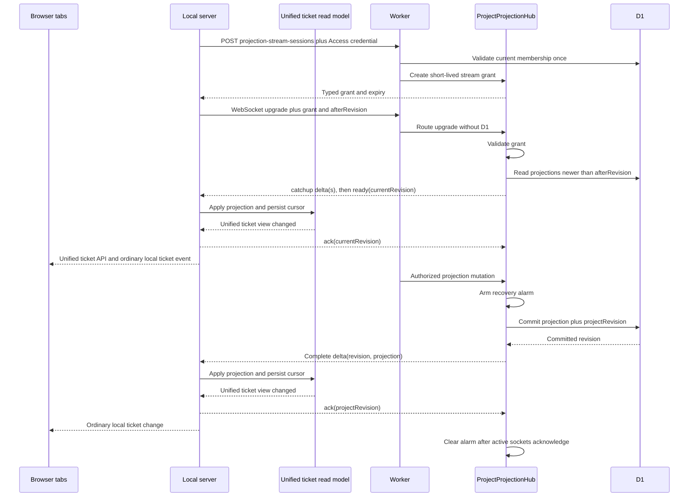

# MDT-226 Architecture

## Decision

Use **grant-gated push delivery**: a typed HTTPS control-plane request performs
one Access and D1 membership decision and asks the project Durable Object for a
short-lived stream grant; the WebSocket data plane validates that grant without
querying D1. The hibernating `ProjectProjectionHub`, deterministically keyed by
cloud project UUID, coordinates delivery while D1 remains authoritative. A
persisted local activation state—not a timer—decides when a failed project may
try again.



## Architecture Boundaries

### Cloud project hub

`ProjectProjectionHub` owns:

- accepted hibernating WebSockets and minimal socket attachments;
- an explicit per-instance async operation queue for subscription, membership
  mutation, and projection mutation work;
- race-free cursor catch-up followed by `ready`;
- commit-triggered complete-delta broadcast;
- per-socket acknowledged revisions and pre-armed alarm recovery.
- short-lived stream grants, grant revocation, and upgrade validation without a
  D1 membership query.

It does not own ticket bodies, projection authority, membership authority, or a
second mutation log. Its durable state is delivery metadata only.

### Worker routing

The Worker exposes a typed HTTPS session endpoint carrying a stable, non-secret
activation ID. After Access validation it asks the project hub whether that
principal/activation decision is already known. A cached terminal decision is
returned without D1 or audit; a cached positive decision issues a fresh grant
without D1. Only a cache miss checks current membership and writes one audit,
then the hub records the bounded decision and grant. Membership mutation
invalidates affected decisions and grants. The grant expires no later than the
Access credential and is never returned to a browser or persisted locally.

The subsequent WebSocket upgrade is a data-plane operation: the Worker
preserves the original upgrade headers and routes the request plus grant to the
same hub without another D1 query. The hub validates the grant, binds its
principal/cursor metadata to the socket, and accepts or rejects the upgrade.
Membership mutations revoke matching grants and sockets through that hub.

The existing HTTPS cursor endpoint remains a bounded recovery and rollout
compatibility surface. Version 2 clients never call it on a timer.

### Mutation and delivery

The hub's explicit operation queue prevents async handler interleaving; the
design does not assume Durable Object event delivery alone provides a critical
section across D1 awaits. The hub arms an alarm before invoking the existing
projection use case. The use case commits the projection row, monotonic project
revision, and audit record in the D1 transaction. Only that committed result
becomes a stream delta.

Broadcast is not treated as delivery acknowledgement. After the local read
model applies and persists a revision, the stream client sends `ack`. The hub
stores the acknowledged revision in that socket's attachment. The alarm remains
armed while an active authorized socket is behind and replays a bounded catch-up
from that socket's cursor. A closed socket stops being an active delivery
obligation and catches up when it reconnects. With no active sockets, the alarm
can clear because D1 remains available for future catch-up.

### D1 cursor catch-up

Catch-up captures the current project revision as its high-water mark, then
reads `ticket_projections` by `cloud_project_id` and
`project_revision > afterRevision AND project_revision <= highWaterRevision`,
ordered by project revision with a bounded page size. The hub sends complete
projection rows, not patches, then sends `ready(highWaterRevision)`.

Catch-up revisions may be sparse because D1 stores only the latest row per
ticket: several historical revisions for one ticket can collapse into its
current row. The local read model applies all catch-up rows and advances to the
`ready` high-water mark as one completed batch. Once live, deltas are contiguous;
a live gap triggers a new catch-up.

There is no periodic membership or projection query. D1 reads occur when a
stream grant is issued or renewed, during catch-up/gaps, actual mutations,
authorization changes, or recovery. Reconnect with an unexpired grant does not
read membership.

### Wire contract

`POST /v1/projects/{projectId}/projection-stream-sessions` returns a typed
server-only grant and expiry or the normal coordination error envelope. The
grant is opaque, scoped to one project/principal, stored as a digest in the
project hub, and reusable only until expiry or revocation. This HTTP boundary
is where `401`/`403`/`404` become actionable local states; the WebSocket API
does not need to expose an upgrade response body.

The versioned stream envelope is a discriminated union:

- `catchup`: complete projection delta emitted before `ready`;
- `delta`: complete committed projection delta for live delivery;
- `ready`: current committed project revision after catch-up;
- `stale`: typed server-side indication that delivery cannot currently proceed;
- `error`: stable non-secret error code and retry disposition.

The client envelope `ack` carries the highest revision that the local read model
has applied and persisted. It is sent for a completed catch-up `ready` cursor or
a live delta, never merely because bytes were received.

Every data envelope includes `cloudProjectId` and `projectRevision`. Projection
deltas also include `ticketNumber`, `projectionVersion`, `lifecycle`, and the
approved projected header. No ticket body, Access assertion, service token,
filesystem path, or raw principal identifier is allowed.

### Local stream-session client

`CloudProjectionSessionClient` owns the typed HTTPS authorization call and
normalizes Access/Worker responses into `granted`, `authentication_required`,
`authorization_required`, `incompatible`, or `transient_failure`. It performs
no retries. A successful grant is held in memory and reused by transport
reconnects until expiry.

### Local stream client

`CloudProjectionStreamClient` owns one WebSocket created with a valid grant. It
preserves one in-flight handshake, coalesces `error` plus `close`, ignores stale
transport callbacks, validates envelopes, and reports termination to the
manager. It owns no autonomous retry timer, credential acquisition, membership
probe, or terminal-failure policy.

### Access credential broker

One process-scoped `AccessCredentialBroker` supplies every server cloud path.
It keys human Access credentials by trusted service origin, reuses a token until
the expiry refresh window, and shares one in-flight resolution among concurrent
callers. `CloudflaredCredentialProvider` is the only child-process owner; it
serializes acquisitions, enforces a caller deadline, signals a timed-out child,
and blocks later acquisition until that child reports exit. Background startup
and reconnect use a non-interactive broker path: a cached human token or service
credential only. Tokens remain in memory only and are never logged or persisted.

### Local stream manager

`ProjectionStreamManager` is server-lifecycle owned and keyed by local project
identity. It is the sole owner of activation and reconnect policy. It starts at
most one client per enabled project, acquires/renews one grant, passes deltas to
the read model, and sends `ack` only after state/cursor persistence. Browser
mounts do not change upstream connection count.

The manager persists `phase`, `reason`, activation fingerprint, attempt budget,
and last transition in `projection-stream-state.json`. `401`/`403`/`404` become
`paused_authorization`; `426` or an invalid deployed protocol becomes
`paused_incompatible`. The same fingerprint remains paused across server
restart. Only connection/credential/protocol change, explicit membership
reconciliation, a successful explicit cloud operation after a transport-only
failure, or operator retry can re-arm it. Routine refresh of the same token does
not change the fingerprint. A previously live connection may consume a small
bounded transient reconnect budget with its existing grant; exhaustion becomes
`stale_offline`, with no timer-driven probes.

High-level state (`connecting`, `live`, `stale_offline`,
`authentication_required`, `authorization_required`, `incompatible`) is
available to backend diagnostics and local SSE without exposing the grant,
principal, cursor, or cloud transport to React.

`GET /api/projects/:id/cloud-sync/status` reads only manager/persisted local
state and returns `state`, stable `reasonCode`, `lastTransitionAt`, `lastLiveAt`,
and `nextAction`. It never performs a cloud request. MDT-223 may render this in
CLI diagnostics and MDT-203 may render it in Project Settings.

### Local projection read model

`CloudProjectionReadModel` owns the local cache of complete projected headers,
the applied cloud revision, atomic persistence, duplicate/gap decisions, and
the rule that a canonical local ticket suppresses the same-number projection.
It publishes a backend ticket-view change only after state and cursor are
applied. It exposes no cloud transport state to React.

### Local projection write journal

`CloudProjectionSync` is drained by enqueue, server startup, or a persisted due
retry—never by browser, ticket, or projection reads. One bounded single-flight
runner per project persists attempt/backoff/error state. Transient errors retry;
authorization failures pause the project; a stale local version may adopt the
server's positive `currentVersion` and retry once; remaining version mismatches
conflict; and an authorized missing projection becomes terminal `unmanaged`.

Eligible updates persist the known projection version and issue one conditional
`PUT` without a preflight `GET`. Missing projections are created only by the
original reservation/acknowledgement recovery or an explicit legacy import.

### Browser-facing ticket contract

`domain-contracts/src/ticket/view.ts` defines the browser-facing list item. A
canonical and projection-only item share the ticket fields needed by the board;
`kind`, `readOnly`, and `stale` let the UI render capabilities honestly. The DTO
contains no `projectRevision`, `projectionVersion`, catch-up state, cloud URL,
or credential.

### Unified ticket API

`server/services/TicketService.ts` returns the unified list from
`GET /api/projects/:id/tickets/unified`: canonical Markdown tickets plus
read-model entries that have no canonical local match. A browser refresh
therefore obtains the complete current board without a separate
`/cloud-projections` request. `/api/projects/:id/crs` remains the canonical
Markdown list endpoint, not the cloud projection surface.

### Browser ticket events

`SSEBroadcaster` remains the local one-to-many transport. The backend emits a
normal ticket-view change after the projection read model changes.
`src/services/sseClient.ts` maps it to the existing ticket event bus, and
`useSSEEvents` updates or refreshes the same ticket collection used for local
filesystem changes. The browser has no projection-feed hook, cloud cursor,
reconnect loop, or cloud endpoint knowledge. A separate project sync-status
event may expose `connecting`, `live`, `stale`, or `authentication_required`
without exposing the projection protocol.

### Connection schema v2

Active connection files become:

```toml
version = 2
state = "enabled"
cloudProjectId = "018f5e6c-6f32-7c5b-9e76-97c7c769c123"
serviceOrigin = "https://mdt-sync.example.com"
```

`pollIntervalSeconds` is accepted only while reading version 1 and is discarded
by the atomic version 2 rewrite. Project identity, origin trust, and credential
selection do not change.

### Cloudflare infrastructure

`cloud/wrangler.jsonc` adds a `PROJECT_HUB` Durable Object binding and a
`new_sqlite_classes` class migration for `ProjectProjectionHub`. The hub uses
the Hibernation WebSocket API and Durable Object alarms. The SQLite-backed class
storage holds only alarm and socket metadata — it is a separate database from
the `DB` D1 binding and is not a second projection authority. The existing D1
binding remains the only projection database; no D1 schema migration is required
for delivery. A hibernated, armed alarm makes no D1 request; a settled live or
terminal activation performs zero elapsed-time D1 statements.

The Worker preserves `Upgrade: websocket` and related handshake headers when it
routes the grant-bearing request to `ProjectProjectionHub`. The rollout flag
remains off until a deployed probe observes one session authorization, a `101`
upgrade, catch-up `ready`, and the idle D1 gate. Route telemetry distinguishes
`projection.stream.session` from `projection.stream`.

## Incident Recovery Structure

```text
domain-contracts/src/cloud-sync/projection-stream.ts
  stream-session result, grant metadata, and stream envelopes
cloud/src/cloudflare/worker.ts
  typed session route and upgrade-preserving data-plane route
cloud/src/cloudflare/durable/ProjectProjectionHub.ts
  grant digest lifecycle, revocation, sockets, catch-up, and delivery
shared/services/cloud-sync/CloudProjectionSessionClient.ts
  one typed HTTPS authorization attempt; no retry policy
shared/services/cloud-sync/CloudProjectionStreamClient.ts
  one grant-bearing WebSocket transport; no autonomous retry timer
shared/services/cloud-sync/projection-stream-state-store.ts
  persisted activation fingerprint, phase, reason, and attempt budget
server/services/cloud-sync/ProjectionStreamManager.ts
  sole activation, re-arm, grant renewal, and transient reconnect owner
server/server.ts
  rollout flag, lifecycle wiring, diagnostics, and local sync-status events
```

Extension rule: new cloud failure states are added to the typed session result
and activation state machine. They are never implemented as another polling or
reconnect loop.

## Security and Revocation

- The browser never receives cloud credentials or addresses the hub directly.
- Handshake authorization is fail-closed and project-scoped.
- Socket attachments contain only the minimum project/principal tag, token
  expiry, and applied-revision data needed after hibernation.
- Stream grants are random opaque values, stored only as hub-side digests and
  local process memory; they are bounded derivatives of one D1 membership
  decision, not a second membership authority.
- Before delivery after hibernation, the hub rechecks the distinct connected
  principals against D1 in a bounded batch.
- Membership revocation/suspension is routed through the hub, which commits the
  D1 change, marks matching attachments unauthorized, and closes their sockets
  before a later projection broadcast.
- A local server reconnects no later than token expiry, so an open socket is not
  an indefinitely cached authorization decision.

## Failure Semantics

| Failure | Required behavior |
| --- | --- |
| Session authorization returns `401`, `403`, or `404` | Persist paused state until credential, membership, configuration, or explicit operator retry changes the activation fingerprint |
| Upgrade returns `426` or another protocol/deployment mismatch | Persist incompatible state and require rollout disablement or explicit operator retry |
| Previously live transport disconnects | Reuse the valid grant for a bounded reconnect budget; then persist `stale_offline` with no timer |
| Connection lost while transient budget remains | Keep last projection, mark stale, and let the manager command one grant-reusing reconnect |
| One transport emits `error` and `close` | Coalesce both into one reconnect schedule |
| Catch-up intentionally closes a transport | Replace it once from the applied cursor; ignore the old close callback |
| Credential acquisition hangs | Terminate the child at its deadline and persist authentication-required; no background retry launches another child |
| Sparse revisions inside catch-up | Apply rows and advance only to the final `ready` high-water cursor |
| Duplicate or old revision | Ignore without advancing or rewinding state |
| Revision gap during live delivery | Pause live application and perform one cursor catch-up |
| D1 mutation fails | Broadcast nothing; return typed mutation failure |
| D1 commit succeeds, active socket does not acknowledge | Alarm replays a bounded catch-up from that socket's acknowledged cursor |
| Local apply/persist fails | Do not acknowledge or advance cursor; reconnect/catch-up repeats safely |
| Membership revoked while connected | Exclude and close matching sockets before later delivery |

## Architecture Obligations

### OBL-single-project-stream

Route each local project through one hibernating project hub stream. Derived
from `BR-1.1`, `BR-1.6`, `C-5`, and `C-7`.

### OBL-commit-before-delivery

Commit authoritative D1 projection state before broadcasting a complete delta.
Derived from `BR-1.2`, `C-2`, and `C-4`.

### OBL-race-free-catchup

Serialize project operations, accept sparse catch-up, and persist and
acknowledge applied cursors. Derived from `BR-1.4`, `C-6`, and `Edge-2`.

### OBL-local-fanout

Expose cloud-derived changes only through the unified local ticket API and event
stream. Derived from `BR-1.3`, `BR-1.6`, `C-3`, and `C-11`.

### OBL-stream-authorization

Authorize handshakes and stop delivery after revocation or token expiry.
Derived from `BR-1.7`, `C-10`, and `Edge-4`.

### OBL-post-commit-recovery

Recover committed but unacknowledged revisions with alarms and reconnect
catch-up. Derived from `BR-1.5`, `BR-1.8`, `C-7`, and `Edge-1`.

### OBL-local-authority

Build the unified ticket read model with canonical local tickets winning over
projected entries. Derived from `BR-1.9`, `C-2`, `C-4`, and `C-11`.

### OBL-zero-idle-reads

Eliminate timer-driven D1 reads and bound delivery freshness. Derived from
`C-1`, `C-7`, `C-8`, and `C-9`.

### OBL-maintenance-read-bounds

Bound scheduled-maintenance D1 reads to their working set: the audit-retention
scan locates expired rows through the `audit_by_time` index instead of
full-scanning `audit_events`, keeping time-driven maintenance cost
proportional to the retention working set. Derived from `C-16`.

### OBL-write-retry-isolation

Drain eligible projection writes independently with bounded backoff and stop
automatic retries for missing projections. Derived from `C-12` and `Edge-5`.

### OBL-local-resource-bounds

Bound local WebSocket and credential acquisition concurrency with one
connection state machine per project, one process-scoped credential broker, and
a non-interactive startup/reconnect credential path. Derived from `C-13`,
`Edge-6`, and `Edge-7`.

### OBL-stream-failure-containment

Separate typed session authorization from the WebSocket data plane, preserve
the upgrade across Worker-to-hub routing, persist terminal states, and enforce
one D1 authorization/audit budget per activation fingerprint. Derived from
`C-1`, `C-10`, `C-14`, `C-15`, and `Edge-8`.

### OBL-config-cutover

Migrate polling connections to version 2 backend-managed push connections.
Derived from `Edge-3`.

### OBL-verification

Verify hub behavior, local fan-out, security, recovery, and D1 request shape
against all current requirements before implementation acceptance.

## Verification Architecture

- Worker runtime tests cover the projection repository (versioned publish,
  stale-write conflict, polling, acknowledgement wiring) against real SQLite via
  a D1 adapter, and the hub's pure logic (envelope mapping, ack parsing) plus
  its operation-queue serialization pattern. The hibernation runtime behaviors —
  per-socket acknowledgement under isolation eviction, alarm replay, and
  revocation-before-delivery (Edge-1, Edge-4) — are **not** exercised by the
  automated suite; they are verified by the manual deployed gates C-7/Edge-1 and
  the operator runbooks under `cloud/test/operations/`, which document the
  procedure but do not assert it has run.
- Local server tests use a controllable WebSocket peer and fake clock to prove
  lifecycle ownership, sparse catch-up, live-gap resync, acknowledgement after
  cursor persistence, compound-termination coalescing, catch-up replacement,
  token-expiry refresh, and SSE. Credential-provider tests prove origin-keyed
  cache reuse, concurrent single-flight, serialized child processes, and
  timeout signaling with replacement blocked until exit.
- Browser E2E observes the real board and local server, asserts that the browser
  uses only the unified ticket API plus local event stream, and opens multiple
  tabs without any `/cloud-projections` request.
- A deployed limited-production probe records D1 statement counts and delivery
  percentiles. Unit timing alone cannot accept the freshness SLO.
- The rollout gate also proves the actual Worker-to-Durable-Object upgrade
  returns `101`, grant reconnects add no membership query, terminal session
  outcomes persist across restart, and rejected attempts are logged once under
  the correct route.

## Documentation Ownership

Permanent system truth lives under `docs/architecture/cloud-sync/`. This ticket
owns the decision history, requirements, acceptance, architecture trace, and
implementation handoff. Research documents remain evidence and are marked
superseded where they recommended polling.
