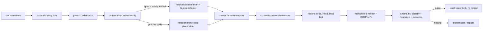

# Architecture: MDT-237 — Inline-code .md references as clickable links

## Overview

Extend the existing markdown linkification pipeline so that inline-code spans whose entire content is a `.md` document reference convert to the same resolved links plain-text references already produce, and give SmartLink a per-project document-existence signal so dead references render visibly broken. All navigation, URL building, scope validation, and rendering machinery stays as built by MDT-150/165.

**Pattern**: pipeline-stage classifier extension. The preprocessor's protection stage gains a classify branch; nothing downstream changes shape.

**Assess carry-forward**: Option 1 (Integrate As-Is) — both mismatch points (unconditional inline-code protection, existence flagging) get concrete structural responses below; no redesign needed.

## Decisions

| ID | Decision | Rationale |
|----|----------|-----------|
| D1 | Render-side detection only; no authoring convention introduced or enforced | Existing docs already use the convention; CR requires no reformatting (BR-1.1 context) |
| D2 | Conversion happens inside `protectInlineCode` (`frontend/src/utils/markdownPreprocessor.ts`) | Single seam; fenced blocks are already protected upstream (BR-3.1); the span regex is exact so no new tokenizer |
| D3 | Qualifying spans are re-emitted as `__LINK_PLACEHOLDER_n__` entries containing `[`ref.md`](resolvedUrl)` | Link placeholders restore **last**, after ticket-key conversion — prevents nested re-linkification corruption (the bug class MDT-150 Step 1.5 guards against) |
| D4 | Qualification = whole-span content matches `isRelativeMarkdownHref` (anchor allowed) AND `enableDocumentLinks` AND `sourcePath`+`projectCode` available | Reuses the accepted plain-text reference shape; no resolution context → verbatim (today's behavior) |
| D5 | Existence flagging via new `frontend/src/utils/documentExistenceCache.ts`; SmartLink renders DOCUMENT links with `data-link-type="broken"` when the cache knows the target is missing | Keeps MDT-150 C4 spirit (no per-link security/existence logic in URL building); one deduped `GET /api/documents` per project per session satisfies C5 |
| D6 | Traversal/out-of-scope blocking: no new code | Converted links are ordinary markdown links; `LinkNormalizer`/`classifyAndNormalizeLink` already block and flag (BR-2.2) |
| D7 | Existence flag applies to DOCUMENT-classified targets only; TICKET-classified refs keep current destination-level not-found handling | Ticket list state differs per view; scope stays bounded |
| D8 | Project-root fallback (UAT 2026-08-24): when the document index proves the ref names an existing project file (e.g. 'frontend/src/THEME.md'), resolve to the documents route; '..'-prefixed refs are never re-anchored | The docs tree excludes the tickets area by design, so ticket-relative existence is unverifiable — the knowable interpretation wins (BR-2.4) |
| D9 | Link config precedence (UAT 2026-08-24): localStorage override > CONFIG_DIR/config.toml [links] (via /api/config/global) > built-in defaults | Global config.toml was advertised but never consumed by rendering; now merged in getLinkConfig() (C6) |
| D12 | Plain-text ticket-key path tokens (UAT 2026-09-05): the Step 1.5 protection regex captures the WHOLE path token (`docs/uat/GPDE-003.md`, not just the basename); `restoreTicketFilenameRef` routes the whole token to the documents view whenever the index is loaded for a path outside the tickets area — existing targets navigate, known-missing targets render as one flagged-broken link (BR-2.1) | Basename-only capture split `docs/uat/GPDE-003.md` into a plain `docs/uat/` prefix plus a bare ticket link — wrong target, even with the index loaded. Positive index knowledge (exists OR known-missing) is the discriminator; tickets-area paths mean the ticket, and an unknown index (null) plus the guarded cases keep the legacy rendering byte-identically |
| D13 | Tickets-area targets mean the ticket, in every source mode (UAT 2026-09-12): `resolveDocumentRef` classifies a resolved path inside the tickets area — ticket view for `<ticketsPath>/<KEY>[-slug].md`, that ticket's subdoc view for `<ticketsPath>/<KEY>/<rest>.md\|.html` — in documents-view mode, and another ticket's subdoc directory resolved from a ticket body routes to that subdoc instead of escaping to a fabricated documents path; a bare ticket-key-shaped .md basename in documents-view mode routes to the ticket, mirroring ticket-context semantics and the target plain-text ticket keys already link to | Documents-view mode resolved `../.tickets/GPDE-012-….md` from a GPDE research brief to the documents route, where the index (which never covers the tickets area — GPDE even lists `.tickets` in excludeFolders) flagged the EXISTING ticket GPDE-012 as "Document not found". The document index cannot verify tickets-area targets, so the documents route was both a guaranteed false flag and the wrong view (BR-2.7) |
| D14 | Known-missing is coverage-bounded (UAT 2026-09-12): SmartLink flags a DOCUMENT target broken only when the index positively covers the target's directory (`coversPrefix`) and the file is absent; targets under prefixes the index never lists render as normal links | "Not in the index" conflates two states: covered-and-absent (provable) and never-listed (unknowable — tickets area, unconfigured dirs). The flag asserts positive knowledge; without coverage there is none (BR-2.8). The check rides the existing index — no new fetches (C5) |

## Canonical Runtime Flow



## Ownership

| Behavior | Owner module |
|----------|--------------|
| Span qualification + conversion | `frontend/src/utils/markdownPreprocessor.ts` |
| URL resolution | `resolveDocumentRef` (MDT-150; UAT 2026-09-12 gains tickets-area classification, D13) |
| Existence signal | `frontend/src/utils/documentExistenceCache.ts` (new) |
| Broken rendering + client-side nav | `frontend/src/components/SmartLink/index.tsx` (existence branch added) |

## Structure

```
frontend/src/utils/markdownPreprocessor.ts          # modified: classify branch in protectInlineCode
frontend/src/utils/documentExistenceCache.ts        # proposed: per-project deduped doc index + subscribe
frontend/src/utils/documentExistenceCache.test.ts   # proposed: unit tests
frontend/src/utils/markdownPreprocessor.mdt237.test.ts # proposed: conversion/preservation unit tests
frontend/src/components/SmartLink/index.tsx         # modified: DOCUMENT existence -> broken styling
tests/e2e/ticket/inline-code-doc-links.spec.ts # proposed: Playwright acceptance
```

## Program Design (consequential bits)

```ts
// documentExistenceCache.ts (signatures only)
export interface DocumentIndex { has(filePath: string): boolean; coversPrefix(dirPrefix: string): boolean; findByBasename(basename: string): string[] }
export function getCachedDocumentIndex(projectId: string): DocumentIndex | null // null while loading
export function subscribeDocumentIndex(projectId: string, cb: () => void): () => void
export function __testSeed(projectId: string, paths: string[]): void // test-only
```

- `protectInlineCode(markdown, state, ctx?)` gains an optional context param (`{ sourcePath, ticketKey, projectCode, ticketsPath, enableDocumentLinks }`); callers in `preprocessMarkdown` pass it through. Missing ctx ⇒ existing behavior, byte-identical.
- UAT 2026-09-05 (BR-2.6/D12): the Step 1.5 ticket-filename regex captures leading path segments (whole token), and `restoreTicketFilenameRef` resolves it — documents route whenever the index is loaded for a path outside the tickets area (existing navigates; known-missing renders flagged-broken via SmartLink; anchor split before the last-separator scan so anchors containing `/` never split the basename); unknown index or guarded cases reconstruct the legacy rendering (prefix plain + basename ticket link) byte-identically.
- UAT 2026-09-12 (BR-2.7/D13): `classifyTicketsAreaPath` classifies resolved tickets-area paths in `resolveDocumentRef` — documents-view mode applies it to the source-dir-resolved path and additionally routes bare ticket-key-shaped .md basenames to the ticket; ticket-context mode routes another ticket's subdoc directory to that subdoc instead of the escape branch. Non-ticket-shaped targets keep their prior routing.
- UAT 2026-09-12 (BR-2.8/D14): SmartLink's existence check requires `coversPrefix(targetDir)` before `has(target)` can flag; `DocumentIndex.coversPrefix` (previously defined, first consumer) answers whether the index lists anything under the prefix.
- UAT 2026-09-12 (BR-2.7 wiring): the documents-view MarkdownViewer fetches `/api/projects/:id/config` (once per project mount, PathSelector's established pattern) and forwards the configured `ticketsPath` to MarkdownContent — without it the preprocessor assumed docs/CRs and GPDE's `.tickets` targets never classified.
- SmartLink: for `LinkType.DOCUMENT`, read cached index; `null` (loading/unknown) renders the normal link; covered-and-missing renders the existing broken span (reuse L92-98 styling + `title="Document not found"`).
- Call order for a converted ref: `protectInlineCode` → `resolveDocumentRef` → link placeholder → restore → markdown-it → SmartLink `classifyAndNormalizeLink` → existence check → `<Link>`.
- Least-confident decision: D5 cache approach (evidence: DocumentsLayout L278 already consumes `GET /api/documents`; the endpoint returns the full tree). Invalidated if the endpoint proves rate-limited or the tree too large for a session cache — fallback is destination-level 404 flagging only.

## Architecture Invariants

1. Inline-code spans that are not solely a `.md` reference render byte-identically to today (BR-3.2, Edge-1).
2. Fenced code blocks are never touched (BR-3.1) — upstream protection unchanged.
3. Converted links are indistinguishable from plain-text-ref links after preprocessing (same URL builders, same SmartLink path) — one link pipeline, no fork (BR-4.1).
4. Existence checks never issue per-span network requests (C5).
5. No link URL is built outside `frontend/src/routes.ts` builders.

## Extension Rule

New convertible span shapes (e.g., other extensions) qualify only by extending `isRelativeMarkdownHref` / the qualification predicate — never by adding a second conversion pass.

## Rollback

Revert the classify branch in `protectInlineCode` (D2/D3) and the SmartLink existence branch (D5). The cache module is additive and inert without the SmartLink branch. No data migrations; no persisted state.

**Next**: UX gate, then `mdt:tests MDT-237`
