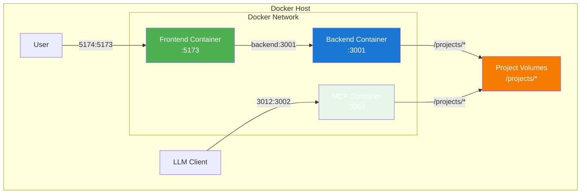

# Docker Guide for Markdown Ticket Board

This guide covers Docker containerization for the Markdown Ticket (MDT) application, including setup instructions, usage patterns, and best practices.

## Table of Contents

1. [Quick Start](#quick-start)
2. [Architecture Overview](#architecture-overview)
3. [Configuration](#configuration)
4. [Usage Patterns](#usage-patterns)
5. [Development Workflow](#development-workflow)
6. [Production Deployment](#production-deployment)
7. [Troubleshooting](#troubleshooting)
8. [Advanced Configuration](#advanced-configuration)

## Quick Start

### Prerequisites
- Docker Engine 20.10+
- Docker Compose 2.0+

### Basic Development Setup

```bash
# Clone the repository
git clone <repository-url>
cd markdown-ticket

# Start development environment
docker-compose --file docker-compose.yml --file docker-compose.dev.yml up -d

# Access the application
# Frontend: http://localhost:5174
# MCP HTTP: http://localhost:3012/mcp
```

### Stop Containers

```bash
# Stop and remove containers
docker-compose -f docker-compose.yml -f docker-compose.dev.yml down

# Stop with volume removal (clean start)
docker-compose -f docker-compose.yml -f docker-compose.dev.yml down -v
```

## Architecture Overview

### Container Architecture

The MDT application runs in three separate containers:



### Container Details

| Service | Port Mapping | Purpose | Access Pattern |
|---------|---------------|---------|----------------|
| **Frontend** | `5174:5173` | React + Vite dev server | `http://localhost:5174` |
| **Backend** | Network only | Express.js API + SSE | Via frontend proxy |
| **MCP** | `3012:3002` | HTTP transport for LLM | `http://localhost:3012/mcp` |

### Path Structure

```
Container Paths:
/app/                    # Application code (self-contained, excluded from discovery)
/projects/              # Generic mount point for all projects
/root/.config/          # Docker-only configuration

Host Mount Examples:
./:/projects/markdown-ticket           # Work on MDT app itself
~/work/project-a:/projects/project-a    # Other projects
```

## Configuration

### Docker-Only Configuration

The application uses container-only configuration in `./docker-config/`:

```toml
# docker-config/config.toml
[dashboard]
port = 3001
autoRefresh = true
refreshInterval = 5000

[discovery]
autoDiscover = true
searchPaths = "/projects"  # Only /projects, /app excluded

[links]
enableAutoLinking = false
enableTicketLinks = false
enableDocumentLinks = false
```

### Environment Variables

Key environment variables for configuration:

```yaml
environment:
  # Frontend
  - NODE_ENV=development
  - VITE_BACKEND_URL=              # Empty = use frontend proxy
  - DOCKER_BACKEND_URL=http://backend:3001

  # Backend
  - CHOKIDAR_USEPOLLING=true       # Required for file watching in containers
  - DOCKER=true                    # Enable Docker-specific features

  # MCP
  - MCP_HTTP_ENABLED=true
  - MCP_HTTP_PORT=3002
  - MCP_BIND_ADDRESS=0.0.0.0

  # Configuration Management (MDT-073)
  - CONFIG_DIR=/app/config          # Directory for configuration files
  - CONFIG_DISCOVER_PATH=/projects  # Default project discovery path
```

### Configuration Management Environment Variables (MDT-073)

The Docker containers support dynamic configuration through the configuration management CLI tool:

#### `CONFIG_DIR`
- **Purpose**: Directory where configuration files are stored and managed
- **Default**: `/app/config`
- **Usage**: All config files (`.toml`, `.json`) are read from and written to this directory
- **Volume Mount**: Automatically mounted as a Docker volume for persistence
- **Example**: `CONFIG_DIR=/custom/config/path`

#### `CONFIG_DISCOVER_PATH`
- **Purpose**: Default path used for automatic project discovery
- **Default**: `/projects`
- **Usage**: Sets the initial search path when `config.toml` doesn't specify discovery paths
- **Runtime**: Can be overridden per deployment without rebuilding containers
- **Example**: `CONFIG_DISCOVER_PATH=/workspace/projects`

#### Configuration Example

```yaml
# docker-compose.yml
services:
  backend:
    environment:
      - CONFIG_DIR=/app/config
      - CONFIG_DISCOVER_PATH=/projects
    volumes:
      - ./docker-config:/app/config  # Config persistence
      - ./my-projects:/projects      # Project files

  mcp:
    environment:
      - CONFIG_DIR=/app/config
      - CONFIG_DISCOVER_PATH=/projects
    volumes:
      - ./docker-config:/app/config  # Shared config
      - ./my-projects:/projects      # Shared projects
```

#### Dynamic Configuration Usage

The configuration is managed via the built-in config-cli tool:

```bash
# Inside containers, configuration is automatically applied
docker exec backend node /app/shared/dist/tools/config-cli.js show

# Set discovery paths dynamically
docker exec backend node /app/shared/dist/tools/config-cli.js set discovery.searchPaths "/projects,/workspace"

# The entrypoint script automatically applies CONFIG_DISCOVER_PATH
# when containers start, ensuring consistent configuration
```

#### Configuration Persistence

- Config files are persisted in the mounted volume (`./docker-config:/app/config`)
- Changes made via the application or config-cli are saved to the host
- Configuration survives container restarts and redeployments
- Each deployment can have different configurations by changing volume mounts

## Usage Patterns

### 1. Working on MDT Application Itself

Mount the entire MDT repository as a project to work on it:

```yaml
# docker-compose.override.yml
version: '3.8'
services:
  backend:
    volumes:
      - ./:/projects/markdown-ticket
  mcp:
    volumes:
      - ./:/projects/markdown-ticket
```

```bash
# Start with MDT mounted as project
docker-compose -f docker-compose.yml -f docker-compose.dev.yml -f docker-compose.override.yml up
```

### 2. Working on External Projects

Mount other projects alongside MDT:

```yaml
# docker-compose.override.yml
version: '3.8'
services:
  backend:
    volumes:
      - ~/work/project-alpha:/projects/project-alpha
      - ~/personal/project-beta:/projects/project-beta
  mcp:
    volumes:
      - ~/work/project-alpha:/projects/project-alpha
      - ~/personal/project-beta:/projects/project-beta
```

### 3. Demo Configuration

Use the provided demo configuration as a template:

```bash
# Use demo configuration (includes example project mounts)
docker-compose -f docker-compose.yml -f docker-compose.demo.yml up
```

### 4. Production Deployment

```bash
# Production build with no source mounts
docker-compose -f docker-compose.yml -f docker-compose.prod.yml up -d
```

## Development Workflow

### Hot Reload Configuration

All services support hot reload in development mode:

- **Frontend**: Vite Hot Module Replacement (HMR)
- **Backend**: tsx watch mode with automatic TypeScript compilation
- **MCP**: tsx watch mode for MCP server development

### Development Commands

```bash
# View logs for all services
docker-compose logs -f

# View logs for specific service
docker-compose logs -f frontend
docker-compose logs -f backend
docker-compose logs -f mcp

# Execute commands in containers
docker-compose exec backend bash
docker-compose exec mcp npm test

# Rebuild specific service
docker-compose build frontend
docker-compose build --no-cache  # Force rebuild
```

### Debugging

```bash
# Check container health
docker-compose ps

# Inspect container configuration
docker-compose config

# Access container shell for debugging
docker-compose exec backend /bin/bash
docker-compose exec mcp /bin/sh
```

## Production Deployment

### Production Features

- **Multi-stage builds**: Optimized container images (~100-200MB per service)
- **Non-root users**: Enhanced security
- **Health checks**: Automated monitoring
- **No source mounts**: Self-contained deployment

### Production Commands

```bash
# Deploy to production
docker-compose -f docker-compose.yml -f docker-compose.prod.yml up -d

# Scale services (if needed)
docker-compose -f docker-compose.yml -f docker-compose.prod.yml up -d --scale backend=2

# Update deployment
docker-compose -f docker-compose.yml -f docker-compose.prod.yml pull
docker-compose -f docker-compose.yml -f docker-compose.prod.yml up -d
```

### Production Environment Variables

```yaml
environment:
  # Security
  - NODE_ENV=production

  # MCP Security (optional)
  - MCP_SECURITY_ORIGIN_VALIDATION=true
  - MCP_SECURITY_RATE_LIMITING=true
  - MCP_SECURITY_AUTH=true
  - MCP_AUTH_TOKEN=your-secure-token

  # Rate Limiting
  - MCP_RATE_LIMIT_MAX=100
  - MCP_RATE_LIMIT_WINDOW_MS=60000
```

## Troubleshooting

### Common Issues

#### 1. Port Conflicts

**Problem**: `Port already in use` errors
```bash
# Check what's using the ports
lsof -i :5174
lsof -i :3012

# Solution: Stop conflicting services or change ports
```

#### 2. File Watching Not Working

**Problem**: Changes not detected in containers
```bash
# Ensure CHOKIDAR_USEPOLLING=true is set
docker-compose exec backend env | grep CHOKIDAR
```

#### 3. Volume Mount Issues

**Problem**: Projects not visible in application
```bash
# Check volume mounts
docker-compose exec backend ls -la /projects

# Verify configuration
docker-compose exec backend cat /app/config/config.toml
```

#### 4. Configuration Management Issues

**Problem**: Configuration changes not persisting
```bash
# Check config directory permissions
docker-compose exec backend ls -la /app/config

# Verify config-cli tool is working
docker-compose exec backend node /app/shared/dist/tools/config-cli.js show

# Check environment variables
docker-compose exec backend env | grep CONFIG_
```

**Problem**: CONFIG_DISCOVER_PATH not applied
```bash
# Check if entrypoint script ran correctly
docker-compose exec backend cat /app/config/config.toml | grep searchPaths

# Manually apply configuration
docker-compose exec backend node /app/shared/dist/tools/config-cli.js set discovery.searchPaths "$CONFIG_DISCOVER_PATH"
```

#### 5. MCP Connection Issues

**Problem**: Cannot connect to MCP server
```bash
# Check MCP health
curl http://localhost:3012/health

# Check MCP logs
docker-compose logs mcp
```

### Performance Optimization

#### Reduce Container Size
```bash
# Use multi-stage builds (already configured)
# Remove unnecessary dependencies
# Use Alpine Linux base images
```

#### Improve File Watching Performance
```yaml
environment:
  - CHOKIDAR_USEPOLLING=true
  - CHOKIDAR_INTERVAL=1000  # Adjust polling interval
```

### Health Checks

All services include health checks:

```bash
# Check service health
docker-compose ps
curl http://localhost:5174/        # Frontend health
curl http://localhost:3012/health  # MCP health
```

## Advanced Configuration

### Custom Networks

```yaml
networks:
  mdt-network:
    driver: bridge
    ipam:
      config:
        - subnet: 172.20.0.0/16
```

### Resource Limits

```yaml
services:
  frontend:
    deploy:
      resources:
        limits:
          cpus: '0.5'
          memory: 512M
        reservations:
          cpus: '0.25'
          memory: 256M
```

### Logging Configuration

```yaml
services:
  backend:
    logging:
      driver: "json-file"
      options:
        max-size: "10m"
        max-file: "3"
```

### Custom Entrypoints

```yaml
services:
  backend:
    entrypoint: ["/bin/sh", "-c", "node server/fix-paths.js && npm run dev"]
```

## Best Practices

### Development
1. **Use named volumes** for persistent data when needed
2. **Mount source code** for hot reload during development
3. **Use environment variables** for configuration
4. **Keep secrets** out of Docker Compose files (use .env files)

### Production
1. **Never mount source code** in production
2. **Use specific image tags** instead of `latest`
3. **Implement proper logging** and monitoring
4. **Use health checks** for all services
5. **Run containers as non-root users**

### Security
1. **Enable MCP security features** for production
2. **Use read-only mounts** for configuration
3. **Implement network segmentation** if needed
4. **Regular security updates** for base images

## Integration Examples

### VS Code Dev Containers

```json
// .devcontainer/devcontainer.json
{
  "name": "Markdown Ticket Development",
  "dockerComposeFiles": [
    "docker-compose.yml",
    "docker-compose.dev.yml"
  ],
  "service": "backend",
  "workspaceFolder": "/app"
}
```

### CI/CD Pipeline

```yaml
# .github/workflows/docker.yml
name: Docker CI/CD
on: [push, pull_request]

jobs:
  test:
    runs-on: ubuntu-latest
    steps:
      - uses: actions/checkout@v3
      - name: Start services
        run: docker-compose -f docker-compose.yml -f docker-compose.prod.yml up -d
      - name: Run tests
        run: docker-compose exec backend npm test
      - name: Stop services
        run: docker-compose down
```

## Migration from Native Development

### Step 1: Backup Configuration
```bash
cp -r ~/.config/markdown-ticket ~/config-backup/
```

### Step 2: Initialize Docker Config
```bash
# Docker uses its own configuration in ./docker-config/
# No migration needed for project files
```

### Step 3: Update Development Workflow
```bash
# Old way
npm run dev:full

# New way
docker-compose -f docker-compose.yml -f docker-compose.dev.yml up
```

### Step 4: Update MCP Client Configuration
```typescript
// Native development
const mcpClient = new MCPClient({ transport: 'stdio', command: 'npm', args: ['run', 'mcp'] });

// Docker development
const mcpClient = new MCPClient({ transport: 'http', url: 'http://localhost:3012/mcp' });
```

---

For more detailed technical information, see:
- [MDT-055: Docker Containerization Architecture](docs/CRs/MDT-055-docker-containerization-architecture-for-multi-ser.md)
- [MDT-073: Configuration Management CLI Tool for Project Discovery](docs/CRs/MDT-073-configuration-management-cli-tool-for-project-disc.md)
- [README.docker.md](README.docker.md)
- [Development Documentation](docs/development/)