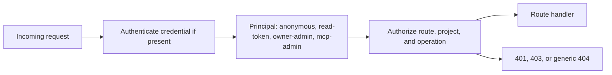
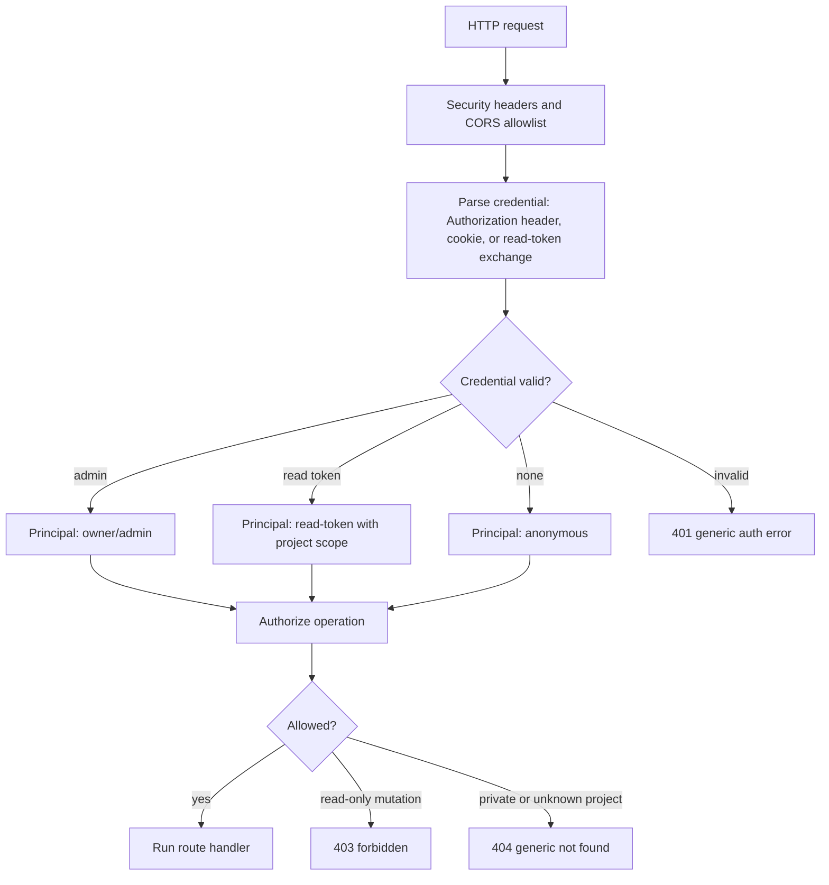
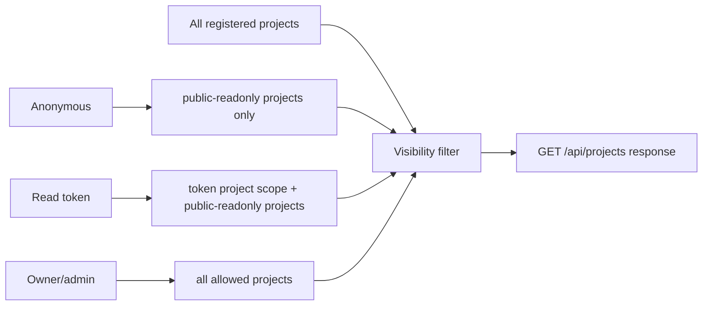
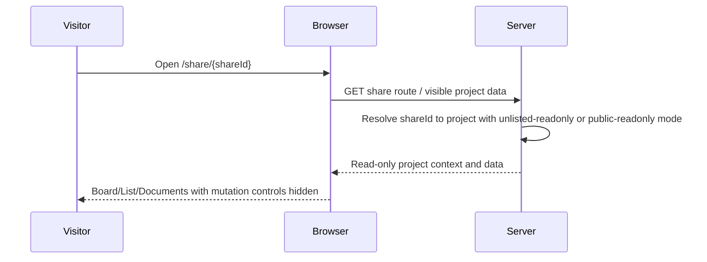
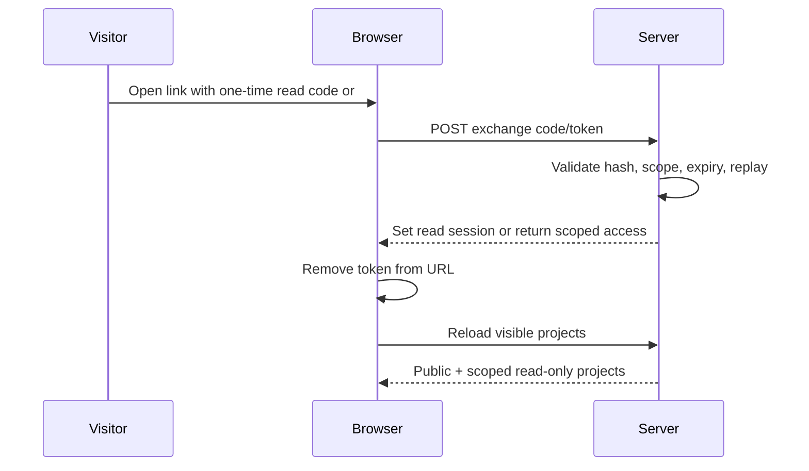

# Authentication and Sharing Architecture

End-state architecture for `MDT-157` and `MDT-172`.

## Scope

This document defines the combined access model for backend REST API, web UI, and MCP HTTP transport for a single-user, single-instance public-domain deployment.

It is not a multi-instance cloud security design. If the app is later deployed behind a CDN, across multiple app instances, or with managed user accounts, this document must be extended for shared durable storage, centralized session revocation, cache/proxy behavior, and audit requirements.

- `MDT-157` owns authentication: validating credentials and establishing a principal.
- `MDT-172` owns authorization and sharing: deciding which projects a principal can see and which actions are allowed.
- `MDT-156` remains the baseline hardening layer for CORS, filesystem restrictions, security headers, and dependency patches.

## Core Decision

Authentication and sharing must stay separate.



Authentication answers: who is calling?  
Authorization answers: what can this caller see or change?

## Access Levels

| Access | Credential | Project visibility | Mutations | Purpose |
|--------|------------|--------------------|-----------|---------|
| Anonymous | none | directory-public projects, plus unlisted projects when reached by share ID | no | public board sharing |
| Read token | scoped opaque token | projects allowed by token, plus public/unlisted access already granted | no | private read-only sharing |
| Owner/admin | admin credential | all configured projects | yes | normal owner workflow |
| MCP stdio | local process | existing local behavior | yes | local LLM/client integration |
| MCP HTTP | MCP auth token | admin-level unless future scoped MCP is designed | yes | protected remote MCP |

Public read-only access is not authentication. It is an authorization result for anonymous users.

## Sharing Modes

Use three explicit modes. Do not overload "public" to mean both link-only and globally listable.

| Mode | Listed by anonymous `GET /api/projects` | Accessible by `/share/{shareId}` | Mutations | Use case |
|------|------------------------------------------|----------------------------------|-----------|----------|
| `private` | no | no | owner/admin only | default |
| `unlisted-readonly` | no | yes | no | normal "share this board with a link" |
| `public-readonly` | yes | yes | no | intentional public directory listing |

Default sharing mode is `private`. The recommended public-domain sharing mode is `unlisted-readonly`.

## Token Model

Use opaque random tokens first. Do not require JWT for this system.

| Token type | Storage | Sensitivity | URL allowed | Notes |
|------------|---------|-------------|-------------|-------|
| Admin web/API token | env/config secret, or server-set HttpOnly cookie after exchange | high | never | Grants writes; do not store in localStorage/sessionStorage. |
| MCP HTTP token | `MCP_AUTH_TOKEN` pattern | high | never | Compare with `crypto.timingSafeEqual`. |
| Scoped read token | hashed server-side token record | medium | only as one-time exchange code or URL fragment handled by browser | Reveals extra projects, still read-only. |
| Public share ID | server sharing config | low | yes, preferably path segment | Random non-enumerable ID; not a write credential. |

JWT is only justified later if the project needs stateless, signed, expiring claims across independent servers. Until then, opaque tokens are easier to revoke, rotate, hash at rest, and keep claim details off the browser.

## Storage

Sharing is deployment behavior, not repository behavior. Do not store it in `.mdt-config.toml`.

Recommended storage:

```text
CONFIG_DIR/auth/project-sharing.json
CONFIG_DIR/auth/read-tokens.json
```

`project-sharing.json` stores project sharing mode and public share IDs by canonical `project.id`.

```json
{
  "projects": {
    "markdown-ticket": {
      "mode": "unlisted-readonly",
      "shareId": "random-non-enumerable-id"
    }
  }
}
```

`read-tokens.json` stores token hashes and scopes, never raw tokens.

```json
{
  "tokens": [
    {
      "id": "token-record-id",
      "hash": "server-side-token-hash",
      "scope": "read",
      "projectIds": ["markdown-ticket"],
      "expiresAt": null,
      "revokedAt": null
    }
  ]
}
```

Admin secrets should stay in environment/config secret channels. If browser owner/admin auth uses cookies, the server sets `HttpOnly`, `SameSite=Lax` or stricter. Set `Secure` only for HTTPS-capable deployments.

For this single-instance target, JSON storage is acceptable only with a persistent disk, single writer, `0600` permissions, atomic write-and-rename, and no raw token persistence. Multi-instance deployments need SQLite/Postgres or another shared durable store.

## Request Pipeline



Route handlers should receive an already-resolved access context. They should not parse tokens themselves.

## Project Visibility

Project list responses are filtered by the access context.



Unshared project names, counts, paths, and metadata must not appear in anonymous or unauthorized responses.

End-state nuance:
- Before MDT-172, MDT-157 may return `401` for unauthenticated `GET /api/projects`.
- After MDT-172, unauthenticated `GET /api/projects` returns only `public-readonly` directory-listed projects. `unlisted-readonly` projects are not listed and require `/share/{shareId}`.

## Operation Policy

Classify requests by operation, not just HTTP method.

| Operation | Anonymous unlisted/public project | Read token project | Owner/admin |
|-----------|-----------------------------------|--------------------|-------------|
| Health/status | allowed | allowed | allowed |
| List visible projects | public-readonly only | public-readonly + token scope | all allowed |
| Read tickets/board/list | allowed for visible projects | allowed for scoped projects | allowed |
| Read documents | allowed for visible projects | allowed for scoped projects | allowed |
| SSE project events | only visible project events | only scoped project events | all allowed |
| Create/update/delete tickets | `403` | `403` | allowed |
| Drag/drop status update | `403` | `403` | allowed |
| Project config/edit/add/delete | `403` or hidden | `403` or hidden | allowed |
| Filesystem browsing/configuration | denied unless owner/admin | denied unless owner/admin | allowed within MDT-156 path restrictions |
| Document fav writes | `403` | `403` | allowed if feature remains owner/user state |
| MCP HTTP tools | denied by default | denied by default | allowed with MCP auth |

Use a generic `404` when a project is private or outside the principal's visibility. Use `403` when the project is visible but the operation is not allowed.

## Browser Flows

### Public Share Link



The share ID is bookmarkable. It never grants write access and does not make the project appear in anonymous project lists unless mode is explicitly `public-readonly`.

### Read Token Link Exchange



Long-lived admin/write tokens must never use this flow.

Read-token link exchange rules:
- exchange token/code with `POST`, not `GET`;
- expire in minutes;
- single use with atomic replay protection;
- rate-limit exchange attempts;
- never log raw token, code, or full query string;
- redirect or replace browser history to a clean URL immediately after exchange.

## UI Contract

The frontend uses backend-provided access context/capabilities to shape the UI:

- show a compact `Read-only` badge when the current project cannot be mutated;
- hide owner/admin-only menu items such as Add Project, Edit Project, Event History, and Sharing settings;
- keep non-mutating sort, filter, navigation, and document read flows available;
- disable or remove create, drag/drop, status update, delete, config, document fav write, and filesystem controls;
- show an Authorize action for users who have a scoped read token.

The UI is advisory. Backend authorization is the enforcement layer.

## MCP Boundary

MCP stdio remains local and unchanged by public sharing.

MCP HTTP is not a public read API in this architecture. It should be disabled for public-domain sharing unless explicitly enabled for an admin-only deployment. When enabled, it requires a separate MCP token, no browser cookie auth, no public CORS, and admin-level semantics unless a future ticket designs scoped MCP read tools.

## Error Semantics

| Case | Response |
|------|----------|
| Missing admin credential on admin-only route | `401` |
| Invalid token exchange | `401` with generic message |
| Visible read-only project, mutation attempted | `403` |
| Private/unshared project requested by anonymous or wrong token | generic `404` |
| Health/status | `200` without auth |

Never disclose whether a private project exists through error wording, timings that are easy to distinguish, or project metadata in filtered lists.

## Security Invariants

- No raw token is logged, committed, or persisted.
- Token comparisons use timing-safe comparison.
- Public IDs are random and non-enumerable.
- CORS is not widened for sharing.
- Cookie-based write/admin auth has CSRF protection: non-GET mutations only, `SameSite=Lax` or stricter, Origin/Host validation, and either a signed double-submit CSRF token or equivalent same-origin custom-header control.
- Filesystem APIs remain bounded by MDT-156 restrictions and require owner/admin for public deployments.
- SSE only emits events for projects visible to the principal.
- SSE must not carry tokens in query strings. Use same-site cookies or a fetch-based stream with headers.
- Frontend hidden controls are not considered security controls.
- Markdown/document rendering must remain sanitized because read-only content can still execute attacks against an owner viewing the same project.

## Implementation Shape

Expected server modules:

```text
server/security/AuthContextMiddleware.ts
server/security/AccessPolicy.ts
server/security/TokenStore.ts
server/security/ProjectSharingStore.ts
server/security/routeClassification.ts
```

Expected shared/domain contracts:

```text
domain-contracts/src/auth/access.ts
domain-contracts/src/auth/sharing.ts
shared/services/auth/AccessPolicyService.ts
```

Expected frontend modules:

```text
src/config/accessContext.ts
src/components/AccessBadge.tsx
src/components/AuthorizeModal.tsx
src/config/projectSharing.ts
```

Keep route policy centralized. Do not scatter one-off checks inside each controller except where the controller maps access errors to HTTP status.

## Ticket Review Notes

MDT-157 should be read as the authentication foundation. It should not grow public sharing rules.

MDT-172 should depend on MDT-157 and provide the access policy, project filtering, read-only UI, and read-token flows.

The only apparent conflict is `GET /api/projects`: MDT-157's standalone acceptance can require `401` before sharing exists, but the end state after MDT-172 is a filtered anonymous project list containing only explicit `public-readonly` projects.
