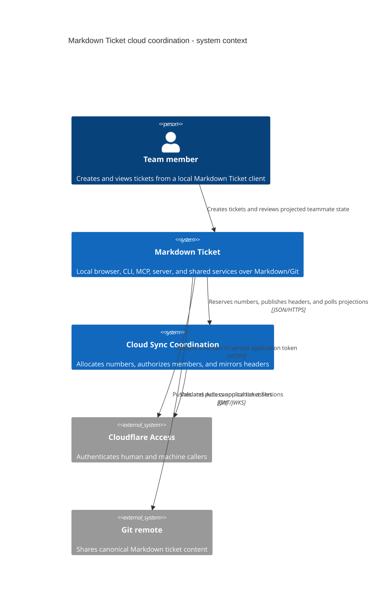
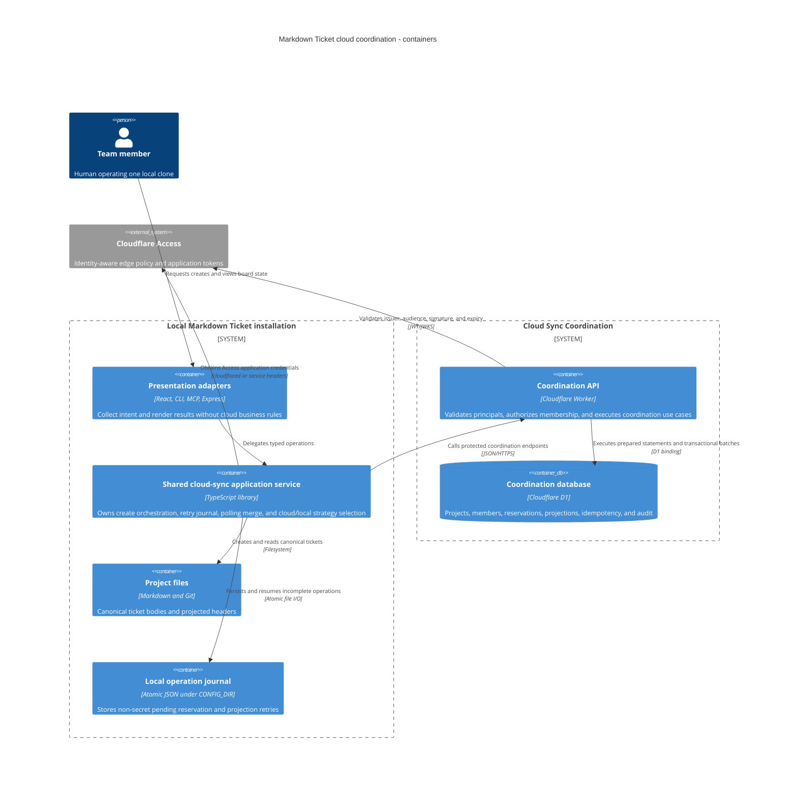
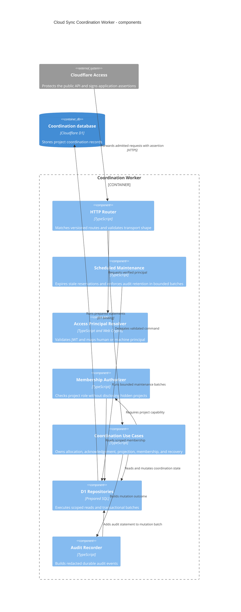

# Cloud Sync Architecture

## Status and Scope

This namespace owns Markdown Ticket's opt-in cloud coordination architecture.
It is the implementation contract for `MDT-200`, based on the approved
`MDT-198` research and D1-binding proof of concept.

Cloud sync solves two problems only:

1. allocate collision-free ticket numbers across separate clones and processes;
2. expose a versioned, read-only projection of ticket headers between Git
   synchronizations.

It does not make the cloud a ticket-content authority.

## Non-Negotiable Invariants

1. Cloud coordination is opt-in per local installation and binds explicitly to
   one cloud project.
2. The cloud owns project membership and the per-project number counter.
3. Markdown/Git owns ticket bodies and projected header fields.
4. Header data flows one way, from Markdown into a versioned cloud mirror.
5. A cloud-bound create requires the coordination service. It never falls back
   to local numbering and never renames a ticket after creation.
6. The first slice excludes presence, offline allocation, body sync,
   WebSockets, and Durable Objects.
7. Clients discover changes by polling.
8. Audit records distinguish human principals from machine principals.
9. Ticket numbers are never reused. Abandoned reservations create acceptable
   gaps.

## V1 Product Decisions

### Online-Only Creation

Creating a ticket in a cloud-bound project requires a live coordinator.
Offline clients may read and edit existing Markdown tickets, but they cannot
allocate a fallback number, temporary key, range, or lease. This is the same
behavior defined by the outage contract, made explicit as a product decision.

Deferring offline creation does not remove the counter, reservation,
idempotency, acknowledgement, membership, or audit model. Those records protect
concurrent online creation, retries, and the boundary between cloud allocation
and local Markdown persistence.

### Projection Is Part of V1

Versioned header projection remains in the first slice because teammate
visibility before Git synchronization is one of the two approved cloud-sync
outcomes. Projection versions, operation and content hashes, project revision
cursors, tombstones, and polling protect stale online clients; they do not
exist to support offline ticket creation.

## Ownership Map

| Concern | Authority | Owner document |
| --- | --- | --- |
| Ticket body and projected headers | Local Markdown/Git | This document |
| Cloud project UUID and connection | Cloud project plus CONFIG_DIR connection state | [Data and consistency](data-and-consistency.md) |
| Membership and roles | Cloud coordination service | [Identity and access](identity-and-access.md) |
| Ticket-number allocation | D1 transaction | [Data and consistency](data-and-consistency.md) |
| Projection version and polling cursor | D1 coordination records | [Data and consistency](data-and-consistency.md) |
| Credentials and principal attribution | Cloudflare Access and client credential providers | [Identity and access](identity-and-access.md) |
| Deployment, migrations, recovery, and telemetry | Cloud sync operator | [Operations](operations.md) |
| Local checkout, worktree, and routing identity | Existing local project services | [Project identity](../project-identity-and-worktrees.md) |

## System Context



## Container Architecture



## Production Package Boundary

`MDT-200` adds one Cloudflare Worker package and extends existing shared
contracts:

```text
cloud/                                    new private @mdt/cloud workspace
  package.json
  wrangler.jsonc                          Worker environments and bindings
  migrations/                             ordered D1 migrations
  src/
    cloudflare/
      worker.ts                            HTTP and scheduled Worker entry points
      http/                                versioned route mapping
      access/                              Access JWT validation and principal mapping
      application/                         allocation, membership, projection use cases
      d1/                                  prepared statements and transactional batches
      rate-limit/                          Workers rate-limit adapter
      scheduled/                           reservation and audit maintenance dispatch
  test/                                    unit, Workers-runtime, and D1 integration tests

domain-contracts/src/cloud-sync/           pure request, response, and error types
shared/services/cloud-sync/                application orchestration and strategies
server/                                    thin browser-facing adapter and token provider
cli/                                       thin interactive adapter
mcp-server/                                thin interactive or machine adapter
src/                                       board state and sync-status presentation only
```

Dependency direction remains:

```text
domain-contracts <- shared <- server | cli | mcp-server | src
domain-contracts <- cloud/cloudflare

shared --JSON/HTTPS--> cloud/cloudflare
```

The main application never imports `@mdt/cloud`; `shared` reaches it only
through the protected HTTP contract. The cloud package does not import
filesystem-aware `shared` services. Presentation adapters do not implement
allocation, retry, polling merge, or projection conflict rules. Those local
rules belong to `shared/services/cloud-sync/`; cloud-side coordination use
cases belong to `cloud/src/cloudflare/application/`.

This document owns the concrete package boundary. The
[MDT-200 package note](../../CRs/MDT-200/cloud-package-boundary.md) records the
rationale and implementation handoff without defining a second structure.

## Worker Components



## Local Integration Contract

`TicketService.createCR()` reads device-local cloud connection state. Complete
absence preserves the existing local scan. An enabled connection calls
`CloudCreateOrchestrator`, which persists the intent, reserves a number, writes
the Markdown file exclusively, and acknowledges the header projection. A
disabled, malformed, or untrusted connection fails closed.

`CloudProjectionSync` journals and safely publishes later header changes.
`CloudProjectionClient` polls derived headers through the owner-only local
server adapter; the browser never receives Cloudflare credentials.
`RuntimeCloudCredentialProvider` resolves either an interactive `cloudflared`
token or a machine service-token pair from the owner-only CONFIG_DIR credential
store. Credentials are never stored in the project file, registry, or operation
journal.

The journal key combines a device-local hash of the physical Git common
directory (or canonical project root outside Git) with the cloud project UUID.
That device-local routing key is never sent as cloud identity. Linked worktrees
for one physical repository therefore resume the same pending operation while
independent clones remain independent clients.

Journal files live at
`CONFIG_DIR/cloud-sync/journals/{routingHash}/{cloudProjectId}.json`; the lock
and temporary file stay in the same directory. Implementations use user-only
directory/file permissions (`0700`/`0600` on POSIX and the closest supported
user-only protection elsewhere).

## Local Cloud Connection

The cloud project is project-scoped, but every installation keeps its own
non-secret connection outside the repository:

```toml
# CONFIG_DIR/projects/{localProjectId}/cloud-sync.toml
version = 1
state = "enabled"
cloudProjectId = "018f5e6c-6f32-7c5b-9e76-97c7c769c123"
serviceOrigin = "https://mdt-sync.example.com"
pollIntervalSeconds = 15
```

| Field | Rule |
| --- | --- |
| `version` | Connection schema version; currently `1` |
| `state` | `enabled` or `disabled`; disabled remains fail-closed |
| `cloudProjectId` | UUID issued by the cloud |
| `serviceOrigin` | Coordination HTTPS origin; exact trusted-origin match |
| `pollIntervalSeconds` | Integer from 5 through 300; default 15 |

Repository `.mdt-config.toml` and the global registry entry
`CONFIG_DIR/projects/{localProjectId}.toml` contain no cloud enablement, project
UUID, service origin, credential, team domain, or audience.
Legacy `[project.cloudSync]` is read only by the explicit MDT-201 migration
flow; normal lifecycle operations never write it.

Machine credentials live separately at
`CONFIG_DIR/cloud-sync/credentials/{credentialRef}.toml`. The directory and file
use user-only permissions (`0700`/`0600` on POSIX and the closest supported
equivalent elsewhere), atomic writes, and redacted diagnostics. Human Access
tokens remain managed by `cloudflared` and in process memory.

The local runtime has an effective cloud-sync trusted-origin set composed of:

1. product-controlled HTTPS origins shipped with the distribution; and
2. operator-controlled HTTPS origins added in global
   `CONFIG_DIR/config.toml`.

The connection `serviceOrigin` is accepted only on an exact trusted-profile
match. Official hosted sync needs no per-project allowlist edit. Self-hosted and
custom services still require an operator to trust their exact origin globally:

```toml
[cloudSync]
allowedOrigins = ["https://mdt-sync.example.com"]
```

`cloudSync.allowedOrigins` is a global `fileOnly` selector containing
operator-added absolute HTTPS origins only. Its default is empty, so no custom
origin is trusted until an operator configures it; this does not remove the
distribution-provided trusted origins.
Headless adapters refuse to attach service-token headers to any other origin.
Repository contents cannot redirect credentials because they contain no active
cloud origin.

Initial activation is one explicit operator operation. The client journals a
provisioning idempotency key before the request; identical retries return the
same UUID and conflicting key reuse fails. A second installation receives the
non-secret cloud project UUID through the onboarding channel and runs explicit
`connect`. Connect verifies membership and writes CONFIG_DIR state; it never
provisions.

Privileged project provisioning uses the operator Access audience. Its endpoint
is resolved from a distribution- or operator-controlled trusted service
profile, not from repository configuration. A normal project owner is not
automatically a cloud-service operator. After provisioning, teammate login and
all normal project operations use the coordination origin stored in the local
connection.

## Delivery Slices for MDT-200

| Slice | Outcome | Exit gate |
| --- | --- | --- |
| 1. Protected skeleton | Worker package, D1 binding, migrations, Access validation, typed errors | Real human and service-token assertions validated in the protected limited-production Worker |
| 2. Membership and allocation | Project provisioning, roles, reservation, idempotency, acknowledgement | Deployed concurrency, replay, isolation, denial, and recovery tests pass |
| 3. Shared local orchestration | Strategy seam, durable operation journal, browser/CLI/MCP credential providers | Local-only regressions stay green; cloud create has no fallback path |
| 4. Projection and polling | Versioned push, tombstone/restore, cursor polling, board projection stubs | Two independent clients observe updates inside the configured interval |
| 5. Operational release | Alerts, migration checks, backup/restore/export drill, disable path | [Operations](operations.md) release gate is recorded against the limited-production deployment and an isolated drill database |

## Evidence Boundary

`MDT-198` proved the lifecycle model and a production-shaped static D1 batch
locally: 50 concurrent unique allocations and 10 concurrent idempotent replays
passed. It did not prove production capacity, multi-isolate latency, or real
Cloudflare Access behavior. Those remain deployment gates for `MDT-200`, not
claims of this architecture.

Current official Cloudflare behavior used by this design was checked on
2026-07-24. Source URLs and operational consequences are listed in
[Operations](operations.md).
