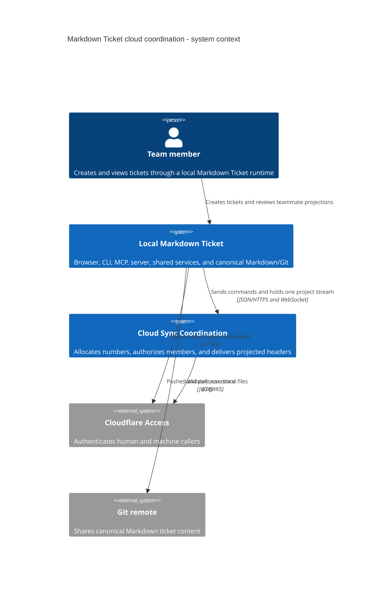
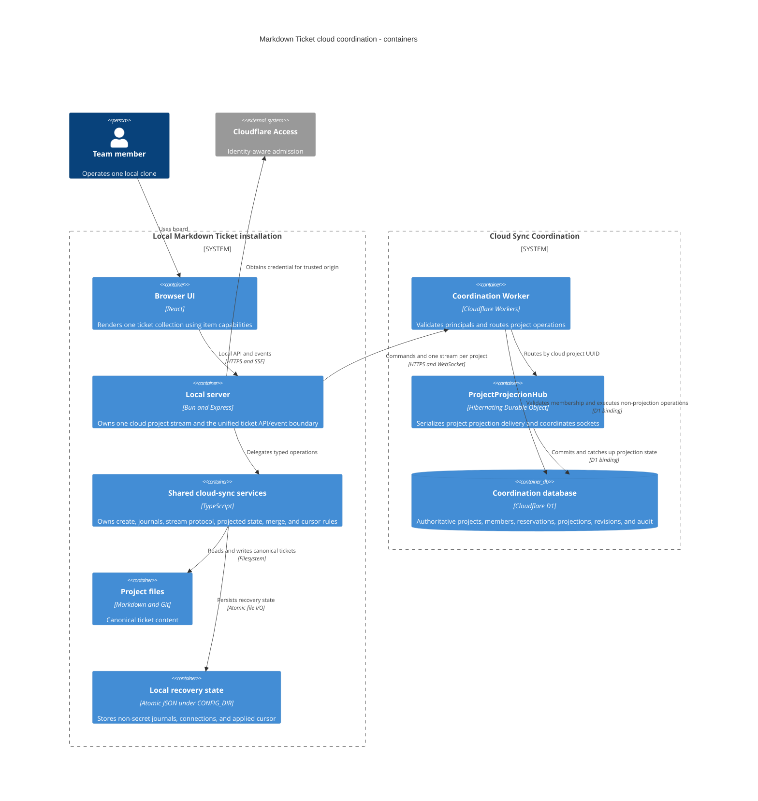

# Cloud Sync Architecture

## Status and Scope

This namespace is the permanent implementation contract for Markdown Ticket's
opt-in cloud coordination. It incorporates `MDT-200` and the projection-delivery
decision in `MDT-226`.

Cloud sync provides:

1. collision-free ticket-number allocation across clones and processes;
2. versioned, near-real-time delivery of read-only ticket-header projections
   between Git synchronizations.

It does not make the cloud a ticket-content authority.

## Non-Negotiable Invariants

1. Cloud coordination is opt-in per local installation and explicitly bound to
   one cloud project.
2. D1 owns project membership, number counters, projection versions, and
   project revisions.
3. Markdown/Git owns ticket bodies and canonical projected header fields.
4. Header data flows one way from Markdown into the cloud projection read model.
5. Cloud-bound create requires the coordinator; it never falls back to local
   numbering and never renames a ticket after creation.
6. Ticket numbers are never reused; abandoned reservations may leave gaps.
7. Projection delivery is event-driven. Healthy idle clients do not poll D1.
8. One hibernating `ProjectProjectionHub` Durable Object coordinates each cloud
   project but is not a second projection authority.
9. One local server opens at most one cloud projection stream per project,
   materializes a unified ticket read model, and emits ordinary local ticket
   events; browser tabs never receive cloud credentials or projection protocol.
10. The design excludes presence, ticket-body sync, collaborative editing, and
    offline cloud-bound allocation.

## Product Decisions

### Online-only creation

Creating a ticket in a cloud-bound project requires a live coordinator. Offline
clients may read and edit existing Markdown tickets but cannot allocate a
fallback number, temporary key, range, or lease. Counter, reservation,
idempotency, acknowledgement, membership, and audit records remain necessary
for concurrent online creation and crash recovery.

### Projection is part of V1

Versioned header projection remains a first-slice outcome because teammate
visibility before Git synchronization is an approved product behavior.
Projection versions, operation/content hashes, project revisions, and
tombstones protect stale clients and conflict handling.

### Delivery follows changes, not time

Periodic projection polling is superseded by `MDT-226`. A project-scoped,
hibernating Durable Object serializes subscription catch-up with projection
mutations through an explicit operation queue. After D1 commits, it broadcasts a
complete header delta and waits for per-active-socket acknowledgement after
local persistence. Reconnects and live revision gaps use bounded cursor
catch-up; sparse revisions are valid within catch-up. The old cursor endpoint
remains a recovery and rollout-compatibility surface, not a timer-driven client
loop.

## Ownership Map

| Concern | Authority | Owner document |
| --- | --- | --- |
| Ticket body and canonical projected headers | Local Markdown/Git | This document |
| Cloud project connection and delivery cursor | CONFIG_DIR local state | [Data and consistency](data-and-consistency.md) |
| Membership, roles, and stream authorization | Cloudflare Access plus D1 | [Identity and access](identity-and-access.md) |
| Ticket-number allocation | D1 transaction | [Data and consistency](data-and-consistency.md) |
| Projection version and project revision | D1 transaction | [Data and consistency](data-and-consistency.md) |
| Projection ordering and live delivery | `ProjectProjectionHub` | [Data and consistency](data-and-consistency.md) |
| Credentials and principal attribution | Access and local credential providers | [Identity and access](identity-and-access.md) |
| Bindings, migrations, recovery, and telemetry | Cloud-sync operator | [Operations](operations.md) |
| Local checkout/worktree routing identity | Existing local project services | [Project identity](../project-identity-and-worktrees.md) |

## System Context



## Container Architecture



## Production Package Boundary

```text
cloud/
  wrangler.jsonc
  migrations/                             ordered D1 migrations
  src/cloudflare/
    worker.ts                              HTTP/WebSocket Worker entry point
    durable/ProjectProjectionHub.ts        project delivery sequencer
    access/                                Access JWT validation
    application/                           allocation, membership, projection use cases
    d1/                                    prepared statements and batches
    scheduled/                             reservation and audit maintenance

domain-contracts/src/cloud-sync/           request, response, error, and cloud stream envelopes
domain-contracts/src/ticket/view.ts        unified browser-facing ticket item
shared/services/cloud-sync/                create orchestration, journals, stream client, projection read model
server/services/cloud-sync/                project stream lifecycle
server/services/TicketService.ts           unified canonical/projected ticket reads
cli/ and mcp-server/                       thin adapters over shared operations
src/                                       board and live/stale projection presentation
```

Dependency direction remains:

```text
domain-contracts <- shared <- server | cli | mcp-server | src
domain-contracts <- cloud/cloudflare

server/shared --JSON/HTTPS + WebSocket--> cloud/cloudflare
```

The application never imports `@mdt/cloud`. Cloud code does not import
filesystem-aware shared services. Presentation adapters do not implement
allocation, journal, authorization, cursor, or projection-conflict rules.

## Cloud Component Responsibilities

| Component | Owns | Must not own |
| --- | --- | --- |
| Worker router | HTTP/upgrade validation, principal resolution, deterministic project routing | Long-lived socket state |
| Membership authorizer | Project-scoped role decisions and non-disclosure | Cached authorization beyond its documented boundary |
| `ProjectProjectionHub` | Hibernating sockets, ordering, catch-up, broadcast, alarm recovery, revocation disconnect | Ticket bodies or authoritative projection data |
| Projection use case | Version checks, operation idempotency, D1 transaction result | Pre-commit broadcast |
| D1 repositories | Prepared project-scoped reads and atomic mutation batches | Transport/session ownership |
| Local stream manager | One upstream stream/project and cloud reconnect/catch-up | Ticket-list presentation or browser state |
| Local projection read model | Projected header cache, applied cursor, local-wins merge | Cloud transport or React state |
| Server ticket service | Unified browser ticket list and ordinary local ticket changes | Cloud cursor or projection protocol exposure |

## Local Integration Contract

`TicketService.createCR()` reads device-local connection state. Absence preserves
local allocation. An enabled connection uses `CloudCreateOrchestrator`, which
journals intent, reserves a number, writes Markdown exclusively, and
acknowledges the header projection. Disabled, malformed, or untrusted state
fails closed.

`CloudProjectionSync` continues to journal failed local-to-cloud header
mutations. Its write retry lifecycle is independent of reads and browser
activity. `CloudProjectionStreamClient` receives cloud-to-local projection
state; `ProjectionStreamManager` passes it to `CloudProjectionReadModel`, which
persists the cursor/state and merges against canonical tickets. The existing
project-ticket endpoint and local SSE expose ordinary ticket views/events. The
browser never receives Cloudflare credentials, project revisions, or a separate
projection feed.

The stream manager never launches an interactive login merely because the
server started. A machine credential can connect headlessly; a human connection
remains `authentication_required` until an owner action makes a valid
`cloudflared` application token available. Once a credential is available, the
manager owns the stream independently of browser-tab mounts.

Journal and connection files use a device-local routing hash derived from the
physical Git common directory or canonical non-Git root plus cloud project UUID.
The routing key is not cloud identity. Files use atomic replacement and
user-only permissions (`0700` directories and `0600` files on POSIX, closest
supported equivalent elsewhere).

## Local Cloud Connection

Version 2 removes polling cadence from active configuration:

```toml
# CONFIG_DIR/projects/{localProjectId}/cloud-sync.toml
version = 2
state = "enabled"
cloudProjectId = "018f5e6c-6f32-7c5b-9e76-97c7c769c123"
serviceOrigin = "https://mdt-sync.example.com"
```

| Field | Rule |
| --- | --- |
| `version` | Connection schema version; active version is `2` |
| `state` | `enabled` or `disabled`; disabled remains fail-closed |
| `cloudProjectId` | UUID issued by the cloud |
| `serviceOrigin` | Exact trusted HTTPS origin; WebSocket derives `wss` from it |

Version 1 `pollIntervalSeconds` is accepted only by the explicit atomic
migration and is discarded when version 2 is written. Cloud project identity,
trusted origin, and credential reference do not change.

Repository `.mdt-config.toml` and the global registry contain no cloud
enablement, origin, project UUID, credentials, team domain, or audience.
Credentials remain in the owner-only CONFIG_DIR credential store or
`cloudflared` session flow. Redirects to other origins are rejected.

## Delivery Sequence

1. Protected Worker/D1 coordination and Access validation.
2. Membership, online allocation, idempotency, acknowledgement, and projection
   writes.
3. Shared local orchestration and durable write journals.
4. Project hub, stream contract, cursor catch-up, alarm recovery, and schema-v2
   local stream manager (`MDT-226`).
5. Browser projection-hook removal, unified ticket API/events, live/stale UX,
   multi-tab fan-out, and bounded legacy compatibility retirement.
6. Limited-production idle-traffic, latency, revocation, backup, restore, and
   rollback gates in [Operations](operations.md).

## Evidence Boundary

`MDT-198` proved the allocation lifecycle and a production-shaped static D1
batch locally. It did not prove production capacity or Access behavior.
`MDT-226` defines the projection delivery architecture; it does not claim the
current polling implementation already satisfies it. Production acceptance
requires the deployed evidence in [Operations](operations.md).
