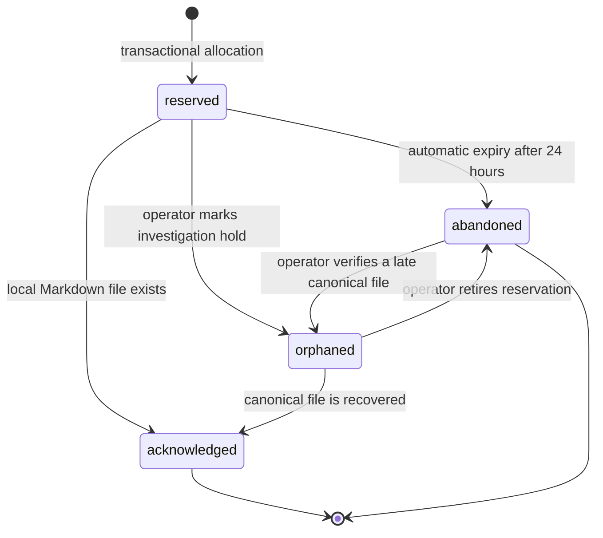
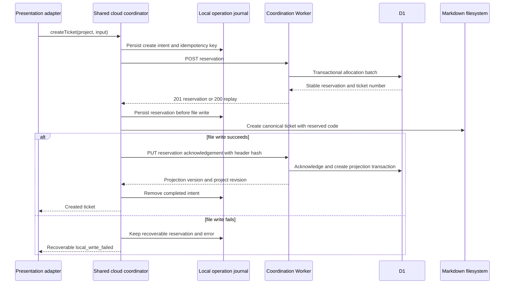

# Cloud Sync Data and Consistency

## Authority Model

The coordination database is authoritative for:

- cloud project UUID, coordination state, and membership;
- the next ticket number and every reservation;
- idempotency outcomes;
- projection versions and polling order;
- cloud audit records.

Markdown/Git is authoritative for:

- ticket filename and frontmatter `code` after reservation;
- title, status, type, priority, assignee, dates, and body;
- deletion or restoration of the canonical ticket file;
- all workflow subdocuments.

D1 stores a derived subset of header fields. It never stores a ticket body and
never writes a projected value back into Markdown.

## Data Model

The first slice uses one D1 database per deployment environment and scopes every
tenant query by `cloud_project_id`.

```sql
CREATE TABLE cloud_projects (
  id TEXT PRIMARY KEY,
  project_code TEXT NOT NULL,
  coordination_state TEXT NOT NULL
    CHECK (coordination_state IN ('active', 'suspended')),
  next_ticket_number INTEGER NOT NULL CHECK (next_ticket_number > 0),
  projection_revision INTEGER NOT NULL DEFAULT 0,
  created_at TEXT NOT NULL,
  updated_at TEXT NOT NULL
);

CREATE TABLE project_provisioning_requests (
  idempotency_key_hash TEXT PRIMARY KEY,
  request_hash TEXT NOT NULL,
  cloud_project_id TEXT NOT NULL UNIQUE,
  created_at TEXT NOT NULL,
  FOREIGN KEY (cloud_project_id) REFERENCES cloud_projects(id)
);

CREATE TABLE memberships (
  cloud_project_id TEXT NOT NULL,
  principal_kind TEXT NOT NULL
    CHECK (principal_kind IN ('human', 'machine')),
  principal_id TEXT NOT NULL,
  display_label TEXT NOT NULL,
  role TEXT NOT NULL CHECK (role IN ('viewer', 'contributor', 'owner')),
  created_at TEXT NOT NULL,
  updated_at TEXT NOT NULL,
  PRIMARY KEY (cloud_project_id, principal_kind, principal_id),
  FOREIGN KEY (cloud_project_id) REFERENCES cloud_projects(id)
);

CREATE TABLE ticket_reservations (
  cloud_project_id TEXT NOT NULL,
  reservation_id TEXT NOT NULL,
  ticket_number INTEGER NOT NULL,
  state TEXT NOT NULL
    CHECK (state IN ('reserved', 'acknowledged', 'abandoned', 'orphaned')),
  created_by_kind TEXT NOT NULL,
  created_by_id TEXT NOT NULL,
  created_at TEXT NOT NULL,
  acknowledged_at TEXT,
  abandoned_at TEXT,
  PRIMARY KEY (cloud_project_id, reservation_id),
  UNIQUE (cloud_project_id, ticket_number),
  FOREIGN KEY (cloud_project_id) REFERENCES cloud_projects(id)
);

CREATE TABLE idempotency_keys (
  cloud_project_id TEXT NOT NULL,
  idempotency_key_hash TEXT NOT NULL,
  request_hash TEXT NOT NULL,
  reservation_id TEXT NOT NULL,
  created_at TEXT NOT NULL,
  PRIMARY KEY (cloud_project_id, idempotency_key_hash),
  UNIQUE (cloud_project_id, reservation_id),
  FOREIGN KEY (cloud_project_id, reservation_id)
    REFERENCES ticket_reservations(cloud_project_id, reservation_id)
);

CREATE TABLE ticket_projections (
  cloud_project_id TEXT NOT NULL,
  ticket_number INTEGER NOT NULL,
  reservation_id TEXT NOT NULL,
  lifecycle TEXT NOT NULL CHECK (lifecycle IN ('active', 'deleted')),
  projection_version INTEGER NOT NULL CHECK (projection_version > 0),
  project_revision INTEGER NOT NULL CHECK (project_revision > 0),
  operation_id TEXT NOT NULL,
  content_hash TEXT NOT NULL,
  code TEXT NOT NULL,
  title TEXT NOT NULL,
  status TEXT NOT NULL,
  type TEXT,
  priority TEXT,
  assignee TEXT,
  date_created TEXT,
  last_modified TEXT NOT NULL,
  updated_by_kind TEXT NOT NULL,
  updated_by_id TEXT NOT NULL,
  updated_at TEXT NOT NULL,
  deleted_at TEXT,
  PRIMARY KEY (cloud_project_id, ticket_number),
  UNIQUE (cloud_project_id, reservation_id),
  UNIQUE (cloud_project_id, operation_id),
  FOREIGN KEY (cloud_project_id, reservation_id)
    REFERENCES ticket_reservations(cloud_project_id, reservation_id)
);

CREATE TABLE audit_events (
  id TEXT PRIMARY KEY,
  cloud_project_id TEXT,
  request_id TEXT NOT NULL,
  principal_kind TEXT NOT NULL,
  principal_id TEXT NOT NULL,
  action TEXT NOT NULL,
  outcome TEXT NOT NULL,
  resource_type TEXT NOT NULL,
  resource_id TEXT,
  detail_json TEXT NOT NULL,
  occurred_at TEXT NOT NULL
);
```

Required indexes:

```sql
CREATE INDEX memberships_by_principal
  ON memberships(principal_kind, principal_id, cloud_project_id);
CREATE INDEX projections_by_revision
  ON ticket_projections(cloud_project_id, project_revision);
CREATE INDEX reservations_by_state_age
  ON ticket_reservations(cloud_project_id, state, created_at);
CREATE INDEX audit_by_project_time
  ON audit_events(cloud_project_id, occurred_at);
CREATE INDEX audit_by_principal_time
  ON audit_events(principal_kind, principal_id, occurred_at);
```

Wrangler migrations own this schema. Application startup never creates or
repairs tables.

## Reservation Lifecycle



Numbers in `acknowledged`, `abandoned`, or `orphaned` reservations are never
reused. Reservation records are retained while the cloud project exists.

An automatic scheduled handler marks `reserved` rows older than 24 hours as
`abandoned` in bounded batches and emits audit records. It never decrements the
counter or deletes the reservation.

## Allocation Transaction

`POST /v1/projects/{projectId}/reservations` requires an
`Idempotency-Key`. The client creates and durably journals that key before the
first network request. The Worker stores only its SHA-256 hash.

The request-scoped `reservation_id` allows a static list of prepared statements
without branching on intermediate results. The production implementation must
retain the shape proven by `MDT-198`:

```text
batch([
  1. INSERT reservation with projects.next_ticket_number
       only when no row exists for the project + idempotency-key hash;
  2. INSERT OR IGNORE the idempotency result by selecting the row created with
       this request's reservation_id;
  3. UPDATE cloud_projects.next_ticket_number by one only when its current
       value equals this request's selected ticket number;
  4. INSERT an allocation or replay audit event by comparing the selected
       reservation_id with this request's reservation_id;
  5. SELECT the row for project + idempotency-key hash.
])
```

D1 executes the batch as one transaction. Unique constraints provide the final
guard. A replay returns the existing reservation without advancing the counter.
Reusing one key with a different canonical request hash returns
`409 idempotency_key_reused`.

The counter is monotonic. It is initialized to a value greater than the highest
ticket number already present in the repository.

## Local Create Sequence



Crash recovery is deterministic:

| Last durable point | Recovery |
| --- | --- |
| Intent exists, no reservation response | Retry the same idempotency key |
| Reservation exists, no local file | Retry the same atomic file creation |
| Local file exists, no acknowledgement | Re-read header and retry acknowledgement |
| Acknowledgement succeeded, journal not cleared | Replay acknowledgement, then clear |

The local journal contains no credential. It is mode `0600`, uses
write-temp-then-rename, and is protected by one lock per physical repository
and cloud project.

## Acknowledgement

Acknowledgement is permitted only for `reserved` or `orphaned` rows belonging
to the same project. It creates the first projection with
`projection_version = 1`, advances the project revision once, and changes the
reservation to `acknowledged` in one batch.

A replay with the same reservation and `contentHash` returns the existing
projection. A replay with different content is not an acknowledgement; the
client must use the versioned projection endpoint.

The cloud must not expose a reserved ticket on the normal projection feed
before acknowledgement.

## Projection Write Transaction

Every projection mutation provides:

- a random `operationId`;
- the last observed `projectionVersion` in `If-Match`;
- a SHA-256 `contentHash` over the canonical projected fields;
- the complete projected header, not a partial patch.

The D1 batch:

1. updates the ticket only when the expected version matches;
2. sets `project_revision` to the project's current revision plus one;
3. increments the project revision only when the ticket carries this request's
   `operationId`;
4. inserts a success audit event only for that operation;
5. returns the resulting projection.

The Worker checks the affected-row count. Zero affected ticket rows returns
`409 projection_version_conflict` with the current version. Project revisions
do not advance for a rejected write.

An `operationId` replay returns the existing result. A fresh operation with a
stale version never overwrites the mirror.

## Projection Conflicts

A cloud conflict does not change the local file. The client:

1. fetches the current projection;
2. treats an equal content hash as a completed replay;
3. otherwise records a sync conflict and shows the current cloud and local
   header versions;
4. requires explicit user confirmation before republishing the authoritative
   local header against the newly observed version.

There is no automatic last-writer-wins retry and no cloud-to-Markdown merge.
Git remains the place where divergent canonical edits are reconciled.

## Delete and Restore

Deleting a local ticket publishes a `deleted` tombstone with an expected
projection version. The tombstone retains the ticket number, code, last known
header hash, actor, and revision. Polling clients remove the projection stub but
retain the revision cursor.

An old clone that still has the file receives a version conflict and cannot
silently resurrect it. Restore is an explicit `lifecycle = active` mutation
against the current tombstone version and requires the canonical local file to
exist.

Tombstones are retained while the cloud project exists so ticket numbers cannot
be mistaken for reusable.

## Polling Contract

`GET /v1/projects/{projectId}/projections` accepts:

```text
after=<projectRevision>&limit=<1..500>
```

The response is:

```json
{
  "projectId": "018f5e6c-6f32-7c5b-9e76-97c7c769c123",
  "items": [],
  "nextCursor": 42,
  "hasMore": false,
  "polledAt": "2026-07-24T10:00:00.000Z"
}
```

Items are ordered by `(project_revision, ticket_number)` and include active
projections and tombstones. The client drains all pages before waiting for the
next interval. The cursor is persisted only after the page is merged.

Merge rules:

- a local canonical ticket always supplies the displayed body and header;
- a cloud projection with no local file appears as a clearly labeled,
  read-only projection stub;
- a tombstone removes only the cloud stub;
- cloud data never overwrites a local ticket object;
- polling failures keep the last projection and expose stale status;
- exponential retry is capped at 60 seconds, while a healthy client returns to
  the configured interval.

The first slice does not use D1 read replication. Reads and writes use the
primary binding so projection cursors do not require a Sessions consistency
design.

## HTTP API

All success and error bodies use `application/json`. IDs in paths are validated
before repository access. Request bodies are strictly validated and size
bounded.

| Method and path | Minimum role | Success |
| --- | --- | --- |
| `POST /v1/admin/projects` | Operator audience | `201` project and initial owner, or replay `200` |
| `GET /v1/projects/{projectId}` | Viewer | `200` binding and coordination state |
| `GET /v1/projects/{projectId}/members` | Owner | `200` member list |
| `PUT /v1/projects/{projectId}/members/{kind}/{principalId}` | Owner | `200` upserted member |
| `DELETE /v1/projects/{projectId}/members/{kind}/{principalId}` | Owner | `204` |
| `PUT /v1/projects/{projectId}/coordination-state` | Owner | `200` active or suspended |
| `POST /v1/projects/{projectId}/reservations` | Contributor | `201` or replay `200` |
| `GET /v1/projects/{projectId}/reservations/{reservationId}` | Contributor | `200` recovery state |
| `PUT /v1/projects/{projectId}/reservations/{reservationId}/acknowledgement` | Contributor | `200` projection |
| `PUT /v1/projects/{projectId}/tickets/{ticketNumber}/projection` | Contributor | `200` projection |
| `PUT /v1/projects/{projectId}/tickets/{ticketNumber}/lifecycle` | Contributor | `200` projection or tombstone |
| `GET /v1/projects/{projectId}/projections` | Viewer | `200` cursor page |

Mutation responses include `requestId`; projection responses include
`ETag: "<projectionVersion>"`. No endpoint accepts or returns a ticket body.
Project provisioning requires an `Idempotency-Key`; the Worker stores its hash
with a canonical request hash and returns `idempotency_conflict` when the same
key is reused with different content.

## Error Contract

Worker-generated errors use:

```json
{
  "error": {
    "code": "projection_version_conflict",
    "message": "Projection version does not match.",
    "requestId": "018f5e7f-22bc-78a2-a436-157885a207a8",
    "retryable": false,
    "currentVersion": 7
  }
}
```

| Status | Code | Meaning |
| --- | --- | --- |
| `400` | `invalid_request` | Strict validation failed |
| `401` | `authentication_required` | Assertion missing or invalid after Access |
| `403` | `forbidden` | Authenticated member lacks the role |
| `404` | `project_not_found` | Unknown project or caller is not a member |
| `404` | `reservation_not_found` | Member cannot find the scoped reservation |
| `409` | `idempotency_key_reused` | Same key, different request hash |
| `409` | `reservation_state_conflict` | Operation is invalid for reservation state |
| `409` | `projection_version_conflict` | `If-Match` is stale |
| `409` | `last_owner_required` | Mutation would remove the final owner |
| `423` | `coordination_suspended` | Project intentionally blocks cloud writes |
| `429` | `rate_limited` | Caller exceeded the operation budget |
| `503` | `coordination_unavailable` | D1 or required identity dependency unavailable |

Messages do not contain SQL, stack traces, membership lists, paths, tokens, or
project existence details.

## Cloud Outage and Disable Semantics

When coordination is unavailable:

- existing Markdown files remain readable and editable;
- local-only projects continue current behavior;
- cloud-bound creation is blocked and keeps its journaled intent;
- projection pushes remain queued in the local journal;
- polling shows the last projection as stale;
- no caller allocates a local fallback number.

Changing the CONFIG_DIR connection to `state = "disabled"` detaches one
installation from polling and publishing but does not make local allocation
safe. The connection remains present, existing Markdown remains usable, and new
ticket creation fails closed.

Permanent return to local allocation requires an owner-run detach procedure:

1. set the cloud project's coordination state to `suspended`;
2. drain or retire every pending reservation;
3. synchronize Git so all canonical ticket numbers are present;
4. verify the local next number is above both the highest file and the cloud
   counter;
5. remove the CONFIG_DIR cloud connection from every participating installation;
6. resume local-only creation with explicit acknowledgement that cross-clone
   collision protection is gone.

Re-enabling preserves the cloud counter and requires a fresh membership probe.

## Retention

| Record | Retention |
| --- | --- |
| Project and membership | Until explicit project deletion procedure |
| Project provisioning idempotency | Lifetime of the cloud project |
| Reservations and allocated numbers | Lifetime of the cloud project |
| Idempotency keys | Lifetime of the cloud project |
| Active projections and tombstones | Lifetime of the cloud project |
| Audit events | 180 days in D1, then delete in bounded batches |
| Local completed journal entries | Removed immediately after confirmed success |
| Local failed journal entries | Until recovery or explicit operator retirement |

Project-lifetime idempotency retention intentionally supersedes MDT-198's
tentative prune-after-window note. A delayed replay must resolve to its original
reservation rather than allocate a second number.

Before deleting a cloud project, operations must export coordination data and
confirm the canonical Markdown repository remains usable.
