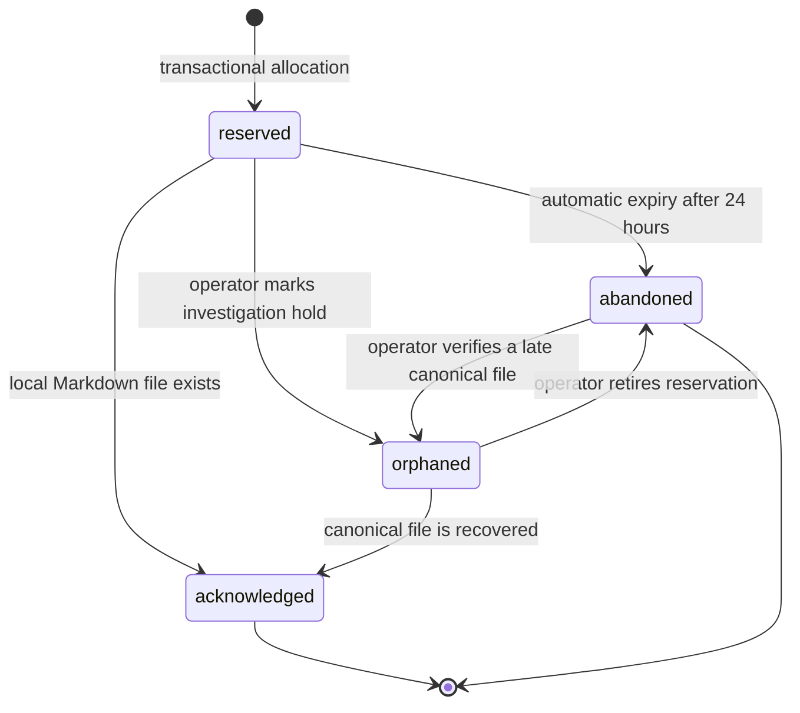
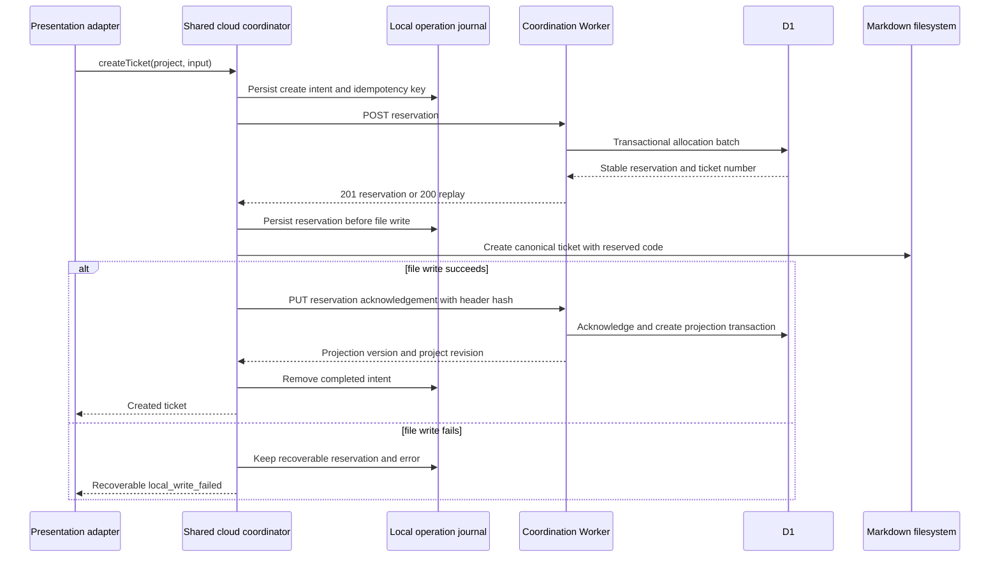

# Cloud Sync Data and Consistency

## Authority Model

The coordination database is authoritative for:

- cloud project UUID, coordination state, and membership;
- the next ticket number and every reservation;
- idempotency outcomes;
- projection versions and project-revision delivery order;
- cloud audit records.

Markdown/Git is authoritative for:

- ticket filename and frontmatter `code` after reservation;
- title, status, type, priority, assignee, dates, and body;
- deletion or restoration of the canonical ticket file;
- all workflow subdocuments.

D1 stores a derived subset of header fields. It never stores a ticket body and
never writes a projected value back into Markdown.

## Data Model

The first slice uses one D1 database per deployment environment and scopes every
tenant query by `cloud_project_id`.

```sql
CREATE TABLE cloud_projects (
  id TEXT PRIMARY KEY,
  project_code TEXT NOT NULL,
  coordination_state TEXT NOT NULL
    CHECK (coordination_state IN ('active', 'suspended')),
  next_ticket_number INTEGER NOT NULL CHECK (next_ticket_number > 0),
  projection_revision INTEGER NOT NULL DEFAULT 0,
  created_at TEXT NOT NULL,
  updated_at TEXT NOT NULL
);

CREATE TABLE project_provisioning_requests (
  idempotency_key_hash TEXT PRIMARY KEY,
  request_hash TEXT NOT NULL,
  cloud_project_id TEXT NOT NULL UNIQUE,
  created_at TEXT NOT NULL,
  FOREIGN KEY (cloud_project_id) REFERENCES cloud_projects(id)
);

CREATE TABLE memberships (
  cloud_project_id TEXT NOT NULL,
  principal_kind TEXT NOT NULL
    CHECK (principal_kind IN ('human', 'machine')),
  principal_id TEXT NOT NULL,
  display_label TEXT NOT NULL,
  role TEXT NOT NULL CHECK (role IN ('viewer', 'contributor', 'owner')),
  created_at TEXT NOT NULL,
  updated_at TEXT NOT NULL,
  PRIMARY KEY (cloud_project_id, principal_kind, principal_id),
  FOREIGN KEY (cloud_project_id) REFERENCES cloud_projects(id)
);

CREATE TABLE ticket_reservations (
  cloud_project_id TEXT NOT NULL,
  reservation_id TEXT NOT NULL,
  ticket_number INTEGER NOT NULL,
  state TEXT NOT NULL
    CHECK (state IN ('reserved', 'acknowledged', 'abandoned', 'orphaned')),
  created_by_kind TEXT NOT NULL,
  created_by_id TEXT NOT NULL,
  created_at TEXT NOT NULL,
  acknowledged_at TEXT,
  abandoned_at TEXT,
  PRIMARY KEY (cloud_project_id, reservation_id),
  UNIQUE (cloud_project_id, ticket_number),
  FOREIGN KEY (cloud_project_id) REFERENCES cloud_projects(id)
);

CREATE TABLE idempotency_keys (
  cloud_project_id TEXT NOT NULL,
  idempotency_key_hash TEXT NOT NULL,
  request_hash TEXT NOT NULL,
  reservation_id TEXT NOT NULL,
  created_at TEXT NOT NULL,
  PRIMARY KEY (cloud_project_id, idempotency_key_hash),
  UNIQUE (cloud_project_id, reservation_id),
  FOREIGN KEY (cloud_project_id, reservation_id)
    REFERENCES ticket_reservations(cloud_project_id, reservation_id)
);

CREATE TABLE ticket_projections (
  cloud_project_id TEXT NOT NULL,
  ticket_number INTEGER NOT NULL,
  reservation_id TEXT NOT NULL,
  lifecycle TEXT NOT NULL CHECK (lifecycle IN ('active', 'deleted')),
  projection_version INTEGER NOT NULL CHECK (projection_version > 0),
  project_revision INTEGER NOT NULL CHECK (project_revision > 0),
  operation_id TEXT NOT NULL,
  content_hash TEXT NOT NULL,
  code TEXT NOT NULL,
  title TEXT NOT NULL,
  status TEXT NOT NULL,
  type TEXT,
  priority TEXT,
  assignee TEXT,
  date_created TEXT,
  last_modified TEXT NOT NULL,
  updated_by_kind TEXT NOT NULL,
  updated_by_id TEXT NOT NULL,
  updated_at TEXT NOT NULL,
  deleted_at TEXT,
  PRIMARY KEY (cloud_project_id, ticket_number),
  UNIQUE (cloud_project_id, reservation_id),
  UNIQUE (cloud_project_id, operation_id),
  FOREIGN KEY (cloud_project_id, reservation_id)
    REFERENCES ticket_reservations(cloud_project_id, reservation_id)
);

CREATE TABLE audit_events (
  id TEXT PRIMARY KEY,
  cloud_project_id TEXT,
  request_id TEXT NOT NULL,
  principal_kind TEXT NOT NULL,
  principal_id TEXT NOT NULL,
  action TEXT NOT NULL,
  outcome TEXT NOT NULL,
  resource_type TEXT NOT NULL,
  resource_id TEXT,
  detail_json TEXT NOT NULL,
  occurred_at TEXT NOT NULL
);
```

Required indexes:

```sql
CREATE INDEX memberships_by_principal
  ON memberships(principal_kind, principal_id, cloud_project_id);
CREATE INDEX projections_by_revision
  ON ticket_projections(cloud_project_id, project_revision);
CREATE INDEX reservations_by_state_age
  ON ticket_reservations(cloud_project_id, state, created_at);
CREATE INDEX reservations_by_expiry
  ON ticket_reservations(state, created_at);
CREATE INDEX audit_by_project_time
  ON audit_events(cloud_project_id, occurred_at);
CREATE INDEX audit_by_principal_time
  ON audit_events(principal_kind, principal_id, occurred_at);
CREATE INDEX audit_by_time
  ON audit_events(occurred_at);
```

Wrangler migrations own this schema. Application startup never creates or
repairs tables.

## Reservation Lifecycle



Numbers in `acknowledged`, `abandoned`, or `orphaned` reservations are never
reused. Reservation records are retained while the cloud project exists.

An automatic scheduled handler marks `reserved` rows older than 24 hours as
`abandoned` in bounded batches and emits audit records. It never decrements the
counter or deletes the reservation.

## Allocation Transaction

`POST /v1/projects/{projectId}/reservations` requires an
`Idempotency-Key`. The client creates and durably journals that key before the
first network request. The Worker stores only its SHA-256 hash.

The request-scoped `reservation_id` allows a static list of prepared statements
without branching on intermediate results. The production implementation must
retain the shape proven by `MDT-198`:

```text
batch([
  1. INSERT reservation with projects.next_ticket_number
       only when no row exists for the project + idempotency-key hash;
  2. INSERT OR IGNORE the idempotency result by selecting the row created with
       this request's reservation_id;
  3. UPDATE cloud_projects.next_ticket_number by one only when its current
       value equals this request's selected ticket number;
  4. INSERT an allocation or replay audit event by comparing the selected
       reservation_id with this request's reservation_id;
  5. SELECT the row for project + idempotency-key hash.
])
```

D1 executes the batch as one transaction. Unique constraints provide the final
guard. A replay returns the existing reservation without advancing the counter.
Reusing one key with a different canonical request hash returns
`409 idempotency_key_reused`.

The counter is monotonic. It is initialized to a value greater than the highest
ticket number already present in the repository.

## Local Create Sequence



Crash recovery is deterministic:

| Last durable point | Recovery |
| --- | --- |
| Intent exists, no reservation response | Retry the same idempotency key |
| Reservation exists, no local file | Retry the same atomic file creation |
| Local file exists, no acknowledgement | Re-read header and retry acknowledgement |
| Acknowledgement succeeded, journal not cleared | Replay acknowledgement, then clear |

The local journal contains no credential. It is mode `0600`, uses
write-temp-then-rename, and is protected by one lock per physical repository
and cloud project.

## Acknowledgement

Acknowledgement is permitted only for `reserved` or `orphaned` rows belonging
to the same project. It creates the first projection with
`projection_version = 1`, advances the project revision once, and changes the
reservation to `acknowledged` in one batch.

A replay with the same reservation and `contentHash` returns the existing
projection. A replay with different content is not an acknowledgement; the
client must use the versioned projection endpoint.

The cloud must not expose a reserved ticket through normal projection delivery
or catch-up before acknowledgement.

## Projection Write Transaction

Every projection mutation provides:

- a random `operationId`;
- the last observed `projectionVersion` in `If-Match`;
- a SHA-256 `contentHash` over the canonical projected fields;
- the complete projected header, not a partial patch.

Every supported projection mutation is routed through the cloud project's
deterministically named `ProjectProjectionHub`. An explicit per-instance async
operation queue serializes mutations with stream subscription/catch-up across
D1 awaits. The hub arms a recovery alarm and invokes the D1 use case. It never
broadcasts an uncommitted request body.

The D1 batch:

1. updates the ticket only when the expected version matches;
2. sets `project_revision` to the project's current revision plus one;
3. increments the project revision only when the ticket carries this request's
   `operationId`;
4. inserts a success audit event only for that operation;
5. returns the resulting projection.

The Worker checks the affected-row count. Zero affected ticket rows returns
`409 projection_version_conflict` with the current version. Project revisions
do not advance for a rejected write.

An `operationId` replay returns the existing result. A fresh operation with a
stale version never overwrites the mirror.

After the batch commits, the hub broadcasts the returned complete projection
and `project_revision`. A send does not count as delivery. Each active socket
acknowledges only after its local read model applies and persists state; the hub
stores that cursor in the socket attachment. The alarm stays armed while an
active authorized socket is behind and replays a bounded catch-up from its
acknowledged cursor. The replay is bounded in count as well: a socket that makes
no acknowledgement progress across three alarm passes is closed
(`ack_timeout`) and recovers by reconnecting — a stuck client must not turn the
alarm into a D1 polling loop. A disconnected server catches up when it
reconnects.

Recovery promises final-state convergence. The latest-row projection table is
not an event log of every intermediate edit, so catch-up can contain sparse
project revisions.

## Local Projection Write Journal

The device-local write journal is not a read-side cache. It is drained only on
enqueue, server startup, or when a persisted `nextAttemptAt` is due. One
single-flight runner per project processes a bounded batch; browser requests,
ticket reads, projection reads, and stream delivery never trigger a drain.

Each entry persists its operation ID, base/desired hashes, lifecycle, known
projection version, attempt count, `nextAttemptAt`, and last typed error. States
are:

| State | Meaning |
| --- | --- |
| `pending` / `retry_scheduled` | Eligible write; transient failure retries with capped exponential backoff and jitter |
| `authentication_paused` | Project credential, membership, or coordination state must recover before any ticket retry |
| `conflict` | Conditional write lost optimistic concurrency; requires reconciliation |
| `unmanaged` | Authorized project has no projection for this ticket; automatic retries stop |
| `synced` | Conditional write succeeded; remove the entry |

An update uses the persisted projection version in one conditional `PUT`; it
does not issue a per-attempt read first. A conflict may fetch current state once
for reconciliation. `project_not_found` remains the non-disclosing project or
membership failure. Only after project membership succeeds may an absent ticket
return `projection_not_found`.

`projection_not_found` never means "create automatically." Initial projection
creation must recover its original reservation/acknowledgement, or an operator
must run an explicit legacy import. A later local edit must not reactivate an
`unmanaged` entry until that eligibility exists.

A cold-start `projection_version_conflict` with a positive `currentVersion` may
adopt that version and retry the same operation once. This is not
last-writer-wins. If the retry fails, or if the conflict cannot be proven to be
only a stale local version, the entry becomes `conflict` and requires explicit
reconciliation.

## Legacy Projection Import

Existing local tickets that predate cloud sync have no original reservation or
projection row. The write journal must not create those rows implicitly. The
only supported bootstrap is an explicit operator import/backfill operation that:

1. scans canonical Markdown tickets for a selected cloud-bound project;
2. probes D1 for missing projections without disclosing hidden projects to
   normal callers;
3. reserves or reuses each ticket number through the coordinator contract;
4. acknowledges the canonical header as projection version 1;
5. records idempotency, audit outcome, skipped tickets, and failures; and
6. leaves local ticket bodies entirely in Markdown/Git.

The import is a CLI/operator workflow, not a runtime retry path. It must be
idempotent, bounded, and safe to resume after partial failure.

## Projection Conflicts

A cloud conflict does not change the local file. The client:

1. may adopt a positive `currentVersion` and retry once when the only known
   defect is a cold-start stale local version;
2. fetches the current projection for any remaining conflict;
3. treats an equal content hash as a completed replay;
4. otherwise records a sync conflict and shows the current cloud and local
   header versions; and
5. requires explicit user confirmation before republishing the authoritative
   local header against the newly observed version.

There is no automatic last-writer-wins retry and no cloud-to-Markdown merge.
Git remains the place where divergent canonical edits are reconciled.

## Delete and Restore

Deleting a local ticket publishes a `deleted` tombstone with an expected
projection version. The tombstone retains the ticket number, code, last known
header hash, actor, and revision. Stream clients remove the projection stub but
retain the applied revision cursor.

An old clone that still has the file receives a version conflict and cannot
silently resurrect it. Restore is an explicit `lifecycle = active` mutation
against the current tombstone version and requires the canonical local file to
exist.

Tombstones are retained while the cloud project exists so ticket numbers cannot
be mistaken for reusable.

## Projection Stream and Catch-Up Contract

The local server first authorizes a session:

```text
POST /v1/projects/{projectId}/projection-stream-sessions
```

This typed HTTPS request carries a stable opaque activation ID. The project hub
coalesces the same principal/activation decision; only a cache miss performs
one D1 membership decision and denial audit. The hub returns a short-lived
opaque grant and stores its digest plus minimum activation/revocation metadata
in SQLite-backed storage. D1 remains the membership authority; membership
mutation invalidates affected cached decisions, grants, and sockets.

Success is intentionally small and secret-bearing (`grantExpiresAt` is
epoch-ms and bounded by the authorizing Access credential; `streamProtocol` is
the control-plane protocol version the local client must accept):

```json
{
  "grant": "opaque-server-only-value",
  "grantExpiresAt": 1755259200000,
  "streamProtocol": 2
}
```

The grant is redacted from logs and local status. Terminal errors use the normal
typed coordination envelope. Repeating the same activation ID returns the
cached decision without another membership query or denial audit.

The local server then opens:

```text
GET /v1/projects/{projectId}/projection-stream
Upgrade: websocket
x-mdt-stream-grant: <opaque grant>
x-mdt-after-revision: <last applied+persisted projectRevision>
```

The Worker validates the Access assertion only, preserves every client header
(including the WebSocket upgrade headers), and routes the request to the
project's `ProjectProjectionHub` without another membership query. The hub
validates the grant against its digest registry and accepts one logical stream
per local server/project instance.
Reconnects reuse the grant until expiry or revocation. Browser tabs do not open
cloud streams.

The versioned server envelopes are a `kind`-discriminated union with flat
delivery metadata (see `domain-contracts/src/cloud-sync/projection-stream.ts`):

```json
{
  "kind": "delta",
  "cloudProjectId": "018f5e6c-6f32-7c5b-9e76-97c7c769c123",
  "projectRevision": 43,
  "ticketNumber": 226,
  "projectionVersion": 4,
  "lifecycle": "active",
  "header": {}
}
```

`catchup` carries the same complete projection shape. The hub first captures an
authoritative high-water project revision, sends every applicable latest row
whose revision is above the requested cursor and at or below that high-water
revision, then sends `ready(highWaterRevision)`. Stable typed `stale` and `error`
envelopes contain no raw dependency response. The client sends
`ack(projectRevision)` only after applying and persisting either a completed
catch-up cursor or live delta.

Catch-up uses the existing bounded cursor query:

```text
GET /v1/projects/{projectId}/projections?after=<projectRevision>&limit=<1..500>
```

The hub normally performs this D1 read internally. The HTTPS endpoint remains
available for bounded reconnect/repair and rolling compatibility, but version 2
clients never call it periodically. Items are ordered by
`(project_revision, ticket_number)` and include active projections and
tombstones. The backend projection read-model cursor is persisted only after
the received projection state is applied. It is never returned to the browser.

Catch-up rows may skip historical revisions because multiple mutations of one
ticket collapse into that ticket's latest row. The read model accepts sparse
catch-up rows and advances atomically to the `ready` high-water cursor. After
`ready`, live deltas are contiguous.

Backend read-model merge rules:

- a local canonical ticket always supplies the displayed body and header;
- a cloud projection with no local file appears as a clearly labeled,
  read-only projection stub;
- a tombstone removes only the cloud stub;
- cloud data never overwrites a local ticket object;
- stream failures keep the last projection and expose stale status;
- duplicate or older revisions are ignored;
- a non-contiguous **live** revision pauses live application and triggers one
  cursor catch-up from the last applied revision;
- a previously live transport may reconnect within a bounded attempt budget
  using its existing grant; terminal outcomes persist and no timer probes D1.

The projection read model is atomically persisted under owner-only CONFIG_DIR
state for the local project. It contains approved projected headers, lifecycle,
the applied revision, and high-level stale state. It contains no credential or
ticket body. On browser refresh, the server merges that state with the current
Markdown scan before returning the ticket list.

Subscription and projection mutations pass through the same per-project hub
operation queue, which removes the race between a final catch-up read and live
registration. D1 remains the authority and primary binding. The Durable Object
persists only delivery cursor/socket metadata and uses hibernating WebSockets
plus alarms; it is not a read replica or projection store. The hub's metadata
lives in the DO's own SQLite-backed storage (`new_sqlite_classes` migration), a
separate database from the `DB` D1 binding.

Settled live or terminal activations perform no elapsed-time D1 statements. D1
membership reads occur only for explicit stream-session issue/renewal, actual
operations, and authorization changes—not WebSocket reconnect. Catch-up/gap and
alarm recovery may read projection state when work exists.

## Cloud Service API

This contract is consumed by local backends and other trusted adapters, not by
React. All success and error bodies use `application/json`. IDs in paths are
validated before repository access. Request bodies are strictly validated and
size bounded.

| Method and path | Minimum role | Success |
| --- | --- | --- |
| `POST /v1/admin/projects` | Operator audience | `201` project and initial owner, or replay `200` |
| `GET /v1/projects/{projectId}` | Viewer | `200` binding and coordination state |
| `GET /v1/projects/{projectId}/members` | Owner | `200` member list |
| `PUT /v1/projects/{projectId}/members/{kind}/{principalId}` | Owner | `200` upserted member |
| `DELETE /v1/projects/{projectId}/members/{kind}/{principalId}` | Owner | `204` |
| `PUT /v1/projects/{projectId}/coordination-state` | Owner | `200` active or suspended |
| `POST /v1/projects/{projectId}/reservations` | Contributor | `201` or replay `200` |
| `GET /v1/projects/{projectId}/reservations/{reservationId}` | Contributor | `200` recovery state |
| `PUT /v1/projects/{projectId}/reservations/{reservationId}/acknowledgement` | Contributor | `200` projection |
| `PUT /v1/projects/{projectId}/tickets/{ticketNumber}/projection` | Contributor | `200` projection |
| `PUT /v1/projects/{projectId}/tickets/{ticketNumber}/lifecycle` | Contributor | `200` projection or tombstone |
| `POST /v1/projects/{projectId}/projection-stream-sessions` | Viewer | `201` short-lived server-only stream grant |
| `GET /v1/projects/{projectId}/projection-stream` | Viewer | `101` authenticated WebSocket upgrade |
| `GET /v1/projects/{projectId}/projections` | Viewer | `200` bounded cursor page for catch-up/compatibility |

Mutation responses include `requestId`; projection responses include
`ETag: "<projectionVersion>"`. No endpoint accepts or returns a ticket body.
Project provisioning requires an `Idempotency-Key`; the Worker stores its hash
with a canonical request hash and returns `idempotency_conflict` when the same
key is reused with different content.

## Browser-Facing Local Contract

The browser uses only local application contracts:

| Method and path | Purpose |
| --- | --- |
| `GET /api/projects/{localProjectId}/tickets/unified` | Unified canonical and projection-only ticket views |
| `GET /api/projects/{localProjectId}/cloud-sync/status` | Local-only live/paused/failed state; never triggers a cloud request |
| `GET /api/events` | Ordinary local ticket changes plus high-level project sync status |

A projection-only ticket view includes `kind = projected`, `readOnly = true`,
and `stale`; these fields describe UI capability. It does not include cloud
project ID, projection/project revision, stream cursor, catch-up state, cloud
origin, or credential data. The target architecture removes the browser
`/api/projects/{id}/cloud-projections` call after the bounded legacy rollout.
`/api/projects/{id}/crs` remains the canonical Markdown list endpoint; it is not
the browser's cloud projection surface.

## Error Contract

Worker-generated errors use:

```json
{
  "error": {
    "code": "projection_version_conflict",
    "message": "Projection version does not match.",
    "requestId": "018f5e7f-22bc-78a2-a436-157885a207a8",
    "retryable": false,
    "currentVersion": 7
  }
}
```

| Status | Code | Meaning |
| --- | --- | --- |
| `400` | `invalid_request` | Strict validation failed |
| `401` | `authentication_required` | Assertion missing or invalid after Access |
| `403` | `forbidden` | Authenticated member lacks the role |
| `404` | `project_not_found` | Unknown project or caller is not a member |
| `404` | `projection_not_found` | Authorized project has no projection for the ticket |
| `404` | `reservation_not_found` | Member cannot find the scoped reservation |
| `409` | `idempotency_key_reused` | Same key, different request hash |
| `409` | `reservation_state_conflict` | Operation is invalid for reservation state |
| `409` | `projection_version_conflict` | `If-Match` is stale |
| `409` | `last_owner_required` | Mutation would remove the final owner |
| `423` | `coordination_suspended` | Project intentionally blocks cloud writes |
| `429` | `rate_limited` | Caller exceeded the operation budget |
| `503` | `coordination_unavailable` | D1 or required identity dependency unavailable |

Messages do not contain SQL, stack traces, membership lists, paths, tokens, or
project existence details.

## Cloud Outage and Disable Semantics

When coordination is unavailable:

- existing Markdown files remain readable and editable;
- local-only projects continue current behavior;
- cloud-bound creation is blocked and keeps its journaled intent;
- eligible projection pushes remain queued with bounded backoff; terminal,
  conflict, and authentication-paused entries do not spin;
- the projection stream shows the last applied projection as stale; the manager
  may use its bounded transient budget, while terminal state schedules no retry;
- no caller allocates a local fallback number.

Changing the CONFIG_DIR connection to `state = "disabled"` detaches one
installation from projection delivery and publishing but does not make local allocation
safe. The connection remains present, existing Markdown remains usable, and new
ticket creation fails closed.

Permanent return to local allocation requires an owner-run detach procedure:

1. set the cloud project's coordination state to `suspended`;
2. drain or retire every pending reservation;
3. synchronize Git so all canonical ticket numbers are present;
4. verify the local next number is above both the highest file and the cloud
   counter;
5. remove the CONFIG_DIR cloud connection from every participating installation;
6. resume local-only creation with explicit acknowledgement that cross-clone
   collision protection is gone.

Re-enabling preserves the cloud counter and requires a fresh membership probe.

## Retention

| Record | Retention |
| --- | --- |
| Project and membership | Until explicit project deletion procedure |
| Project provisioning idempotency | Lifetime of the cloud project |
| Reservations and allocated numbers | Lifetime of the cloud project |
| Idempotency keys | Lifetime of the cloud project |
| Active projections and tombstones | Lifetime of the cloud project |
| Audit events | 180 days in D1, then delete in bounded batches |
| Durable Object per-socket acknowledged cursor and attachments (DO SQLite-backed storage, not D1) | Until project decommission; attachments only while sockets exist |
| Local applied projection cursor | Until connection removal or explicit repair |
| Local completed journal entries | Removed immediately after confirmed success |
| Local failed journal entries | Until recovery or explicit operator retirement |

Project-lifetime idempotency retention intentionally supersedes MDT-198's
tentative prune-after-window note. A delayed replay must resolve to its original
reservation rather than allocate a second number.

Before deleting a cloud project, operations must export coordination data and
confirm the canonical Markdown repository remains usable.
