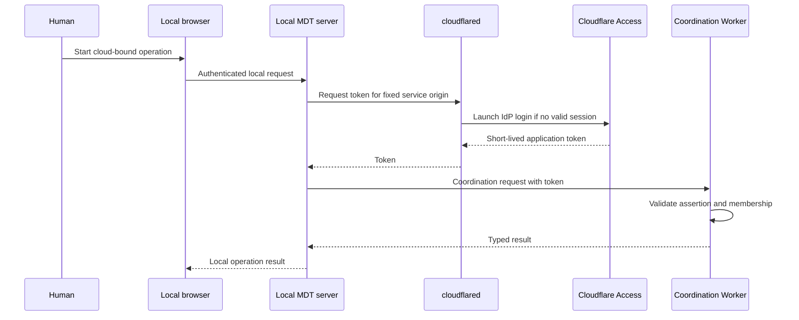

# Cloud Sync Identity and Access

## Boundary

The cloud coordination service has its own team identity model. It does not
extend or replace the local single-instance authentication and sharing model in
`auth-and-sharing-architecture.md`.

Cloudflare Access establishes a candidate human or machine principal. The
Worker then validates the assertion and D1 membership authorizes the operation
for one cloud project. Passing Access alone never grants project access.

## Trust Boundaries

```mermaid
flowchart LR
  Client["Local MDT client"] -->|"Access credential over HTTPS"| Edge["Cloudflare Access policy"]
  Edge -->|"Cf-Access-Jwt-Assertion"| Worker["Coordination Worker"]
  Worker -->|"JWKS, pinned issuer and audience"| Verify["Assertion verifier"]
  Verify --> Principal["Human or machine principal"]
  Principal --> Membership["D1 project membership check"]
  Membership --> UseCase["Authorized use case"]
```



There are three independent checks:

1. Access edge policy accepts the presented credential.
2. The Worker validates the application JWT itself.
3. Project membership permits the requested operation.

Each check fails closed.

## Access Applications

Production uses two self-hosted Access application audiences on one protected
HTTPS origin:

| Audience | Paths | Accepted principal | Purpose |
| --- | --- | --- | --- |
| Coordination | `/v1/projects/*` | IdP human or Access service token | Normal project operations |
| Operator | `/v1/admin/*` | IdP human in the operator Access policy | Project provisioning and administrative repair |

The Worker config contains the team domain, coordination audience, and operator
audience as non-secret environment variables. Access policies and the Worker
must agree on both audience tags. A normal project owner is not automatically a
cloud-service operator.

The `workers.dev` route is disabled in production. Only the Access-protected
custom domain serves the API.

## Assertion Validation

For every request that reaches the Worker:

1. Read `Cf-Access-Jwt-Assertion`. Do not trust caller-supplied identity
   headers and do not use the browser cookie as the origin assertion.
2. Parse a bounded JWT and allow only `RS256`.
3. Select the JWK by `kid` from the team-domain JWKS endpoint.
4. Verify the signature, exact issuer, accepted audience, `exp`, `nbf` when
   present, and a sane `iat`.
5. Cache the JWKS for at most five minutes. On an unknown `kid`, refresh once
   and retry so Access key rotation does not require a deployment.
6. Derive exactly one principal type:
   - human: non-empty `email`, normalized with trim and lowercase;
   - machine: non-empty `common_name`, the Access service-token client ID.
7. Reject ambiguous, missing, malformed, expired, or unverifiable claims.

The verifier may fetch JWKS across requests, but it must not keep
request-scoped principal data in module-global mutable state.

Full identity lookup is not required for authorization. Email and
`common_name` from a verified application assertion are the stable membership
keys for the first slice.

## Principal Contract

```ts
type CloudPrincipal =
  | {
      kind: "human";
      id: string; // normalized email
      display: string; // same email in the first slice
    }
  | {
      kind: "machine";
      id: string; // verified Access common_name
      display: string; // membership label, never a secret
    };
```

The audit record stores `kind`, `id`, and membership label. It never stores the
raw JWT, Access cookie, service-token secret, or authorization headers.

## Membership and Roles

Membership is keyed by `(cloud_project_id, principal_kind, principal_id)`.

| Capability | Viewer | Contributor | Owner |
| --- | --- | --- | --- |
| Read own membership | Yes | Yes | Yes |
| Poll header projections | Yes | Yes | Yes |
| Reserve and acknowledge a ticket number | No | Yes | Yes |
| Publish, tombstone, or restore a projection | No | Yes | Yes |
| List project members | No | No | Yes |
| Add, change, or revoke a project member | No | No | Yes |
| Delete the cloud project | No | No | No; operator procedure only |

Human and machine members use the same roles. A service token should normally
be `contributor` or `viewer`, never `owner`.

Authorization rules:

- Every project query includes the cloud project UUID and principal key.
- Unknown projects and projects hidden from the caller both return the same
  `404 project_not_found` response.
- A known member with an insufficient role receives `403 forbidden`.
- Membership revocation takes effect on the next Worker request; there is no
  authorization cache in the first slice.
- The final owner cannot be removed or demoted.
- A principal cannot grant a role higher than its own role.

## Provisioning and Onboarding

### New Cloud Project

`POST /v1/admin/projects` requires the operator audience and operator policy.
It accepts:

```json
{
  "projectCode": "MDT",
  "initialOwnerEmail": "owner@example.com",
  "initialNextTicketNumber": 201
}
```

The Worker creates a random cloud project UUID, the initial counter, and the
first owner membership in one D1 batch. `initialNextTicketNumber` must be
greater than the highest ticket number in the local repository. The operator
returns the UUID once; the local owner writes the non-secret binding only after
a membership probe succeeds.

There is no anonymous bootstrap endpoint and no reusable bootstrap secret.

### Add a Human

An owner adds the normalized email before or after the person first
authenticates through Access. Access policy admission and project membership
are both required. Removing either blocks subsequent project operations.

### Add a Machine

1. An Access administrator creates a named, expiring service token.
2. An owner adds its verified client ID (`common_name`) as a machine member.
3. The client ID and secret are installed only in the headless runtime's secret
   channel.
4. A test request confirms machine attribution before automation is enabled.

## Client Credential Flows

The local server exposes cloud coordination routes only to an owner-capable
local session. Anonymous and read-only shared-board sessions receive canonical
local tickets only; they cannot trigger a cloud call and do not receive
cloud-only projection stubs. A local cloud credential is never used on behalf
of an unauthenticated or read-only browser caller.

### Browser-Initiated Human Operation

The local browser never receives the cloud token.



The local server invokes `cloudflared` with a fixed executable and argument
array, never through a shell. The origin comes from validated project config,
not request input. The server holds the returned token in memory only for its
remaining lifetime.

### Interactive CLI and Local MCP

CLI and stdio MCP use the same human credential provider:

```text
cloudflared access token -app=https://mdt-sync.example.com
```

`cloudflared` launches the IdP flow when needed. The adapter passes the token to
the shared cloud client in memory and does not print it, persist it, or include
it in structured logs.

### Headless MCP or Automation

MCP HTTP and non-interactive automation use an Access service token. The two
credential values are supplied by process environment or an OS/runtime secret
store:

```text
CF_ACCESS_CLIENT_ID
CF_ACCESS_CLIENT_SECRET
```

They are sent only to the fixed Access-protected origin. The local MCP bearer
token authenticates the MCP caller; it is not a cloud credential and must not
be forwarded to the coordination Worker.

Before attaching any human token or service-token header, every adapter
requires the project `serviceUrl` to exactly match an operator-controlled local
allowlist. Redirects to another origin are rejected and credential-bearing
requests use redirect mode `error`.

## Secret and Token Policy

- Project TOML and registry files contain no credential material.
- Browser storage contains no cloud token or service secret.
- Human application tokens are short-lived and retained in process memory only;
  `cloudflared` owns its own authenticated session storage.
- Service tokens have named owners, explicit expiry, least-privilege
  membership, and an expiration alert.
- Rotation installs the replacement token, validates it, switches automation,
  then deletes the old token.
- Revocation requires deleting the Access service token or removing project
  membership. Revoking an Access session alone does not revoke a still-valid
  service-token client secret.
- Logs redact `Authorization`, `Cookie`, `CF_Authorization`,
  `cf-access-token`, `CF-Access-Client-Id`, `CF-Access-Client-Secret`, and
  `Cf-Access-Jwt-Assertion`.

## Failure Semantics

Cloudflare Access may reject a request before the Worker, so its response is not
guaranteed to use the coordination JSON envelope. Client adapters normalize
edge and Worker failures:

| Condition | Client result | Retry |
| --- | --- | --- |
| No human session | `authentication_required` | Start interactive login |
| Expired or invalid assertion | `authentication_required` | Refresh once, then stop |
| Valid Access principal without membership | `project_not_found` | No automatic retry |
| Insufficient project role | `forbidden` | No automatic retry |
| Revoked or expired service token | `machine_authentication_failed` | Stop automation and alert |
| JWKS unavailable with no usable cached key | `identity_validation_unavailable` | Bounded backoff; no fail-open |

Authentication failures never cause local-number allocation for a cloud-bound
project.

## Required MDT-200 Validation

Unit tests with fabricated tokens are insufficient for closure. Staging must
prove all of the following against a real Access-protected Worker:

- human email attribution after IdP login;
- service-token `common_name` attribution;
- wrong audience, issuer, signature, and expired token denial;
- unknown `kid` refresh behavior;
- viewer/contributor/owner authorization;
- cross-project non-disclosure;
- membership and service-token revocation;
- no secret or raw assertion in Worker, server, CLI, or MCP logs.
