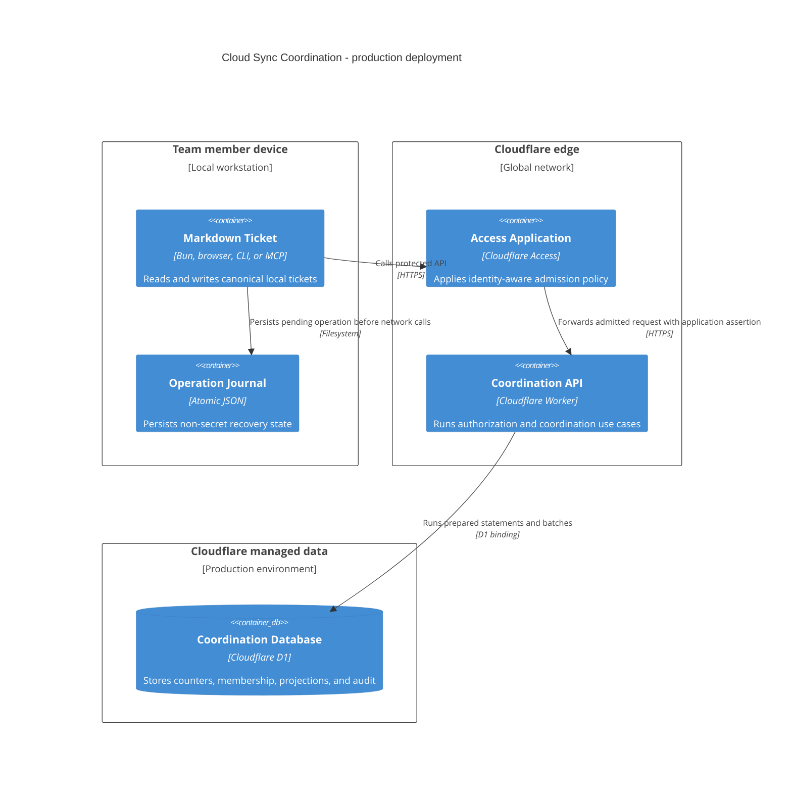

# Cloud Sync Operations

## Environments and Topology

Use separate Cloudflare resources for `staging` and `production`:

| Resource | Staging | Production |
| --- | --- | --- |
| Worker name | `mdt-cloud-sync-staging` | `mdt-cloud-sync-production` |
| Custom domain | Dedicated Access-protected staging host | Dedicated Access-protected production host |
| D1 database | Staging-only database | Production-only database |
| Access applications | Staging coordination and operator audiences | Production coordination and operator audiences |
| Rate-limit namespaces | Staging-only IDs | Production-only IDs |
| Logs and alerts | Full sampling during validation | Tuned sampling plus unsampled durable audit |

Production disables the `workers.dev` route. No production resource identifier,
audience, service token, or secret is reused in staging.



The cloud service is the root `cloud/` workspace. Its Worker entry point and
Cloudflare implementation are under `cloud/src/cloudflare/`.
`cloud/wrangler.jsonc` is the deployment source of truth. It uses:

- one D1 binding named `DB`;
- separate read and mutation rate-limit bindings;
- one UTC Cron Trigger, every 15 minutes, invoking the Worker's `scheduled()`
  handler for bounded reservation expiry and audit-retention batches;
- Worker Logs and Traces;
- non-secret `TEAM_DOMAIN`, `COORDINATION_AUD`, and `OPERATOR_AUD` variables;
- a version metadata binding for diagnostic responses and logs.

Binding types are generated with `wrangler types`; the implementation does not
hand-write a duplicate `Env` interface.

The Cron Trigger is declared only in `wrangler.jsonc`. Deployment validation
invokes the local scheduled-handler endpoint, then confirms the deployed Cron
event and resulting audit records before release.

## Secret Inventory

The Worker needs no Cloudflare API token at runtime. Its D1 and rate-limit
permissions come from bindings.

| Secret | Location | Consumer |
| --- | --- | --- |
| Wrangler deployment credential | CI secret store or operator OS keychain | Deployment only |
| Access service-token client ID | Headless process secret channel | MCP HTTP or automation |
| Access service-token client secret | Headless process secret channel | MCP HTTP or automation |
| Human Access application token | `cloudflared` store and process memory | Interactive local client |

Local development uses an ignored `.dev.vars` file only when a secret is
required. Production secrets use encrypted secret channels, never Wrangler
`vars`, TOML, command-line arguments, logs, or repository files.

## Migration Procedure

Every schema change is an ordered SQL migration under `cloud/migrations/`. Use
the immutable D1 database name, not only the binding name, in operator commands.

Before production:

1. apply and test the migration against a fresh local D1 database;
2. restore a representative staging export and apply the migration there;
3. run schema, foreign-key, allocation, idempotency, and projection tests;
4. retrieve and record the production Time Travel bookmark;
5. apply migrations with `wrangler d1 migrations apply`;
6. verify the applied migration list and schema version;
7. deploy code only after its required schema is present.

Migrations are forward-only during normal rollout. A migration that removes or
rewrites data must use expand/migrate/contract across separate releases.

## Deployment and Rollback

### Release

1. Pin and install the repository's Wrangler version.
2. Run type generation, TypeScript validation, lint, Workers-runtime tests, D1
   integration tests, and package build.
3. Run `wrangler deploy --dry-run` and inspect bindings and bundle output.
4. Apply required staging migrations.
5. Upload a Worker version without directing production traffic.
6. Smoke-test that version against staging and a protected production preview
   where available.
7. Apply production migrations after recording a Time Travel bookmark.
8. Gradually deploy the version while monitoring errors, denials, D1 latency,
   conflicts, and allocation outcomes.
9. Record Worker version ID, migration versions, bookmark, source revision,
   operator, and verification result.

### Code Rollback

A Worker version rollback does not roll back D1. Roll back code only when the
previous Worker version is compatible with the current schema. Otherwise deploy
a forward fix.

### Database Restore

D1 Time Travel restore is destructive, overwrites the database in place, and
cancels in-flight queries. It is an incident operation, not a normal
application rollback:

1. suspend coordination writes at the Access policy or project state layer;
2. record the current bookmark so the restore can be undone;
3. export coordination data;
4. identify and peer-review the target timestamp or bookmark;
5. restore with Wrangler;
6. verify schema, counters, reservation uniqueness, memberships, and projection
   revision monotonicity;
7. reconcile local journals created after the restore point;
8. resume writes only after two-person approval;
9. retain the before/after bookmarks and incident record.

Because Markdown/Git remains authoritative, a projection can be rebuilt after a
restore. Membership and counter history cannot be inferred safely from Git and
must be verified before allocation resumes.

## Backup and Export

D1 Time Travel is always on for the production backend. Current documented
retention is 30 days on Workers Paid and 7 days on Workers Free.

Time Travel is not the vendor-exit artifact. Production additionally creates a
weekly, encrypted export retained for 90 days outside the D1 database. The
export contains:

- cloud projects and counter state;
- memberships;
- reservations and terminal allocation history;
- projections and tombstones;
- audit records inside their retention window;
- migration version and export timestamp.

Quarterly, restore an export into an isolated staging database and run
integrity checks. An untested export is not accepted as a backup.

## Rate Limits

Rate limiting is an abuse and runaway-client guard, not an allocation
correctness mechanism.

After JWT validation, the Worker calls a Workers Rate Limiting binding with a
key derived from principal kind, principal ID, cloud project UUID, and route
class:

| Route class | Initial limit per principal/project | Response |
| --- | --- | --- |
| Projection polling | 600 requests per 60 seconds | `429 rate_limited` |
| Mutations | 60 requests per 60 seconds | `429 rate_limited` |
| Operator mutations | 20 requests per 60 seconds | `429 rate_limited` |

Workers rate limits are location-local, permissive, and eventually consistent.
They must not be used to issue numbers, enforce quotas, or replace D1 unique
constraints. Tune initial limits from measured staging and production traffic;
do not lower them below the documented client polling envelope without a
compatibility review.

## Observability

### Structured Worker Event

Every request emits one redacted structured completion event:

```json
{
  "event": "cloud_sync_request",
  "requestId": "018f5e7f-22bc-78a2-a436-157885a207a8",
  "workerVersion": "version-id",
  "route": "reservation.create",
  "status": 201,
  "durationMs": 18,
  "cloudProjectId": "project-uuid",
  "principalKind": "human",
  "outcome": "allocated",
  "d1RowsRead": 3,
  "d1RowsWritten": 4
}
```

Do not log raw request bodies, projected titles, assignee values, email beyond
the durable audit requirement, filesystem paths, tokens, cookies, assertions,
or SQL parameters.

### Durable Audit

Success and denial audit events are written to D1 for:

- project provisioning and coordination-state changes;
- membership add, change, revoke, and final-owner denial;
- allocation, replay, acknowledgement, abandonment, and recovery;
- projection update, conflict, tombstone, and restore;
- authorization denial and rate limiting.

Audit writes that establish a mutation outcome are in the same D1 batch as the
mutation. A Worker log is not a substitute for durable audit.

### Metrics

Track:

- request count, status, and latency by route;
- authentication and authorization denials;
- allocation success, replay, and batch failure;
- reservation age and count by state;
- projection writes, conflicts, and polling lag;
- D1 read/write query count, rows read/written, latency, response bytes, and
  database size;
- rate-limited requests;
- client journal backlog and oldest pending operation;
- Worker version and migration version.

Cloudflare D1 metrics are retained for 31 days according to current
documentation. Export longer-term operational metrics if the service needs a
longer baseline.

## Initial Alerts and Release Gates

Initial thresholds are conservative and must be recalibrated from production
evidence:

| Signal | Alert |
| --- | --- |
| Allocation duplicate or unique-constraint invariant failure | Page immediately; suspend affected project |
| Allocation or acknowledgement 5xx rate | More than 1% for 5 minutes |
| Allocation p95 latency | More than 1 second for 10 minutes |
| D1 overloaded errors | Any sustained occurrence for 5 minutes |
| Oldest `reserved` operation | More than 30 minutes warns; more than 24 hours alerts |
| Projection conflict rate | More than 5% for 15 minutes |
| Polling freshness | No successful poll for three configured intervals |
| Service-token expiry | Warn 30 days and 7 days before expiry |
| Database size | Warn at 60%, alert at 75% of the current D1 per-database limit |
| Export or restore drill | Any missed weekly export or failed quarterly restore |

The first production rollout is limited to explicitly selected projects. Do not
broaden adoption until deployed tests record p50, p95, and p99 allocation
latency, error/overload behavior, D1 rows read/written, and recovery outcomes.
The local POC is correctness evidence, not a capacity result.

## Incident Runbooks

### Coordination or D1 Unavailable

1. Confirm Access, Worker, and D1 health separately.
2. Keep cloud-bound allocation blocked; never enable local fallback.
3. Notify clients that existing Markdown remains usable and projections are
   stale.
4. Inspect journal backlog and reservation age.
5. Recover the dependency, replay idempotent operations, and verify counters.
6. Resume normal polling before new allocation.

### Suspected Duplicate Number

1. Suspend the cloud project immediately.
2. Preserve D1 audit, reservation, and counter rows plus involved local files.
3. Check project scoping, unique constraints, idempotency hashes, and migration
   state.
4. Do not rename or delete either ticket automatically.
5. Repair only through a reviewed incident decision; number reuse is forbidden.

### Lost Acknowledgement

1. Read the local operation journal and reservation endpoint.
2. If the canonical file exists, recompute its projected hash.
3. Replay acknowledgement with the same reservation.
4. If the reservation is abandoned, mark it `orphaned` for operator review;
   never allocate the number again.

### Projection Conflict Storm

1. Keep local Markdown authoritative.
2. Stop automatic projection retries for the affected tickets.
3. Inspect client versions, content hashes, and local Git divergence.
4. Reconcile canonical files through Git.
5. Explicitly republish against the latest cloud version.

### Credential Exposure

1. Delete the affected Access service token; session revocation alone is not
   sufficient.
2. Revoke its project memberships.
3. Search redacted logs and audit events for its `common_name`.
4. Create a replacement with least privilege and a new expiry.
5. Validate attribution before re-enabling automation.

## Disable and Vendor Exit

Disabling one client does not stop cloud allocations by other clients. Follow
the project-wide suspend and detach sequence in
`data-and-consistency.md` before resuming local numbering.

For vendor exit:

1. suspend every cloud project;
2. drain or retire reservations and synchronize canonical Git repositories;
3. export all D1 tables, migrations, Access membership mapping, and audit data;
4. verify each local repository's highest ticket number against the cloud
   counter;
5. remove cloud bindings from clients;
6. retain the export according to organizational policy;
7. decommission Access applications, service tokens, Worker routes, and D1 only
   after Markdown continuity and export readability are verified.

Ticket content remains usable without the cloud service. Lost membership or
counter history may not be reconstructed from Git, which is why export precedes
decommissioning.

## Official Platform Sources

Platform behavior is mutable. These primary sources were checked on
2026-07-24 and must be rechecked during `MDT-200` implementation:

- [D1 batch transaction and Worker API](https://developers.cloudflare.com/d1/worker-api/d1-database/)
- [D1 migrations](https://developers.cloudflare.com/d1/reference/migrations/)
- [D1 Time Travel and backups](https://developers.cloudflare.com/d1/reference/time-travel/)
- [D1 limits and throughput model](https://developers.cloudflare.com/d1/reference/faq/)
- [D1 metrics and analytics](https://developers.cloudflare.com/d1/observability/metrics-analytics/)
- [Validate Cloudflare Access JWTs](https://developers.cloudflare.com/cloudflare-one/access-controls/applications/http-apps/authorization-cookie/validating-json/)
- [Access application token claims](https://developers.cloudflare.com/cloudflare-one/access-controls/applications/http-apps/authorization-cookie/application-token/)
- [Access service-token lifecycle](https://developers.cloudflare.com/cloudflare-one/access-controls/service-credentials/service-tokens/)
- [Interactive Access CLI tokens](https://developers.cloudflare.com/cloudflare-one/tutorials/cli/)
- [Workers rate-limit binding](https://developers.cloudflare.com/workers/runtime-apis/bindings/rate-limit/)
- [Workers Cron Triggers](https://developers.cloudflare.com/workers/configuration/cron-triggers/)
- [Workers secrets](https://developers.cloudflare.com/workers/configuration/secrets/)
- [Workers versions and deployments](https://developers.cloudflare.com/workers/versions-and-deployments/)
- [Workers Logs](https://developers.cloudflare.com/workers/observability/logs/workers-logs/)
