# Backend Event Catalog

**Document Version**: 1.0
**Last Updated**: 2025-10-03
**Backend Version**: Express.js + Node.js
**Event Protocol**: Server-Sent Events (SSE)

---

## Table of Contents

1. [Overview](#overview)
2. [SSE Infrastructure](#sse-infrastructure)
3. [Event Types Catalog](#event-types-catalog)
4. [Event Flow Architecture](#event-flow-architecture)
5. [Event Payload Schemas](#event-payload-schemas)
6. [Implementation Details](#implementation-details)
7. [Error Handling](#error-handling)
8. [Recommendations](#recommendations)

---

## Overview

The backend event system uses **Server-Sent Events (SSE)** to push real-time updates to connected frontend clients. The system is built on:

- **Express.js** HTTP server (port 3001)
- **Chokidar** file system watcher
- **SSE** for unidirectional server-to-client communication
- **Multi-project support** with per-project file watchers

### Key Components

```
┌─────────────────────────────────────────────────────────────┐
│                    Express.js Server                        │
│  (server/server.js)                                         │
└────────────────────────────┬────────────────────────────────┘
                             │
                ┌────────────┴────────────┐
                │                         │
     ┌──────────▼──────────┐   ┌─────────▼──────────┐
     │  FileWatcherService │   │   SSE Endpoint     │
     │ (fileWatcherService)│   │   /api/events      │
     └──────────┬──────────┘   └─────────┬──────────┘
                │                         │
                │     SSE Events          │
                └─────────►───────────────┘
                            │
                   ┌────────▼─────────┐
                   │  Connected       │
                   │  Clients         │
                   │  (Frontend)      │
                   └──────────────────┘
```

---

## SSE Infrastructure

### SSE Endpoint

**Endpoint**: `GET /api/events`
**Protocol**: Server-Sent Events (text/event-stream)
**Location**: `/Users/kirby/home/markdown-ticket/server/server.js:431-459`

#### Connection Headers

```javascript
{
  'Content-Type': 'text/event-stream',
  'Cache-Control': 'no-cache',
  'Connection': 'keep-alive',
  'Access-Control-Allow-Origin': '*',
  'Access-Control-Allow-Headers': 'Cache-Control'
}
```

#### SSE Message Format

All SSE messages follow this format:

```
data: {"type":"<event-type>","data":{<event-payload>}}

```

**Note**: SSE messages must end with double newline (`\n\n`)

### Connection Lifecycle


### Client Management

**Service**: `FileWatcherService`
**Location**: `/Users/kirby/home/markdown-ticket/server/fileWatcherService.js`

- **Clients stored in**: `Set<Response>` (line 9)
- **Client added**: `addClient(response)` (line 145)
- **Client removed**: `removeClient(response)` (line 165)
- **Client count**: `getClientCount()` (line 203)

---

## Event Types Catalog

### 1. Connection Event

**Type**: `connection`
**Trigger**: When client establishes SSE connection
**Sent**: Once on initial connection
**Source**: `server.js:442`

#### Payload

```json
{
  "type": "connection",
  "data": {
    "status": "connected",
    "timestamp": 1696348800000
  }
}
```

#### Frontend Mapping

- **EventBus**: `sse:connected`
- **Handler**: SSEClient (sseClient.ts:55-61)

---

### 2. File Change Event

**Type**: `file-change`
**Trigger**: File system changes detected by Chokidar
**Sent**: On file add/change/unlink
**Source**: `fileWatcherService.js:86-143`

#### Sub-types

##### 2.1 File Added

**File Event**: `add`
**Trigger**: New `.md` file created
**Debounced**: 100ms

```json
{
  "type": "file-change",
  "data": {
    "eventType": "add",
    "filename": "MDT-061-robust-event-management.md",
    "projectId": "markdown-ticket",
    "timestamp": 1696348800000
  }
}
```

##### 2.2 File Changed

**File Event**: `change`
**Trigger**: Existing `.md` file modified
**Debounced**: 100ms

```json
{
  "type": "file-change",
  "data": {
    "eventType": "change",
    "filename": "MDT-061-robust-event-management.md",
    "projectId": "markdown-ticket",
    "timestamp": 1696348800500
  }
}
```

##### 2.3 File Deleted

**File Event**: `unlink`
**Trigger**: `.md` file deleted
**Debounced**: 100ms

```json
{
  "type": "file-change",
  "data": {
    "eventType": "unlink",
    "filename": "MDT-061-robust-event-management.md",
    "projectId": "markdown-ticket",
    "timestamp": 1696348801000
  }
}
```

#### Frontend Mapping

- **EventBus**:
  - `add` → `ticket:created`
  - `change` → `ticket:updated`
  - `unlink` → `ticket:deleted`
- **Handler**: SSEClient (sseClient.ts:163-227)

---

### 3. Heartbeat Event

**Type**: `heartbeat`
**Trigger**: Periodic timer (every 30 seconds)
**Purpose**: Keep connection alive, detect dead connections
**Source**: `fileWatcherService.js:183-201`

#### Payload

```json
{
  "type": "heartbeat",
  "data": {
    "timestamp": 1696348830000
  }
}
```

#### Frontend Mapping

- **EventBus**: Silent (no event emitted)
- **Handler**: SSEClient logs debug message (sseClient.ts:160-161)

---

### 4. Project Created Event

**Type**: `project-created`
**Trigger**: New project created via UI
**Sent**: When `/api/projects/create` succeeds
**Source**: `server.js:1456-1472`

#### Payload

```json
{
  "type": "project-created",
  "data": {
    "projectId": "new-project",
    "projectPath": "/path/to/project",
    "timestamp": 1696348900000
  }
}
```

#### Frontend Mapping

- **EventBus**: `project:created`
- **Handler**: SSEClient (sseClient.ts:168-174)
- **Additional**: Custom DOM event `projectCreated` (realtimeFileWatcher.ts:228-230)

---

## Event Flow Architecture

### File Change Detection Flow

```mermaid
flowchart TB
    Start([File System Change]) --> Filter{Is .md file?}
    Filter -->|No| End([Ignore])
    Filter -->|Yes| Debounce[Debounce 100ms]
    Debounce --> HandleEvent[handleFileEvent]
    HandleEvent --> Broadcast[broadcastFileChange]

    Broadcast --> Queue[Add to eventQueue]
    Queue --> Iterate[Iterate clients]

    Iterate --> CheckClient{Client valid?}
    CheckClient -->|No| Remove[Mark for removal]
    CheckClient -->|Yes| Send[sendSSEEvent]

    Send --> Success[✅ Send successful]
    Remove --> Cleanup[Remove stale client]

    Success --> Emit[Emit 'file-change' event]
    Cleanup --> Emit
    Emit --> End

    style Start fill:#e1f5e1
    style End fill:#ffe1e1
    style Success fill:#c8e6c9
    style Remove fill:#ffcdd2
```



### Multi-Project File Watching


### SSE Connection Management


---

## Event Payload Schemas

### Base SSE Event Structure

```typescript
interface SSEEvent {
  type: string;
  data: Record<string, any>;
}
```

### Connection Event Schema

```typescript
interface ConnectionEvent {
  type: 'connection';
  data: {
    status: 'connected';
    timestamp: number;
  };
}
```

### File Change Event Schema

```typescript
interface FileChangeEvent {
  type: 'file-change';
  data: {
    eventType: 'add' | 'change' | 'unlink';
    filename: string;
    projectId: string;
    timestamp: number;
  };
}
```

### Heartbeat Event Schema

```typescript
interface HeartbeatEvent {
  type: 'heartbeat';
  data: {
    timestamp: number;
  };
}
```

### Project Created Event Schema

```typescript
interface ProjectCreatedEvent {
  type: 'project-created';
  data: {
    projectId: string;
    projectPath: string;
    timestamp: number;
  };
}
```

---

## Implementation Details

### File Watcher Configuration

**Service**: Chokidar
**Location**: `fileWatcherService.js:32-39`

```javascript
chokidar.watch(watchPath, {
  ignoreInitial: true,           // Don't emit events for existing files
  persistent: true,              // Keep process running
  awaitWriteFinish: {
    stabilityThreshold: 100,     // Wait 100ms for file to stabilize
    pollInterval: 100            // Check every 100ms
  }
});
```

### Debouncing

**Purpose**: Prevent duplicate events for rapid file changes
**Implementation**: `fileWatcherService.js:72-83`

- **Debounce window**: 100ms
- **Strategy**: Clear previous timer, set new timer
- **Key format**: `${eventType}:${filePath}:${projectId}`

```javascript
const debounceKey = `${eventType}:${filePath}:${projectId}`;

if (this.debounceTimers.has(debounceKey)) {
  clearTimeout(this.debounceTimers.get(debounceKey));
}

const timer = setTimeout(() => {
  this.debounceTimers.delete(debounceKey);
  this.broadcastFileChange(eventType, filename, projectId);
}, 100);
```

### Event Queue

**Purpose**: Store recent events for new connections
**Location**: `fileWatcherService.js:100-106`

- **Max size**: 50 events
- **Strategy**: FIFO (First In, First Out)
- **Used for**: Event history, debugging

### Client Connection Tracking

**Data structure**: `Set<Response>`
**Location**: `fileWatcherService.js:9`

**Advantages of Set**:
- O(1) add/remove operations
- No duplicates
- Easy iteration

**Client lifecycle**:
1. **Add**: `addClient(response)` (line 145)
2. **Track**: Event listeners on `close` and `error` (lines 156-162)
3. **Remove**: `removeClient(response)` (line 165)

### Broadcast Implementation

**Location**: `fileWatcherService.js:86-143`

**Process**:
1. Create event object
2. Add to event queue
3. Iterate through all clients
4. Check client validity (`destroyed`, `closed` flags)
5. Send SSE event via `sendSSEEvent()`
6. Track success/failure counts
7. Remove stale clients
8. Emit local event via EventEmitter

**Stale client detection**:
```javascript
if (client.destroyed || client.closed) {
  staleClients.push(client);
  failCount++;
}
```

### SSE Message Formatting

**Location**: `fileWatcherService.js:172-179`

```javascript
sendSSEEvent(response, event) {
  try {
    const data = `data: ${JSON.stringify(event)}\n\n`;
    response.write(data);
  } catch (error) {
    console.error('Error sending SSE event:', error);
    this.removeClient(response);
  }
}
```

**Format**:
- Prefix: `data: `
- Content: JSON stringified event
- Suffix: `\n\n` (double newline required by SSE spec)

### Heartbeat Mechanism

**Purpose**:
- Keep connection alive
- Detect dead/hung connections
- Prevent timeout

**Interval**: 30 seconds
**Location**: `fileWatcherService.js:183-201`

```javascript
startHeartbeat(intervalMs = 30000) {
  setInterval(() => {
    const heartbeatEvent = {
      type: 'heartbeat',
      data: { timestamp: Date.now() }
    };

    this.clients.forEach(client => {
      try {
        if (!client.headersSent) {
          this.sendSSEEvent(client, heartbeatEvent);
        }
      } catch (error) {
        this.removeClient(client);
      }
    });
  }, intervalMs);
}
```

---

## Error Handling

### File Watcher Errors

**Location**: `fileWatcherService.js:46-49`

```javascript
.on('error', (error) => {
  console.error(`File watcher error for project ${project.id}:`, error);
  this.emit('error', { error, projectId: project.id });
})
```

**Behavior**:
- Logs error to console
- Emits local error event
- **Does NOT** crash the watcher

### SSE Send Errors

**Location**: `fileWatcherService.js:175-178`

```javascript
try {
  const data = `data: ${JSON.stringify(event)}\n\n`;
  response.write(data);
} catch (error) {
  console.error('Error sending SSE event:', error);
  this.removeClient(response);
}
```

**Behavior**:
- Catches write errors
- Logs to console
- Removes client from active set
- **Prevents** error propagation

### Client Connection Errors

**Location**: `fileWatcherService.js:156-162`

```javascript
response.on('close', () => {
  this.removeClient(response);
});

response.on('error', () => {
  this.removeClient(response);
});
```

**Behavior**:
- Automatically cleanup on disconnect
- Graceful handling of network errors
- No manual intervention needed

### Heartbeat Error Handling

**Location**: `fileWatcherService.js:190-198`

```javascript
this.clients.forEach(client => {
  try {
    if (!client.headersSent) {
      this.sendSSEEvent(client, heartbeatEvent);
    }
  } catch (error) {
    console.error('Heartbeat failed for client:', error);
    this.removeClient(client);
  }
});
```

**Behavior**:
- Try-catch around each client send
- Remove failed clients
- Continue with remaining clients
- **Isolation**: One failed client doesn't affect others

---

## Recommendations

### 1. Event Naming Conventions ✅

**Current State**: **GOOD**
- Events use clear, hierarchical naming: `file-change`, `project-created`, `heartbeat`
- Frontend maps to business events: `ticket:created`, `ticket:updated`

**Recommendation**: **No changes needed**

### 2. Event Standardization

**Current State**: **INCONSISTENT**
- Most events have `timestamp` in payload
- `connection` event has it, but `project-created` puts it in `data`

**Recommendation**: **Standardize event metadata**

```typescript
// Proposed standard structure
interface StandardSSEEvent {
  type: string;
  data: Record<string, any>;
  metadata: {
    timestamp: number;
    eventId: string;
    source: 'watcher' | 'api' | 'system';
  };
}
```

**Implementation**:
```javascript
// In fileWatcherService.js
broadcastFileChange(eventType, filename, projectId) {
  const event = {
    type: 'file-change',
    data: {
      eventType,
      filename,
      projectId
    },
    metadata: {
      timestamp: Date.now(),
      eventId: `evt_${Date.now()}_${Math.random().toString(36).substr(2, 9)}`,
      source: 'watcher'
    }
  };

  // ... rest of broadcast logic
}
```

### 3. Missing Events

**Recommendation**: **Add project lifecycle events**

Current gaps:
- ❌ `project-updated` - When project config changes
- ❌ `project-deleted` - When project removed
- ❌ `project-changed` - When active project switches (frontend only?)
- ❌ `system-error` - Critical backend errors
- ❌ `config-reloaded` - When config cache cleared

**Implementation locations**:
- `project-updated`: `server.js:1498-1563` (PUT /api/projects/:code/update)
- `project-deleted`: Create DELETE endpoint
- `system-error`: Error handling middleware
- `config-reloaded`: `server.js:2433-2453` (POST /api/cache/clear)

### 4. Error Event Structure

**Current State**: **MISSING**
- No structured error events sent to frontend
- Console logging only

**Recommendation**: **Add error events**

```typescript
interface ErrorEvent {
  type: 'error';
  data: {
    severity: 'critical' | 'error' | 'warning';
    code: string;
    message: string;
    details?: Record<string, any>;
    recoverable: boolean;
  };
  metadata: {
    timestamp: number;
    eventId: string;
    source: string;
  };
}
```

**Example**:
```javascript
// In fileWatcherService.js error handler
.on('error', (error) => {
  console.error(`File watcher error for project ${project.id}:`, error);

  // Send error event to clients
  const errorEvent = {
    type: 'error',
    data: {
      severity: 'error',
      code: 'FILE_WATCHER_ERROR',
      message: `File watcher error for project ${project.id}`,
      details: { projectId: project.id, error: error.message },
      recoverable: true
    },
    metadata: {
      timestamp: Date.now(),
      eventId: `err_${Date.now()}`,
      source: 'watcher'
    }
  };

  this.clients.forEach(client => {
    this.sendSSEEvent(client, errorEvent);
  });
})
```

### 5. Event Versioning

**Current State**: **NOT VERSIONED**
- No version information in events
- Breaking changes would break all clients

**Recommendation**: **Add event versioning**

```typescript
interface VersionedSSEEvent {
  version: '1.0';  // Semantic versioning
  type: string;
  data: Record<string, any>;
  metadata: {
    timestamp: number;
    eventId: string;
    source: string;
  };
}
```

**Benefits**:
- Clients can handle multiple versions
- Gradual migration during updates
- Backward compatibility

### 6. Event Filtering/Subscription

**Current State**: **BROADCAST ALL**
- All clients receive all events
- No per-project filtering

**Recommendation**: **Add subscription model**

**Implementation**:
```javascript
// Modified addClient to accept options
addClient(response, options = {}) {
  const clientInfo = {
    response,
    subscriptions: options.projects || 'all', // Array of project IDs or 'all'
    eventTypes: options.eventTypes || 'all'   // Array of event types or 'all'
  };

  this.clients.add(clientInfo);
}

// Modified broadcast to filter
broadcastFileChange(eventType, filename, projectId) {
  this.clients.forEach(clientInfo => {
    // Filter by project subscription
    if (clientInfo.subscriptions !== 'all' &&
        !clientInfo.subscriptions.includes(projectId)) {
      return; // Skip this client
    }

    // Filter by event type subscription
    if (clientInfo.eventTypes !== 'all' &&
        !clientInfo.eventTypes.includes('file-change')) {
      return; // Skip this client
    }

    this.sendSSEEvent(clientInfo.response, event);
  });
}
```

**URL format**:
```
GET /api/events?projects=markdown-ticket,debug&events=file-change,project-created
```

### 7. Event Acknowledgment

**Current State**: **FIRE-AND-FORGET**
- No confirmation that client received event
- No retry mechanism

**Recommendation**: **Add optional ACK mechanism**

**For critical events only** (like project-deleted):

```javascript
// Backend: Track pending events
const pendingEvents = new Map(); // clientId -> [eventIds]

// Send with ACK requirement
broadcastCriticalEvent(event) {
  const eventWithAck = {
    ...event,
    requiresAck: true,
    ackTimeout: 5000 // 5 seconds
  };

  this.clients.forEach(client => {
    this.sendSSEEvent(client, eventWithAck);

    // Track for ACK
    pendingEvents.set(client.id, [
      ...(pendingEvents.get(client.id) || []),
      event.metadata.eventId
    ]);
  });
}

// Frontend: Send ACK via separate endpoint
// POST /api/events/ack
// { eventId: 'evt_123', clientId: 'client_456' }
```

### 8. TypeScript Type Definitions

**Current State**: **MISSING**
- Backend is JavaScript
- No shared types between backend/frontend

**Recommendation**: **Create shared type definitions**

**New file**: `/Users/kirby/home/markdown-ticket/shared/events.ts`

```typescript
// Event type definitions shared between backend and frontend
export type SSEEventType =
  | 'connection'
  | 'heartbeat'
  | 'file-change'
  | 'project-created'
  | 'project-updated'
  | 'project-deleted'
  | 'error';

export interface BaseSSEEvent {
  version: '1.0';
  type: SSEEventType;
  metadata: {
    timestamp: number;
    eventId: string;
    source: 'watcher' | 'api' | 'system';
  };
}

export interface FileChangeEvent extends BaseSSEEvent {
  type: 'file-change';
  data: {
    eventType: 'add' | 'change' | 'unlink';
    filename: string;
    projectId: string;
  };
}

// ... other event interfaces
```

**Usage in backend** (with JSDoc):
```javascript
/**
 * @typedef {import('../shared/events').FileChangeEvent} FileChangeEvent
 */

/**
 * Broadcast file change to all clients
 * @param {string} eventType - File event type
 * @param {string} filename - Name of the file
 * @param {string} projectId - Project identifier
 * @returns {void}
 */
broadcastFileChange(eventType, filename, projectId) {
  /** @type {FileChangeEvent} */
  const event = {
    version: '1.0',
    type: 'file-change',
    data: { eventType, filename, projectId },
    metadata: {
      timestamp: Date.now(),
      eventId: `evt_${Date.now()}`,
      source: 'watcher'
    }
  };
  // ...
}
```

### 9. Performance Optimizations

**Current State**: **BASIC**
- Simple debouncing (100ms)
- Event queue limited to 50 items
- No batching

**Recommendations**:

#### 9.1 Event Batching
For high-frequency events, batch multiple events:

```javascript
class FileWatcherService {
  constructor() {
    this.eventBatch = [];
    this.batchTimer = null;
    this.batchWindow = 200; // ms
  }

  broadcastFileChange(eventType, filename, projectId) {
    // Add to batch
    this.eventBatch.push({ eventType, filename, projectId });

    // Clear existing timer
    if (this.batchTimer) {
      clearTimeout(this.batchTimer);
    }

    // Set new timer to flush batch
    this.batchTimer = setTimeout(() => {
      this.flushEventBatch();
    }, this.batchWindow);
  }

  flushEventBatch() {
    if (this.eventBatch.length === 0) return;

    const batchEvent = {
      type: 'file-change-batch',
      data: {
        events: this.eventBatch,
        count: this.eventBatch.length
      },
      metadata: {
        timestamp: Date.now(),
        eventId: `batch_${Date.now()}`,
        source: 'watcher'
      }
    };

    // Broadcast batch
    this.clients.forEach(client => {
      this.sendSSEEvent(client, batchEvent);
    });

    // Clear batch
    this.eventBatch = [];
    this.batchTimer = null;
  }
}
```

#### 9.2 Compression
For large event payloads, consider compression:

```javascript
import zlib from 'zlib';

sendSSEEvent(response, event) {
  try {
    const json = JSON.stringify(event);

    // Compress if large (>1KB)
    if (json.length > 1024) {
      zlib.gzip(json, (err, compressed) => {
        if (err) {
          // Fallback to uncompressed
          response.write(`data: ${json}\n\n`);
        } else {
          response.write(`data: compressed:${compressed.toString('base64')}\n\n`);
        }
      });
    } else {
      response.write(`data: ${json}\n\n`);
    }
  } catch (error) {
    console.error('Error sending SSE event:', error);
    this.removeClient(response);
  }
}
```

### 10. Monitoring & Metrics

**Current State**: **CONSOLE LOGGING ONLY**

**Recommendation**: **Add metrics collection**

```javascript
class FileWatcherMetrics {
  constructor() {
    this.metrics = {
      eventsSent: 0,
      eventsFailed: 0,
      clientsConnected: 0,
      clientsDisconnected: 0,
      eventsPerType: {},
      averageLatency: 0,
      errors: []
    };
  }

  recordEventSent(eventType) {
    this.metrics.eventsSent++;
    this.metrics.eventsPerType[eventType] =
      (this.metrics.eventsPerType[eventType] || 0) + 1;
  }

  recordEventFailed(eventType, error) {
    this.metrics.eventsFailed++;
    this.metrics.errors.push({
      eventType,
      error: error.message,
      timestamp: Date.now()
    });
  }

  getStats() {
    return {
      ...this.metrics,
      errorRate: this.metrics.eventsFailed /
                 (this.metrics.eventsSent + this.metrics.eventsFailed),
      uptime: process.uptime()
    };
  }
}

// Expose via API endpoint
app.get('/api/events/metrics', (req, res) => {
  res.json(fileWatcher.metrics.getStats());
});
```

---

## Summary

### Current Implementation: Strengths ✅

1. **Solid Foundation**
   - Clean SSE implementation
   - Multi-project support
   - Proper client connection management
   - Debouncing to prevent event floods
   - Heartbeat for connection health

2. **Good Practices**
   - Event-driven architecture
   - Separation of concerns (FileWatcher vs SSE endpoint)
   - Error handling with client cleanup
   - EventEmitter pattern for local events

3. **Frontend Integration**
   - Well-designed EventBus system
   - Clean SSE-to-business-event mapping
   - Type-safe event handling

### Areas for Improvement 🔧

1. **Event Structure**
   - Add standardized metadata (timestamp, eventId, source)
   - Implement versioning for backward compatibility
   - Consider event acknowledgment for critical events

2. **Missing Events**
   - Project lifecycle events (updated, deleted)
   - System/error events
   - Config reload notifications

3. **Performance**
   - Event batching for high-frequency changes
   - Optional compression for large payloads
   - Client-side event filtering/subscription

4. **Observability**
   - Metrics collection
   - Performance monitoring
   - Error tracking and alerting

5. **Type Safety**
   - Shared TypeScript definitions
   - JSDoc annotations in backend
   - Contract validation

### Migration Path

**Phase 1: Non-Breaking Additions** (Immediate)
- Add metadata to new events
- Implement project lifecycle events
- Add metrics endpoint
- Create shared type definitions

**Phase 2: Enhanced Features** (Short-term)
- Event batching
- Client subscription model
- Error events
- Compression support

**Phase 3: Breaking Changes** (Long-term, versioned)
- Standardize all event structures
- Remove deprecated formats
- Implement ACK mechanism for critical events

---

## References

### Source Files

- **Server**: `/Users/kirby/home/markdown-ticket/server/server.js`
- **File Watcher**: `/Users/kirby/home/markdown-ticket/server/fileWatcherService.js`
- **Frontend SSE Client**: `/Users/kirby/home/markdown-ticket/src/services/sseClient.ts`
- **Frontend EventBus**: `/Users/kirby/home/markdown-ticket/src/services/eventBus.ts`
- **Frontend DataLayer**: `/Users/kirby/home/markdown-ticket/src/services/dataLayer.ts`

### Related Documentation

- MDT-061: Robust Event Management System Architecture
- MDT-048: Event System Bug Fixes (implemented)

### External Resources

- [Server-Sent Events Specification](https://html.spec.whatwg.org/multipage/server-sent-events.html)
- [Chokidar Documentation](https://github.com/paulmillr/chokidar)
- [EventEmitter Node.js Docs](https://nodejs.org/api/events.html)
