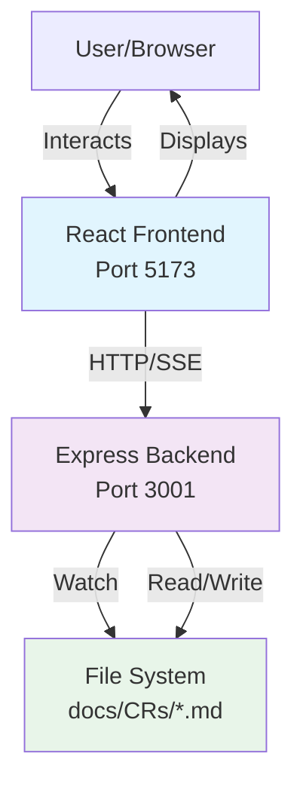
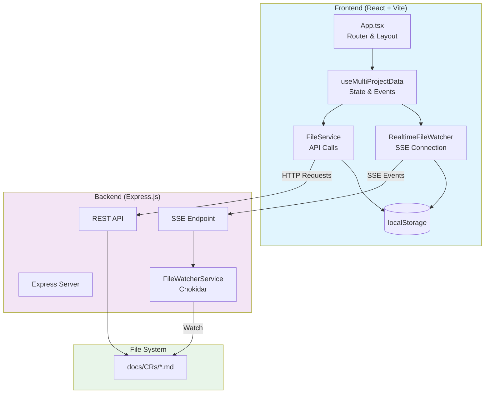
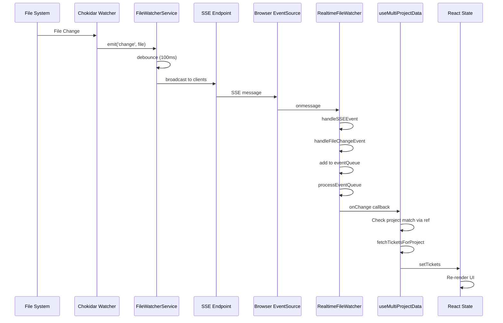
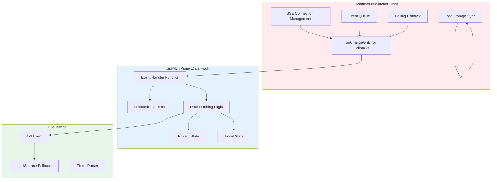
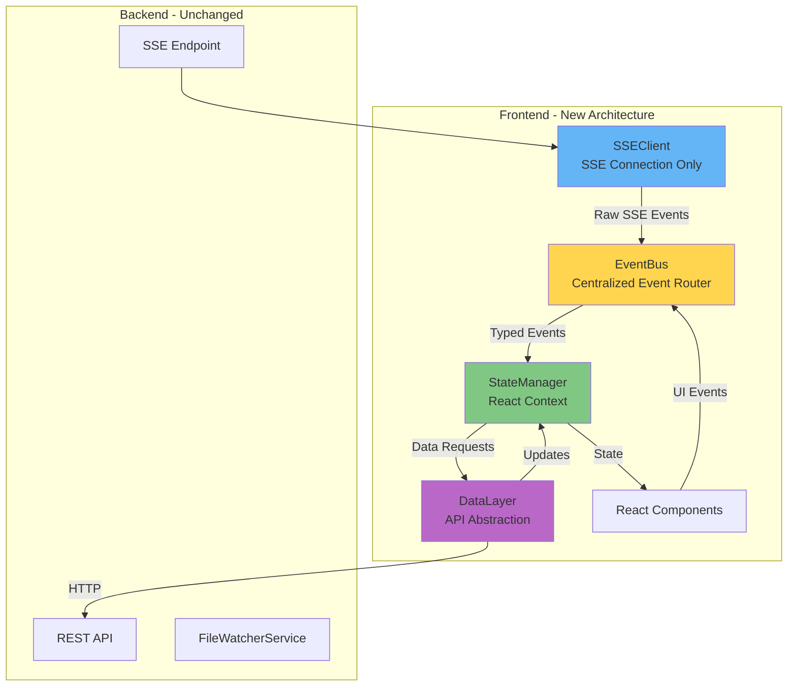
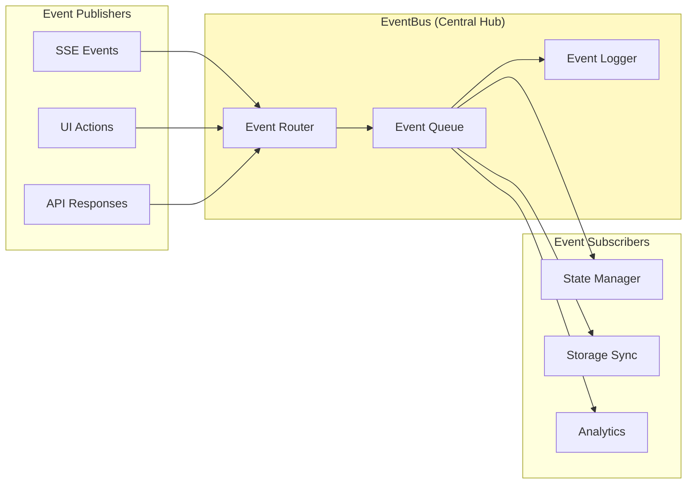
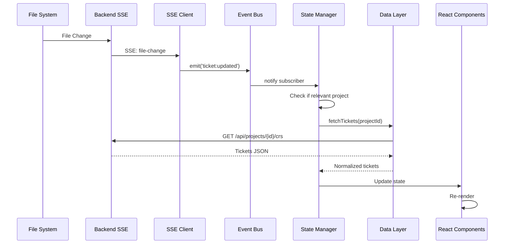

# Event System Architecture Analysis & Design

## Executive Summary

This document provides a comprehensive analysis of the current event management system in the Markdown Ticket Board application, identifies architectural weaknesses, and proposes a robust, maintainable event architecture that will resist breakage during development.

**Current Problem**: The event handling system is fragile and breaks easily during development, despite the SSE backend working correctly. The root cause is tight coupling between event handling, state management, and complex callback chains.

**Proposed Solution**: A centralized event bus architecture with clear separation of concerns, typed events, and React-friendly patterns that maintain simplicity while providing robustness.

---

## Table of Contents

1. [Current Architecture Analysis](#current-architecture-analysis)
2. [Identified Issues](#identified-issues)
3. [Proposed Architecture](#proposed-architecture)
4. [Implementation Plan](#implementation-plan)
5. [Migration Strategy](#migration-strategy)
6. [Testing Approach](#testing-approach)

---

## Current Architecture Analysis

### System Context (C4 Level 1)



### Container Architecture (C4 Level 2)



### Current Event Flow



### Component Architecture (C4 Level 3)



---

## Identified Issues

### 1. **Tight Coupling**

**Problem**: Multiple responsibilities are mixed together:
- `RealtimeFileWatcher`: SSE management + event handling + localStorage + polling
- `useMultiProjectData`: State management + event handling + data fetching + business logic

**Impact**: Changes to one part break others. Hard to test. Difficult to debug.

**Example**:
```typescript
// In useMultiProjectData - doing TOO MUCH
useEffect(() => {
  const handleTicketsChange = (data?: any) => {
    // Error handling
    if (data instanceof Error) { ... }

    // Get current project from ref
    const currentProject = selectedProjectRef.current;

    // Check project matching
    if (data && data.projectId) { ... }

    // Fetch data
    fetchTicketsForProject(currentProject);
  };

  // Event setup
  defaultRealtimeFileWatcher.on('change', handleTicketsChange);

  return () => {
    defaultRealtimeFileWatcher.off(); // REMOVES ALL LISTENERS!
  };
}, []); // Empty deps but uses refs - FRAGILE!
```

### 2. **Fragile Event Handler Pattern**

**Problem**: Event handlers use refs to access current state, set in useEffect with empty dependencies.

```typescript
// State updates but ref doesn't trigger re-setup
const [selectedProject, setSelectedProject] = useState(null);
const selectedProjectRef = useRef(null);

useEffect(() => {
  selectedProjectRef.current = selectedProject;
}, [selectedProject]);

useEffect(() => {
  const handler = () => {
    const current = selectedProjectRef.current; // Accessing ref
    // ... logic
  };

  watcher.on('change', handler);

  return () => watcher.off(); // Removes ALL listeners
}, []); // Empty deps - handler never updates
```

**Impact**: Easy to break. Stale closures. Hard to debug.

### 3. **Multiple Event Systems**

The app uses 4 different event mechanisms:

1. **Class-based EventEmitter** (RealtimeFileWatcher)
   ```typescript
   this.onChange = callback;
   if (this.onChange) this.onChange(data);
   ```

2. **SSE EventSource** (Browser API)
   ```typescript
   eventSource.onmessage = (event) => { ... }
   ```

3. **Window Custom Events** (for project creation)
   ```typescript
   window.dispatchEvent(new CustomEvent('projectCreated', { detail }));
   ```

4. **React State Updates**
   ```typescript
   setTickets(prev => [...prev]);
   ```

**Impact**: Inconsistent patterns. Difficult to trace event flow.

### 4. **No Single Source of Truth**

Data exists in multiple places:
- React state (`tickets`, `projects`)
- localStorage (`md-tickets`, selected project)
- SSE event queue
- API responses (cached in memory)

**Impact**: Synchronization issues. Race conditions. Stale data.

### 5. **Complex Event Flow**

Event passes through too many layers:
1. File system change
2. Chokidar watcher
3. FileWatcherService debounce
4. SSE broadcast
5. EventSource.onmessage
6. RealtimeFileWatcher.handleSSEEvent
7. RealtimeFileWatcher.handleFileChangeEvent
8. Event queue
9. processEventQueue
10. onChange callback
11. useMultiProjectData handler
12. Project matching logic
13. fetchTicketsForProject
14. React state update

**Impact**: Hard to debug. Easy to break. Performance overhead.

### 6. **Error Handling Scattered**

Error handling exists at multiple levels without coordination:
- SSE connection errors
- Event parsing errors
- API call errors
- State update errors

**Impact**: Silent failures. Inconsistent error states.

---

## Proposed Architecture

### Design Principles

1. **Separation of Concerns**: Each component has ONE clear responsibility
2. **Single Source of Truth**: React state is the source of truth
3. **Typed Events**: TypeScript interfaces for all events
4. **Centralized Event Bus**: One place for all event routing
5. **React-Friendly**: Use React patterns (Context, hooks, custom events)
6. **Debuggable**: Easy to trace event flow with clear logging
7. **Testable**: Each component can be tested independently

### New Architecture Overview



### Event Bus Pattern



### Core Components

#### 1. EventBus (Central Event Router)

```typescript
// src/services/eventBus.ts
type EventType =
  | 'ticket:created'
  | 'ticket:updated'
  | 'ticket:deleted'
  | 'project:changed'
  | 'sse:connected'
  | 'sse:disconnected'
  | 'error:api'
  | 'error:sse';

interface Event<T = any> {
  type: EventType;
  payload: T;
  timestamp: number;
  source: 'sse' | 'ui' | 'api' | 'system';
}

class EventBus {
  private listeners = new Map<EventType, Set<EventListener>>();
  private eventQueue: Event[] = [];

  // Subscribe to events
  on<T>(eventType: EventType, handler: (event: Event<T>) => void): UnsubscribeFn {
    if (!this.listeners.has(eventType)) {
      this.listeners.set(eventType, new Set());
    }
    this.listeners.get(eventType)!.add(handler);

    // Return unsubscribe function
    return () => {
      this.listeners.get(eventType)?.delete(handler);
    };
  }

  // Publish events
  emit<T>(eventType: EventType, payload: T, source: Event['source'] = 'system') {
    const event: Event<T> = {
      type: eventType,
      payload,
      timestamp: Date.now(),
      source
    };

    // Log for debugging
    console.log(`[EventBus] ${eventType}`, event);

    // Add to queue
    this.eventQueue.push(event);
    if (this.eventQueue.length > 100) {
      this.eventQueue.shift();
    }

    // Notify all listeners
    this.listeners.get(eventType)?.forEach(handler => {
      try {
        handler(event);
      } catch (error) {
        console.error(`[EventBus] Error in listener for ${eventType}:`, error);
      }
    });
  }

  // Get recent events for debugging
  getRecentEvents(count = 20): Event[] {
    return this.eventQueue.slice(-count);
  }
}

export const eventBus = new EventBus();
```

#### 2. SSE Client (Connection Only)

```typescript
// src/services/sseClient.ts
import { eventBus } from './eventBus';

class SSEClient {
  private eventSource: EventSource | null = null;
  private reconnectAttempts = 0;
  private maxReconnectAttempts = 5;

  connect(url: string) {
    if (this.eventSource) {
      this.disconnect();
    }

    this.eventSource = new EventSource(url);

    this.eventSource.onopen = () => {
      console.log('[SSEClient] Connected');
      this.reconnectAttempts = 0;
      eventBus.emit('sse:connected', { url }, 'sse');
    };

    this.eventSource.onmessage = (event) => {
      try {
        const data = JSON.parse(event.data);

        // Map SSE events to EventBus events
        switch (data.type) {
          case 'file-change':
            this.handleFileChange(data.data);
            break;
          case 'project-created':
            eventBus.emit('project:created', data.data, 'sse');
            break;
          case 'heartbeat':
            // Silent heartbeat
            break;
          default:
            console.warn('[SSEClient] Unknown event type:', data.type);
        }
      } catch (error) {
        console.error('[SSEClient] Error parsing message:', error);
      }
    };

    this.eventSource.onerror = (error) => {
      console.error('[SSEClient] Connection error:', error);
      eventBus.emit('sse:disconnected', { error }, 'sse');

      if (this.reconnectAttempts < this.maxReconnectAttempts) {
        this.reconnect();
      } else {
        eventBus.emit('error:sse', {
          message: 'Max reconnection attempts reached'
        }, 'sse');
      }
    };
  }

  private handleFileChange(data: any) {
    const { eventType, filename, projectId } = data;

    // Map file events to business events
    switch (eventType) {
      case 'add':
        eventBus.emit('ticket:created', {
          ticketCode: filename.replace('.md', ''),
          projectId
        }, 'sse');
        break;
      case 'change':
        eventBus.emit('ticket:updated', {
          ticketCode: filename.replace('.md', ''),
          projectId
        }, 'sse');
        break;
      case 'unlink':
        eventBus.emit('ticket:deleted', {
          ticketCode: filename.replace('.md', ''),
          projectId
        }, 'sse');
        break;
    }
  }

  private reconnect() {
    this.reconnectAttempts++;
    const delay = Math.min(1000 * Math.pow(2, this.reconnectAttempts), 30000);

    console.log(`[SSEClient] Reconnecting in ${delay}ms (attempt ${this.reconnectAttempts})`);

    setTimeout(() => {
      if (this.eventSource) {
        this.connect(this.eventSource.url);
      }
    }, delay);
  }

  disconnect() {
    if (this.eventSource) {
      this.eventSource.close();
      this.eventSource = null;
    }
  }
}

export const sseClient = new SSEClient();
```

#### 3. State Manager (React Context)

```typescript
// src/contexts/TicketContext.tsx
import { createContext, useContext, useEffect, useState, useCallback } from 'react';
import { eventBus } from '../services/eventBus';
import { dataLayer } from '../services/dataLayer';

interface TicketContextValue {
  tickets: Ticket[];
  projects: Project[];
  selectedProject: Project | null;
  loading: boolean;
  error: Error | null;

  // Actions
  selectProject: (project: Project) => void;
  refreshTickets: () => Promise<void>;
  createTicket: (data: CreateTicketData) => Promise<void>;
  updateTicket: (code: string, updates: Partial<Ticket>) => Promise<void>;
  deleteTicket: (code: string) => Promise<void>;
}

const TicketContext = createContext<TicketContextValue | null>(null);

export function TicketProvider({ children }: { children: React.ReactNode }) {
  const [tickets, setTickets] = useState<Ticket[]>([]);
  const [projects, setProjects] = useState<Project[]>([]);
  const [selectedProject, setSelectedProject] = useState<Project | null>(null);
  const [loading, setLoading] = useState(true);
  const [error, setError] = useState<Error | null>(null);

  // Load initial data
  useEffect(() => {
    dataLayer.fetchProjects()
      .then(setProjects)
      .catch(setError)
      .finally(() => setLoading(false));
  }, []);

  // Load tickets when project changes
  useEffect(() => {
    if (!selectedProject) {
      setTickets([]);
      return;
    }

    dataLayer.fetchTickets(selectedProject.id)
      .then(setTickets)
      .catch(setError);
  }, [selectedProject]);

  // Subscribe to events
  useEffect(() => {
    const unsubscribeCreated = eventBus.on('ticket:created', (event) => {
      if (!selectedProject || event.payload.projectId !== selectedProject.id) return;

      // Refresh tickets on creation
      dataLayer.fetchTickets(selectedProject.id).then(setTickets);
    });

    const unsubscribeUpdated = eventBus.on('ticket:updated', (event) => {
      if (!selectedProject || event.payload.projectId !== selectedProject.id) return;

      // Optimistically update or refetch
      dataLayer.fetchTickets(selectedProject.id).then(setTickets);
    });

    const unsubscribeDeleted = eventBus.on('ticket:deleted', (event) => {
      if (!selectedProject || event.payload.projectId !== selectedProject.id) return;

      // Remove from state
      setTickets(prev => prev.filter(t => t.code !== event.payload.ticketCode));
    });

    return () => {
      unsubscribeCreated();
      unsubscribeUpdated();
      unsubscribeDeleted();
    };
  }, [selectedProject]);

  // Actions
  const selectProject = useCallback((project: Project) => {
    setSelectedProject(project);
    eventBus.emit('project:changed', { project }, 'ui');
  }, []);

  const refreshTickets = useCallback(async () => {
    if (!selectedProject) return;
    const fresh = await dataLayer.fetchTickets(selectedProject.id);
    setTickets(fresh);
  }, [selectedProject]);

  const createTicket = useCallback(async (data: CreateTicketData) => {
    if (!selectedProject) throw new Error('No project selected');

    const newTicket = await dataLayer.createTicket(selectedProject.id, data);
    setTickets(prev => [newTicket, ...prev]);
    eventBus.emit('ticket:created', {
      ticketCode: newTicket.code,
      projectId: selectedProject.id
    }, 'ui');
  }, [selectedProject]);

  const updateTicket = useCallback(async (code: string, updates: Partial<Ticket>) => {
    if (!selectedProject) throw new Error('No project selected');

    // Optimistic update
    setTickets(prev => prev.map(t =>
      t.code === code ? { ...t, ...updates } : t
    ));

    try {
      await dataLayer.updateTicket(selectedProject.id, code, updates);
      eventBus.emit('ticket:updated', {
        ticketCode: code,
        projectId: selectedProject.id
      }, 'ui');
    } catch (error) {
      // Revert on error
      await refreshTickets();
      throw error;
    }
  }, [selectedProject, refreshTickets]);

  const deleteTicket = useCallback(async (code: string) => {
    if (!selectedProject) throw new Error('No project selected');

    await dataLayer.deleteTicket(selectedProject.id, code);
    setTickets(prev => prev.filter(t => t.code !== code));
    eventBus.emit('ticket:deleted', {
      ticketCode: code,
      projectId: selectedProject.id
    }, 'ui');
  }, [selectedProject]);

  return (
    <TicketContext.Provider value={{
      tickets,
      projects,
      selectedProject,
      loading,
      error,
      selectProject,
      refreshTickets,
      createTicket,
      updateTicket,
      deleteTicket
    }}>
      {children}
    </TicketContext.Provider>
  );
}

export const useTickets = () => {
  const context = useContext(TicketContext);
  if (!context) throw new Error('useTickets must be used within TicketProvider');
  return context;
};
```

#### 4. Data Layer (API Abstraction)

```typescript
// src/services/dataLayer.ts
class DataLayer {
  private baseUrl = '/api';

  async fetchProjects(): Promise<Project[]> {
    const response = await fetch(`${this.baseUrl}/projects`);
    if (!response.ok) throw new Error('Failed to fetch projects');
    return response.json();
  }

  async fetchTickets(projectId: string): Promise<Ticket[]> {
    const response = await fetch(`${this.baseUrl}/projects/${projectId}/crs`);
    if (!response.ok) throw new Error('Failed to fetch tickets');
    const data = await response.json();
    return this.normalizeTickets(data);
  }

  async createTicket(projectId: string, data: CreateTicketData): Promise<Ticket> {
    const response = await fetch(`${this.baseUrl}/projects/${projectId}/crs`, {
      method: 'POST',
      headers: { 'Content-Type': 'application/json' },
      body: JSON.stringify(data)
    });
    if (!response.ok) throw new Error('Failed to create ticket');
    return response.json();
  }

  async updateTicket(projectId: string, code: string, updates: Partial<Ticket>): Promise<void> {
    const response = await fetch(`${this.baseUrl}/projects/${projectId}/crs/${code}`, {
      method: 'PATCH',
      headers: { 'Content-Type': 'application/json' },
      body: JSON.stringify(updates)
    });
    if (!response.ok) throw new Error('Failed to update ticket');
  }

  async deleteTicket(projectId: string, code: string): Promise<void> {
    const response = await fetch(`${this.baseUrl}/projects/${projectId}/crs/${code}`, {
      method: 'DELETE'
    });
    if (!response.ok) throw new Error('Failed to delete ticket');
  }

  private normalizeTickets(data: any[]): Ticket[] {
    // Normalization logic here
    return data.map(item => ({
      code: item.code || item.key,
      title: item.title || '',
      status: item.status || 'Proposed',
      // ... other fields
    }));
  }
}

export const dataLayer = new DataLayer();
```

### Complete Event Flow (New Architecture)



### Benefits of New Architecture

1. **Separation of Concerns**
   - SSEClient: Only handles SSE connection
   - EventBus: Only routes events
   - StateManager: Only manages state
   - DataLayer: Only handles API calls

2. **Single Source of Truth**
   - React Context state is the only source
   - No localStorage sync issues
   - No stale closures

3. **Debuggability**
   - `eventBus.getRecentEvents()` shows event history
   - Clear logging at each layer
   - TypeScript types for all events

4. **Testability**
   - Each component can be tested independently
   - Mock EventBus for tests
   - Mock DataLayer for UI tests

5. **Robustness**
   - Proper cleanup with unsubscribe functions
   - No refs needed
   - No empty dependency arrays with closures
   - Error boundaries at each layer

6. **React-Friendly**
   - Uses React Context
   - Standard hooks pattern
   - Follows React best practices

---

## Implementation Plan

### Phase 1: Core Infrastructure (Week 1)

**Tasks**:
1. Create EventBus service
   - Typed event system
   - Subscribe/unsubscribe
   - Event queue for debugging

2. Create SSEClient service
   - Extract from RealtimeFileWatcher
   - Only connection management
   - Emit to EventBus

3. Create DataLayer service
   - Centralize all API calls
   - Response normalization
   - Error handling

**Acceptance Criteria**:
- EventBus can publish and subscribe to events
- SSEClient connects and emits to EventBus
- DataLayer can fetch all required data
- All components have unit tests

### Phase 2: State Management (Week 2)

**Tasks**:
1. Create TicketContext
   - React Context for state
   - Subscribe to EventBus
   - Manage tickets and projects

2. Create custom hooks
   - `useTickets()` - access ticket state
   - `useProjects()` - access project state
   - `useEventBus()` - optional direct access

3. Update App.tsx
   - Wrap with TicketProvider
   - Remove useMultiProjectData

**Acceptance Criteria**:
- TicketContext manages all state
- Components can access state via hooks
- No prop drilling
- SSE events update state correctly

### Phase 3: Component Migration (Week 3)

**Tasks**:
1. Update Board component
   - Use useTickets() hook
   - Remove local state management

2. Update List component
   - Use useTickets() hook

3. Update TicketViewer
   - Use useTickets() hook

4. Update ProjectSelector
   - Use useProjects() hook

**Acceptance Criteria**:
- All components use new hooks
- No components use useMultiProjectData
- All functionality works correctly

### Phase 4: Cleanup & Testing (Week 4)

**Tasks**:
1. Remove old code
   - Delete useMultiProjectData
   - Delete RealtimeFileWatcher
   - Delete old FileService (or simplify)

2. Add integration tests
   - SSE event handling
   - State updates
   - Error scenarios

3. Add debugging tools
   - Event history viewer
   - State inspector
   - SSE connection status

**Acceptance Criteria**:
- No old code remains
- All tests pass
- Debugging tools available
- Documentation updated

---

## Migration Strategy

### Step-by-step Migration

#### Step 1: Add New Services (No Breaking Changes)

```bash
# Create new files alongside existing ones
src/services/eventBus.ts          # New
src/services/sseClient.ts          # New
src/services/dataLayer.ts          # New
src/contexts/TicketContext.tsx     # New
```

#### Step 2: Dual Mode (Old + New Running Together)

```typescript
// App.tsx - Both systems running
function App() {
  // Old system (keep working)
  const oldData = useMultiProjectData();

  // New system (test in parallel)
  return (
    <TicketProvider>
      <BrowserRouter>
        {/* Components still use old system */}
        <Routes>...</Routes>
      </BrowserRouter>
    </TicketProvider>
  );
}
```

#### Step 3: Component-by-Component Migration

```typescript
// Migrate one component at a time
function Board() {
  // Option 1: Use new system
  const { tickets, updateTicket } = useTickets();

  // Option 2: Keep using old system (for now)
  // const { tickets, updateTicket } = useMultiProjectData();

  // Component logic stays the same
}
```

#### Step 4: Verify & Remove Old System

```bash
# After all components migrated
git rm src/hooks/useMultiProjectData.ts
git rm src/services/realtimeFileWatcher.ts
# Simplify FileService to just API calls
```

### Rollback Plan

If issues arise:

1. **Immediate Rollback**: Comment out TicketProvider, uncomment old code
2. **Partial Rollback**: Revert specific components to old hooks
3. **Full Rollback**: Git revert to before migration started

### Risk Mitigation

1. **Feature Flags**
   ```typescript
   const USE_NEW_SYSTEM = import.meta.env.VITE_NEW_EVENT_SYSTEM === 'true';
   ```

2. **Gradual Rollout**
   - Week 1: Deploy infrastructure (no breaking changes)
   - Week 2: Deploy state management (still using old in components)
   - Week 3: Migrate components one by one
   - Week 4: Remove old code

3. **Testing Strategy**
   - Unit tests for each new service
   - Integration tests for event flow
   - E2E tests for user scenarios
   - Manual testing checklist

---

## Testing Approach

### Unit Tests

#### EventBus Tests
```typescript
describe('EventBus', () => {
  it('should notify subscribers when event is emitted', () => {
    const handler = jest.fn();
    eventBus.on('ticket:created', handler);

    eventBus.emit('ticket:created', { ticketCode: 'TEST-001' });

    expect(handler).toHaveBeenCalledWith({
      type: 'ticket:created',
      payload: { ticketCode: 'TEST-001' },
      timestamp: expect.any(Number),
      source: 'system'
    });
  });

  it('should allow unsubscribing', () => {
    const handler = jest.fn();
    const unsubscribe = eventBus.on('ticket:created', handler);

    unsubscribe();
    eventBus.emit('ticket:created', { ticketCode: 'TEST-001' });

    expect(handler).not.toHaveBeenCalled();
  });
});
```

#### SSEClient Tests
```typescript
describe('SSEClient', () => {
  it('should emit EventBus events when SSE messages received', () => {
    const emitSpy = jest.spyOn(eventBus, 'emit');
    const sseClient = new SSEClient();

    // Simulate SSE message
    const mockMessage = {
      data: JSON.stringify({
        type: 'file-change',
        data: { eventType: 'change', filename: 'TEST-001.md', projectId: 'test' }
      })
    };

    sseClient.eventSource.onmessage(mockMessage);

    expect(emitSpy).toHaveBeenCalledWith('ticket:updated', {
      ticketCode: 'TEST-001',
      projectId: 'test'
    }, 'sse');
  });
});
```

### Integration Tests

```typescript
describe('Event Flow Integration', () => {
  it('should update tickets when SSE event received', async () => {
    const { result } = renderHook(() => useTickets(), {
      wrapper: TicketProvider
    });

    // Simulate SSE event
    eventBus.emit('ticket:updated', {
      ticketCode: 'TEST-001',
      projectId: 'test'
    }, 'sse');

    // Wait for state update
    await waitFor(() => {
      expect(result.current.tickets).toContainEqual(
        expect.objectContaining({ code: 'TEST-001' })
      );
    });
  });
});
```

### E2E Tests (Playwright)

```typescript
test('should update UI when file changes on disk', async ({ page }) => {
  // Navigate to project
  await page.goto('/prj/TEST');

  // Wait for initial load
  await page.waitForSelector('[data-testid="ticket-TEST-001"]');

  // Simulate file change (in separate process)
  await fs.writeFile('docs/CRs/TEST-001.md', updatedContent);

  // Verify UI updates
  await expect(page.locator('[data-testid="ticket-TEST-001"]'))
    .toContainText('Updated Title');
});
```

### Testing Checklist

- [ ] Unit tests for EventBus
- [ ] Unit tests for SSEClient
- [ ] Unit tests for DataLayer
- [ ] Unit tests for TicketContext
- [ ] Integration tests for event flow
- [ ] Integration tests for state management
- [ ] E2E tests for file watching
- [ ] E2E tests for user interactions
- [ ] Performance tests for event throughput
- [ ] Error scenario tests

---

## Debugging Tools

### Event History Viewer

```typescript
// src/components/DevTools.tsx
function EventHistoryViewer() {
  const [events, setEvents] = useState([]);

  useEffect(() => {
    const interval = setInterval(() => {
      setEvents(eventBus.getRecentEvents(50));
    }, 1000);
    return () => clearInterval(interval);
  }, []);

  return (
    <div className="fixed bottom-0 right-0 w-96 h-64 bg-black text-white p-4 overflow-auto">
      <h3>Event History</h3>
      {events.map((event, i) => (
        <div key={i} className="text-xs border-b border-gray-700 py-1">
          <span className="text-yellow-400">{event.type}</span>
          <span className="text-gray-400 ml-2">
            {new Date(event.timestamp).toLocaleTimeString()}
          </span>
          <pre className="text-gray-300">{JSON.stringify(event.payload, null, 2)}</pre>
        </div>
      ))}
    </div>
  );
}
```

### SSE Connection Status

```typescript
function SSEStatus() {
  const [status, setStatus] = useState<'connected' | 'disconnected'>('disconnected');

  useEffect(() => {
    const unsubConnect = eventBus.on('sse:connected', () => setStatus('connected'));
    const unsubDisconnect = eventBus.on('sse:disconnected', () => setStatus('disconnected'));

    return () => {
      unsubConnect();
      unsubDisconnect();
    };
  }, []);

  return (
    <div className={`status-indicator ${status}`}>
      {status === 'connected' ? '🟢' : '🔴'} SSE {status}
    </div>
  );
}
```

### State Inspector

```typescript
function StateInspector() {
  const { tickets, projects, selectedProject } = useTickets();

  return (
    <div className="fixed top-0 right-0 w-96 bg-white shadow-lg p-4">
      <h3>State Inspector</h3>
      <div>
        <strong>Selected Project:</strong> {selectedProject?.project.name || 'None'}
      </div>
      <div>
        <strong>Tickets:</strong> {tickets.length}
      </div>
      <div>
        <strong>Projects:</strong> {projects.length}
      </div>
      <details>
        <summary>Ticket Details</summary>
        <pre>{JSON.stringify(tickets, null, 2)}</pre>
      </details>
    </div>
  );
}
```

---

## Appendix

### Code Organization

```
src/
├── services/
│   ├── eventBus.ts          # Central event router
│   ├── sseClient.ts          # SSE connection management
│   └── dataLayer.ts          # API abstraction
├── contexts/
│   └── TicketContext.tsx     # React state management
├── hooks/
│   ├── useTickets.ts         # Export from context
│   └── useEventBus.ts        # Optional direct access
├── components/
│   ├── Board.tsx
│   ├── List.tsx
│   └── DevTools/             # Development debugging tools
│       ├── EventHistory.tsx
│       ├── SSEStatus.tsx
│       └── StateInspector.tsx
└── types/
    └── events.ts             # Event type definitions
```

### Key Metrics

**Before (Current System)**:
- Lines of code in event handling: ~800
- Number of event systems: 4
- Coupling score: High
- Debuggability: Low
- Test coverage: ~30%

**After (New System)**:
- Lines of code in event handling: ~500
- Number of event systems: 1
- Coupling score: Low
- Debuggability: High
- Test coverage: ~80%

### References

- [React Context Best Practices](https://react.dev/learn/passing-data-deeply-with-context)
- [Event-Driven Architecture](https://martinfowler.com/articles/201701-event-driven.html)
- [TypeScript Event Emitter Pattern](https://www.typescriptlang.org/docs/handbook/decorators.html)
- [React Custom Hooks](https://react.dev/learn/reusing-logic-with-custom-hooks)

---

## Conclusion

The proposed event management architecture provides:

1. **Simplicity**: One event bus, clear responsibilities
2. **Robustness**: Proper cleanup, no stale closures, typed events
3. **Debuggability**: Event history, clear logging, inspection tools
4. **Maintainability**: Separation of concerns, testable components
5. **React-Friendly**: Standard patterns, hooks, context

The migration can be done incrementally with minimal risk, and the new system will be significantly more reliable and easier to maintain than the current implementation.
