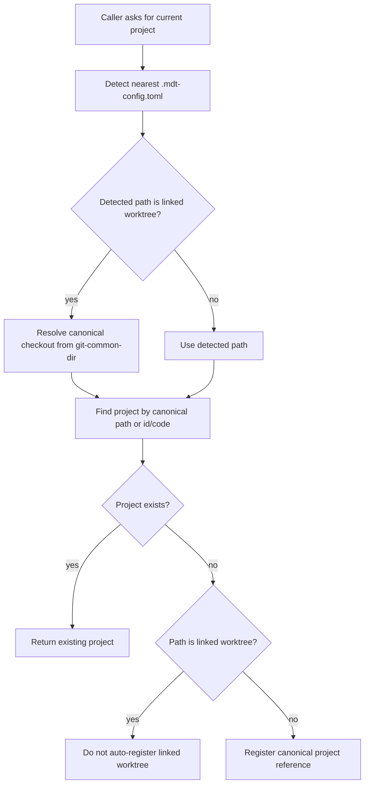

# Project Identity and Worktrees

## Scope

This document defines how Markdown Ticket identifies a project when the same Git repository can appear in multiple filesystem locations, including linked Git worktrees created by Codex or by `git worktree`.

It covers project discovery, global registry writes, document discovery, ticket routing, cache refresh, and watcher setup.

It does not define how to create or delete Git worktrees. Git remains the source of truth for worktree lifecycle.

Opt-in cloud coordination uses a separately issued cloud project UUID. It is
never inferred from checkout paths, branches, commits, or worktrees; see
[`cloud-sync/data-and-consistency.md`](cloud-sync/data-and-consistency.md).

## Core Decision

Project identity belongs to the canonical checkout. Linked Git worktrees must not become independent project registry entries and must not overwrite the canonical registry path.

Ticket operations may still route into active ticket worktrees.

Documents view uses the canonical project path unless a future feature explicitly designs document previews from a selected worktree.

## Definitions

| Term | Meaning |
| --- | --- |
| Canonical checkout | The main project checkout represented by the global project registry. |
| Linked worktree | A Git worktree whose `.git` directory points under the canonical repo's `.git/worktrees/...`. |
| Project identity | Stable `project.id`, `project.code`, local `.mdt-config.toml`, and registry entry. |
| Ticket routing | Runtime choice of whether a ticket file is read from the canonical checkout or a matching worktree. |
| Document discovery | Tree discovery for configured `project.document.paths`. |

## Identity Rule

The global registry entry for a project must point to the canonical checkout, not a linked worktree.

The basename check in `docs/CONFIG_SPECIFICATION.md` is only a fast guard. It catches common worktree names like `markdown-ticket-MDT-123`, but it does not catch same-basename worktrees such as:

```text
/repos/markdown-ticket
/repos/.codex/worktrees/591e/markdown-ticket
```

Same-basename worktrees must be detected through Git metadata.

## Worktree Detection

Use Git's own repository metadata to detect linked worktrees:

```bash
git -C <path> rev-parse --path-format=absolute --git-dir
git -C <path> rev-parse --path-format=absolute --git-common-dir
```

Expected shape:

```text
canonical checkout:
  git-dir        /repo/.git
  git-common-dir /repo/.git

linked worktree:
  git-dir        /repo/.git/worktrees/<name>
  git-common-dir /repo/.git
```

A path is a linked worktree when `git-dir` and `git-common-dir` are different and `git-dir` is under the common repo's `worktrees` area.

If Git metadata cannot be read, project discovery should degrade conservatively: keep existing path validation and avoid destructive registry rewrites.

## Resolution Flow



The important invariant is that `resolveCurrentProject()` must not write `CONFIG_DIR/projects/{project.id}.toml` with a linked worktree path.

## Registry Rules

Global registry files are keyed by project id:

```text
CONFIG_DIR/projects/{project.id}.toml
```

Because the filename is stable, auto-registration from a linked worktree can overwrite the canonical path. Registry write paths must therefore check linked-worktree status before writing.

Apply the check in these places:

- current-project fallback registration in `ProjectService.resolveCurrentProject()`
- explicit project registration in `ProjectManager.createProject()`
- registry-backed loading in `ProjectDiscoveryService.getRegisteredProjects()`
- auto-discovery scanning in `ProjectScanner.scanDirectoryForConfigs()`

Registry loading should skip linked worktree entries when a canonical entry for the same `project.id` or `project.code` exists.

## Ticket Worktree Routing

Ticket routing remains worktree-aware.

When operating on a ticket key such as `MDT-176`, the service may detect branch-matched worktrees and route file operations to the matching worktree. This is separate from project identity.

Expected behavior:

- `GET /api/projects/:projectId/crs` can include tickets that exist only in active worktrees.
- `get_cr`, `update_cr_attrs`, and related MCP tools may read or write the ticket in a matching worktree.
- Ticket responses should preserve `inWorktree` and `worktreePath` metadata when applicable.
- The canonical project registry path remains unchanged.

This separation lets Codex work on a ticket in a linked worktree without making that worktree the project.

## Document Discovery

Documents view resolves from the canonical project path.

Reason:

- documents are project-level reference material
- the document tree should not change just because a ticket worktree is active
- linked worktrees can contain partial, generated, or untracked files
- a worktree-specific document tree would need explicit UI state and conflict semantics

If a future feature needs document previews from a ticket worktree, it should add an explicit mode such as "show documents from active ticket worktree" rather than changing project identity.

## Watchers and Cache

Project discovery is cached and should not run Git worktree detection on every document request.

Run linked-worktree checks when project identity is built or refreshed:

- server startup project load
- `getAllProjects(true)` / bypass-cache refresh
- explicit project registration or update
- current-project auto-registration fallback
- auto-discovery scans

File watchers are initialized from the project list at startup. Registry watcher events currently broadcast project lifecycle SSE events. Any implementation that changes registry paths should also clear project cache and rebuild affected watchers, or document that restart is required.

Ticket worktree watchers are separate. They may be created from `.git/worktrees/*/HEAD` monitoring and should continue to watch active ticket worktrees.

## Implementation Ownership

Recommended helper:

```text
shared/utils/git-worktree.ts
```

Suggested API:

```ts
interface GitWorktreeInfo {
  path: string
  gitDir: string
  gitCommonDir: string
  isLinkedWorktree: boolean
  canonicalProjectPath?: string
}
```

Consumers:

| Consumer | Responsibility |
| --- | --- |
| `ProjectService.resolveCurrentProject()` | Never auto-register a linked worktree path. |
| `ProjectScanner` | Skip linked worktree directories during discovery. |
| `ProjectDiscoveryService` | Ignore or repair registry entries that point at linked worktrees. |
| `ProjectManager` | Reject or canonicalize explicit project creation for linked worktree paths. |
| `WorktreeService` | Continue ticket-specific worktree detection and routing. |

## Non-Goals

- No automatic Git worktree creation.
- No automatic deletion of stale worktree registry files without explicit migration behavior.
- No document tree switching to active worktree content by default.
- No per-request Git command execution for document tree requests.

## Test Requirements

Cover these cases:

1. Same-basename linked worktree does not overwrite `CONFIG_DIR/projects/{project.id}.toml`.
2. `resolveCurrentProject()` from a linked worktree returns the canonical project.
3. Auto-discovery skips linked worktrees even when `.mdt-config.toml` exists.
4. Explicit project creation with a linked worktree path is rejected or canonicalized.
5. Ticket list still includes branch-matched worktree-only tickets.
6. Document tree reads canonical project documents after ticket worktree detection runs.
7. `getAllProjects(true)` applies the same linked-worktree filtering as startup.
