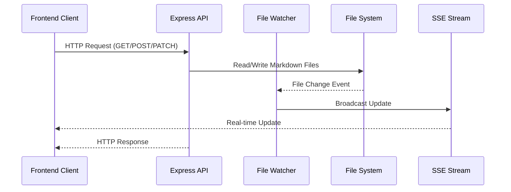

# Backend Architecture

The Markdown Ticket Board backend is built with Express.js and provides a robust foundation for file-based ticket management with real-time synchronization capabilities.

## Project Structure

```
server/
├── server.js                 # Main application server
├── package.json              # Dependencies and scripts
├── fileWatcherService.js     # File system monitoring
├── projectDiscovery.js       # Project detection service
├── mcpCounterIntegration.js  # MCP counter integration
├── createSampleTickets.js    # Sample data generation
├── config/                   # Configuration management
│   ├── permissions.js        # File permissions handling
│   └── configManager.js      # Configuration utilities
├── mcp-dev-tools/           # MCP development utilities
│   ├── src/
│   │   ├── index.ts         # MCP dev server entry point
│   │   └── tools/           # Development tools
│   └── package.json         # MCP dev tools dependencies
├── routes/                  # API route handlers
│   └── counter.js          # Counter API routes
└── sample-tasks/           # Sample ticket files
    ├── CR-A001.md
    ├── CR-A002.md
    └── ...
```

## Data Flow

The backend follows a file-system-first approach where markdown files serve as the primary data store:



### Key Data Flow Patterns:

1. **Read Operations**: API reads markdown files directly from filesystem
2. **Write Operations**: API writes to filesystem, triggering file watcher events
3. **Real-time Updates**: File watcher broadcasts changes via Server-Sent Events
4. **Project Discovery**: Automatic scanning for `.mdt-config.toml` files

## Core Components

### 1. Main Server (`server.js`)

The central Express.js application that orchestrates all backend functionality:

```javascript
// Key responsibilities:
- REST API endpoint handling
- CORS configuration for frontend communication
- Static file serving
- SSE connection management
- Project discovery integration
- File watcher service initialization
```

**Key Features:**
- **Port Configuration**: Runs on port 3001 (configurable via PORT env var)
- **CORS Support**: Enables cross-origin requests from frontend
- **JSON Middleware**: Handles JSON request/response parsing
- **Error Handling**: Centralized error handling with proper HTTP status codes

### 2. File Watcher Service (`fileWatcherService.js`)

Monitors filesystem changes and provides real-time updates:

```javascript
class FileWatcherService {
  // Monitors markdown files for changes
  // Broadcasts updates via Server-Sent Events
  // Handles file creation, modification, and deletion
  // Manages SSE client connections
}
```

**Key Features:**
- **Chokidar Integration**: Uses chokidar for robust file system monitoring
- **SSE Broadcasting**: Real-time updates to connected clients
- **Event Filtering**: Only monitors relevant file types (.md, .toml)
- **Connection Management**: Handles client connect/disconnect gracefully

### 3. Project Discovery Service (`projectDiscovery.js`)

Automatically detects and configures projects:

```javascript
class ProjectDiscoveryService {
  // Scans for .mdt-config.toml files
  // Manages global project registry
  // Handles project configuration validation
  // Provides project metadata management
}
```

**Key Features:**
- **Automatic Scanning**: Recursively searches for project configurations
- **Registry Management**: Maintains global project registry in user config
- **Configuration Validation**: Ensures project configs are valid
- **Metadata Tracking**: Tracks access times and registration dates

### 4. Configuration Management (`config/`)

Handles application and project configuration:

**`configManager.js`**:
- TOML configuration file parsing
- Default configuration generation
- Configuration validation and merging
- User-specific configuration handling

**`permissions.js`**:
- File system permission management
- Directory creation with proper permissions
- Cross-platform compatibility handling

### 5. MCP Development Tools (`mcp-dev-tools/`)

Development utilities for MCP integration:

```typescript
// TypeScript-based MCP development server
// Provides logging and debugging capabilities
// Integrates with main application for development workflows
// Offers real-time log streaming for frontend development
```

**Key Components:**
- **Frontend Session Management**: Tracks frontend logging sessions
- **Stream URL Generation**: Provides SSE endpoints for log streaming
- **Health Checking**: Monitors MCP server health and connectivity

## API Endpoints

### Project Management
- `GET /api/projects` - List all discovered projects
- `POST /api/projects` - Create new project
- `PUT /api/projects/:id` - Update project configuration
- `DELETE /api/projects/:id` - Remove project from registry

### Ticket Management
- `GET /api/projects/:projectId/tickets` - Get all tickets for project
- `POST /api/projects/:projectId/tickets` - Create new ticket
- `PATCH /api/projects/:projectId/tickets/:ticketId` - Update ticket
- `DELETE /api/projects/:projectId/tickets/:ticketId` - Delete ticket

### Real-time Updates
- `GET /api/events` - Server-Sent Events stream for real-time updates
- `GET /api/health` - Health check endpoint

### Configuration
- `GET /api/config` - Get application configuration
- `POST /api/config/refresh` - Refresh project discovery
- `DELETE /api/config/cache` - Clear configuration cache

## Storage Architecture

### File System Structure
```
~/.config/markdown-ticket/          # Global configuration
├── config.toml                     # Application settings
├── projects/                       # Project registry
│   ├── project1.toml              # Project registration
│   └── project2.toml
└── user.toml                       # User preferences

/path/to/project/                   # Individual project
├── .mdt-config.toml               # Project configuration
├── .mdt-next                      # Counter file
└── docs/CRs/                      # Ticket directory
    ├── MDT-001-feature.md
    ├── MDT-002-bugfix.md
    └── ...
```

### Ticket File Format
```yaml
---
code: MDT-001
title: Example Feature
status: Proposed
type: Feature Enhancement
priority: Medium
dateCreated: 2025-10-02T09:20:02.492Z
lastModified: 2025-10-02T09:20:02.492Z
phaseEpic: Phase A
assignee: developer@example.com
---

# Description
Detailed description of the feature...

# Implementation
Technical implementation details...
```

## Performance Considerations

### File System Optimization
- **Efficient File Watching**: Uses chokidar's optimized watching algorithms
- **Selective Monitoring**: Only watches relevant file extensions
- **Debounced Updates**: Prevents excessive update events during bulk operations

### Memory Management
- **Stream Management**: Properly closes SSE connections to prevent memory leaks
- **File Handle Management**: Ensures proper cleanup of file system resources
- **Configuration Caching**: Caches frequently accessed configuration data

### Scalability Features
- **Concurrent Request Handling**: Express.js handles multiple simultaneous requests
- **Asynchronous Operations**: All file operations use async/await patterns
- **Error Isolation**: Individual project errors don't affect other projects

## Error Handling

### HTTP Status Codes
- `200` - Success
- `201` - Created (new resource)
- `400` - Bad Request (validation errors)
- `404` - Not Found (missing resource)
- `409` - Conflict (duplicate resources)
- `500` - Internal Server Error

### Error Response Format
```json
{
  "error": "Error message",
  "code": "ERROR_CODE",
  "details": {
    "field": "validation details"
  }
}
```

### Logging Strategy
- **Console Logging**: Development environment logging
- **File Logging**: Production log files (when configured)
- **Error Tracking**: Structured error logging with stack traces
- **Performance Monitoring**: Request timing and resource usage tracking
