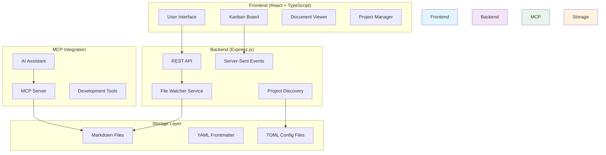

# Markdown Ticket Board

A developer-friendly project management tool that speaks your language! AI-powered Kanban board that stores tickets as markdown files, integrating project management with your existing Git workflow.

## Overview

Markdown Ticket Board is a full-stack web application that revolutionizes project management by storing tickets as markdown files with YAML frontmatter. This approach allows developers to version control their project management alongside their code, creating a seamless workflow that integrates with existing development practices.

**Technology Stack:**
- **Frontend**: React 18 with TypeScript, Tailwind CSS, Radix UI components
- **Backend**: Express.js with Node.js, file system-based storage
- **MCP Integration**: Model Context Protocol server for AI assistant workflows
- **Real-time Updates**: Server-Sent Events (SSE) for live synchronization
- **Build Tools**: Vite for fast development and optimized builds

## Features

- **📋 Kanban Board Interface**: Visual drag-and-drop ticket management with status columns
- **🏗️ Multi-Project Support**: Manage multiple projects from a single dashboard
- **📝 Markdown-based Storage**: All tickets stored as markdown files with YAML frontmatter
- **⚡ Real-time Updates**: Live synchronization using Server-Sent Events (SSE)
- **🤖 MCP Server Integration**: Model Context Protocol server for AI assistant workflows
- **🎯 Drag-and-Drop Functionality**: Intuitive ticket movement between status columns
- **📚 Document Viewer**: Tree navigation for markdown documents with syntax highlighting
- **🔍 Project Discovery**: Automatic detection and configuration of project structures
- **🎨 Theme Support**: Dark/light mode with system preference detection
- **🔄 File System Sync**: Automatic synchronization with file system changes

## Prerequisites

### Development Environment

- **Node.js**: Version 16.0.0 or higher
- **npm**: Latest version (comes with Node.js)
- **Git**: For version control integration
- **Modern Browser**: Chrome, Firefox, Safari, or Edge

### Required AWS Setup

This project runs entirely locally and does not require AWS resources. However, it integrates with AWS Labs' code documentation MCP server for enhanced AI workflows:

- **Optional**: AWS CLI configured for documentation generation workflows
- **Optional**: `uv` package manager for Python-based MCP servers

## Architecture Diagram



## Project Components

### Frontend (`src/`)
The React-based frontend provides an intuitive interface for ticket management:

- **Components** (`src/components/`): Reusable UI components including Board, TicketCard, ProjectSelector
- **Hooks** (`src/hooks/`): Custom React hooks for data management and theme handling
- **Services** (`src/services/`): Frontend services for API communication and real-time updates
- **Types** (`src/types/`): TypeScript type definitions for tickets, projects, and configurations

### Backend (`server/`)
Express.js server handling API requests and file system operations:

- **Core Server** (`server.js`): Main application server with REST API endpoints
- **File Watcher** (`fileWatcherService.js`): Real-time file system monitoring
- **Project Discovery** (`projectDiscovery.js`): Automatic project detection and configuration
- **MCP Dev Tools** (`mcp-dev-tools/`): Development utilities for MCP integration

### Shared Components (`shared/`)
Common code shared between frontend, backend, and MCP server:

- **Models** (`shared/models/`): TypeScript interfaces for Ticket, Project, and Config
- **Services** (`shared/services/`): Business logic for markdown processing and CR management
- **Templates** (`shared/templates/`): Ticket templates for different types (bug-fix, feature, etc.)

### MCP Server (`mcp-server/`)
Model Context Protocol server for AI assistant integration:

- **Core Server** (`src/index.ts`): MCP protocol implementation
- **Services** (`src/services/`): CR management and project discovery services
- **Configuration** (`src/config/`): MCP server configuration and setup

## Installation & Setup

1. **Clone the repository**:
   ```bash
   git clone <repository-url>
   cd markdown-ticket
   ```

2. **Install dependencies**:
   ```bash
   npm install
   cd server && npm install
   cd ../mcp-server && npm install && npm run build
   ```

3. **Start the development environment**:
   ```bash
   # Terminal 1: Start backend server
   cd server && npm start
   
   # Terminal 2: Start frontend development server
   npm run dev
   ```

4. **Access the application**:
   - Open http://localhost:5173 in your browser
   - Use "Add New Project" to create your first project
   - Start creating and managing tickets!

## MCP Integration Setup

### For Amazon Q CLI:
```bash
q mcp add --name mdt-all \
  --command "node" \
  --args $HOME/markdown-ticket/mcp-server/dist/index.js \
  --scope global --force
```

### For Claude Code:
```bash
claude mcp add mdt-all node $HOME/markdown-ticket/mcp-server/dist/index.js
```

## Next Steps

### Potential Enhancements
- **Database Integration**: Add PostgreSQL or MongoDB for enhanced querying
- **User Authentication**: Implement user management and permissions
- **Advanced Filtering**: Add complex search and filtering capabilities
- **Reporting Dashboard**: Create analytics and progress tracking views
- **Mobile App**: Develop React Native mobile companion
- **Integration APIs**: Connect with GitHub, Jira, or other project management tools

### Contributing
1. Fork the repository
2. Create a feature branch (`git checkout -b feature/amazing-feature`)
3. Commit your changes (`git commit -m 'Add amazing feature'`)
4. Push to the branch (`git push origin feature/amazing-feature`)
5. Open a Pull Request

## Clean Up

Since this application runs locally, cleanup involves:

1. **Stop running services**:
   ```bash
   # Stop development servers (Ctrl+C in terminals)
   # Stop any background MCP servers
   ```

2. **Remove generated files** (optional):
   ```bash
   rm -rf node_modules
   rm -rf server/node_modules
   rm -rf mcp-server/node_modules
   rm -rf mcp-server/dist
   ```

3. **Remove MCP configurations** (if no longer needed):
   ```bash
   q mcp remove mdt-all
   # or
   claude mcp remove mdt-all
   ```

## Troubleshooting

### Common Issues

**Frontend not loading**:
- Ensure backend server is running on port 3001
- Check browser console for CORS errors
- Verify Node.js version (16.0.0+)

**Tickets not updating in real-time**:
- Check Server-Sent Events connection in browser dev tools
- Verify file watcher service is running
- Ensure proper file permissions in project directories

**MCP server connection issues**:
- Verify MCP server is built (`npm run build` in mcp-server/)
- Check MCP configuration in AI assistant settings
- Review MCP server logs for connection errors

**Project discovery not working**:
- Ensure `.mdt-config.toml` exists in project root
- Verify global registry at `~/.config/markdown-ticket/`
- Check file permissions for configuration directories

### Debug Commands

```bash
# Check server health
curl http://localhost:3001/api/health

# Test MCP server
node mcp-server/dist/index.js

# View real-time logs
tail -f server/logs/application.log
```

## License

MIT License - see [LICENSE](LICENSE) file for details.

This project is open source and welcomes contributions from the community.
