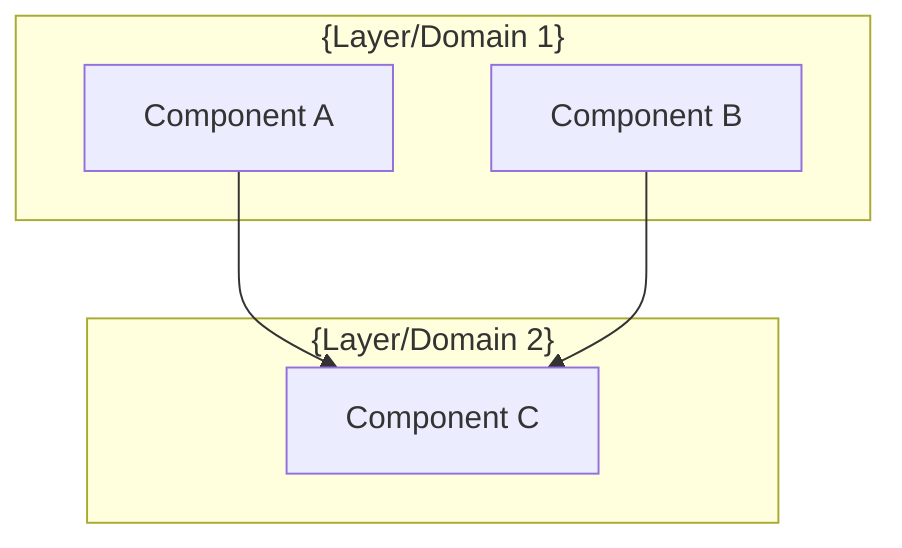
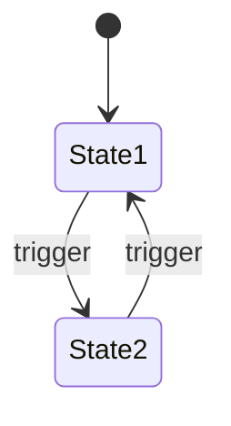

# MDT Architecture Design Workflow (v8)

Surface architectural decisions before implementation. Output location adapts to complexity — simple stays in CR, complex extracts to `architecture.md`.

**Core Principle**: Surface decisions LLM would otherwise make implicitly — including size constraints and shared patterns.

## User Input

```text
$ARGUMENTS
```

## Session Context

Use `{TICKETS_PATH}` in all file path templates below (if it's not defined read ticketsPath key from .mdt-config.toml).

## Output Location (Graduated)

| Mode | Output | Criteria |
|------|--------|----------|
| **Prep** (`--prep` flag) | `{TICKETS_PATH}/{CR-KEY}/prep/architecture.md` | Preparatory refactoring design |
| **Simple** | `## Architecture Design` in CR | ≤3 components, no state flows, ≤60 lines |
| **Complex** | `{TICKETS_PATH}/{CR-KEY}/architecture.md` | >3 components, state flows, or >60 lines |

CR always gets a reference — either the section itself or a link to the extracted file.

### Prep vs Feature Architecture

| Aspect | Prep Architecture | Feature Architecture |
|--------|-------------------|----------------------|
| **Purpose** | How to restructure existing code | How to build new capability |
| **Focus** | Behavior preservation, structure change | New behavior, extend structure |
| **Reads** | Current code state | New code state (after prep) |
| **Output** | `prep/architecture.md` | Root `architecture.md` or CR section |

## Problem This Solves

Without explicit architecture design, LLMs make implicit structural decisions:
- Horizontal vs. vertical organization (e.g., duplicated blocks across layers)
- Single file vs. multiple files
- Inheritance vs. composition
- Centralized vs. distributed logic

These implicit decisions accumulate technical debt. This workflow surfaces them for human review **before** code generation.

## When to Use

Use this workflow when:
- CR involves multiple similar things (providers, handlers, adapters)
- CR introduces new abstraction or extension point
- CR affects code organization across files/modules
- Previous implementation attempts produced poor structure

Use `--prep` flag when:
- Assessment indicated "Prep Required"
- Refactoring fundamentally changes code structure
- Feature design depends on refactored structure
- Breaking up God class, introducing new services, etc.

Do NOT use when:
- Simple bug fix with clear single-file scope
- Documentation-only change
- CR already has explicit architecture in problem statement

## Execution Steps

### Step 0: Detect Mode

Check for `--prep` flag in arguments:

```yaml
# If --prep flag present
mode: "prep"
output_path: "{TICKETS_PATH}/{CR-KEY}/prep/architecture.md"
focus: "refactoring design"

# Otherwise (default)
mode: "feature"
output_path: "{TICKETS_PATH}/{CR-KEY}/architecture.md"  # or CR section if simple
focus: "feature design"
```

**If mode is prep**:
- Create `prep/` directory if not exists
- **Load domain-audit.md** — this provides the diagnosis that drives design
- Focus on: How to restructure existing code safely
- Skip: Feature-specific design (that comes after prep)
- Output sections emphasize: behavior preservation, interface stability, size reduction
- Use Domain Concept from audit as the organizing principle

### Step 1: Load Context

1. `mdt-all:get_cr` with `mode="full"` — abort if CR doesn't exist
2. **If prep mode**: 
   - Load `{TICKETS_PATH}/{CR-KEY}/domain-audit.md` if exists — this is the PRIMARY input
   - Extract: DDD violations, structural issues, dependency analysis, domain concept, natural grouping
   - These findings DRIVE the architecture decisions
   - If domain-audit.md doesn't exist, suggest running `/mdt:domain-audit {CR-KEY}` first
3. **Load PoC findings if exists** (feature mode only): Check `{TICKETS_PATH}/{CR-KEY}/poc.md`
   - If found: extract validated decisions, constraints discovered, recommended approach
   - These are PROVEN approaches — use them directly, don't re-evaluate
   - Reference in Key Dependencies: "Validated in PoC: {finding}"
   - If not found: proceed (PoC is optional)
3. **Load domain constraints if exists**: Check `{TICKETS_PATH}/{CR-KEY}/domain.md`
   - If found: extract bounded contexts, aggregates, invariants, cross-context flags
   - These CONSTRAIN structural decisions in Steps 4-6
   - Aggregate roots → inform component boundaries
   - Invariants → inform where validation logic lives
   - Cross-context flags → require event/service patterns in structure
   - If not found: proceed without domain constraints (normal for refactoring/tech-debt)
4. Extract from CR:
   - **CR type**: Technical Debt, Feature Enhancement, Architecture, etc.
   - Problem statement (what's being solved)
   - Affected artifacts (existing files/components)
   - New artifacts (planned files/components)
   - Scope boundaries (what changes, what doesn't)
   - **Open Questions** (tech questions that might need PoC)
5. **For Technical Debt/Refactoring CRs**:
   - Focus on: What's wrong with current structure?
   - Success criteria: Size targets, interface preservation, behavioral equivalence
   - Skip behavioral requirement analysis
6. **Load requirements if exists**: Check `{TICKETS_PATH}/{CR-KEY}/requirements.md`
   - If found: extract requirement IDs and artifact mappings
   - These inform component boundaries (each requirement needs a home)
   - Note: Usually absent for refactoring CRs (which is correct)
7. Check for project CLAUDE.md — may have project-specific size limits
8. Scan for architectural signals:
   - Multiple similar items (providers, handlers, commands)
   - Words: "adapter", "factory", "provider", "handler", "strategy"
   - Patterns: "for each X", "multiple Y", "extensible"

### Step 2: Assess Complexity

Count complexity indicators to determine output location:

| Indicator | Weight | Signal |
|-----------|--------|--------|
| Components involved | +1 each | Files in Affected/New Artifacts |
| State transitions | +2 | UI modes, workflows, async operations |
| Component interactions | +1 each | Integration points |
| Error scenarios | +1 each | Failure modes needing design |
| Shared patterns | +1 each | Logic appearing in 2+ places |

**Thresholds**:
- Score ≤ 5 → **Simple** (embed in CR)
- Score > 5 → **Complex** (extract to architecture.md)

### Step 3: Identify Shared Patterns

**Before designing structure**, scan for repeated logic:

```markdown
| Pattern | Where It Appears | Extract To |
|---------|------------------|------------|
| Input validation | command1, command2, command3 | `validators/` |
| Error handling | all handlers | `utils/error-handler` |
| Silent mode | CLI, config | `utils/silent-mode` |
```

**Rule**: If pattern appears in 2+ places → must extract to shared module FIRST.

This prevents duplication that size limits alone won't catch.

### Step 3.5: Check for Technical Uncertainty

**Before proceeding to architecture decisions**, check if there are unresolved technical questions that need hands-on validation.

**Uncertainty Signals**:
| Signal | Example | Action |
|--------|---------|--------|
| Open Questions in CR with tech focus | "Does X support Y?" | Suggest PoC |
| Unfamiliar library/API | First time using tool | Suggest PoC |
| Performance-critical path | "Must handle N requests/sec" | Suggest PoC |
| Integration unknowns | "Connect to external service" | Suggest PoC |
| Behavior verification | "What happens when X fails?" | Suggest PoC |

**If poc.md exists**: Skip this step — uncertainty already resolved.

**If uncertainty detected and no poc.md**:

```markdown
⚠️ **Technical Uncertainty Detected**

The following questions should be validated before finalizing architecture:

| Question | Why It Matters | Suggestion |
|----------|----------------|------------|
| {uncertainty from CR/analysis} | {impact on design} | `/mdt:poc {CR-KEY} --question "{question}"` |

**Options**:
1. **Run PoC first** — `/mdt:poc {CR-KEY}` to validate, then return to architecture
2. **Proceed with assumption** — Document assumption, accept pivot risk
3. **Research only** — Question answerable from docs, no spike needed

Choose: [1] [2] [3]
```

**If user chooses [1]**: Stop architecture, direct to `/mdt:poc`.
**If user chooses [2]**: Document assumption in architecture, proceed.
**If user chooses [3]**: Proceed without PoC.

### Step 4: Identify Decision Points

Analyze the CR to surface **implicit architectural decisions**.

#### 4.1 Extract Existing CR Decisions

**First**, check what's already decided in the CR:

1. Read CR Section 2 (Decision) and Section 3 (Alternatives Considered)
2. Extract any explicit technology/approach choices
3. These decisions are **already made** — don't re-evaluate

```markdown
| Decision | Chosen | Source |
|----------|--------|--------|
| {from CR} | {from CR} | CR Section 2/3 |
```

#### 4.2 Build vs Use Existing Evaluation

**Before designing custom implementation**, evaluate existing solutions for major capabilities NOT already decided in the CR.

**Trigger**: Any substantial functionality (>50 lines) that's a common, solved problem:
- CLI argument parsing
- Configuration file handling
- HTTP client/server
- Logging framework
- Date/time manipulation
- Validation libraries
- Testing utilities

**Evaluation Table**:

| Capability | Build Custom | Use Existing | Recommendation |
|------------|--------------|--------------|----------------|
| {capability} | {effort + pros/cons} | {package + pros/cons} | {Build/Use: reason} |

**Evaluation Criteria** (all must be YES to recommend "Use Existing"):

| Criterion | Question |
|-----------|----------|
| Coverage | Does it solve ≥50% of the requirement? |
| Maturity | Maintained? (recent commits, no deprecation warnings) |
| License | Compatible with project license? |
| Footprint | Reasonable dependency count? (<10 transitive deps preferred) |
| Fit | Consistent with project's existing dependencies? |

**Search Strategy** (language-agnostic):
1. Check project's existing dependencies first (reuse preferred)
2. Search "{language} {capability}" in ecosystem package registry
3. Prefer widely-adopted solutions (>1000 weekly downloads equivalent)
4. Check for project-specific guidance in CLAUDE.md

**Decision Recording**:
- If "Use Existing" → Add to CR Section 2 as architectural decision
- If "Build Custom" → Document why (customization needs, size constraints, etc.)

#### 4.3 Structural Decision Points

For each remaining decision point, determine:
- **Decision**: What structural choice must be made?
- **Options**: What are the 2-3 viable approaches?
- **Implication**: How does each option affect extensibility?

Common decision points:

| Decision Type | Signal in CR | Question to Surface |
|---------------|--------------|---------------------|
| **Code Location** | New functionality | Single file vs. multiple files? Which directory? |
| **Responsibility** | Multiple similar things | Logic per-item vs. centralized handler? |
| **Abstraction** | Shared behavior | Base class vs. interface vs. utility functions? |
| **Extension** | "Easily add new X" | Plugin pattern vs. configuration vs. subclass? |
| **Coupling** | Cross-module interaction | Who depends on whom? Shared interface? |
| **Build vs Use** | Common solved problem | Existing library vs. custom implementation? |
| **Domain Boundary** | Cross-context operation (from domain.md) | Event vs. service vs. direct call? |

### Step 5: Present Decision Surface

Present decision points to user. Maximum 5 architectural questions.

**Question Format**:
```
Question: [Decision point as question]
Options:
- Option A (Recommended): [Concrete structure] → [Extension implication]
- Option B: [Concrete structure] → [Extension implication]
- Option C: [Concrete structure] → [Extension implication]
```

**Recommendation criteria**:
- Prefer existing solutions for solved problems (less code to maintain)
- Prefer structure where extension requires fewer file changes
- Prefer structure that isolates provider/handler/adapter-specific logic
- Prefer structure consistent with existing codebase patterns

**Build vs Use Question Format**:
```
Question: How should we handle {capability}?
Options:
- Option A (Recommended): Use {package} — {coverage}% of needs, {N} weekly downloads, {license}
- Option B: Build custom — Full control, {estimated lines} lines, no dependencies

Rationale: {why recommendation fits this project}
```

### Step 6: Generate Architecture Design

Based on decisions and complexity assessment, generate appropriate output.

**For Technical Debt/Refactoring CRs**:
- Focus on "before → after" structure transformation
- Emphasize size reduction and interface preservation
- Clearly define what's being consolidated, extracted, or simplified
- Include behavioral equivalence verification approach

---

## Simple Output (Embed in CR)

For Score ≤ 5, generate `## Architecture Design` section:

```markdown
## Architecture Design

### Key Dependencies
{If any "Use Existing" decisions were made}
| Capability | Package | Rationale |
|------------|---------|----------|
| {capability} | {package} | {why chosen over custom} |

{Or: "No external dependencies — all custom implementation."}

### Pattern
{Pattern name} — {one sentence why it fits the problem}

### Shared Patterns
{Table if any, or "None identified — single new module."}

### Structure
```
{source_dir}/
  └── {compact file tree, ≤10 lines}
```

### Size Guidance
| Module | Role | Limit | Hard Max |
|--------|------|-------|----------|
| `{path}` | {role} | {N} | {N×1.5} |

### Extension Rule
To add {X}: create `{path}` ({role}, limit {N} lines) implementing `{interface}`.

### Domain Alignment
{Include ONLY if domain.md exists}

| Domain Concept | Implementation | Notes |
|----------------|----------------|-------|
| `{Aggregate}` | `{file path}` | {role: root entity, value object, etc.} |
| `{Invariant}` | `{method/location}` | Enforced in {aggregate/boundary} |
```

**For Technical Debt/Refactoring**, add:
```markdown
### Refactoring Transformation
| From | To | Rationale |
|------|----|-----------|
| `{old_path}` (N lines) | `{new_path}` (M lines) | Extract/consolidate {reason} |

### Behavioral Equivalence
- Public interfaces preserved: {list}
- Test coverage ensures: {what behavior remains identical}
```

**Insert**: After `## 2. Decision`, before `## 3. Alternatives Considered`

---

## Complex Output (Extract to File)

For Score > 5, generate `{TICKETS_PATH}/{CR-KEY}/architecture.md`:

```markdown
# Architecture: {CR-KEY}

**Source**: [{CR-KEY}](../../../{TICKETS_PATH}/{PROJECT}/{CR-KEY}.md)
**Generated**: {YYYY-MM-DD}
**Complexity Score**: {N}

## Overview

{2-3 sentences: what this architecture achieves, key constraints}

## Pattern

**{Pattern name}** — {why it fits the problem}

{Optional: 1-2 sentences on pattern application specifics}

## Key Dependencies

{If any "Use Existing" decisions were made}

| Capability | Package | Coverage | Rationale |
|------------|---------|----------|----------|
| {capability} | {package} | {%} | {why chosen} |

**Build Custom Decisions**:
| Capability | Reason | Estimated Size |
|------------|--------|---------------|
| {capability} | {why not using existing} | {N} lines |

{Or: "No significant build-vs-use decisions — standard project patterns apply."}

## Component Boundaries



| Component | Responsibility | Owns | Depends On |
|-----------|----------------|------|------------|
| `{name}` | {single responsibility} | {data/state} | `{dependencies}` |

## State Flows

{Include ONLY if feature has states/modes}



| State | Entry Condition | Exit Condition | Invariants |
|-------|-----------------|----------------|------------|
| {state} | {when entered} | {when exited} | {what must be true} |

## Shared Patterns

| Pattern | Occurrences | Extract To |
|---------|-------------|------------|
| {pattern} | {where appears} | `{path}` |

> Part 1 extracts these BEFORE features that use them.

## Structure

```
{source_dir}/
  ├── {area}/
  │   ├── index.{ext}           → Orchestration only
  │   ├── {shared}/             → Shared utilities (extract first)
  │   │   └── {file}.{ext}
  │   └── {feature}/
  │       └── {file}.{ext}
```

## Size Guidance

| Module | Role | Limit | Hard Max |
|--------|------|-------|----------|
| `{path}` | {role} | {N} | {N×1.5} |

## Error Scenarios

{Include ONLY if non-trivial error handling needed}

| Scenario | Detection | Response | Recovery |
|----------|-----------|----------|----------|
| {what fails} | {how detected} | {immediate action} | {return to good state} |

## Requirement Coverage

{Include ONLY if requirements.md exists}

| Requirement | Component | Notes |
|-------------|-----------|-------|
| R1.1 | `{component}` | {how it's satisfied} |
| R1.2 | `{component}` | {how it's satisfied} |

**Coverage**: {N}/{M} requirements mapped ({percentage}%)

## Refactoring Plan

{Include ONLY for Technical Debt/Refactoring CRs}

### Transformation Matrix
| Component | From | To | Reduction | Reason |
|-----------|------|----|-----------|--------|
| `{name}` | `{old_path}` | `{new_path}` | {N}→{M} lines | {why} |

### Interface Preservation
| Public Interface | Status | Verification |
|------------------|--------|--------------|
| `{method/class}` | Preserved | Existing tests cover |
| `{method/class}` | Modified | Update tests in {location} |
| `{method/class}` | Removed | Deprecated in {version} |

### Behavioral Equivalence
- Test suite: {which tests verify identical behavior}
- Performance: {expected impact, if any}
- Migration: {any migration steps needed}

## Domain Alignment

{Include ONLY if domain.md exists}

| Domain Concept | Implementation | Notes |
|----------------|----------------|-------|
| `{Aggregate}` (root) | `{file path}` | Entry point, owns {children} |
| `{Aggregate}` (internal) | `{file path}` | Accessed via {root} |
| `{Invariant}` | `{method/class}` | Enforced {where} |
| `{Cross-context op}` | `{event/service path}` | {Pattern} to {Context} |

## Extension Rule

To add {X}:
1. Create `{path}` ({role}, limit {N} lines) implementing `{interface}`
2. {Registration step if needed}

---
*Generated by /mdt:architecture*
```

**In CR**, add reference after `## 2. Decision`:

```markdown
## Architecture Design

> **Extracted**: Complex architecture — see [architecture.md](./architecture.md)

**Summary**:
- Pattern: {name}
- Components: {count}
- Key constraint: {most important size/structure rule}

**Extension Rule**: {one-liner}
```

---

### Step 7: Validate Design

Before saving, validate:

1. **Shared patterns identified** — any logic in 2+ places has extraction target
2. **Size limits assigned** — every module in Structure has a limit
3. **Total check** — sum of limits < current monolith (no bloat)
4. **Consistency** — structure aligns with existing codebase conventions
5. **Artifact alignment** — file paths match CR Section 4 artifacts
6. **Extension rule testable** — includes "create X (limit N)"
7. **Complexity matches output** — simple in CR, complex extracted
8. **Requirement coverage** (if requirements.md exists):
   - Every requirement has at least one component home
   - No orphan requirements (requirements with no implementing component)
   - Flag gaps: "R1.3 has no component assignment"

If misalignment detected, update Section 4 or adjust design.

### Step 8: Save and Update CR

**Simple (embed)**:
1. Use `mdt-all:manage_cr_sections` to insert `## Architecture Design`
2. Update Section 4 with new artifacts
3. Update Section 5 with size verification criteria

**Complex (extract)**:
1. Save to `{TICKETS_PATH}/{CR-KEY}/architecture.md`
2. Use `mdt-all:manage_cr_sections` to insert summary + link in CR
3. Update Section 4 with new artifacts
4. Update Section 5 with size verification criteria

**Prep mode**:
1. Create `{TICKETS_PATH}/{CR-KEY}/prep/` directory
2. Save to `{TICKETS_PATH}/{CR-KEY}/prep/architecture.md`
3. Use `mdt-all:manage_cr_sections` to note prep workflow in CR Section 1 (Scope)
4. Do NOT update Section 4 yet — feature artifacts come after prep

### Step 9: Report Completion

**For feature mode (default):**

```markdown
## Architecture Design Complete

**CR**: {CR-KEY}
**Complexity Score**: {N} ({Simple|Complex})
**Output**: {CR section | architecture.md}

**Decisions Surfaced**: {N}
**Pattern**: {name}

### Shared Patterns
{list or "None"}

### Size Limits
| Module | Limit | Hard Max |
|--------|-------|----------|
| ... | ... | ... |

### Extension Rule
> {rule}

{If complex}
### Additional Sections
- Component Boundaries: {Y/N}
- State Flows: {Y/N}
- Error Scenarios: {Y/N}

### Next Steps
- Review architecture {in CR | in architecture.md}
- Run `/mdt:tasks {CR-KEY}` — inherits limits
```

**For prep mode (`--prep`):**

```markdown
## Prep Architecture Complete

**CR**: {CR-KEY}
**Mode**: Preparatory Refactoring
**Output**: `prep/architecture.md`

### Refactoring Goal
{what's being restructured and why}

### Target Structure
{new file organization after refactoring}

### Size Limits
| Module | Current | Target | Hard Max |
|--------|---------|--------|----------|
| ... | ... | ... | ... |

### Behavior Preservation
{interfaces that must remain stable}

### Next Steps (Prep Workflow)
1. `/mdt:tests {CR-KEY} --prep` — lock current behavior
2. `/mdt:tasks {CR-KEY} --prep` — refactoring tasks
3. `/mdt:implement {CR-KEY} --prep` — execute refactoring
4. `/mdt:architecture {CR-KEY}` — design feature (after prep complete)
```

---

## Examples

### Simple Example (Score: 3)

**Indicators**: 2 components, 1 shared pattern, no state flows

**Output**: Embedded in CR (~40 lines)

```markdown
## Architecture Design

### Pattern
Service extraction — isolate business logic from controller.

### Shared Patterns
None identified — single new module.

### Structure
```
src/
  ├── controllers/
  │   └── user-controller.ts  → HTTP handling only
  └── services/
      └── user-service.ts     → Business logic (new)
```

### Size Guidance
| Module | Role | Limit | Hard Max |
|--------|------|-------|----------|
| `user-service.ts` | Feature | 200 | 300 |

### Extension Rule
To add business logic: add methods to `user-service.ts` (limit 200 lines).
```

### Complex Example (Score: 8)

**Indicators**: 4 components, 2 shared patterns, state flows, 2 error scenarios

**Output**: Extracted to `architecture.md` (~120 lines)

CR gets summary:
```markdown
## Architecture Design

> **Extracted**: Complex architecture — see [architecture.md](./architecture.md)

**Summary**:
- Pattern: State machine + Observer
- Components: 4 (StatusToggle, Column, TicketStore, SSEHandler)
- Key constraint: StatusToggle ≤150 lines, Column ≤300 lines

**Extension Rule**: To add status mode, add case to `StatusToggle` state machine.
```

### Build vs Use Example (CLI Tool)

**CR**: Implement project management CLI

**Step 4.2 Evaluation**:

| Capability | Build Custom | Use Existing | Recommendation |
|------------|--------------|--------------|----------------|
| Argument parsing | 80 lines, full control | Commander.js (mature, 0 deps) | **Use**: solved problem, auto-generates help |
| Interactive prompts | 25 lines, minimal needs | Inquirer.js (feature-rich) | **Build**: needs are simple, avoid overhead |
| Config file parsing | 40 lines | dotenv, cosmiconfig | **Use**: dotenv already in project |

**Resulting Architecture Decision**:
```markdown
### Key Dependencies
| Capability | Package | Rationale |
|------------|---------|----------|
| CLI framework | commander | Argument parsing, help generation, subcommands |
| Config parsing | dotenv | Already in project dependencies |

### Build Custom
| Capability | Reason | Estimated Size |
|------------|--------|---------------|
| Interactive prompts | Minimal needs (3 prompts), avoid 50KB dependency | ~25 lines |
```

**Impact**: CLI reduced from ~650 lines to ~200 lines by using Commander.js instead of custom arg parsing.

---

## Size Guidance Reference

**Defaults** (can be overridden by CR or project CLAUDE.md):

| Role | Default | Hard Max | Notes |
|------|---------|----------|-------|
| Orchestration | 100 | 150 | Wiring only, no business logic |
| Feature module | 200 | 300 | Core functionality |
| Complex logic | 300 | 450 | Parser, state machine, algorithm |
| Utility | 75 | 110 | Small, focused helpers |
| Shared base/interface | 100 | 150 | Contracts, minimal implementation |

**Override priority** (highest to lowest):
1. CR Acceptance Criteria
2. Project CLAUDE.md
3. These defaults

## Behavioral Rules

- **Assess complexity first** — determines output location
- **Maximum 5 architectural questions** — avoid analysis paralysis
- **Always provide recommendation** — mark one option as (Recommended)
- **Concrete file paths only** — no abstract "ModuleA" references
- **Shared patterns first** — identify before structure, extract before consumers
- **Size limits per module** — every file needs a limit
- **Extension rule includes size** — "create X (limit N lines)"
- **Don't over-architect** — if CR is simple, say "No architecture design needed"
- **Respect existing patterns** — structure should match codebase conventions
- **State flows only when needed** — skip for stateless features
- **Error scenarios only when needed** — skip for simple CRUD

## Anti-Patterns to Avoid

❌ **Always extract**: Every CR gets architecture.md
✅ **Graduate by complexity**: Simple embeds, complex extracts

❌ **Vague pattern**: "Use good design patterns"
✅ **Specific pattern**: "Adapter pattern — each provider owns its logic"

❌ **Abstract structure**: "Create modules for each concern"
✅ **Concrete structure**: "src/providers/ollama-provider.ts"

❌ **No size limit**: "To add provider, create one file"
✅ **With size limit**: "To add provider, create file (limit 200 lines)"

❌ **Kitchen sink architecture.md**: Goals, Non-Goals, Tech Stack, Traceability Matrix
✅ **Focused architecture.md**: Boundaries, Flows (if needed), Errors (if needed), Sizes

❌ **Reinvent solved problems**: Custom arg parsing, custom config loading
✅ **Evaluate existing first**: Check ecosystem for mature solutions before building

❌ **Hardcoded ecosystem references**: "Use npm install commander"
✅ **Language-agnostic guidance**: "Search {language} CLI framework in package registry"

## Quality Checklist

Before completing, verify:
- [ ] PoC findings consumed if poc.md exists
- [ ] Technical uncertainty checked — suggest PoC or document assumption
- [ ] Existing CR decisions extracted (don't re-evaluate)
- [ ] Build vs Use evaluated for major capabilities (>50 lines)
- [ ] Complexity assessed and output location chosen
- [ ] Shared patterns identified (logic in 2+ places)
- [ ] Pattern is named and justified
- [ ] Structure shows concrete file paths
- [ ] Size limits assigned to every module
- [ ] Extension Rule includes size constraint
- [ ] Extension Rule is testable
- [ ] Section 4 artifacts align with Structure
- [ ] State flows included ONLY if feature has states
- [ ] Error scenarios included ONLY if non-trivial
- [ ] Complex extracts to file, simple stays in CR
- [ ] Domain alignment section included (if domain.md exists)
- [ ] Aggregate roots map to component boundaries
- [ ] Cross-context operations use appropriate patterns (event/service)

## Integration

**Before**: CR exists with problem/scope defined (optionally after `/mdt:assess`, `/mdt:poc`, and/or `/mdt:bdd`)

**Consumes**: 
- `domain-audit.md` — DDD + structural diagnosis for prep/refactoring (PRIMARY for prep mode)
- `poc.md` — validated technical decisions (use directly, don't re-evaluate)
- `domain.md` — DDD constraints for structure (feature mode)
- `requirements.md` — requirement-to-component mapping
- `bdd.md` — user journeys inform component boundaries (if exists)

**After**: `/mdt:tests` generates module-level tests based on architecture structure

**Position in workflow (Feature)**:
```
/mdt:requirements
        ↓
/mdt:bdd ─────────────── Creates: bdd.md (user-visible E2E tests)
        ↓
/mdt:assess (optional)
        ↓
/mdt:poc (optional) ──── Creates: poc.md
        ↓
/mdt:domain-lens (optional)
        ↓
/mdt:architecture ────── Creates: architecture.md (defines parts, modules)
        ↓
/mdt:tests ───────────── Creates: tests.md (module-level, part-aware)
        ↓
/mdt:tasks
```

**Position in workflow (Prep)**:
```
/mdt:assess
        ↓
/mdt:bdd --prep (optional) ─ Lock existing E2E behavior
        ↓
/mdt:domain-audit ────────── Creates: domain-audit.md
        ↓
/mdt:architecture --prep ─── Creates: prep/architecture.md
        ↓
/mdt:tests --prep ────────── Creates: prep/tests.md (lock module behavior)
        ↓
/mdt:tasks --prep
```

**Key change (v8)**: `/mdt:bdd` now handles user-visible acceptance tests BEFORE architecture. `/mdt:tests` handles module-level tests AFTER architecture.

Context: $ARGUMENTS
